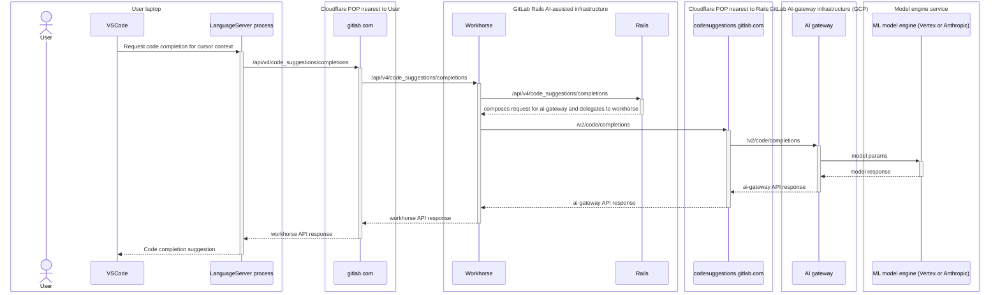

<!-- MARKER: do not edit this section directly. Edit services/service-catalog.yml then run scripts/generate-docs -->

# AI Gateway Service

* [Service Overview](https://dashboards.gitlab.net/d/ai-gateway-main/ai-gateway-overview)
* **Alerts**: <https://alerts.gitlab.net/#/alerts?filter=%7Btype%3D%22ai-gateway%22%2C%20tier%3D%22sv%22%7D>
* **Label**: gitlab-com/gl-infra/production~"Service::AIGateway"

## Logging

* [mlops](https://log.gprd.gitlab.net/goto/d21f8880-f0a7-11ed-a017-0d32180b1390)
* [request rate](https://log.gprd.gitlab.net/goto/c4faac00-f612-11ed-a017-0d32180b1390)
* [request latency](https://log.gprd.gitlab.net/goto/b423c240-f612-11ed-8afc-c9851e4645c0)

<!-- END_MARKER -->

## Summary

The AI-gateway is a standalone-service that will give access to AI features to all users of GitLab, no matter which
instance they are using: self-managed, dedicated or GitLab.com.

The AI Gateway was formerly known as Model Gateway and Code Suggestions.

Please update the status page whenever we encounter LLM provider disruptions. Key indicators include elevated error rates for provider inference SLI, e.g. `inference_anthropic` . For additional context, you may also want to monitor LLM provider status pages:

* [Anthropic Status Page](https://status.anthropic.com/)
* [Fireworks Status Page](https://status.fireworks.ai/)

## Operational Roles and Responsibilities

1. Regional deployment management - The AI-Gateway team is responsible for selecting, provisioning and de-provisioning regional deployments. Selection and provisioning can be self-served via the runway config ([multi region docs](https://docs.runway.gitlab.com/runtimes/cloud-run/multi-region)). Currently deprovisioning should be requested by contacting the Runway team.
2. Quota Saturation Monitoring and Response - The AI-Gateway team is responsible for monitoring the saturation warnings and responding to the warnings when raised.

## Architecture

See the AI Gateway architecture blueprint at <https://docs.gitlab.com/ee/architecture/blueprints/ai_gateway/>

For a higher level view of how the AI Gateway fits into our AI Architecture, see
<https://docs.gitlab.com/ee/development/ai_architecture.html>

### Example API call graph

For context, here is a typical call graph for a Code Suggestions API request from an IDE on an end-user's laptop.  This call graph is current as of 2023-12-15 but may change in the future.



Notes:

* Over the last few months, the endpoints and control flow have evolved, sometimes in non-backward-compatible ways.
  * e.g. Prior to GitLab 16.3, clients directly accessed a now deprecated request endpoint `/v2/completions`.  Some self-managed GitLab deployments running older versions while Code Suggestions was still in beta release may still be using those now-broken endpoints.
* Transits Cloudflare twice, once from end-user to Rails [AI Assisted](../ai-assisted/README.md), and later from Rails to `ai-gateway`.
  * Typically at least one of those is fairly low latency: only 10 ms RTT between GCP's `us-east1` region and Cloudflare's `ATL` POP.
  * Cloudflare tools (logs, analytics, rules, etc.) are available for both of those API calls.
* The requests to `ai-gateway` are expected to be slow, so Rails composes the request headers and then delegates it for Workhorse to send that request to `ai-gateway`.  (Workhorse can handle slow requests much more efficiently than Rails; this conserves puma worker threads.)
* Caching and reuse of TCP and TLS sessions allows most requests to avoid extra round-trips for connection setup.
* Currently `ai-gateway` containers run as a GCP Cloud Run service.
  * See the Cloud Run [docs](https://cloud.google.com/run/docs/resource-model) and [console](https://console.cloud.google.com/run/detail/us-east1/ai-gateway/metrics?project=gitlab-runway-production).
  * Those containers are not accessible via the tools we use for GKE-based services (`kubectl`, etc.).
  * The `gcloud` CLI tool exposes specs for the containers and their revisions (deployments).

Starter `gcloud` commands:

```
$ gcloud run services describe --project gitlab-runway-production --region us-east1 --format yaml ai-gateway
$ gcloud run revisions list --project gitlab-runway-production --region us-east1 --service ai-gateway
```

## Deployment

AI Gateway is deployed through Runway:

* [Runway Deployment](https://gitlab.com/gitlab-com/gl-infra/platform/runway/deployments/ai-gateway)
* [Runway Service](https://console.cloud.google.com/run/detail/us-east1/ai-gateway/metrics?project=gitlab-runway-production)

For more details, refer to [Runway runbook](../runway/README.md).

AI Gateway deployments are triggered from the [security mirror](https://gitlab.com/gitlab-org/security/modelops/applied-ml/code-suggestions/ai-assist).
To verify whether a change has been deployed, check the pipeline status on the [commits](https://gitlab.com/gitlab-org/security/modelops/applied-ml/code-suggestions/ai-assist/-/commits/main?ref_type=heads) page.

## Rolling Back a Deployment

During an incident, rolling back to a previous working deployment can be an effective mitigation strategy. This should be used with care, but it's a reasonable and practical way to quickly restore a working state.

To roll back to a previous revision:

1. **Identify the last known good commit**
   * Browse the commits list and find the merge commit just before the problematic change was introduced.
1. **Open that commit's pipeline**
   * Click on the commit title to open the commit detail page, then click the pipeline status icon (the CI badge) to navigate to its pipeline.
1. **Retry the deployment pipeline**
   * On the pipeline page, click "Run pipeline" is not available for old commits directly, so instead use the "Retry" button on the pipeline if it previously ran, which will re-execute all jobs including the Runway deployment stages.
   * Alternatively, from the commit page, go to `CI/CD > Pipelines`, filter by the target commit SHA, and retry that pipeline.
1. **Monitor the deployment**
   * Watch the pipeline jobs to confirm the Runway deployment stages complete successfully and the previous revision is live.

**Note:** A rollback is a temporary measure. Ensure the underlying issue is addressed and a proper fix is deployed as soon as possible. Ensure the problematic commit is reverted on `main` before the next pipeline runs, otherwise the rollback will be overridden by the subsequent deploy.

## Pausing AI Gateway Deployments

Runway handles the multi-stage deployments of AI Gateway. In certain situations (for example, during incident mitigation or maintenance), it may be beneficial to temporarily disable these continuous deployments. To do this, the pipeline can be configured to require manual intervention before deploying changes.

## Expedited AI Gateway Deployments

For incident response or critical changes, the AI Gateway CI process can be expedited through MR pipeline configurations.

To fully expedite an AI Gateway deployment, you must complete both of the following steps:

1. **Pre-merge Acceleration:**
   * Apply the `pipeline::expedited` label to your MR
   * This skips non-essential CI jobs, reducing pipeline time from ~30 minutes to ~3-4 minutes

2. **Post-merge Acceleration:**
   * When merging the MR to `main`, include `pipeline_expedited: true` in the commit **body** (not the subject line)
   * You can use any conventional commit format for the subject line (e.g., `feat: add new feature`)
   * This will trigger an expedited deployment pipeline on the `main` branch which only runs required stages for runway deployments

**Important:** Both steps are required for complete acceleration. MR labels don't carry over to the `main` branch pipeline, which is why the commit body configuration is necessary for the second half of the process.

**Temporarily disabling automatic deployments:**

1. Open the AI Gateway project in Gitlab: Go to the project's **Settings >> CI/CD** page.
1. Add a CI/CD variable: Under **Variables**, define a new variable named `RUNWAY_DEPLOYMENT_ACTION`.
1. Set the value to "manual": Enter `manual` as the value for `RUNWAY_DEPLOYMENT_ACTION`, Mark the variable as *protected* and save changes.
1. Confirm pipeline behavior: With this variable set, any new AI Gateway deployment pipeline will pause before deploying. The deployment job will not proceed to staging or production until manually triggered.

This configuration effectively pauses all continuous deployments. To resume normal automated deployments, remove the `RUNWAY_DEPLOYMENT_ACTION` variable. Once this variable is removed, Runway will revert to automatically deploying new changes on pipeline runs as usual.

## Environments

* [Production](https://gitlab.com/gitlab-com/gl-infra/platform/runway/deployments/ai-gateway/-/environments/15709878)
* [Staging](https://gitlab.com/gitlab-com/gl-infra/platform/runway/deployments/ai-gateway/-/environments/15709877)

## Regions

* [Runway Multi-Region Documentation](https://docs.runway.gitlab.com/runtimes/cloud-run/multi-region/#regional-service)

AI Gateway is currently deployed in the following regions:

1. us-east4
1. asia-northeast1
1. asia-northeast3
1. europe-west2
1. europe-west3
1. europe-west9

When the decision is made to provision a new region, the following steps should be taken:

1. Request a quota increase in the new region (for instructions see [this section below](https://gitlab.com/gitlab-com/runbooks/-/blob/master/docs/ai-gateway/README.md#gcp-quotas))
1. Follow the [Runway documentation to set up the new region](https://docs.runway.gitlab.com/runtimes/cloud-run/multi-region/)
1. Notify the [testing team](https://handbook.gitlab.com/handbook/engineering/infrastructure-platforms/test-platform/) that a new region has been set up so that they can run the necessary tests. Our current contact is Abhinaba Ghosh and the active Slack channel is #ai-gateway-testing.

## Services and Accounts

The Cloud Run service accounts are managed by Runway and have `aiplatform.user` role set, granting the service accounts the `aiplatform.endpoints.predict` permission. Other permissions granted by this role are unused. To set [additional roles](https://gitlab-com.gitlab.io/gl-infra/platform/runway/provisioner/inventory.schema.html#inventory_items_additional_roles), update `ai-gateway` entry in Runway [provisioner](https://gitlab.com/gitlab-com/gl-infra/platform/runway/provisioner/-/blob/main/inventory.json?ref_type=heads).
This IAM membership is managed via the `gl-infra/config-mgmt` repository, using Terraform.

* [Service Account Configuration](https://ops.gitlab.net/gitlab-com/gl-infra/config-mgmt/-/blob/main/environments/ai-framework-prod/service_accounts.tf?ref_type=heads#L7)

## Performance

AI Gateway includes the following SLIs/SLOs:

* [Apdex](https://dashboards.gitlab.net/d/ai-gateway-main/ai-gateway3a-overview?orgId=1&viewPanel=380731558)
* [Error Rate](https://dashboards.gitlab.net/d/ai-gateway-main/ai-gateway3a-overview?orgId=1&viewPanel=144302059)

Service degradation could be the result of the following saturation resources:

* [Memory Utilization](https://dashboards.gitlab.net/d/ai-gateway-main/ai-gateway3a-overview?orgId=1&from=now-1h&to=now&viewPanel=377718254)
* [CPU Utilization](https://dashboards.gitlab.net/d/ai-gateway-main/ai-gateway3a-overview?orgId=1&from=now-1h&to=now&viewPanel=1050857443)
* [Instance Utilization](https://dashboards.gitlab.net/d/ai-gateway-main/ai-gateway3a-overview?orgId=1&from=now-1h&to=now&viewPanel=1738137433)
* [Concurrency Utilization](https://dashboards.gitlab.net/d/ai-gateway-main/ai-gateway3a-overview?orgId=1&from=now-1h&to=now&viewPanel=4285373877)
* [Vertex AI API Quota Limit](https://dashboards.gitlab.net/d/ai-gateway-main/ai-gateway3a-overview?orgId=1&from=now-1h&to=now&viewPanel=1515902021)

### Determining Affected Components

As the AI Gateway serves multiple features, you can use the above dashboards to determine if the degradation is related to a specific feature.

For more information about the features covered by the `server_code_generations` and `server_code_completions` SLIs, refer to the [Code Suggestions Runbook](code-suggestions.md).

## Scalability

AI Gateway will autoscale with traffic. To manually scale, update [`runway.yml`](https://gitlab.com/gitlab-org/modelops/applied-ml/code-suggestions/ai-assist/-/blob/main/.runway/runway.yml?ref_type=heads) based on [documentation](../runway/README.md#scalability).

It is also possible to directly edit the tunables for the `ai-gateway` service via the [Cloud Run console's Edit YAML interface](https://console.cloud.google.com/run/detail/us-east1/ai-gateway/yaml/view?project=gitlab-runway-production).  This takes effect faster, but be sure to make the equivalent updates to the `runway.yml` as described above; otherwise the next deploy will revert your manual changes to the service YAML.

### Capacity Planning

AI Gateway uses [capacity planning](https://about.gitlab.com/handbook/engineering/infrastructure-platforms/capacity-planning/) provided by Runway for long-term forecasting of saturation resources. To view forecasts, refer to [Tamland page](https://gitlab-com.gitlab.io/gl-infra/capacity-planning-trackers/gitlab-com/service_groups/ai-gateway/).

### GCP Quotas

Apart from our quota monitoring in our usual GCP projects, the AI Gateway relies on resources that live in the following projects:

* `gitlab-ai-framework-dev`
* `gitlab-ai-framework-stage`
* `gitlab-ai-framework-prod`

Refer to
<https://gitlab-com.gitlab.io/gl-infra/tamland/saturation.html?highlight=code_suggestions#other-utilization-and-saturation-forecasting-non-horizontally-scalable-resources>
for quota usage trends and projections.

Many of our AI features use GCP's Vertex AI service. Vertex AI consists of various `base models` that represent logic for different types of AI models (such as code generation, or chat bots).
Each model has its own usage quota, which can be viewed in the [GCP Console](https://console.cloud.google.com/iam-admin/quotas?referrer=search&project=gitlab-ai-framework-prod&pageState=(%22allQuotasTable%22:(%22f%22:%22%255B%257B_22k_22_3A_22_22_2C_22t_22_3A10_2C_22v_22_3A_22_5C_22base_model_5C_22_22%257D%255D%22))).

To request a quota alteration:

* Visit the following page in the GCP Console: [Quotas by Base Model](https://console.cloud.google.com/iam-admin/quotas?referrer=search&project=gitlab-ai-framework-prod&pageState=(%22allQuotasTable%22:(%22f%22:%22%255B%257B_22k_22_3A_22_22_2C_22t_22_3A10_2C_22v_22_3A_22_5C_22base_model_5C_22_22%257D%255D%22)))
* Select each base model that requires a quota decrease/increase
* Click 'EDIT QUOTAS'
* Input the desired quota limit for each service and submit the request.
* Existing/previous requests can be viewed [here](https://console.cloud.google.com/iam-admin/quotas/qirs?referrer=search&project=gitlab-ai-framework-prod&pageState=(%22allQuotasTable%22:(%22f%22:%22%255B%257B_22k_22_3A_22_22_2C_22t_22_3A10_2C_22v_22_3A_22_5C_22base_model_5C_22_22%257D%255D%22)))

If you do not have access to the GCP console, please file an access request asking for the `Quota Administrator` role on the `gitlab-ai-framework-prod` project.

### Fireworks Capacity / Usage

Fireworks capacity is based on the hardware configuration of our endpoints, which are directly controlled by us either through the [deployment dashboard](https://fireworks.ai/dashboard/deployments) or through the [firectl command](https://docs.fireworks.ai/tools-sdks/firectl/firectl).

You can view current usage at the [usage dashboard](https://fireworks.ai/account/usage?type=deployments)

To increase the hardware available to a given endpoint in a specific region, contact the Fireworks team via the `#ext-gitlab-fireworks` channel and tag `@Shaunak Godbole ` for visibility.

If you do not have access to the GitLab Fireworks account, please file an access request or reach out to `@Allen Cook` or `@bob` for Fireworks access

### OpenAI Usage

You can view current usage and billing information for the GitLab OpenAI account at the [usage dashboard](https://platform.openai.com/usage).

To request access to the OpenAI admin dashboard for rate limits and usage management, reach out to `@wortschi`, `@mnohr`, `@m_gill` or `@timzallmann`.

If you do not have access to the GitLab OpenAI account, please file an access request.

### Anthropic Rate Limits

Anthropic applies per-model limits to concurrency, requests per minute, input tokens per minute, and output tokens per minute. You can see the current limits set for the
GitLab account in <https://console.anthropic.com/settings/limits>.

To request a rate limit increase, contact the Anthropic team via the `#ext-anthropic` channel and tag `@wortschi` for visibility.

If you do not have access to the GitLab Anthropic account, please file an access request.

### AWS Bedrock Quotas

AWS Bedrock applies per-model limits to tokens per minute (TPM) and requests per minute (RPM). GitLab uses cross-region inference profiles (`global.anthropic.*`) for all Bedrock models. Requests are routed through `us-west-2`, which is the default region in LiteLLM — this still allows use of global Bedrock endpoints. You can view the current quotas for each account using the AWS CLI:

```bash
aws service-quotas list-service-quotas \
  --service-code bedrock \
  --region us-west-2 \
  --query "Quotas[?contains(QuotaName, 'lobal') && contains(QuotaName, 'laude')].{Name:QuotaName, Value:Value, Unit:Unit}" \
  --output json
```

The following AWS accounts are used:

* **Staging**: `ai-framework-stage-bedrock`
* **Production**: `ai-framework-prd-bedrock`

Sign in at <https://gitlabsandbox.cloud> to retrieve credentials for both accounts.

To request a quota increase, visit the [Service Quotas console for Bedrock](https://us-west-2.console.aws.amazon.com/servicequotas/home/services/bedrock/quotas) in the relevant account (`us-west-2` is the region to use, as it is LiteLLM's default), select the model quota to increase, and click **Request increase at account level**.

If you do not have access to the AWS accounts, please file an access request referencing the `group::ai framework` team.

<!-- ## Availability -->

<!-- ## Durability -->

<!-- ## Security/Compliance -->

## Monitoring/Alerting

AI Gateway uses both [custom metrics](../../metrics-catalog/services/ai-gateway.jsonnet) scraped from application and default metrics provided by [Runway](../runway/README.md#monitoringalerting). Right now, alerts are routed to `#g_mlops-alerts` in Slack. To route to different channel, refer to [documentation](../uncategorized/alert-routing.md).

* [AiGatewayServiceRunwayIngressTrafficCessationRegional alert playbook](alerts/AiGatewayServiceRunwayIngressTrafficCessationRegional.md)
* [AI Gateway Service Overview Dashboard](https://dashboards.gitlab.net/d/ai-gateway-main/ai-gateway3a-overview?orgId=1)
* [AI Gateway Logs](https://log.gprd.gitlab.net/app/r/s/mkS0F)
* [AI Gateway Alerts](https://gitlab.enterprise.slack.com/archives/C0586SBDZU2)
* [AI Gateway Logs Overview Dashboard](https://log.gprd.gitlab.net/app/dashboards#/view/6c947f80-7c07-11ed-9f43-e3784d7fe3ca?_g=h@2294574)
* [AI Gateway Logs Errors Dashboard](https://log.gprd.gitlab.net/app/dashboards#/view/031cd3a0-61c0-11ee-ac5b-8f88ebd04638?_g=h@2294574)
* [Runway Service Metrics](https://dashboards.gitlab.net/d/runway-service/runway3a-runway-service-metrics?orgId=1&var-environment=gprd&var-service=ai-gateway)
* [Runway Service Logs](https://cloudlogging.app.goo.gl/SXc6rpSwfkH4rCD9A)

## Troubleshooting

### Rotating LLM Secret

AI Gateway uses Runway's secrets management to store LLM provider secrets. To rotate or revoke a secret, refer to the [Runway documentation](https://docs.runway.gitlab.com/runtimes/cloud-run/secrets-management/#rotating-a-secret) for instructions on logging into Vault to rotate secrets in production or staging. Any changes to Vault should be tracked via a production change request for traceability, see [this example](https://gitlab.com/gitlab-com/gl-infra/production/-/work_items/19787)

#### API Keys Overview

Our current list of provider keys stored in Vault:

* **Anthropic**: `ANTHROPIC_API_KEY` - Claude model inference
* **OpenAI**: `OPENAI_API_KEY` - OpenAI model inference
* **Fireworks**: `AIGW_MODEL_KEYS__FIREWORKS_PROVIDER_API_KEY` - Fireworks provider models inference. Used mainly for Code Completion with Codestral models

## Links to further Documentation

* [AI Gateway Blueprint](https://docs.gitlab.com/ee/architecture/blueprints/ai_gateway/)
