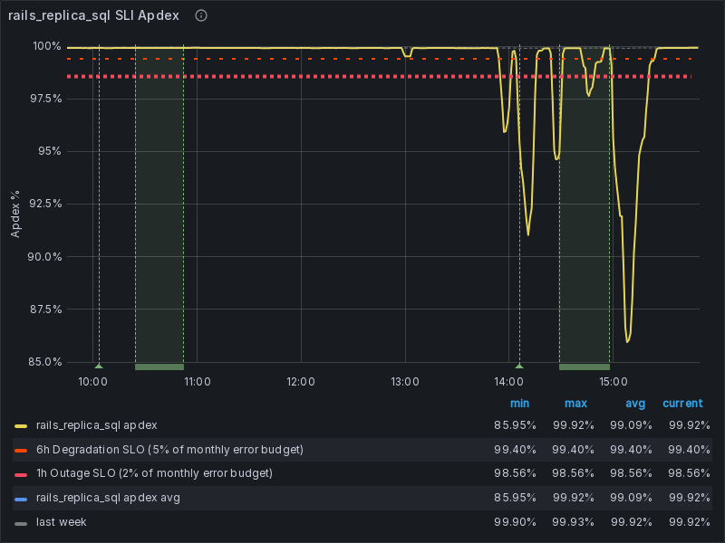

# ApdexSLOViolation

## Overview

### What does this alert mean?

This alert indicates that the Apdex score for a specific service has fallen below a predefined threshold, signifying a potential performance degradation. An Apdex violation occurs when specific application or service transactions fail to complete within the defined Apdex time, indicating a decline in user experience.

### Possible Causes

Several factors can contribute to these alerts:

- Unexpected spikes in traffic leading to resource exhaustion. (CPU, memory)
- Database connection issues, slow queries or database performance issues.
- Recent code deployments introducing bugs or performance issues.
- External service dependencies experiencing slowdowns
- Server or network problems affecting service performance.

### General Troubleshooting Steps

For a diagnosis methodology, see: [Incident Diagnosis in a Symptom-based World](../tutorials/diagnosis.md).

Common troubleshooting steps though may differ slightly for each service:

- When investigating an Apdex issue without a corresponding increase in error rates, a valuable initial step is to identify the specific Service Level Indicator (SLI) reporting elevated slow request metrics. By examining the logs for these slow requests, we can often gain insights into the nature of the performance degradation.
- Review Apdex score details, response times, error rates, and any anomalies.
- Review logs for errors, timeouts, or slow queries related to the affected services. Look for correlations between log entries and performance issues.
- Check for recent deployments, configuration changes, or infrastructure modifications.
- Identify patterns or spikes in latency and errors.

## Services

Refer to the service catalogue for the service owners and escalation [Service Catalogue](../../services/service-catalog.yml)

## Metrics

[ApdexSLOViolation Metrics](https://gitlab.com/gitlab-com/runbooks/-/blob/0371723ed09edab223eda73aaef0a504522f3da6/libsonnet/slo-alerts/service-alerts-generator.libsonnet#L80-L95)

- The main goal is to monitor these metrics and raise alerts when they violate predefined thresholds, ensuring that the service performance meets the expected standards. The Apdex score quantifies user satisfaction with an application’s response time. It classifies user experiences into three categories: satisfactory, tolerable, and frustrating.

- An Apdex score is calculated on a scale from 0 to 1, where:
  - 1.0: All responses are satisfactory.
  - 0.5: Half the responses are satisfactory and half are not satisfactory.
  - 0.0: All responses are frustrating.

- Under normal conditions, the Apdex score should remain consistently high, reflecting good user experience. For example:

    ```
    The Apdex score should consistently be above 0.9, with occasional minor drops but no prolonged periods below this threshold.
    ```

- If a  service typically achieves an Apdex score of 0.9, a threshold might be set at 0.8 to trigger an alert if user satisfaction drops significantly.

**Example**: In the graph below traffic absent alert fires when an SLI, the `rails_replica_sql` SLI of the patroni-ci service (main stage) has an apdex violating SLO

  

A few examples of how the metrics is been calculated:

- Patroni: [gitlab_sql_replica_duration_seconds_bucket](https://gitlab.com/gitlab-com/runbooks/-/blob/9ef55ee4963242eb6acb0bdc1e536d16792edff9/mimir-rules/gitlab-gprd/patroni-ci/autogenerated-gitlab-gprd-patroni-ci-service-level-alerts.yml#L537)

- CI Runners: [gitlab_component_shard_apdex](https://gitlab.com/gitlab-com/runbooks/-/blob/9ef55ee4963242eb6acb0bdc1e536d16792edff9/mimir-rules/gitlab-gprd/ci-runners/autogenerated-gitlab-gprd-ci-runners-service-level-alerts.yml#L59)

- Gitaly: [gitlab_component_shard_apdex](https://gitlab.com/gitlab-com/runbooks/-/blob/9ef55ee4963242eb6acb0bdc1e536d16792edff9/mimir-rules/gitlab-gprd/sidekiq/autogenerated-gitlab-gprd-sidekiq-service-level-alerts.yml#L1295)

- Web: [gitlab_regional_sli_apdex](https://gitlab.com/gitlab-com/runbooks/-/blob/9ef55ee4963242eb6acb0bdc1e536d16792edff9/mimir-rules/gitlab-gprd/web/autogenerated-gitlab-gprd-web-service-level-alerts.yml#L455)

## Severities

- The severity of this alert is generally what is configured on the SLI, this defaults to ~"severity::2".
- There might be customer user impact depending on which service is affected

## Recent changes

- [Recent Production Change/Incident Issues](https://gitlab.com/gitlab-com/gl-infra/production/-/issues/?sort=created_date&state=closed&first_page_size=20)
- [Chef Changes](https://gitlab.com/gitlab-com/gl-infra/chef-repo/-/merge_requests?scope=all&state=merged)

## Previous Incidents

- [Patroni-CI apdex violation](https://gitlab.com/gitlab-com/gl-infra/production/-/issues/18229)
- [The sidekiq_queueing SLI of the sidekiq service on shard catchall has an apdex violating SLO](https://gitlab.com/gitlab-com/gl-infra/production/-/issues/18276)
- [KubeServiceApiserverApdexSLOViolation](https://gitlab.com/gitlab-com/gl-infra/production/-/issues/18267)
- [SidekiqServiceSidekiqQueueingApdexSLOViolationSingleShard](https://gitlab.com/gitlab-com/gl-infra/production/-/issues/18243)
- [AiGatewayServiceRunwayIngressApdexSLOViolation](https://gitlab.com/gitlab-com/gl-infra/production/-/issues/18105)

## Alert Behavior

- Common false positive conditions to look out for:

  - Services with low traffic levels will often have widely varying apdex scores, because a single anomalous request can swing the result in one direction quickly.
  - It's common for services that are just starting to receive traffic to report low apdex for the first several minutes, for example, you can expect apdex alerts after re-enabling canary in production but these should level out on their own.

## Escalation

 If the issue cannot be resolved quickly, escalate to the appropriate engineering or operations team for further investigation.

## Definitions

- [Update the template used to format this playbook](https://gitlab.com/gitlab-com/runbooks/-/edit/master/docs/template-alert-playbook.md?ref_type=heads)

## Related Links

- [Related alerts](https://gitlab.com/gitlab-com/runbooks/-/tree/master/docs/alerts/)
