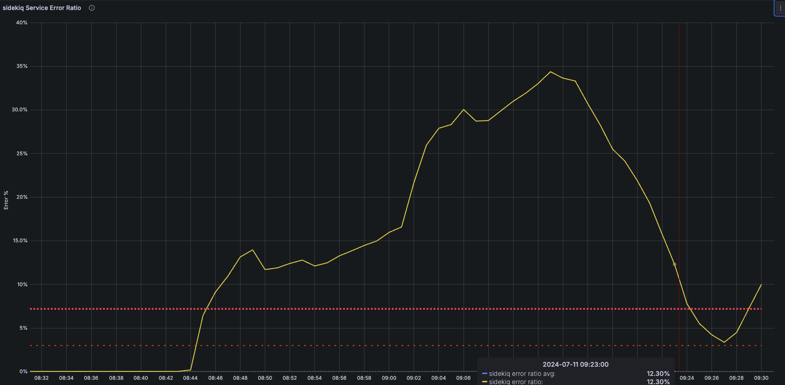
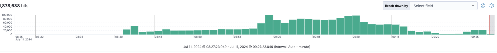

# ErrorSLOViolation

## Overview

### What does this alert mean?

An ErrorSLOViolation occurs when the error rate for a specific application or service exceeds the defined Service Level Objective (SLO) threshold, indicating potential issues impacting functionality or user experience.

### Possible Causes

Several factors can contribute to these alerts:

- Bugs in the application code causing unexpected behavior.
- Resource exhaustion (CPU, memory) leading to errors during request processing.
- External service errors propagating back to the application
- Underlying infrastructure problems impacting application stability (e.g., database errors, network connectivity issues).

### General Troubleshooting Steps

For a diagnosis methodology, see: [Incident Diagnosis in a Symptom-based World](../tutorials/diagnosis.md).

Common troubleshooting steps though may differ slightly for each service:

- Investigate application error logs to identify the specific errors occurring.
- Analyze the timestamps and frequency of errors to pinpoint potential root causes
- Correlate error messages with recent code deployments or infrastructure changes.
- Identify spikes in response times that might be correlated with errors. Compare current metrics with historical performance data to identify deviations.
- Monitor resource utilization (CPU, memory) for signs of bottlenecks impacting application stability.
- Investigate code changes introduced in the deployment to identify potential causes. Check for recent deployments, configuration changes, or infrastructure modifications.
- Check the health of underlying infrastructure components (database, servers, network) for any reported issues.

## Services

Refer to the service catalogue for the service owners and escalation [Service Catalogue](../../services/service-catalog.yml)

## Metrics

[ErrorSLOViolation Metrics](https://gitlab.com/gitlab-com/runbooks/-/blob/01f5831cbc9d6e8ddbf35d8b47fff68d8772718b/libsonnet/slo-alerts/service-alerts-generator.libsonnet#L138)

- The error ratio measures the proportion of requests that result in errors compared to the total number of requests. Alerts are triggered if the error ratio exceeds the defined threshold, signaling potential issues with the application.

- Under normal conditions, the error ratio should remain low, indicating that the majority of requests are successfully processed. For example:

    ```
    Frontend Web Service Error Rate: Consistently below 1%, with minor, short-lived spikes but no sustained periods above the threshold.
    ```

- Analysis of historical error data helps identify normal performance patterns and determine acceptable thresholds. For instance, if the service usually has an error ratio of 0.5%, a threshold might be set at 1.5% to account for normal fluctuations but still detect significant reliability issues.

**Example**: In the graph below there was a spike in the error ratio for sidekiq service. Upon investigation this was been caused by `Gitlab::ExclusiveLeaseHelpers::FailedToObtainLockError` error.

  

The Kibana logs also provide insight as to when the issue probably started

  

A few examples of how the metrics is been calculated:

- Git: [GitServiceGitlabSshdErrorSLOViolation](https://gitlab.com/gitlab-com/runbooks/-/blob/9ef55ee4963242eb6acb0bdc1e536d16792edff9/mimir-rules/gitlab-gprd/git/autogenerated-gitlab-gprd-git-service-level-alerts.yml#L420)

- Patroni: [gitlab_component_errors](https://gitlab.com/gitlab-com/runbooks/-/blob/9ef55ee4963242eb6acb0bdc1e536d16792edff9/mimir-rules/gitlab-gprd/patroni-ci/autogenerated-gitlab-gprd-patroni-ci-service-level-alerts.yml#L226)

## Severities

- The severity of this alert is generally what is configured on the SLI, this defaults to ~"severity::2".
- There might be customer user impact depending on which service is affected

## Recent changes

- [Recent Production Change/Incident Issues](https://gitlab.com/gitlab-com/gl-infra/production/-/issues/?sort=created_date&state=closed&first_page_size=20)
- [Chef Changes](https://gitlab.com/gitlab-com/gl-infra/chef-repo/-/merge_requests?scope=all&state=merged)

## Previous Incidents

- [CiRunnersServicePollingErrorSLOViolation](https://gitlab.com/gitlab-com/gl-infra/production/-/issues/18278)
- [GitServiceWorkhorseErrorSLOViolation](https://gitlab.com/gitlab-com/gl-infra/production/-/issues/18266)
- [SidekiqServiceSidekiqExecutionErrorSLOViolationSingleShard](https://gitlab.com/gitlab-com/gl-infra/production/-/issues/18264)
- [FrontendServiceWebsocketsServicesErrorSLOViolation](https://gitlab.com/gitlab-com/gl-infra/production/-/issues/18251)

## Alert Behavior

- Error ratios may fluctuate considerably for services that receive very little traffic, and that we may need to adjust SLO targets to accommodate these.
- Temporary issues with external services can cause transient errors and trigger false alerts
- Network connectivity problems can lead to intermittent errors and false positives

## Escalation

 If the issue cannot be resolved quickly, escalate to the appropriate engineering or operations team for further investigation.

## Definitions

- [Update the template used to format this playbook](https://gitlab.com/gitlab-com/runbooks/-/edit/master/docs/template-alert-playbook.md?ref_type=heads)

## Related Links

- [Related alerts](https://gitlab.com/gitlab-com/runbooks/-/tree/master/docs/alerts/)
