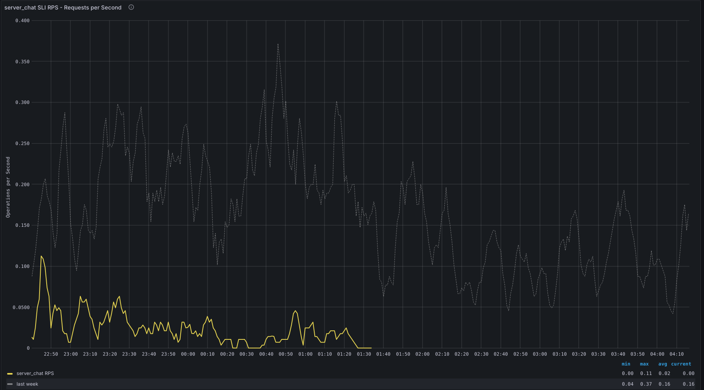

# TrafficAbsent and TrafficCessation

## Overview

### What does this alert mean?

- **TrafficAbsent**
  alerts indicate that a specific component for a service is not generating or reporting any traffic for at least 30m, while it was an hour ago. This lack of traffic suggests that the service is not functioning as intended, which can lead to disruptions in dependent systems and user functionalities. Traffic can refer to various types of interactions, such as data being processed, requests being handled, or jobs being executed.

  It also signifies that the SLI was previously reporting traffic, but is no longer been reported which means the signal is absent. This could be caused by a change to the metrics used in the SLI, or by the service not receiving traffic.

- **TrafficCessation**: This alert signifies that the SLI is reporting a cessation of traffic; the signal is present, but is zero.

These alerts can fire for the `component` aggregation, but also for the `component_node`, `component_shard` and `regional_component` aggregations:

[Source](https://gitlab.com/gitlab-com/runbooks/blob/debbc6cbc58da4e74edd80c56eedc75810fa3415/libsonnet/alerts/service-component-alerts.libsonnet#L21-61)

### Possible Causes

Several factors can contribute to these alerts:

- **Service Outage:** The service might be down or unresponsive.
- **Network Issues:** Connectivity problems could prevent the service from communicating with other components.
- **Resource Exhaustion:** Servers may be running out of CPU, memory, or other resources, hindering their ability to process traffic.
- **Configuration Errors:** Misconfigurations in the service or its dependencies can block traffic.
- **Application Errors:** Bugs or issues in the application code can prevent normal operations.
- **Metric Catalog:** The metric we use to calculate the rate is either wrong or changed.

### General Troubleshooting Steps

Common troubleshooting steps though may differ slightly for each service:

- **Investigate the Status:** Check the status of the service and its dependencies using the dashboard links
- **Review Logs:** Look for errors or unusual activity in the Kibana.
- **Verify Recent Configuration Changes:** Ensure all configurations are correct and consistent with known good settings and if the recent changes caused the issue
- **Monitor Resources:** Check for resource constraints on the servers.
- **Check Network Connectivity:** Ensure there are no network issues hindering communication.
- Verify the service is still running by checking k8s deployment/VM
- Check the metric catalog rate metric and see if it's still present
- Send requests yourself to validate that you get a response
- Check **Request Per Second(RPS)** trend on the service to see if it is a spikey traffic problem or maybe it doesn't get any traffic

### False Positives

- A low traffic service gets no traffic for a period of time during the weekend or over holidays
- A service gets low or no traffic during scheduled maintenance periods

### False Negatives

Because of the way we attempt to avoid false positives with low traffic services it is possible for a service's traffic to degrade to near zero but not reach it and then not be detected by the traffic cessation alerts. Therefore it is important to have other alerts you can fall back on in those situations, such as a service's error rate.

## Services

Refer to the service catalogue for the service owners and escalation [Service Catalogue](../../services/service-catalog.yml)

## Metrics

[Traffic Cessation & Traffic Absent Metric](../../libsonnet/slo-alerts/traffic-cessation-alerts.libsonnet)

- These metrics monitors the presence of traffic for a specific service. The unit of measurement depends on the type of traffic being monitored.

- Analysis of historical metrics data help to identify normal traffic patterns and determine what constitutes an absence of traffic. For instance, if a service usually processes 100 jobs per minute, a threshold might be set at 5 jobs per minute to account for normal fluctuations but still detect significant drops.

- Under normal conditions, the metric should show consistent traffic that aligns with the service’s expected operational patterns. For example:

  ```
  Sidekiq Job Processing: A steady stream of jobs being executed, with minor fluctuations but no prolonged periods of zero activity.
  ```

A few examples of how the metrics is been calculated:

- Sidekiq: [sidekiq_enqueued_jobs_total](https://gitlab.com/gitlab-com/runbooks/-/blob/c7c0261b15d920aee6c1c48271bd0f088880b203/metrics-catalog/services/sidekiq.jsonnet#L132-134)

- API Workhorse: [gitlab_workhorse_http_requests_total](https://gitlab.com/gitlab-com/runbooks/-/blob/e4305e9b64e62732272d922b640d4594bdd81a87/metrics-catalog/services/api.jsonnet#L163-166)

- Gitaly: [gitaly_service_client_requests_total](https://gitlab.com/gitlab-com/runbooks/-/blob/c7c0261b15d920aee6c1c48271bd0f088880b203/metrics-catalog/services/gitaly.jsonnet#L80-83)

- KAS: [grpc_server_handled_total](https://gitlab.com/gitlab-com/runbooks/-/blob/c7c0261b15d920aee6c1c48271bd0f088880b203/metrics-catalog/services/kas.jsonnet#L69-72)

In the graph below traffic absent alert fires when an SLI (`gitlab_component_ops:rate_5m`) is missing for `30m`, while it was present an hour ago.



## Severities

- The severity of this alert is generally what is configured on the SLI, this defaults to ~"severity::2".
- There might be customer user impact depending on which service is affected

## Recent changes

- [Recent Production Change/Incident Issues](https://gitlab.com/gitlab-com/gl-infra/production/-/issues/?sort=created_date&state=closed&first_page_size=20)
- [Kubernetes GitLab Helm Chart](https://gitlab.com/gitlab-com/gl-infra/k8s-workloads/gitlab-com/-/merge_requests?scope=all&state=merged)
- [Kubernetes Helm Charts](https://gitlab.com/gitlab-com/gl-infra/k8s-workloads/gitlab-helmfiles/-/merge_requests?scope=all&state=merged)
- [gprd events](https://nonprod-log.gitlab.net/app/r/s/HnyOd)

## Previous Incidents

- [TrafficAbsent alerts everywhere](https://gitlab.com/gitlab-com/gl-infra/production/-/issues/18109)
- [AI Gateway Traffic Absent](https://gitlab.com/gitlab-com/gl-infra/production/-/issues/17986)
- [Traffic Cessation Alerts from ops](https://gitlab.com/gitlab-com/gl-infra/production/-/issues/14493)
- [Ops Registry Apdex and Traffic Cessation](https://gitlab.com/gitlab-com/gl-infra/production/-/issues/13915)
- [GitalyServiceGoserverTrafficCessationSingleNode](https://gitlab.com/gitlab-com/gl-infra/production/-/issues/17859)

## Disable Alert

The trafficCessation alerts can be disabled by specifying `trafficCessationAlertConfig` on an SLI, this is documented in [Traffic Cessation Alerts](https://gitlab.com/gitlab-com/runbooks/blob/debbc6cbc58da4e74edd80c56eedc75810fa3415/docs/metrics-catalog/traffic-cessation-alerts.md#L1)

- Some examples of disabling the alerts:
  - [fix: ignore traffic cessation for memory-bound shard](https://gitlab.com/gitlab-com/runbooks/-/merge_requests/4194)
  - [Ignore traffic cessation for some periodically used SLIs](https://gitlab.com/gitlab-com/runbooks/-/merge_requests/3064)
  - [fix(monitoring): ignore traffic cessation alerts for kibana_googlelb](https://gitlab.com/gitlab-com/runbooks/-/merge_requests/3403)

## Escalation

If the issue cannot be resolved quickly, escalate to the appropriate engineering or operations team for further investigation.

## Definitions

- [Update the template used to format this playbook](https://gitlab.com/gitlab-com/runbooks/-/edit/master/docs/template-alert-playbook.md?ref_type=heads)

## Related Links

- [Related alerts](../alerts/)
