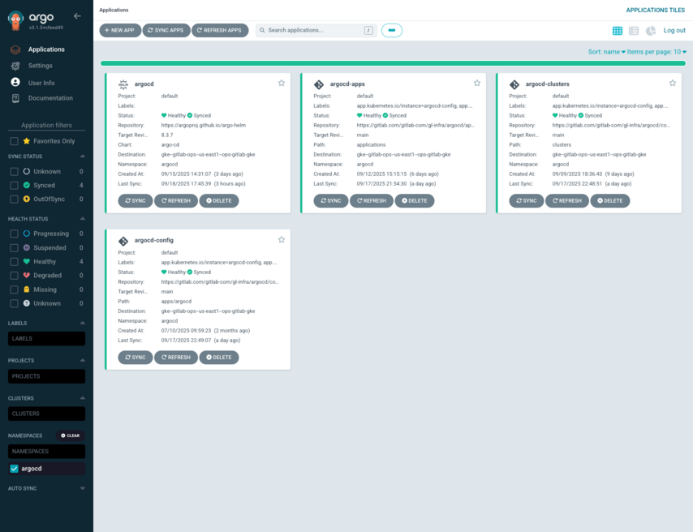

<!-- MARKER: do not edit this section directly. Edit services/service-catalog.yml then run scripts/generate-docs -->

# ArgoCD Service

* [Service Overview](https://dashboards.gitlab.net/d/argocd-main/argocd-overview)
* **Alerts**: <https://alerts.gitlab.net/#/alerts?filter=%7Btype%3D%22argocd%22%2C%20tier%3D%22inf%22%7D>
* **Label**: gitlab-com/gl-infra/production~"Service::ArgoCD"

## Logging

* [Elasticsearch](https://nonprod-log.gitlab.net/app/r/s/c8v2r)

<!-- END_MARKER -->

## Quick Links

| Reference | Link |
| --- | --- |
| ArgoCD | [UI](https://argocd.gitlab.net) |
| Dashboards | [ArgoCD Overview](https://dashboards.gitlab.net/dashboards/f/argocd/argocd) |
| Logs | [Elastic Cloud](https://nonprod-log.gitlab.net/app/r/s/c8v2r) |
| Audit Logs | [Elastic Cloud](https://nonprod-log.gitlab.net/app/r/s/IORHO) |
| Documentation | [gl-infra/argocd/apps//docs](https://gitlab.com/gitlab-com/gl-infra/argocd/apps/-/tree/main/docs) |
| Application Configuration | [gl-infra/argocd](https://gitlab.com/gitlab-com/gl-infra/argocd) |
| Cluster Configuration | [config-mgmt](https://ops.gitlab.net/gitlab-com/gl-infra/config-mgmt) |
| GKE Cluster Bootstrap | [Terraform module](https://gitlab.com/gitlab-com/gl-infra/terraform-modules/google/gke-argocd-bootstrap) |
| Training module | [gl-infra/argocd/apps//training](https://gitlab.com/gitlab-com/gl-infra/argocd/apps/-/blob/main/docs/training.md) |

## Summary

[ArgoCD](https://argoproj.github.io/cd/) is a declarative, GitOps continuous delivery tool for Kubernetes.

The Production Engineering team uses ArgoCD to manage Kubernetes workloads on multiple GKE clusters of the GitLab SaaS infrastructure platform.

It can be accessed at <https://argocd.gitlab.net/>.



## Getting access to ArgoCD

In order to obtain access permission to ArgoCD for the first time, it must [requested via Lumos](https://app.lumosidentity.com/app_store?domainAppId=1548786) and then approved by the requester's manager and the service owners.

Different roles are available:

* `app.argocd.admins`: full access to ArgoCD, reserved for SREs owning the service
* `app.argocd.sre`: near full access to ArgoCD without delete permissions for critical top-level
  applications, projects, and repository credentials, reserved for SREs. All SREs **must** request this role through Lumos, irrespective of whether they are on-call.
* `app.argocd.viewer`: view only access to all projects in ArgoCD
* `app.argocd.members`: for application-specific permissions [defined by RBAC rules](https://gitlab.com/gitlab-com/gl-infra/argocd/config/-/blob/d58f161d574e4fcefd61374c02b204230c290530/apps/argocd/values.yaml#L43), most users will use this role

Once access has been granted, the user can log into ArgoCD via Okta [from the homepage](https://argocd.gitlab.net/).

If this is your first time working with ArgoCD, consider working through the [training module](https://gitlab.com/gitlab-com/gl-infra/argocd/apps/-/blob/main/docs/training.md).

## Architecture

ArgoCD is deployed in the `argocd` namespace of the `ops-central` GKE cluster in the `gitlab-ops` GCP project.

ArgoCD [deploys itself](https://gitlab.com/gitlab-com/gl-infra/argocd/apps/-/blob/main/applications/argocd.yaml) using [its official Helm chart](https://github.com/argoproj/argo-helm/tree/main/charts/argo-cd), for which the configuration can be found [here](https://gitlab.com/gitlab-com/gl-infra/argocd/apps/-/tree/main/services/argocd).

Its ingress is [proxied through Cloudflare](https://ops.gitlab.net/gitlab-com/gl-infra/config-mgmt/-/blob/2fc2d0cf4f7d6a158b387198c34747e822a85529/environments/ops/cloudflare-general.tf#L107-110), then goes [through an Istio gateway](https://gitlab.com/gitlab-com/gl-infra/argocd/apps/-/blob/edfd50366ac14b0bc00ff2168c4f8e99ccff0519/services/argocd/values.yaml#L211-253) and is [protected by OAuth2-Proxy](https://gitlab.com/gitlab-com/gl-infra/k8s-workloads/gitlab-helmfiles/-/blob/51b093aef8b586d9bc3618ccad9bb49fc601b214/releases/istio/values-extras/ops-values.yaml.gotmpl#L32).

User authentication is managed via Okta only.

## Service Management

ArgoCD is entirely managed via 2 GitLab projects:

* [`gitlab-com/gl-infra/argocd/apps`](https://gitlab.com/gitlab-com/gl-infra/argocd/apps): contains the definitions of all ArgoCD Applications and ApplicationSets that each define what Kubernetes workloads are deployed to which cluster(s) and their configuration, [including ArgoCD itself](https://gitlab.com/gitlab-com/gl-infra/argocd/apps/-/blob/main/applications/argocd.yaml).

* [`gitlab-com/gl-infra/argocd/config`](https://gitlab.com/gitlab-com/gl-infra/argocd/config): contains the basic resources configuring the ArgoCD service, including:

  * `argocd-config`: top-level application deploying all other configuration resources and the below applications
  * `argocd-clusters`: Kubernetes cluster definitions and credentials
  * `argocd-apps`: [App of Apps](https://argo-cd.readthedocs.io/en/latest/operator-manual/cluster-bootstrapping/#app-of-apps-pattern) managing all Applications and ApplicationSets defined in [`gitlab-com/gl-infra/argocd/apps`](https://gitlab.com/gitlab-com/gl-infra/argocd/apps)

## How to add or update a new service to ArgoCD

See documentation [here](https://gitlab.com/gitlab-com/gl-infra/argocd/apps/-/tree/main/docs).

## How to onboard a GKE cluster into ArgoCD (via Terraform)

This can be done mainly via the [GKE ArgoCD Bootstrap Terraform module](https://gitlab.com/gitlab-com/gl-infra/terraform-modules/google/gke-argocd-bootstrap/).

1. First, ArgoCD needs to be given the permission to view and connect to GKE clusters in the target GCP project:

   ```terraform
   locals {
     argocd_service_account_email = "argocd@gitlab-ops.iam.gserviceaccount.com"
   }

   resource "google_project_iam_member" "argocd-cluster-viewer" {
     project = var.project
     role    = "roles/container.clusterViewer"
     member  = "serviceAccount:${local.argocd_service_account_email}"
   }
   ```

   > [!note]
   > This only gives ArgoCD the permission to connect but doesn't allow it to access or modify any resource inside any cluster, we can manage those permissions per cluster via Cluster Role Bindings instead in the next step.

2. Then the `gke-argocd-bootstrap` module must be instantiated for each targeted cluster:

   ```terraform
   # data.tf

   data "vault_kv_secret_v2" "gitlab-token-argocd" {
     mount = "ci"
     name  = "access_tokens/gitlab-com/gitlab-com/gl-infra/argocd/config/cluster-provisioner"
   }

   data "google_client_config" "provider" {}

   # providers.tf

   provider "gitlab" {
     alias = "argocd"

     base_url = "https://gitlab.com"
     token    = data.vault_kv_secret_v2.gitlab-token-argocd.data.token
   }

   provider "kubernetes" {
     alias = "my-gke-cluster"

     cluster_ca_certificate = base64decode(module.my-gke-cluster.cluster_ca_certificate)
     host                   = "https://${module.my-gke-cluster.cluster_endpoint}"
     token                  = data.google_client_config.provider.access_token
   }

   # gke.tf

   module "my-gke-cluster-argocd-bootstrap" {
     source  = "gitlab.com/gitlab-com/gke-argocd-bootstrap/google"
     version = "1.4.0"

     environment = var.environment
     stage       = "prod" # "prod" or "non-prod"

     cluster = {
       name           = module.my-gke-cluster.cluster_name
       endpoint       = "https://${module.my-gke-cluster.cluster_endpoint}"
       ca_certificate = base64decode(module.my-gke-cluster.cluster_ca_certificate)
       location       = var.region # region or zone
       project        = var.project
       region         = var.region
     }

     cluster_role_binding = {
       service_account_email = local.argocd_service_account_email
     }

     providers = {
       gitlab     = gitlab.argocd
       kubernetes = kubernetes.my-gke-cluster
     }
   }
   ```

3. When applied, Terraform will commit a new cluster secret manifest [under the `clusters/` directory in the `argocd/config` repository](https://gitlab.com/gitlab-com/gl-infra/argocd/config/-/tree/main/clusters) which will be synced automatically by ArgoCD shortly after.

   > [!note]
   > This cluster secret manifest will be automatically updated by Terraform whenever the cluster endpoint or CA certificate changes, with no manual action required.

4. The cluster is now ready to use in ArgoCD! :tada:

## Troubleshooting

If you received a page for ArgoCD, the first thing is to determine whether the problem is:

* Application sync failures
* ArgoCD controller/server issues
* Repository connectivity problems
* Resource deployment issues

We have some useful dashboards to reference for a quick view of system health:

* [Overview](https://dashboards.gitlab.net/d/argocd-main/argocd3a-overview)
* [Application](https://dashboards.gitlab.net/d/argocd-application-overview/argocd3a-argocd-application-overview)
* [Notifications](https://dashboards.gitlab.net/d/argocd-notifications-overview/argocd3a-argocd-notifications-overview)
* [Operational](https://dashboards.gitlab.net/d/argocd-operational-overview/argocd3a-argocd-operational-overview)

When investigating issues, key questions to ask:

* Are applications failing to sync?
  * Check the ArgoCD UI for specific error messages
  * Verify repository connectivity and credentials
  * Check for resource conflicts or pending finalizers
* Is the ArgoCD API responding?
  * Check server pod health and logs
  * Verify ingress/load balancer configuration
* Are there performance issues?
  * Monitor memory and CPU usage of ArgoCD components

<!-- ## Summary -->

<!-- ## Architecture -->

<!-- ## Performance -->

<!-- ## Scalability -->

<!-- ## Availability -->

<!-- ## Durability -->

<!-- ## Security/Compliance -->

<!-- ## Monitoring/Alerting -->

<!-- ## Links to further Documentation -->
