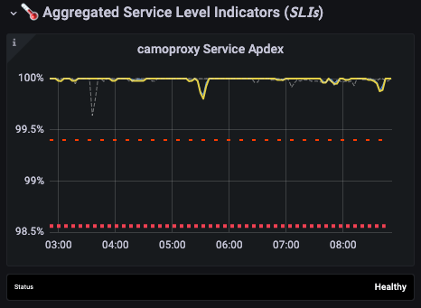
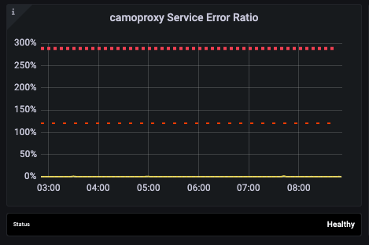

# Camoproxy troubleshooting

Camoproxy is an SSL/TLS proxy for insecure static assets that uses [go-camo](https://github.com/cactus/go-camo).

## Alerting

Camoproxy runs on k8s, with metrics being collected at `/metrics` endpoint. We collect these metrics and adapt our recording rules around them to display the grafana dashboard and alerts.

Quick recap of what *should* be the correct running path:

GCP HTTPS LB with a public IP, holder of the SSL certificate (terminates SSL).  This is user-content.gitlab-static.net.
The LB talks to the camoproxy pods on k8s. The healthcheck URL the LB uses is /healthz. K8S has liveness and readiness probes for camoproxy to make sure pods are alive.

## Logging

### Raw

In elasticsearch/kibana, check out the pubsub-camoproxy-inf-gprd index.  As a quick guide, the field 'json.camoproxy\_message' describes the basic message, and then each type of message has one of json.camoproxy\_{req,resp,url} depending on the message.

To see URLs passing through the proxy, search for `json.camoproxy_message:"signed client url"` and look at the json.camoproxy\_url field.

The "built outgoing request" message shows the HTTP request we're sending to the external service, and the "response from upstream" message shows the full headers being returned from that call.  The "response to client" message shows the HTTP response (mostly headers) being sent back to the original client.

NB: json.camoproxy_level is almost always 'D' for debug; there's next to no interesting logging at below debug level.

## Manual testing

If you need to generate a URL that you can pass through camoproxy to verify its behavior, you can refer to the [chart README](https://gitlab.com/gitlab-com/gl-infra/k8s-workloads/gitlab-helmfiles/-/tree/master/releases/camoproxy/charts#camoproxy-chart).

## Graphs

<https://dashboards.gitlab.net/d/camoproxy-main/camoproxy-overview?orgId=1>

Check to see if the Apdex is getting lower or behaving badly:

Another thing would be the error ratio, it could be spiking and worth checking:

## SSL certificate

Camoproxy uses GCP managed [SSL certificates](https://cloud.google.com/kubernetes-engine/docs/how-to/managed-certs), they are managed, renewed and provisioned by GCP.

Renewal of the certs is automatic and done by GCP <https://cloud.google.com/load-balancing/docs/ssl-certificates/google-managed-certs#renewal>.
