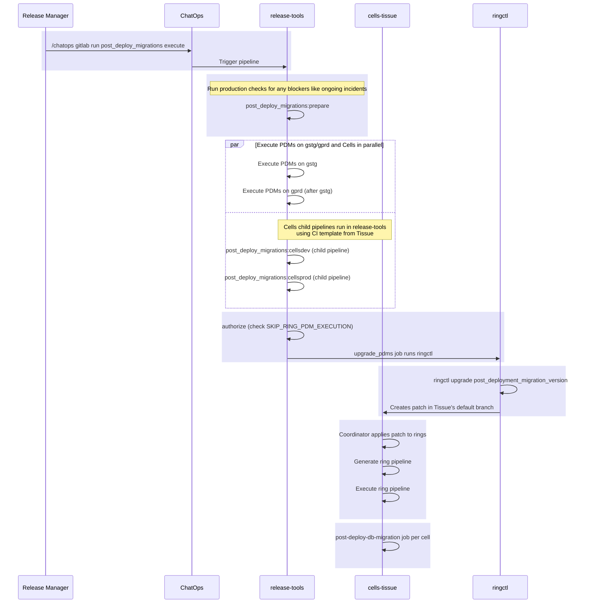

# Post deployment migrations in cells

This document describes how post deployment migrations are executed on cells. It also describes how we can pause periodic
execution of PDMs on cells if required.

## Background

Post Deployment Migrations (PDMs) are Rails database migrations that run **after** a new version of GitLab has been
As executing PDMs prevents rollback to a previous version, controlling when they run is critical for
maintaining a predictable rollback window on Cells.

The tenant model for each cell contains a `post_deployment_migration_version` attribute that serves as the single
source of truth (SSOT) for which version's PDMs should be executed.
When this attribute is updated via a patch, the PDM execution pipeline is triggered for the affected cells.

## Workflow

PDM execution on Cells is triggered as part of the same pipeline that executes PDMs on gstg and gprd. The overall flow is:



1. Release Manager runs `/chatops gitlab run post_deploy_migrations execute` in Slack
2. ChatOps triggers a pipeline in release-tools on ops.gitlab.net
3. release-tools runs production checks, then executes PDMs on gstg and gprd
4. release-tools triggers separate child pipelines for cellsdev and cellsprod (after production checks), which use
   a [Tissue] CI template
5. Tissue `authorize` job checks `SKIP_RING_PDM_EXECUTION`, then the `upgrade_pdms` job runs `ringctl upgrade
   post_deployment_migration_version`
6. [Ringctl] creates a JSON patch updating `post_deployment_migration_version` in the tenant model directly onto Tissue's
   default branch
7. Tissue coordinator detects the patch, generates a ring deployment pipeline, and triggers per-cell child pipelines
8. Each of the per-cell child pipelines creates a Kubernetes Job executing the [Instrumentor]
   `bin/post-deploy-db-migration` script

## Skipping PDM Execution on Cells

PDM execution on Cells can be skipped by setting the `SKIP_RING_PDM_EXECUTION` environment variable to `true`.

This must be done **before** running the initial `/chatops gitlab run post_deploy_migrations execute` command, as the Cells
child pipeline is triggered automatically during the main pipeline execution in [release-tools].

### How-To

1. Navigate to [Release Tools CI Variables](https://ops.gitlab.net/gitlab-org/release/tools/-/settings/ci_cd) on the Ops
   instance.
2. Look for `SKIP_RING_PDM_EXECUTION` and set it to a value of `true`. If the variable does not exist, create it.

The `authorize` job in the Tissue PDM execution template checks this variable and will fail if it is set, preventing the
`upgrade_pdms` job from running.

> [!warning]
> There is no automated procedure to set this value back to `false`, so please ensure any follow-up item resets
> this value as desired.

## Manual PDM Execution

PDMs can also be executed manually on Cells using [Ringctl] directly, without going through the ChatOps/release-tools
flow.

The following procedure creates a patch, in the specified branch, that sets the `post_deployment_migration_version`
tenant model field. A link to create a merge request is output by the command. Once merged, the patch is applied
through the normal ring-based deployment process.

### Prerequisites

- Change to the directory where your [Tissue] project resides.
- Ensure you are on the latest: `git pull main`
- Ensure `ringctl` is updated: `mise install`

### Execute PDMs to Match the Current Deployed Version

```bash
ringctl upgrade post_deployment_migration_version -b your-branch
```

When no version is provided, `ringctl` automatically uses the `prerelease_version` from the perimeter ring. This is the
most common usage, as it executes PDMs for the version currently deployed to cells in the perimeter ring.

### Execute PDMs to a Specific Version

```bash
ringctl upgrade post_deployment_migration_version 18.9.202601300007-8337d22f560.f41a2cdb585 -b your-branch
```

This creates a patch, in the specified branch, that sets `post_deployment_migration_version` to the specified version
for all cells.

The value of `post_deployment_migration_version` can be an auto-deploy version string, a GitLab version string or an
internal version string. However, we always use auto-deploy version strings for this field in cells.

The values the field can hold can be seen in the tenant model schema:

- Schema definition of `post_deployment_migration_version`:
  [json-schemas/tenant-model.json#L373-387](https://gitlab.com/gitlab-com/gl-infra/gitlab-dedicated/tenant-model-schema/-/blob/7714bab2b0fd64157fa2a0d99c4accb763bbf79c/json-schemas/tenant-model.json#L373-387)

- References for each of the version string types:
  [json-schemas/tenant-model.json#L1002-1029](https://gitlab.com/gitlab-com/gl-infra/gitlab-dedicated/tenant-model-schema/-/blob/7714bab2b0fd64157fa2a0d99c4accb763bbf79c/json-schemas/tenant-model.json#L1002-1029)

[Tissue]: https://ops.gitlab.net/gitlab-com/gl-infra/cells/tissue/
[Ringctl]: https://gitlab.com/gitlab-com/gl-infra/ringctl/
[release-tools]: https://ops.gitlab.net/gitlab-org/release/tools/
[Instrumentor]: https://gitlab.com/gitlab-com/gl-infra/gitlab-dedicated/instrumentor/
