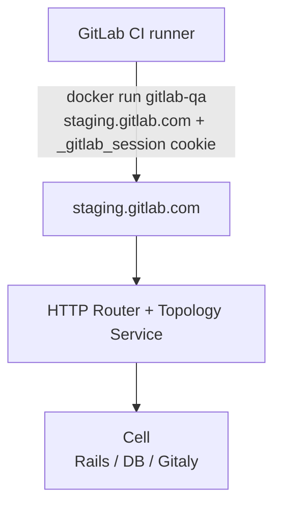

# Cells QA: Running E2E Tests Through the HTTP Router

## Overview

This document describes how end-to-end (E2E) QA tests are run automatically after each Cells
auto-deploy, and how to trigger a QA run manually.

QA tests target `staging.gitlab.com` with a `_gitlab_session` cookie that routes requests to the
desired Cell via the [HTTP router] and [Topology Service]. So, QA runs follow the same request path
as real user requests.

## Architecture

QA runs in GitLab CI using the [gitlab-qa] tool. [gitlab-qa] is part of the image used by CI. The CI
runner must support Docker-in-Docker because [gitlab-qa] starts a Docker container, and end-to-end
tests run inside that container. The CI runner uses [OIDC] to assume a role in the Tenant AWS
account, fetches secrets from AWS Secrets Manager, and passes them to `gitlab-qa`.

During a QA run, requests go to `staging.gitlab.com` with the `_gitlab_session` cookie set
`_gitlab_session=cell-7-please`[^1]. This cookie will route requests to the Cell with `cells.cell_id =
7` in the tenant model.



The credentials passed to `gitlab-qa` (such as `GITLAB_ADMIN_USERNAME` and `GITLAB_ADMIN_PASSWORD`)
are unique per Cell, which means passing tests confirm that responses were served by the correct
Cell. This architecture also ensures that we don't need to verify whether the HTTP Router is working
properly.

## Background

### Why not target the Cell's managed domain directly?

Each Cell has a managed domain `cell-${tenant_id}.gitlab-cells.dev`. But we can not send requests
during QA to this domain because GitLab's QA framework chains API calls using the `web_url` field
returned in API responses. That field is always set to the BYOD domain (`staging.gitlab.com`), and
not the managed domain. So after the first API call, subsequent requests are sent to
`staging.gitlab.com`, which routes them to the Legacy cell.

Also, sending QA requests through the HTTP Router and Topology Service validates that the tenant is
operating as the right Cell in the cluster.

### Why not run QA in the Amp Kubernetes cluster?

Previously, the QA job was executed by creating a pod in the Amp Kubernetes cluster using
`kubectl apply`. The Amp cluster is small and does not have enough resources to schedule the QA
pod, which requires around 6 GiB of memory. This caused QA jobs to fail consistently on AWS
Cells. More information about this limitation can be found in
[this issue](https://gitlab.com/gitlab-com/gl-infra/delivery/-/work_items/21480).

## Test selection: `health_check` and `skip_cells` Rspec tags

QA runs tests in the GitLab Rails codebase tagged with `health_check` and **not** tagged with
`skip_cells`.

The tests included in the QA run can be fetched by running this command:

```shell
(code/gitlab-org/gitlab) $ cd qa/

(code/gitlab-org/gitlab) $ bundle exec bin/qa Test::Instance::All https://gitlab.example.com -- --dry-run --tag health_check --tag '~skip_cells'

```

<details>

<summary>Example command output</summary>

``` shell
(code/gitlab-org/gitlab) $ cd qa/
(code/gitlab-org/gitlab) $ bundle exec bin/qa Test::Instance::All https://gitlab.example.com -- --dry-run --tag health_check --tag '~skip_cells' 2>/dev/null
Run options:
  include {:health_check=>true}
  exclude {:geo=>true, :skip_live_env=>true, :skip_cells=>true}

Randomized with seed 2098

Plan
  Issue creation
    creates an issue and updates the description
    creates an issue
    closes an issue
    when using attachments in comments
      comments on an issue with an attachment

Software Supply Chain Security
  Project access tokens
    can be created and revoked via the UI

Software Supply Chain Security
  basic user login
    user logs in using basic credentials and logs out

Finished in 0.02345 seconds (files took 1.32 seconds to load)
6 examples, 0 failures

Randomized with seed 2098

```

</details>

> [!note]
> Of the 10 tests in the `health_check` suite, 4 currently fail on Cells because the features they
> exercise (Git SSH routing and webhooks routing) are not yet implemented in the HTTP router. The
> `skip_cells` Rspec tag was added to those 4 tests in
> <https://gitlab.com/gitlab-org/gitlab/-/merge_requests/205335>

## Known limitations

### `root` user validation

When QA runs against a newly provisioned Cell, the `root` user (which is used by QA) is not
validated. GitLab requires credit card verification before a user can create top-level groups, and
the QA framework creates top-level groups as part of its setup. Without validation, QA fails with:

```
{"message":"Failed to save group {:identity_verification=>[\"You have reached the group limit until you verify your account.\"]}"}
```

This is a known issue and it is tracked in
<https://gitlab.com/gitlab-com/gl-infra/delivery/-/issues/21542>

The `root` user on any newly provisioned Cell can be manually validated by logging into the Cell as
the admin user, editing the user in **Admin area > Users**, and marking the user as validated.

## Triggering a QA run manually

To trigger a QA pipeline manually against a specific Cell, navigate to:

```
https://ops.gitlab.net/gitlab-com/gl-infra/cells/tissue/-/pipelines/new
```

Set the following variables:

| Variable          | Description                                | Example              |
|-------------------|--------------------------------------------|----------------------|
| `AMP_ENVIRONMENT` | The Amp environment                        | `cellsdev`           |
| `RING`            | The ring number                            | `0`                  |
| `TENANT_ID`       | The tenant ID of the Cell                  | `c01k21yz9qqajjfn6z` |
| `RUN_CELL_QA`     | Must be set to `true` to enable the QA job | `true`               |

Or use this pre-filled URL (substituting your own `TENANT_ID`):

```
https://ops.gitlab.net/gitlab-com/gl-infra/cells/tissue/-/pipelines/new?ref=main&var[AMP_ENVIRONMENT]=cellsdev&var[RING]=0&var[TENANT_ID]=<TENANT_ID>&var[RUN_CELL_QA]=true
```

The QA job will appear in the generated child pipeline. A sample passing job can be found at
<https://ops.gitlab.net/gitlab-com/gl-infra/cells/tissue/-/jobs/20624459#L361>

## References

- [Issue #21521: Create a CI job for running QA against a Cell through the HTTP Router and Topology Service](https://gitlab.com/gitlab-com/gl-infra/delivery/-/issues/21521)
- [Issue #21480: QA run for Cells should be moved from the Amp Kubernetes cluster into GitLab CI](https://gitlab.com/gitlab-com/gl-infra/delivery/-/issues/21480)
- [Issue #21355: Get a Successful run of QA in AWS](https://gitlab.com/gitlab-com/gl-infra/delivery/-/issues/21355)
- [Issue #21542: Manual validation of `root` user is required before running QA for a Cell through HTTP router](https://gitlab.com/gitlab-com/gl-infra/delivery/-/issues/21542)
- [gitlab-org/gitlab!205335: Add `skip_cells` Rspec tag to health_check tests that fail on Cells](https://gitlab.com/gitlab-org/gitlab/-/merge_requests/205335)
- [cells/tissue on ops.gitlab.net](https://ops.gitlab.net/gitlab-com/gl-infra/cells/tissue)

[HTTP router]: https://handbook.gitlab.com/handbook/engineering/architecture/design-documents/cells/http_routing_service/
[Topology Service]: https://handbook.gitlab.com/handbook/engineering/architecture/design-documents/cells/topology_service
[OIDC]: https://docs.gitlab.com/ci/cloud_services/aws/#add-the-identity-provider
[gitlab-qa]: https://gitlab.com/gitlab-org/gitlab-qa

[^1]: This is the actual format of the cookie. The cookie's value is checked by the GitLab Rails
    codebase here:
    <https://gitlab.com/gitlab-org/gitlab/-/blob/ece1e8dc5f49826cd2a68ed391990182f8e27d79/qa/qa/runtime/browser.rb#L382-383>
