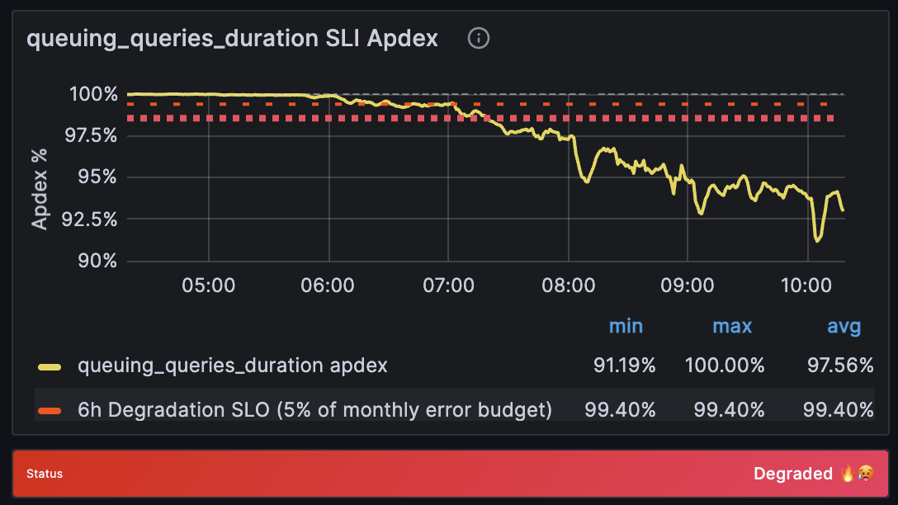
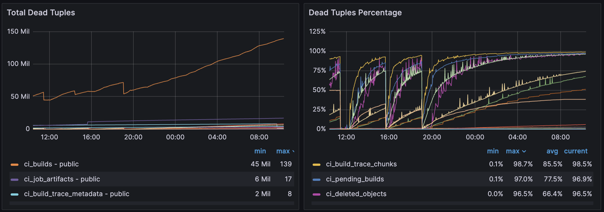
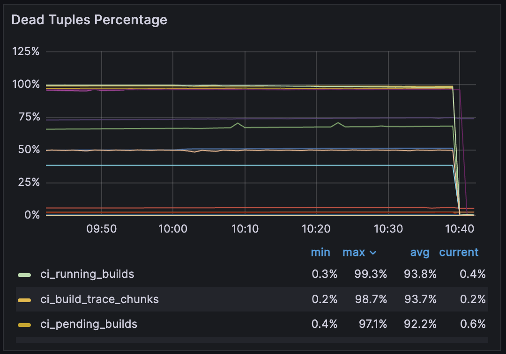
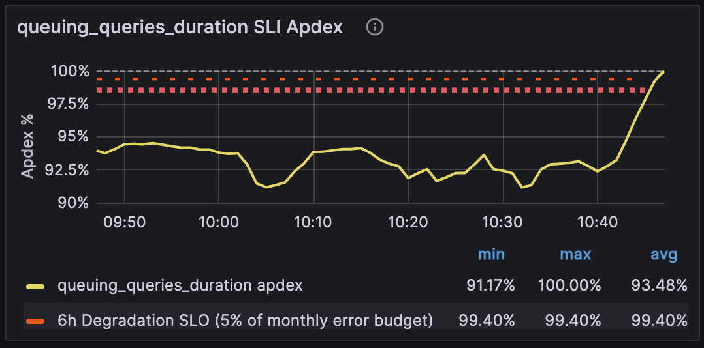

# CiRunnersServiceQueuingQueriesDurationApdexSLOViolation

## Overview

This alert indicates that the CI Runners service is experiencing slower-than-expected queuing query response times, violating the defined Service Level Objectives (SLO) for job scheduling performance.



---

## Services

- [CI Runners Service Overview](https://dashboards.gitlab.net/d/ci-runners-main/ci-runners-overview)
- **Team**: [Verify:Runner](https://handbook.gitlab.com/handbook/engineering/development/ops/verify/runner/)

## Quick Links

- [Queuing_queries_duration SLI Apdex](https://dashboards.gitlab.net/goto/BCE8kFvNg?orgId=1)
- [List of users in the queue](https://log.gprd.gitlab.net/goto/4109739640f8b21b278ca5060012fbf7)
- [List of jobs per project](https://log.gprd.gitlab.net/goto/63f83c2a163fb0b29edc33b19773db25)

---

### Contributing Factors

- High volume of concurrent CI job requests
- Database performance issues
- Runner manager capacity constraints
- Resource exhaustion in the runner fleet
- Runner manager unable to spin ephemeral VMs

### Affected Components

- CI Runner job scheduling system
- Runner managers
- Database queries related to job queuing
- CI/CD pipeline execution times

### Expected Action

Investigate the cause of increased queuing duration and take appropriate action to restore normal service performance.

## Metrics

[Metrics Catalog](../../../metrics-catalog/services/ci-runners.jsonnet)

- **Metric**: Duration of queuing-related queries for CI runners
- **Unit**: Milliseconds
- **Normal Behavior**: Query duration should remain below the Apdex threshold
- **Threshold Reasoning**: Based on historical performance data and user experience requirements

---

## Alert Behavior

- **Silencing**: Can be silenced temporarily during planned maintenance
- **Expected Frequency**: Medium - may trigger during peak usage periods
- **Historical Trends**: Check [CI Runner alerts dashboard](https://dashboards.gitlab.net/goto/uXCF8OvNg?orgId=1)

---

## Severities

- The incident severity can range from Sev3 to Sev1 depending on the specific shard affected.

### Impact Assessment

- Affects all GitLab.com users trying to run CI jobs.
- May cause delays in CI/CD pipeline execution.
- Could affect both public and private projects.

### Severity Checks

1. Check number of affected jobs in the queue.
2. Verify impact on pipeline completion times.
3. Monitor error rates in job scheduling.

---

## Verification

- Check [.com hosted runners logs](https://log.gprd.gitlab.net/app/r/s/FCgzi).
- Review [runner manager metrics](https://dashboards.gitlab.net/goto/Qk0JeBDNg?orgId=1).
- Monitor [database performance metrics](https://dashboards.gitlab.net/goto/S--a6fDHg?orgId=1).

---

## Troubleshooting

### Basic Steps

1. Check for recent [surge in CI job creation](../service-ci-runners.md#surge-of-scheduled-pipelines).
2. Verify [runner manager health](https://dashboards.gitlab.net/goto/xwXEeBDNR?orgId=1).
3. Review [Patroni performance metrics](https://dashboards.gitlab.net/goto/SlRQeBvHg?orgId=1).
5. Check if [GitLab.com usage has outgrown it's surge capacity](../service-ci-runners.md#gitlabcom-usage-has-outgrown-its-surge-capacity)

### Additional Checks

- Review scheduled pipeline timing conflicts.
- Verify runner pool capacity.
- Check for stuck jobs.
- Check for deadtuples-related issues below

---

## Possible Resolutions

1. Scale up runner manager capacity.
2. Optimize database queries.
3. Block abusive users/projects.
4. Adjust job scheduling algorithms.

### Verify for deadtuples-related performance issues

During reindexing operations, deadtuples may accumulate and degrade query performance.



#### How to Check Ongoing Reindexing Operations

Use the following SQL query to identify reindexing operations causing long query durations:

```sql
SELECT
  now(),
  now() - query_start AS query_age,
  now() - xact_start AS xact_age,
  pid,
  backend_type,
  state,
  client_addr,
  wait_event_type,
  wait_event,
  xact_start,
  query_start,
  state_change,
  query
FROM pg_stat_activity
WHERE
  state != 'idle'
  AND backend_type != 'autovacuum worker'
  AND xact_start < now() - '60 seconds'::interval
ORDER BY xact_age DESC NULLS LAST;
```

### How to Cancel Reindexing and Resume Deadtuple Cleanup

Use the `pg_cancel_backend()` function to cancel the ongoing reindexing operation, using the `pid` from the query above.

```sql
SELECT pg_cancel_backend(1641690);
```

Once canceled, you should see immediate relief in the [gitlab_ci_queue_retrieval_duration_seconds_bucket](https://dashboards.gitlab.net/goto/uHOt_ODHR?orgId=1) metrics



And SLI should recover



---

## Recent changes

- [Recent CI runners Production Change/Incident Issues](https://gitlab.com/gitlab-com/gl-infra/production/-/issues/?sort=created_date&state=all&label_name%5B%5D=Service%3A%3ACI%20Runners&first_page_size=20)
- [Recent chef-repo Changes](https://gitlab.com/gitlab-com/gl-infra/chef-repo/-/merge_requests?scope=all&state=merged)
- [Recent k8s-workloads Changes](https://gitlab.com/gitlab-com/gl-infra/k8s-workloads/gitlab-com/-/merge_requests?scope=all&state=merged)

## Recent incidents

- [CiRunnersServiceQueuingQueriesDurationApdexSLOViolation](https://gitlab.com/gitlab-com/gl-infra/production/-/issues/17367)
- [The queuing_queries_duration SLI of the ci-runners service (cny stage) has an apdex violating SLO](https://gitlab.com/gitlab-com/gl-infra/production/-/issues/18764)
- [CiRunnersServiceQueuingQueriesDurationApdexSLOViolation](https://gitlab.com/gitlab-com/gl-infra/production/-/issues/17724)

## Dependencies

- PostgreSQL database
- Runner manager VMs
- Internal load balancers
- GCP infrastructure

---

### Escalation

### When to Escalate

- Alert persists for >30 minutes.
- Multiple runner shards affected.
- Significant impact on pipeline completion times.

### Support Channels

- `#production` Slack channel
- `#g_hosted_runners` Slack channel
- `#g_runner` Slack channel
- `#f_hosted_runners_on_linux` Slack channel

---

### Definitions

- [Alert Definition](https://alerts.gitlab.net/#/alerts?filter=%7Btype%3D%22ci-runners%22%2C%20tier%3D%22sv%22%7D)
- **Tuning Considerations**: Adjust thresholds based on peak usage patterns and user feedback.

---

## Related Links

- [CI Runner Architecture Documentation](https://handbook.gitlab.com/handbook/engineering/infrastructure-platforms/production/architecture/ci-architecture)
- [Runner Abuse Prevention](../service-ci-runners.md)
- [ApdexSLOViolation Documentation](../../alerts/ApdexSLOViolation.md)
