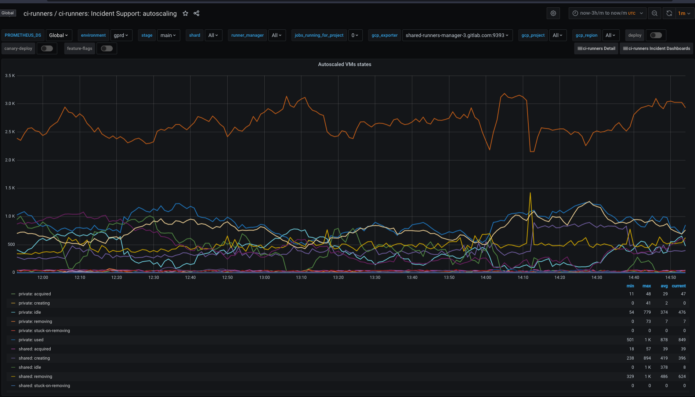

## Runners Manager: Auto-scaling

This graph can be found in
<https://dashboards.gitlab.net/d/ci-runners-incident-autoscaling/ci-runners-incident-support-autoscaling>
where you'll find all the information about autoscaling.

* **acquired**: the number of machines that are "locked" as used for requesting jobs from GitLab,
it can translate to a number of requests executed by runner to job request endpoint of GitLab.
The high number is a result of change described in this MR: <https://gitlab.com/gitlab-org/gitlab-ci-multi-runner/merge_requests/518>.

* **creating**: the number of machines that are currently being provisioned that will be later used to run new builds,

* **idle**: the number of machines that are currently waiting idle and if needed can be used to run new builds,

* **used**: the number of machines that are currently assigned to specific received job as they are used to run job payload,

* **removing**: the number of machines that are currently being removed.

* **stuck-on-removing**: the number of machines that can't be removed. A Machine it masked as `stuck-on-removing` when we tried to remove a machine 3 times.
