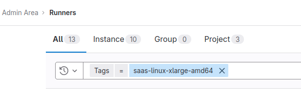
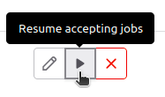

# Provisioning a new shard

## Access requirements

- [ ]  [GPRD admin account access](https://about.gitlab.com/handbook/business-technology/end-user-services/onboarding-access-requests/access-requests/#individual-or-bulk-access-request)
- [ ]  Chef server admin
- [ ]  Write access in repos:
  - [ ]  [chef-repo](https://gitlab.com/gitlab-com/gl-infra/chef-repo)
  - [ ]  [config-mgmt](https://ops.gitlab.net/gitlab-com/gl-infra/config-mgmt)
  - [ ]  [deployer](https://gitlab.com/gitlab-com/gl-infra/ci-runners/deployer)
  - [ ]  [infra-mgmt](https://gitlab.com/gitlab-com/gl-infra/infra-mgmt)
  - [ ]  [runbooks](https://gitlab.com/gitlab-com/runbooks)

## Quota Increases

[reference issue](https://gitlab.com/gitlab-org/ci-cd/shared-runners/infrastructure/-/issues/108)

1. Reach out to Google reps in `#ext-google-cloud` Slack channel.
   1. **NOTE:** Do this as early as possible in the process, as soon as we have an idea of many resources we’ll need, even before the projects exist. Do not assume we will have auto-approval on anything.
2. Collaborate with GCP reps on provisioning and due dates.
   1. [Planning sheet](https://docs.google.com/spreadsheets/d/11-pgtOZUS5FYkXxkY-KeN-MG5ySUoRSNM2LFsnTJJLg/edit?resourcekey=0-Sphm81BpjcG9rWqMh8y4rw#gid=633801891)
   2. [Planning doc](https://docs.google.com/document/d/1loZtcKB5XnuwS6MpnVw1qqZDwywlXpUqx6wQY0aB7G8/edit)
3. Submit standard quota increase requests in the GCP console.

:warning: If you need to increase quotas for `Heavy-weight read requests per minute`, it is possible you need to specifically increase `Heavy-weight read requests per minute per region` as seen in [this issue](https://gitlab.com/gitlab-com/gl-infra/production/-/issues/16233).

Typically, the following quotas will need to be increased:

- N2D CPUs (us-east1)
- Read requests per minute per region (us-east1)
- Heavy-weight read requests per minute per region (us-east1)
- Queries per minute per region (us-east1)
- Concurrent regional operations per project per operation type (us-east1)

Compare the settings with other existing projects and request needed adjustments.

```
https://console.cloud.google.com/iam-admin/quotas?project=gitlab-r-saas-l-m-amd64-org-1&walkthrough_id=bigquery--bigquery_quota_request&pageState=(%22allQuotasTable%22:(%22f%22:%22%255B%257B_22k_22_3A_22Name_22_2C_22t_22_3A10_2C_22v_22_3A_22_5C_22N2D%2520CPUs_5C_22_22_2C_22s_22_3Atrue_2C_22i_22_3A_22displayName_22%257D_2C%257B_22k_22_3A_22_22_2C_22t_22_3A10_2C_22v_22_3A_22_5C_22OR_5C_22_22_2C_22o_22_3Atrue%257D_2C%257B_22k_22_3A_22Name_22_2C_22t_22_3A10_2C_22v_22_3A_22_5C_22Heavy-weight%2520read%2520requests%2520per%2520minute%2520per%2520region_5C_22_22_2C_22s_22_3Atrue_2C_22i_22_3A_22displayName_22%257D_2C%257B_22k_22_3A_22_22_2C_22t_22_3A10_2C_22v_22_3A_22_5C_22OR_5C_22_22_2C_22o_22_3Atrue%257D_2C%257B_22k_22_3A_22Name_22_2C_22t_22_3A10_2C_22v_22_3A_22_5C_22Read%2520requests%2520per%2520minute%2520per%2520region_5C_22_22_2C_22s_22_3Atrue_2C_22i_22_3A_22displayName_22%257D_2C%257B_22k_22_3A_22_22_2C_22t_22_3A10_2C_22v_22_3A_22_5C_22OR_5C_22_22_2C_22o_22_3Atrue%257D_2C%257B_22k_22_3A_22Name_22_2C_22t_22_3A10_2C_22v_22_3A_22_5C_22Queries%2520per%2520minute%2520per%2520region_5C_22_22_2C_22i_22_3A_22displayName_22%257D_2C%257B_22k_22_3A_22_22_2C_22t_22_3A10_2C_22v_22_3A_22_5C_22OR_5C_22_22_2C_22o_22_3Atrue%257D_2C%257B_22k_22_3A_22Name_22_2C_22t_22_3A10_2C_22v_22_3A_22_5C_22In-use%2520IP%2520addresses_5C_22_22_2C_22i_22_3A_22displayName_22%257D_2C%257B_22k_22_3A_22_22_2C_22t_22_3A10_2C_22v_22_3A_22_5C_22OR_5C_22_22_2C_22o_22_3Atrue%257D_2C%257B_22k_22_3A_22Name_22_2C_22t_22_3A10_2C_22v_22_3A_22_5C_22Concurrent%2520regional%2520operations%2520per%2520project%2520per%2520operation%2520type_5C_22_22_2C_22s_22_3Atrue_2C_22i_22_3A_22displayName_22%257D_2C%257B_22k_22_3A_22_22_2C_22t_22_3A10_2C_22v_22_3A_22_5C_22region_3Aus-east1_5C_22_22%257D%255D%22,%22s%22:%5B(%22i%22:%22displayName%22,%22s%22:%220%22),(%22i%22:%22currentPercent%22,%22s%22:%221%22),(%22i%22:%22sevenDayPeakPercent%22,%22s%22:%220%22),(%22i%22:%22currentUsage%22,%22s%22:%221%22),(%22i%22:%22sevenDayPeakUsage%22,%22s%22:%220%22),(%22i%22:%22serviceTitle%22,%22s%22:%220%22),(%22i%22:%22displayDimensions%22,%22s%22:%220%22)%5D))
```

## Document CIDRS

[reference issue](https://gitlab.com/gitlab-org/ci-cd/shared-runners/infrastructure/-/issues/109)

1. Register unique CIDRs for ephemeral runner projects in the [Runbooks](https://gitlab.com/gitlab-com/runbooks/-/blob/master/docs/ci-runners/ci-runner-networking.md#ephemeral-runners-unique-cidrs-list)
1. :warning: If you're creating a new CIDR block, make sure you add it to the [Global allow list](https://docs.gitlab.com/ee/administration/settings/visibility_and_access_controls.html#configure-globally-allowed-ip-address-ranges).
    - In the Admin interface: `Settings -> General -> Visibility and access controls`.
    - If this is missed, we risk running into incidents like [this one](https://gitlab.com/gitlab-com/gl-infra/production/-/issues/18952).

## ****Define GCP projects in terraform****

[reference issue](https://gitlab.com/gitlab-org/ci-cd/shared-runners/infrastructure/-/issues/110)
[reference docs](https://ops.gitlab.net/gitlab-com/gl-infra/config-mgmt/-/blob/main/HOWTO.md#create-an-environment)

Create the projects for the ephemeral VMs in the [config-mgmt](https://ops.gitlab.net/gitlab-com/gl-infra/config-mgmt) repo. Each runner manager will point to one of the projects created here.

1. Add a new module in [environments/env-projects/saas-runners.tf](https://ops.gitlab.net/gitlab-com/gl-infra/config-mgmt/-/blob/main/environments/env-projects/saas-runners.tf)
2. Add the shard name to [atlantis.yaml](https://ops.gitlab.net/gitlab-com/gl-infra/config-mgmt/-/blob/main/atlantis.yaml)
3. Confirm projects exist
   1. May require an SRE who has permissions to check, as most devs will not have permissions for these projects until the configuration step below when we grant permissions.

## ****Configure GCP projects in terraform****

[reference issue](https://gitlab.com/gitlab-org/ci-cd/shared-runners/infrastructure/-/issues/111)

1. Run `make new-environment env=my-new-env`
2. Run `make generate-ci-config`. (This will auto-generate everything in `.gitlab/ci`)
3. Create a new shard entry under `ephemeral_project_networks` in [environments/ci/variables.tf](https://ops.gitlab.net/gitlab-com/gl-infra/config-mgmt/-/blob/main/environments/ci/variables.tf)
4. Peer the new shard's network with GPRD under `ci-gateway-network-peers` in [environments/gprd/variables.tf](https://ops.gitlab.net/gitlab-com/gl-infra/config-mgmt/-/blob/main/environments/gprd/variables.tf#L231)
5. Add the CIDRs under `ci-gateway-allow-runners` in [environments/gprd/main.tf](https://ops.gitlab.net/gitlab-com/gl-infra/config-mgmt/-/blob/main/environments/gprd/main.tf) (using values set in the Document CIDRs step above)
6. Add a new directory with the shard name in `environments/`
   1. This will contain the configuration for each GCP project. If we are adding a shard that is similar to another (e.g. `2XL` when we already have `XL`), copy the pre-existing shard and modify configuration as needed.
7. At the root of `config-mgmt`, run `terraform fmt -recursive`
8. Submit an MR with your changes.

## ****Add chef-repo configs****

[reference issue](https://gitlab.com/gitlab-org/ci-cd/shared-runners/infrastructure/-/issues/112)

Add the chef configs for the new runner shard. This will associate with `config.toml` settings on the runner managers, as well as some other settings (secrets config, analytics, etc).

1. Add a config for the global settings of the shard in `roles/`, `shard-name.json`
2. Add a config for the global `green` settings of the shard in `roles/`, `shard-name-green.json`
3. Add a config for the global `blue` settings of the shard in `roles/`, `shard-name-blue.json`
4. For each runner manager add a `json` file for both `green` and `blue` runners:
   1. `shard-name-green-1.json`
   2. `shard-name-blue-1.json`
   3. continue numerically for each runner manager

Note: initial `concurrent` setting should be `0` until we are ready to enable the runners

## ****Add secrets to vault****

[reference issue](https://gitlab.com/gitlab-org/ci-cd/shared-runners/infrastructure/-/issues/114)

1. Add secrets in vault, which will reflect what similar runners have in [this location](https://vault.gitlab.net/ui/vault/secrets/chef/list/env/ci/cookbook/cookbook-gitlab-runner/).

## Add projects to deployer

[reference issue](https://gitlab.com/gitlab-com/gl-infra/reliability/-/issues/24133)

In the [deployer](https://gitlab.com/gitlab-com/gl-infra/ci-runners/deployer) repo:

1. add the new shard name in `bin/ci`

## Run chef-client on runner managers

[reference issue](https://gitlab.com/gitlab-org/ci-cd/shared-runners/infrastructure/-/issues/115)

Note: will need chef server admin user and secrets in vault!

:warning: Ensure `concurrent` settings for any runners is set to `0`.

In #production Slack channel, initiate a `chef` run on the new machines:

```bash
# /runner run chef <new shard name> green
/runner run chef saas-linux-2xlarge-amd64 green
/runner run chef saas-linux-2xlarge-amd64 blue
```

## Set up TLS for each runner manager

[reference issue](https://gitlab.com/gitlab-com/gl-infra/reliability/-/issues/24011)

In #production Slack channel, initiate a tls-certificate test on the new machines:

```bash
# /runner run ensure-tls-certificate <new shard name> green
/runner run ensure-tls-certificate saas-linux-2xlarge-amd64 green
/runner run ensure-tls-certificate saas-linux-2xlarge-amd64 blue
```

If the run fails for any of the machines, manually `ssh` into it, and attempt running the `/tmp/create-machine.sh` and the `/tmp/test-machine.sh` to find out the root cause.

```bash
export VM_MACHINE=docker-machine-tls-test-vm-01
/tmp/create-machine.sh && /tmp/test-machine.sh
```

## Don't forget to remove any machines you manually created

docker-machine rm -f $VM_MACHINE

## Add projects to cleaner

[reference issue](https://gitlab.com/gitlab-org/ci-cd/shared-runners/infrastructure/-/issues/117)

In the [infra-mgmt](https://gitlab.com/gitlab-com/gl-infra/infra-mgmt) repo:

1. add project names to `run.sh`
2. add project names to `data/gcp/impersonated-accounts.yaml`

## Define cost factor

[reference issue](https://gitlab.com/gitlab-org/ci-cd/shared-runners/infrastructure/-/issues/118)

## Raise concurrent levels

[reference issue](https://gitlab.com/gitlab-com/gl-infra/reliability/-/issues/24144)

1. Update the `default_attributes.cookbook-gitlab-runner.global_config.concurrent` value to match max capacity in the json file for the entire shard in chef-repo.

## Enable the runners on the new shard

[reference issue](https://gitlab.com/gitlab-com/gl-infra/reliability/-/issues/24134)

:warning: Ensure `concurrent` settings for the runners are production ready, usually set to `1200`.

In #production Slack channel, initiate a `start` run on one fleet:

```bash
/runner run start saas-linux-2xlarge-amd64 green
```

After ensuring the runner process is up, enable the new runner-manager VMs through a GitLab Admin account:

1. Login as an Admin.
2. Go to [the admin console](https://gitlab.com/admin/runners)
3. Filter using the shard's tag, for example:

    

4. Click the play button to enable each of the new machines.

    

## Unpause the new runners in GPRD

[reference issue](https://gitlab.com/gitlab-com/gl-infra/production/-/issues/16104)

1. In the gitlab admin account, unpause the runners (only needs to be done once)
