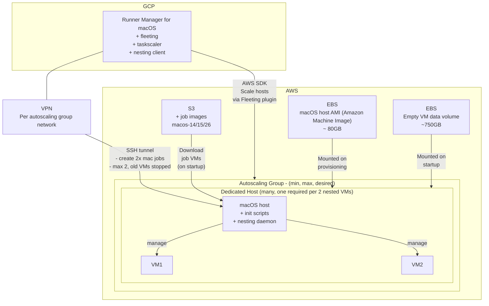

# MacOS Runners

**Table of Contents**

[TOC]

## Background

GitLab's macOS hosted runners have been a long-term goal spanning 5+ years. The current implementation uses AWS macOS dedicated hosts after previous attempts with MacStadium that nearly reached GA but had fundamental flaws preventing full deployment.

They are configured, deployed and monitored using the same methods as the [Linux runners](../linux/README.md). The key differences are detailed here.

## Overview

### Deployments

See [deployment](./deployment.md) for more details.

### Google Cloud and AWS Account Information

All the macOS fleeting hosts are [dedicated hosts](dedicated_hosts.md) in AWS.

#### Google Cloud Project

- **Runner Managers Location**: Managed through Google Cloud Project `gitlab-ci-155816`

## Architecture

### Environments

List of AWS environments:

- **saas-macos-staging**: Production duplicate (M1) for testing all components (Account `251165465090`)
- **saas-macos-medium-m1**: Mac mini M1 machines for production workloads (Account `215928322474`)
- **saas-macos-large-m2pro**: Mac mini M2 Pro machines for resource-intensive jobs (Account `730335264460`)

Here's a rough architectural overview that applies to each of these environments:

## Key Technologies

- **AWS MacOS Dedicated Hosts**: Bare metal Mac mini machines running in AWS
- **macOS Virtualization Framework**: Direct job VM management (replacing Tart after licensing changes)
- **Tart**: Still used for building job VM images (not for runtime)
- **Packer**: Automated AMI building
- **Ansible**: Tool installation and configuration

## Key Projects

### General Runner Repositories

For general information on the projects that are used to maintain runners, including macOS runners, refer to the [projects overview](../runner-projects.md).

### macOS Infrastructure

- **[Nesting](https://gitlab.com/gitlab-org/fleeting/nesting)**
  - gRPC server providing RPC API for job VM creation
  - Integrated into gitlab-runner

- **[Fleeting AWS Plugin](https://gitlab.com/gitlab-org/fleeting/plugins/aws)**
  - Manages auto-scaling groups for AWS
  - Requires Terraform setup with ARN/credentials

### Configuration Management

- **[Chef-repo roles](https://gitlab.com/gitlab-com/gl-infra/chef-repo/-/blob/master/roles/runners-manager-saas-macos-large-m2pro.json)**
- **[Config-mgmt environment](https://ops.gitlab.net/gitlab-com/gl-infra/config-mgmt/-/tree/main/environments/ci)**
- **[Config-mgmt module](https://ops.gitlab.net/gitlab-com/gl-infra/config-mgmt/-/tree/main/modules/ci-runners)**

### Testing

- **[macos platform tests](https://gitlab.com/gitlab-org/ci-cd/tests/saas-runners-tests/macos-platform)**
  - CI pipelines for platform validation

## macOS Terraform Configurations

The infrastructure is defined using Terraform configurations located in the config-mgmt repository:

- [Large macOS Runners (M2 Pro) configuration](https://ops.gitlab.net/gitlab-com/gl-infra/config-mgmt/-/blob/main/environments/ci/saas_macos_large_m2pro_env.tf)
- [Medium macOS Runners (M1) configuration](https://ops.gitlab.net/gitlab-com/gl-infra/config-mgmt/-/blob/main/environments/ci/saas_macos_medium_m1_env.tf)
- [Staging macOS Runners configuration](https://ops.gitlab.net/gitlab-com/gl-infra/config-mgmt/-/blob/main/environments/ci/saas_macos_staging_env.tf)

### Image Building

macOS has a [distinct process for building images](image_building.md) for both host machines and job VMs.

## Access to macOS instances and job VMs

Refer to [access.md](./access.md) for information on how to access macOS instances and job VMs.

## Debugging Issues

Refer to [debugging.md](./debugging.md) for a playbook on debugging issues with AWS macOS runner instances.

## Additional Information

Refer to [resources.md](./resources.md) for information on the available AWS resources.
