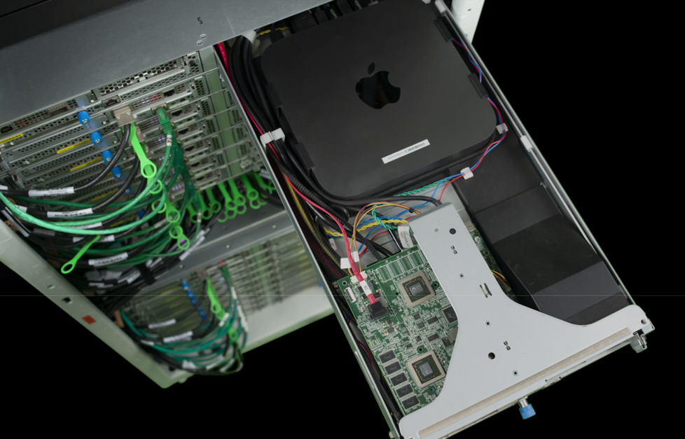

# AWS macOS Dedicated Host Characteristics

## Critical Differences from Linux VMs

**⚠️ IMPORTANT**: macOS dedicated hosts are fundamentally different from typical Linux VMs:

- **Bare Metal Hardware**: Although VMs are created for jobs in the macOS hosts, the hosts are physical [Mac machines](https://aws.amazon.com/ec2/instance-types/mac/) ([Dedicated Hosts on AWS](https://aws.amazon.com/ec2/dedicated-hosts/)) not virtualized instances.
- **Provisioning Time**: Can take hours to provision a new dedicated host.
- **Deprovisioning Time**: Can take hours to fully release and clean up.
- **Limited Availability**: Hardware availability is constrained by AWS's allocation by region and zones.

### How AWS Dedicated Hosts Boot

1. Runs a "control" macOS managed by AWS
1. Creates a second bootable OS from your AMI
1. Reboots the machine to use the custom OS

## Dedicated Host Limitations

- **Provisioning Speed**: Unlike Linux VMs, provisioning a host is slow as it involves creating a second OS from an AMI (EBS volume).
- **Availability Issues**: Frequent problems acquiring instances in specific zones, often requiring hours of waiting across multiple availability zones.
- **Release Delays**: Releasing a dedicated host can take hours as the control OS must wipe the SSD before reuse.
- **Regional Constraints**: macOS machine types are limited to specific AWS regions.
- **Apple Licensing**: Minimum 24-hour hold time per Apple OS licensing requirements - hosts cannot be released before this period.
- **Cost**: Approximately $1,000 per month per host.
