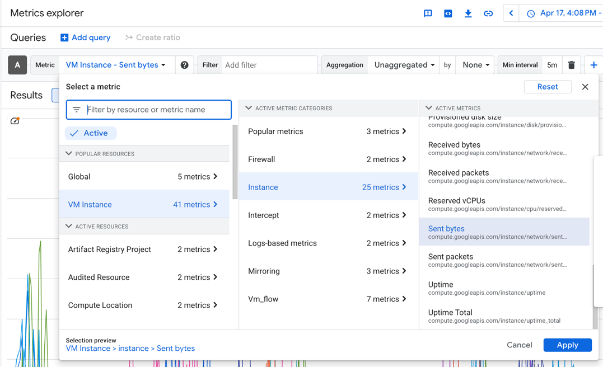
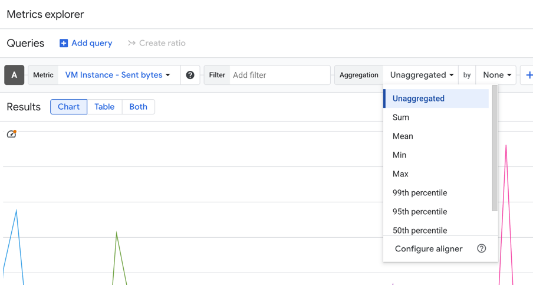
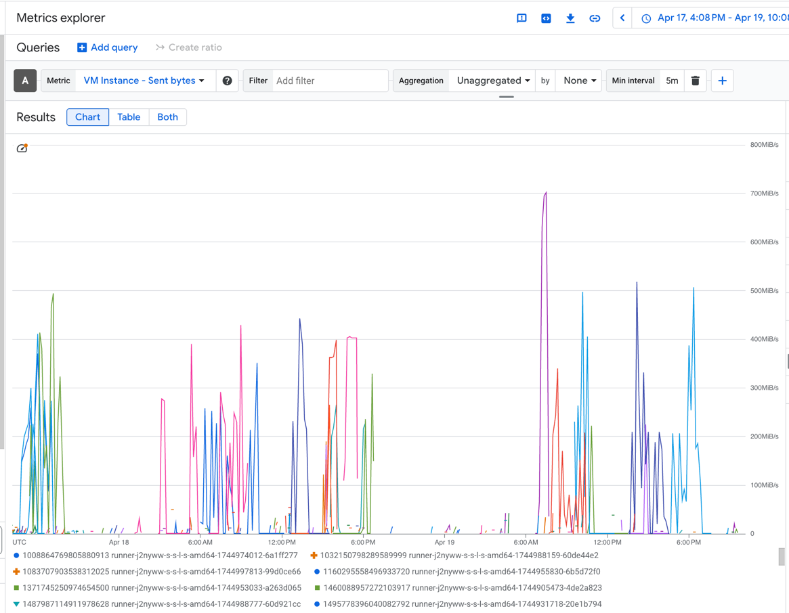
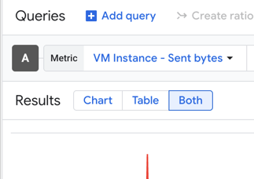
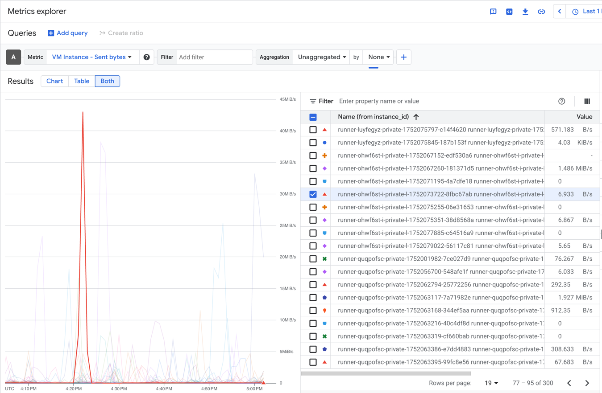
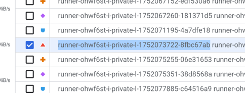
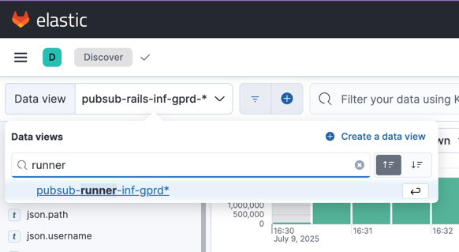
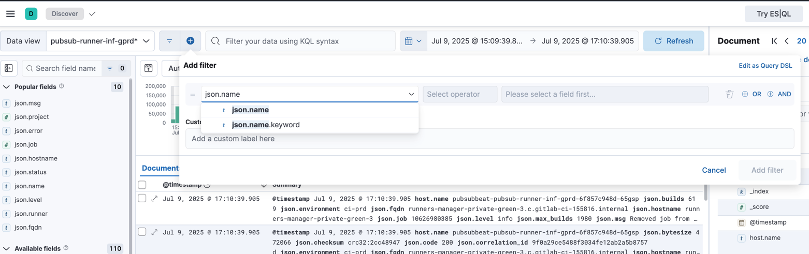
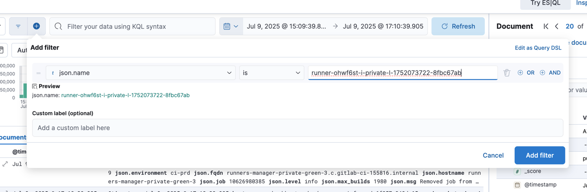
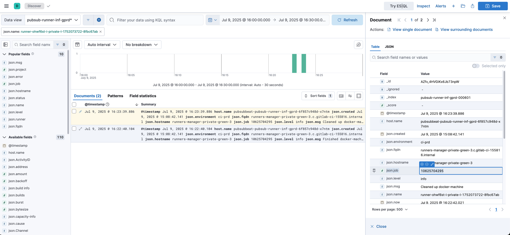

# Google Cloud Metrics Investigation

## Overview

When investigating traffic irregularities, Google Cloud Platform metrics provide valuable insights into system behavior. The "sent bytes" and "received bytes" metrics are particularly useful for recent incidents as it helps identify unusual traffic patterns.

## Locating Metrics in Google Cloud

The relevant metrics for traffic investigation are found under the `compute.googleapis.com` namespace in Google Cloud Monitoring. These metrics are retained for **24 months** according to the [data retention policy](https://cloud.google.com/monitoring/quotas#data_retention_policy).

### Key Metrics: Sent Bytes and Received Bytes

The "sent bytes" metric tracks outbound network traffic from compute instances and the "received bytes" metric tracks inbound network traffic from compute instances.They are crucial for:

- Identifying traffic spikes
- Detecting unusual data transfer patterns
- Pinpointing the specific machines responsible for irregularities

## Investigation Workflow

### Step 1: Identify Problem Machines

1. Navigate to [Google Cloud Monitoring](https://console.cloud.google.com/monitoring/metrics-explorer)
1. Select the project you want to query
1. Query the `compute.googleapis.com` namespace for sent bytes metrics

    

1. Set Aggregation to "Unaggregated"

    

1. Filter by time range to isolate the incident period
1. Identify instances with abnormal traffic patterns
1. Optional: further filter by clicking the + sign above the graph and add a "Min interval" to aggregate metrics by different time windows.

    

### Step 2: Cross-Reference with Kibana Logs

Once you've identified the problematic machines from GCP metrics:

1. Query Kibana logs for the specific machine IDs/names
1. Analyze detailed logs to understand the context of the jobs

#### Example cross-reference search

1. In GCP Metrics explorer, change the results type to "Both"

    

1. Click the line of the instance you want to search, then in the rights side panel, navigate through the list until you find the checked box.

    

1. Copy the instance name, beginning with `runner-` and ending in a 8 character hash.

    

1. In Kibana, set the data view to `pubsub-runner-inf-gprd`

    

1. Click the plus sign to the right of the Data View field, and search for the `json.name` field

    

1. Set the operator to `is` and paste the runner name into the field. Click to add the filter.

    

1. Ensure the time range of the search matches the time of the metric reading for the instance.
1. From the results, more information can be retrieved, like the project id and job id.

    

#### Getting the project URL

1. Follow the steps above for an example cross-reference search.
1. Copy the `json.job` from a log result.
1. Filter for that `json.job` as well as `json.msg == "Added job to processing list"`.
1. The result will contain a field named `json.repo_url`: the project associated with the job.

## Important Log Retention Limitations

### Kibana Logs

- **Retention period**: 30 days
- **Expansion request**: There is an open issue to extend this policy ([GitLab Observability Issue #4123](https://gitlab.com/gitlab-com/gl-infra/observability/team/-/issues/4123))

### Accessing Older Logs

If you need logs that are:

- Older than 30 days
- But within 365 days

Logs are also stored in a [GCS bucket for long-term storage](../../../logging/README.md#gcs-long-term-storage).
