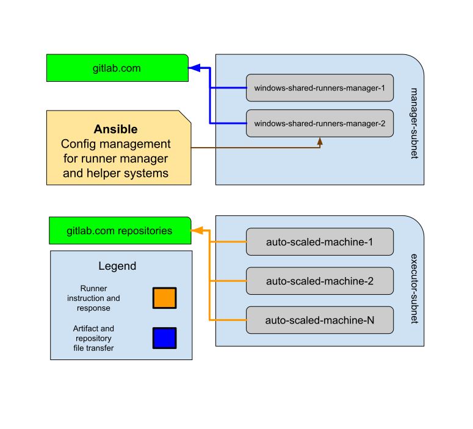

# Windows Autoscaling Runners

We operate 2 runner manager servers that run Windows and build Windows shared runners. We
must use Windows as the manager and executors talk via WinRM. However, the data flow
of the Windows runners managers are the same as the Linux runner described in
[the README](../README.md). We use a [custom autoscaler](https://gitlab.com/gitlab-org/ci-cd/custom-executor-drivers/autoscaler)
instead of `docker-machine` for these Windows runners. There is an architecture diagram that
can be found in [architecture.md](./architecture.md)

## Windows Configurations

We manage configurations of Windows servers in our [ci-infrastructure-windows](https://ops.gitlab.net/gitlab-com/gl-infra/ci-infrastructure-windows)
project. In there you will find an `ansible` directory which includes ansible playbooks and roles
used to configure the servers. Additionally, there is a `packer` directory which is used to build
images for the Windows managers. For now, we aren't doing too much with Packer as we don't have
a way to properly rebuild servers without downtime.

The Windows managers use a [custom image](https://gitlab.com/gitlab-org/ci-cd/shared-runners/images/gcp/windows-containers/)
built with Packer to build the machines that execute jobs.

## Connecting to Windows

Please read the [connecting to Windows](./connecting.md) documentation
to install relevant software and connect to Windows.

## Graceful Shutdown of Windows Runner Managers

Graceful shutdown is built into the `gitlab-runner.exe`. In order to start a shutdown, you need to open a PowerShell as an admin,
navigate to `C:\GitLab-Runner`, and execute `.\gitlab-runner.exe stop`.
This will take up to an hour to finish running jobs and finally stop.

Once it is stopped you can proceed with any maintenance you need to run.

Keep in mind that we only have two runner managers, so to avoid downtime
you should only stop the runner on only one of the managers at a time.

## Upgrading the Runner

Updating the Windows runner is a multi-step, but straightforward process.

### Updating the Windows ephemeral container image

Prepare an MR to the [windows-containers](https://gitlab.com/gitlab-org/ci-cd/shared-runners/images/gcp/windows-containers)
project that updates the runner version and checksum in the [gitlab-runner-dependencies attributes file](https://gitlab.com/gitlab-org/ci-cd/shared-runners/images/gcp/windows-containers/-/blob/main/cookbooks/gitlab-runner-dependencies/attributes/default.rb#L1-6).
Once this is merged, the container should build and publish itself.
After merging and the CI pipelines complete, verify that the image is created and available which can be done using either the GCP console or `gcloud` tool.
After you've verified that the image is available, you can proceed to
updating Ansible.

### Updating Ansible

Create an MR that [updates Ansible](https://ops.gitlab.net/gitlab-com/gl-infra/ci-infrastructure-windows/) with:

- new [runner version and hash](https://gitlab-runner-downloads.s3.amazonaws.com/latest/index.html).
- new autoscaler version (if applicable)
- new autoscaler images generated in the [windows-containers](https://gitlab.com/gitlab-org/ci-cd/shared-runners/images/gcp/windows-containers) pipeline.

These values are declared in the [`gcp_role_runner_manager.yml` file](https://ops.gitlab.net/gitlab-com/gl-infra/ci-infrastructure-windows/-/blob/master/ansible/group_vars/gcp_role_runner_manager.yml).
Be sure to update each autoscaler section to ensure all versions of Windows
are updated, as well as update each relevant image version in the `autoscaler` section of the yml file.

If you are updating the autoscaler, change the version and be sure to also update checksum.

After merging, the CI pipeline will kick off. This is gated by a manual action.
In this case, you should not run the automatically created Ansible apply
job, but instead create your own. While it is not dangerous to run the
apply job, it will fail because the runner process is still running.

**Note:** if you're just trying to _revert_ an autoscaler image upgrade, there is no need to proceed with the following steps to restart the runner manager processes.

### Applying The Upgrade

Now that the images are recreated and Ansible is updated,
it is time to execute the upgrade.

Firstly, you'll want to stop the runner gracefully on only one runner at a time. The instructions for doing so are earlier in this document.

After the runner process is fully stopped, you'll [create a new CI pipeline](https://ops.gitlab.net/gitlab-com/gl-infra/ci-infrastructure-windows/-/pipelines/new)
in the [ci-infrastructure-windows](https://ops.gitlab.net/gitlab-com/gl-infra/ci-infrastructure-windows/) project.
You will need to define the `ANSIBLE_HOST_LIMIT` and set it to the name
of the runner manager that is currently stopped (either `windows-shared-runners-manager-1` or `2`). This ensures that ansible only runs on the server that is ready for the upgrade.
This is also manually gated, so you'll need to go start the apply job after
the plan is run. Keep in mind this could take some time as Ansible on
Windows can be exceedingly slow.

When the Ansible run is completed, you can verify that the runner is
upgraded by running `gitlab-runner.exe version` in PowerShell.
Ansible should start the runner process automatically after it is done
running, but you should also verify that the runner process has started.

Finally, you can repeat the above process for the other manager that
needs an upgrade.

## Tools

### Powershell

[Powershell](https://docs.microsoft.com/en-us/powershell/) is the preferred method
of interacting with Windows via command line. While Powershell is very complex and
powerful, below are some common commands you might use. Please note that as with
most things Windows, these commands are not case-sensitive. You may also be interested
in reading Ryan Palo's [PowerShell Tutorial](https://simpleprogrammer.com/powershell-tutorial/)
as it is written with those who hate PowerShell in mind and helps relate it to
more familiar `bash` commands.

1. `Get-Content` is a tool similar to `head`, `tail`, and `cat` on Linux.
   1. Ex. `Get-Content -Path .\logfile.log -TotalCount 5` will get the first 5 lines of a file.
   2. Ex. `Get-Content -Path .\logfile.log -Tail 5 -Wait` will get the last 5 lines of a file AND follow it for any changes.
   3. [`Get-Content` documentation](https://docs.microsoft.com/en-us/powershell/module/microsoft.powershell.management/get-content?view=powershell-7)

### Third party tools

There are a few tools that are currently installed on each manager during setup. These are:

- [Notepad++](https://notepad-plus-plus.org/)
- [vim](https://chocolatey.org/packages/vim)
- jq
- [Process Explorer](https://docs.microsoft.com/en-us/sysinternals/downloads/process-explorer)
- [cmder](https://cmder.net/)

Process Explorer is probably the most important software listed. It is a great tool that gives
incredibly detailed information on processes, and it is substantially better than the built in
task manager. If you need to find out info on any processes, you should use this instead.

Additionally, `cmder` is an easier to use terminal emulator.

## Troubleshooting

### Deadman Test

A simple pipeline is executed at the project [windows-srm-deadman-test](https://gitlab.com/gitlab-org/ci-cd/tests/windows-srm-deadman-test) on a schedule every 2 hours. This serves as a canary type test to see if jobs are executing and be handled correctly by the Windows Shared Runner Managers. The job it runs is extremely simple and so a failure can be assumed to be a systemic failure of the Windows Shared Runners themselves. Notifications about job failures are posted to the Slack channel #f_win_shared_runners. If a problem is suspected on the Windows Shared Runners, look at the [history of past pipelines](https://gitlab.com/gitlab-org/ci-cd/tests/windows-srm-deadman-test/-/pipelines) for this project, and consider [triggering one manually](https://gitlab.com/gitlab-org/ci-cd/tests/windows-srm-deadman-test/-/pipelines/new) to see how it behaves.

### Shared Runners Manager Offline

If a shared runners manager is [shown offline](https://gitlab.com/gitlab-com/gl-infra/reliability/-/issues/9186):

- Connect to the windows runner manager by following the commands in the [connecting to a Windows machine doc](./connecting.md).
- Click Start Menu > Click Windows PowerShell > Right-click on Windows PowerShell sub-menu > Click Start as Administrator)
- On the command-line in the PowerShell window invoke:

  ```
  C:\Gitlab-Runner\gitlab-runner.exe status

  # if down:
  C:\Gitlab-Runner\gitlab-runner.exe start
  ```

### Autoscaler Logs and Docs

The autoscaler is a [custom executor](https://docs.gitlab.com/runner/executors/custom.html) plugin
for the GitLab Runner.

The autoscaler logs to a file located at `C:\GitLab-Runner\autoscaler\autoscaler.log`. This file
will contain all the information regarding creation, connection, and deletion of VMs. You may want to look
here if VM creation is failing or connections from the managers are failing. This is likely
the best first place to check when issues arise.

- On the command-line in the PowerShell window invoke:

  ```
  Get-Content C:\Gitlab-Runner\autoscaler\autoscaler.log -tail 100 | Out-Host -Paging
  ```

### Firewall rules for winrm

The managers must be able to connect to the spawned VMs via port 5985-5986.
The relevant GCP firewall rules are defined in [firewall.tf](https://ops.gitlab.net/gitlab-com/gitlab-com-infrastructure/-/blob/master/environments/windows-ci/firewall.tf#L15-30)
in our terraform repo. The port should be open by default on the spawned
VMs during [packer image creation](https://gitlab.com/gitlab-org/ci-cd/shared-runners/images/gcp/windows-containers/-/blob/master/packer.json#L28-31).

### Using the wrong image, with missing dependencies

The image that the spawned VMs use is created by the [windows-container](https://gitlab.com/gitlab-org/ci-cd/shared-runners/images/gcp/windows-containers)
project and defined in the [group_vars](https://ops.gitlab.net/gitlab-com/gl-infra/ci-infrastructure-windows/-/blob/master/ansible/group_vars/gcp_role_runner_manager.yml#L48)
in Ansible.

## Architecture Diagram


