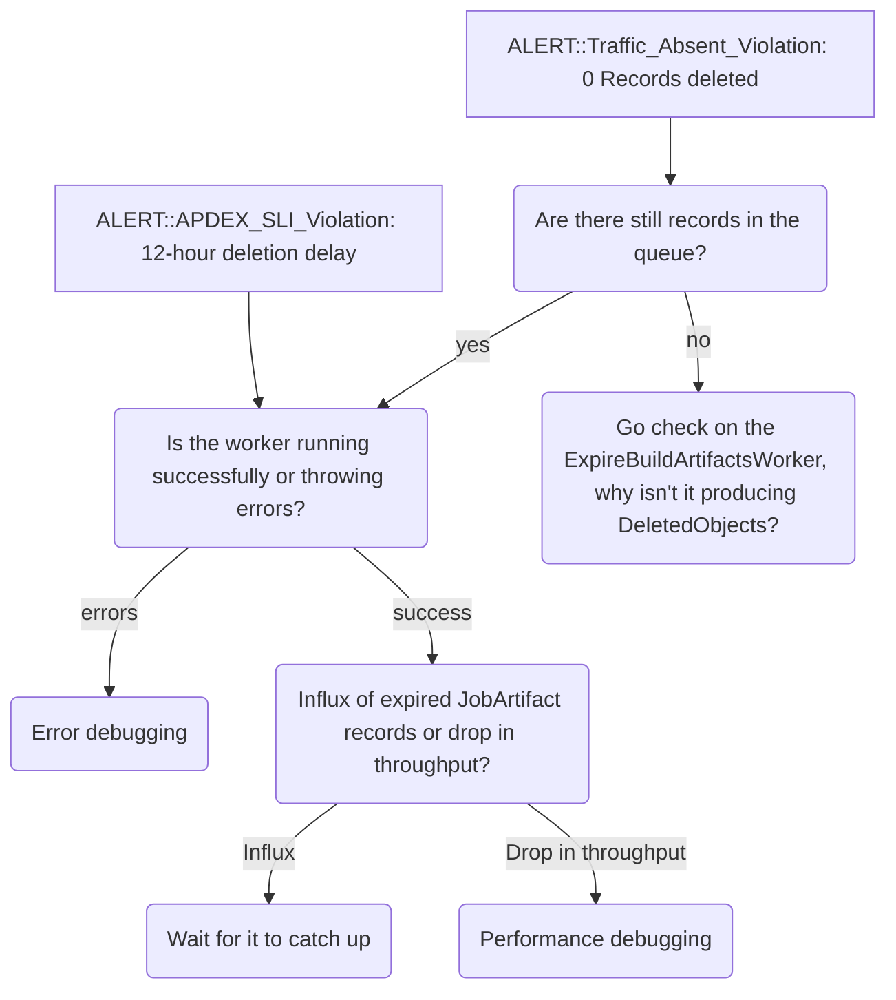

# CI Deleted Objects Processing Triage

**SLI Alert: `ci_deleted_objects_processing`**

This page contains instructions for how to resolve alerts related to deleting job artifacts(`Ci::DeleteObjectsWorker`). The intended audience are product engineers and support engineers looking to resolve issues with degraded artifact deletion on gitlab.com.

## Overview

* [Sidekiq Service Level Indicator Dashboard](https://dashboards.gitlab.net/d/sidekiq-main/sidekiq-overview) _Scroll to row with `ci_deleted_objects_processing SLI` to see current apdex and error ratios._
* **Alerts**: <https://alerts.gitlab.net/#/alerts?silenced=false&inhibited=false&muted=false&active=true&filter=%7Btype%3D%22sidekiq%22%2C%20component%3D%22ci_deleted_objects_processing%22%7D>
* **Label**: gitlab-com/gl-infra/production~"Service::Sidekiq"

## Logging

* [Sidekiq Main](https://log.gprd.gitlab.net/app/r/s/I6EMJ)
* [Sidekiq Ci::DeleteObjectsWorker](https://log.gprd.gitlab.net/app/r/s/JZWtl)
* [Sidekiq Ci::ScheduleDeleteObjectsCronWorker](https://log.gprd.gitlab.net/app/r/s/o2nsO)

## Ci::DeleteObjectsService

Artifacts can be deleted by 2 mechanisms:

1. Default Expiry: 30 days
2. `artifacts:expire_in` can be set in the pipeline configuration(`.gitlab-ci.yml`)

**Note:** _By default (unless explicitly disabled), artifacts are always kept for the most recent successful pipeline on each ref. Any `expire_in` configuration does not apply to the most recent artifacts. More information: [job artifact documentation](https://docs.gitlab.com/ci/jobs/job_artifacts/#keep-artifacts-from-most-recent-successful-jobs)_

Once artifacts are "expired" a record is created on `Ci::DeletedObject` table. `Ci::ScheduleDeleteObjectsCronWorker` runs every 16 minutes queueing artifacts in batches for destruction through `Ci::DeleteObjectsWorker` and eventually `Ci::DeleteObjectsService`.

## Why was this alert implemented?

There have been incidents in the past where `Ci::DeleteObjectsWorker` could not keep up with the amount of data that needs to be removed. There have also been occurances where the workers silently failed due to a bug introduced([!165778](https://gitlab.com/gitlab-org/gitlab/-/merge_requests/165778)), or were under provisioned for a few days before recovering.

While this issue does not directly cause a user facing issue, keeping expired artifacts increases storage costs and this may go unnoticed for quite some time without an alert.

## Monitoring/Alerting

Alerting has been configured through Runbooks to alert into Slack channel `#g_pipeline-execution_alerts`.

If an `ci_deleted_objects_processing` alert is triggered it should be triaged and investigated as soon as possible by a member of the `Verify::Pipeline Execution` team.

For any questions please reach out to the team in Slack via `#g_pipeline-execution` or `s_verify` or use GitLab's group handle `@gitlab-com/pipeline-execution-group`.

### Apdex Violation

The apdex for this alert considers the time elapsed between creation of a `Ci::DeletedObject` and it's deletion. The threshold is set to 12 hours. If at the time of deletion the artifact had been expired (meaning a record on `ci_deleted_objets` was created) more than 12 hours ago the apdex threshold is considered breached and the issue should be investigated. This alert will trigger when the apdex is degraded.

[This dashboard](https://dashboards.gitlab.net/goto/cf0nx61p7ckxse?orgId=1) shows the rate at which records are inserted and deleted from `ci_deleted_objects`. A spike would indicate a large batch of deletions occurred.

Using a production access request, you can group the data by `project_id` or `file_store` to see if there are patterns with the to-be-deleted records.

* [ApdexSLOViolation](../alerts/ApdexSLOViolation.md)

### Traffic Cessation Violation

This alert is triggered when there is no traffic to [`Ci::DeleteObjectsWorker`](https://gitlab.com/gitlab-org/gitlab/-/blob/master/app/workers/ci/delete_objects_worker.rb) for 30 min. Considering the volume of artifacts created and expired each day and the cron job([ScheduleDeleteObjectsCronWorker](https://gitlab.com/gitlab-org/gitlab/-/blob/master/app/workers/ci/schedule_delete_objects_cron_worker.rb)) running every 16 minutes, there is no reason why this worker have no traffic for 30 minutes under usual operating conditions.

* [Traffic Absent](../alerts/TrafficAbsent.md)

### Error Violation

An error is recorded when the artifact deletion fails. This is different than the apdex violation where the artifact is successfully deleted but not within an acceptable time frame. This SLO is measured but does not currently trigger an alert. It is necessary to monitor for traffic absence and can also be used for investigation purposes.

* [ErrorSLOViolation](../alerts/ErrorSLOViolation.md)

## Triage & Trouble Shooting

If the problem is due to saturation of the worker, you can create a MR and update `max_running_jobs` for the worker to a threshold that can withstand the increased backlog.

If the `max_running_jobs` is reading from [ApplicationSettings](https://gitlab.com/gitlab-org/gitlab/-/issues/576122), ask an SRE or GitLab admin to update this config. Warning: This will increase the load on PGBouncer as each worker will be making a transactional call to the database.

### Other Related Components and Documentation

* [Ci::DeleteObjectsService](https://gitlab.com/gitlab-org/gitlab/-/blob/master/app/services/ci/delete_objects_service.rb)
* [JobArtifacts::DestroyBatchService](https://gitlab.com/gitlab-org/gitlab/-/blob/master/app/services/ci/job_artifacts/destroy_batch_service.rb)
* [ExpireBuildArtifactsWorker](https://gitlab.com/gitlab-org/gitlab/-/blob/master/app/workers/expire_build_artifacts_worker.rb)
* [Job artifact troubleshooting](https://gitlab.com/gitlab-org/gitlab/-/blob/master/doc/administration/cicd/job_artifacts_troubleshooting.md)
