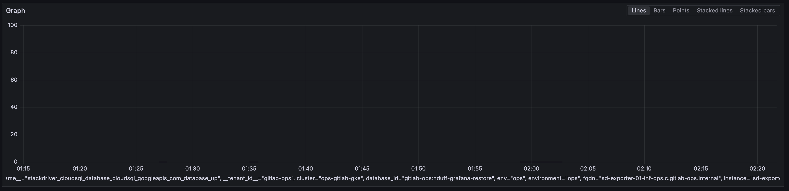

# CloudSQLDatabaseDown

## Overview

This alert means that the Cloud SQL database for the environment is unavailable.
Any services using the Cloud SQL database that is down are most likely to be degraded or unavailable as well.

If you receive this alert, it is expect that you verify the Cloud SQL database status, look for a change or cause of the outage, and possibly open a support ticket with Google Cloud if warranted.

## Services

- [Cloud SQL Service](../README.md)
- No one team owns Cloud SQL.

Consider using the [Tech Stack](https://handbook.gitlab.com/handbook/business-technology/tech-stack/) or [Metrics Catalog](../../../metrics-catalog/README.md) to determine which service owner may need to be involved.

## Metrics

This metric is exported from Google Stackdriver metrics and will report a value of 0 for down and 1 for up.
The thresholds for the metric are to page on any database that reports as down for 5m (or longer).
These values were chosen to reflect an aggresive response to a database being down.

Normally, the Cloud SQL databases in an environment should reflect as up.

Example view of the metric showing a failure.

[Source](https://dashboards.gitlab.net/goto/2bVjTNuIR?orgId=1)

## Alert Behavior

This alert [should fire rarely](https://nonprod-log.gitlab.net/app/r/s/Dvj4e) since it is a managed Google Cloud service.
It is more likely to notify the EoC due to a configuration change, or maintenance work conducted by our own teams.
Due to this, silencing the alert is possible, but a duration should be short and appropriate to the cause of the database being down.

Refer to the metrics above for a reference of the metric when down.

## Severities

At the time of this being written, Cloud SQL is only in use in a few environments (ops and pre).
While GitLab.com would not be directly affected by a database being unavailable in Cloud SQL, there are some key dependent services that could create a high severity incident.

- [GitLab's Package Hosting System](../../pulp/README.md) - Customer facing service for GitLab packages.
- [Sentry](../../sentry/README.md) - Internal error tracking service.
- [Grafana](../../monitoring/README.md) - Internal monitoring and metrics service.

The `pre` environment also depends on several Cloud SQL Databases.

## Verification

Here is the [expression the alert uses in Grafana](https://dashboards.gitlab.net/goto/yiJBLHuSR?orgId=1).

```
stackdriver_cloudsql_database_cloudsql_googleapis_com_database_up{env="ops"} != 1
```

Since this metric represents a binary signal of up or down, there is little benefit in having dashboards to show this information.

Logs for Cloud SQL are probably best references in the `ops` or `pre` projects' [Log Explorer](https://cloudlogging.app.goo.gl/wcQhosoXqEvbVzPJ9) in the Google Cloud web console.

## Recent changes

- [Recent change issues involving Cloud SQL](https://gitlab.com/gitlab-com/gl-infra/production/-/issues/?sort=updated_desc&state=all&search=cloudsql&label_name%5B%5D=change&label_name%5B%5D=Service%3A%3ACloudSQL&first_page_size=100)
- [Recent Terraform changes involving Cloud SQL](https://ops.gitlab.net/gitlab-com/gl-infra/config-mgmt/-/merge_requests?scope=all&search=cloudsql&sort=merged_at_desc&state=merged)

## Troubleshooting

1. Try to identify from the [alert expression](https://dashboards.gitlab.net/goto/yiJBLHuSR?orgId=1) which database is unavailable.
2. Examine the service to verify if it is working or showing problems. This may help rule out false positive alerts.
3. Log into the Google Cloud web console and find the [Cloud SQL database](https://console.cloud.google.com/sql/instances?referrer=search&project=gitlab-ops) and look for health information.
4. Check the [Google Cloud Status](https://status.cloud.google.com/) page for related managed service outages.

## Possible Resolutions

- N/A

## Dependencies

This service is managed by Google Cloud. Outside of our own changes, any degredation in cloud services could contribute to a Cloud SQL database being unavailable.

## Escalation

If the outage is due to a Google Cloud issue, you will need to open a support ticket via the [web console](https://console.cloud.google.com/).
If you also need more synchronous help, you can try to ask for help in the [#ext-google-cloud](https://gitlab.enterprise.slack.com/archives/C01KPV0V3SM) slack channel.

## Definitions

- [Alert Definition for Ops](https://gitlab.com/gitlab-com/runbooks/-/blob/master/mimir-rules/gitlab-ops/cloud_sql.yml#L4-15)
- [Alert Definition for Pre](https://gitlab.com/gitlab-com/runbooks/-/blob/master/mimir-rules/gitlab-pre/cloud_sql.yml#L4-15)
- [Link to edit this playbook](https://gitlab.com/gitlab-com/runbooks/-/edit/master/docs/cloud-sql/alerts/CloudSQLDatabaseDown.md?ref_type=heads)
- [Update the template used to format this playbook](https://gitlab.com/gitlab-com/runbooks/-/edit/master/docs/template-alert-playbook.md?ref_type=heads)

## Related Links

- [Related alerts](./)
