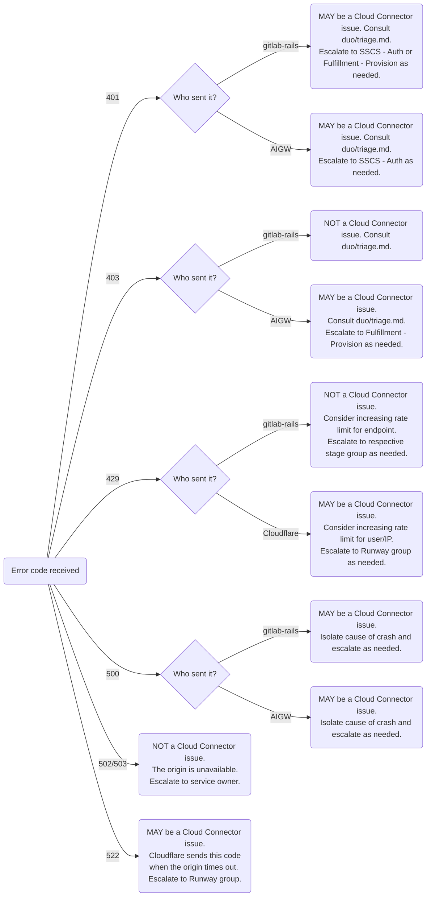

<!-- Permit linking to GitLab docs and issues -->
<!-- markdownlint-disable MD034 -->
# Cloud Connector

Cloud Connector is a way to access services common to multiple GitLab deployments, instances, and cells.
Cloud Connector is not a dedicated service itself, but rather a collection of APIs, code and configuration
that standardize the approach to authentication and authorization when integrating Cloud services with a GitLab instance.

This document contains general information on how Cloud Connector components are configured and operated by GitLab Inc.
The intended audience is GitLab engineers and SREs who have to change configuration for or triage issues with these
components.

See [Cloud Connector architecture](https://docs.gitlab.com/ee/development/cloud_connector/architecture.html) for more information.

---

## Triage decision chart

Navigate the chart below to locate the system and owner of the failing endpoints. The chart covers the AI gateway integration
with Cloud Connector specifically, as it is the system with the most usage, but translates to other backends too:

For client errors with AI features, consult the [Duo triage runbook](../duo/triage.md).

## Cloudflare

See [Cloud Connector - Cloudflare](./cloudflare.md).

Applies to all edges in the triage chart that are labeled Cloudflare.

## Authentication

See [Cloud Connector - Authentication](../sscs/auth/cloud-connector.md).

Applies to all cases in the triage chart that render authn/authz codes (401, 403).

<!-- markdownlint-enable MD034 -->
