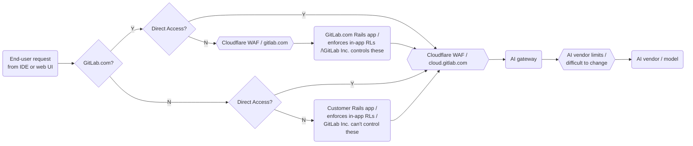

<!-- Permit linking to GitLab docs and issues -->
<!-- markdownlint-disable MD034 -->
# Cloud Connector - Cloudflare

Ownership: [Runway Team](https://handbook.gitlab.com/handbook/engineering/infrastructure-platforms/team/runway/).

Any client consuming a Cloud Connector service must do so through `cloud.gitlab.com`, a public endpoint
managed by Cloudflare. A "client" here is either a GitLab instance or an end-user application such as an IDE.

Cloudflare performs the following primary tasks for us:

- Global load balancing using Cloudflare's Anycast network
- Enforcing WAF and other security rules such as rate limiting
- Routing requests into GitLab feature backends

The `cloud.gitlab.com` DNS record is fully managed by Cloudflare, i.e. Cloudflare acts as a [reverse proxy](https://www.cloudflare.com/learning/cdn/glossary/reverse-proxy).
This means any client dialing this endpoint will reach a Cloudflare server, not a GitLab backend.
See [routing](#routing) for more information on how how requests are forwarded.

Routing and rate limits are configured here:

- [staging](https://ops.gitlab.net/gitlab-com/gl-infra/config-mgmt/-/tree/main/environments/cloud-connect-stg)
- [production](https://ops.gitlab.net/gitlab-com/gl-infra/config-mgmt/-/tree/main/environments/cloud-connect-prd)

The default URL for the Cloudflare proxy is `cloud.gitlab.com`, which is used in production environments.
It can be overridden by setting the `CLOUD_CONNECTOR_BASE_URL` environment variable.
For example, we set this to [cloud.staging.gitlab.com](https://gitlab.com/gitlab-com/gl-infra/k8s-workloads/gitlab-com/-/blob/e1354607d4214b1e8b74b9a13126f42136fd712c/releases/gitlab/values/gstg.yaml.gotmpl#L472) for our multi-tenant GitLab
SaaS deployment.
This will direct any Cloud Connector traffic originating from `staging.gitlab.com` to `cloud.staging.gitlab.com`.
Self-managed customers are _not_ expected to set this variable.

## Monitoring

### Dashboards

- [Cloudflare dashboard](https://dash.cloudflare.com/852e9d53d0f8adbd9205389356f2303d/cloud.gitlab.com)
- [Grafana Cloudflare dashboard for `cloud_gitlab_zone`](https://dashboards.gitlab.net/d/cloudflare-main/cloudflare3a-overview)

### Alerts

- [CloudflareCloudConnectorRateLimitExhaustion](./alerts/CloudflareCloudConnectorRateLimitEvents.md)

### Logs

There are three ways to monitor traffic going through `cloud.gitlab.com`, each with their pros and cons:

- [Instant Logs](https://dash.cloudflare.com/852e9d53d0f8adbd9205389356f2303d/cloud.gitlab.com/analytics/instant-logs).
  Use this to monitor live traffic. This stream will only display the most basic properties of an HTTP request,
  such as method and path, but can be useful to filter and monitor traffic on-the-fly.
- [Log Explorer](https://dash.cloudflare.com/852e9d53d0f8adbd9205389356f2303d/cloud.gitlab.com/analytics/log-explorer).
  This tool allows querying historic logs using an SQL-like query language. It can surface all available information
  about HTTP requests, but has limited filtering capabilities. For example, since HTTP header fields are stored as
  an embedded JSON string, you cannot correlate log records with backend logs by filtering on e.g. correlation IDs.
- [LogPush](../cloudflare/logging.md). This approach first pushes logs from Cloudflare to a Google Cloud Storage bucket, from which you can then
  stream these files to your machine as JSON, or load them into BigQuery for further analysis. To stream the last 30m
  of HTTP request logs from a given timestamp into `jq`, run:

  ```shell
  scripts/cloudflare_logs.sh -e cloud-connect-prd -d 2024-09-25T00:00 -t http -b 30 | jq .
  ```

If you wish to correlate log events between Cloudflare logs and the Rails application or Cloud Connector backends:

- **Via request correlation IDs:** Look for `x-request-id` in the Cloudflare `RequestHeaders` field.
  Correlate it with `correlation_id` in application services.
  This identifies an individual request.
- **Via instance ID:** Look for `x-gitlab-instance-id` in the Cloudflare `RequestHeaders` field.
  Correlate it with `gitlab_instance_id` in application services.
  This identifies an individual GitLab instance (both SM/Dedicated and gitlab.com).
- **Via global user ID:** Look for `x-gitlab-global-user-id` in the Cloudflare `RequestHeaders` field.
  Correlate it with `gitlab_global_user_id` in application services.
  This identifies an individual GitLab end-user (both SM/Dedicated and gitlab.com).
- **Via caller IP:** Look for `ClientIP` in Cloudflare logs.
  Correlate it with `client_ip` (or similar fields) in application services.
  This identifies either a GitLab instance or end-user client such as an IDE from which the
  request originated.

## Routing

While this is not systematically enforced, we require all clients that want to reach Cloud Connector backends
to dial `cloud.gitlab.com` instead of the backends directly. Backends that use a public load balancer such as
GCP Global App LB should use Cloud Armor security policies to reject requests not coming from Cloudflare.

Routing is based on path prefix matching. Every Cloud Connector backend (e.g. the AI gateway) must be connected as
a Cloudflare origin server with such a path prefix. For example, the AI gateway is routed via the `/ai` prefix,
so requests to `cloud.gitlab.com/ai/*` are routed to the AI gateway, with the prefix stripped off (only `*` is forwarded.)

You can see an example of this [here](https://ops.gitlab.net/gitlab-com/gl-infra/config-mgmt/-/blob/30e42e4f36bedb6d65922a4dc68125023f6c2adc/environments/cloud-connect-prd/rules.tf).

## WAF Rules

The Cloud Connector Zones (`cloud.gitlab.com`) are protected by the standard WAF rules used across GitLab, which can be found in the [`cloudflare-waf-rules`](https://gitlab.com/gitlab-com/gl-infra/terraform-modules/cloudflare/cloudflare-waf-rules) module. This provides configuration for the [WAF Custom Rules](https://developers.cloudflare.com/waf/custom-rules/) and [Cloudflare Managed Rules](https://developers.cloudflare.com/waf/managed-rules/) that:

1. block embargoed countries
1. block requests that try to [exploit some vulnerabilities](https://ops.gitlab.net/gitlab-com/gl-infra/terraform-modules/cloudflare/cloudflare-waf-rules/-/blob/main/cloudflare-custom-rules.tf?ref_type=heads#L276-312)

However, Cloud Connector does not use the standard [Rate Limiting Rules](https://developers.cloudflare.com/waf/rate-limiting-rules/) provided by the [`cloudflare-waf-rules`](https://gitlab.com/gitlab-com/gl-infra/terraform-modules/cloudflare/cloudflare-waf-rules) module, and instead overrides these with customized rate limiting rules, outlined below.

## Rate limiting

Additionally to standard WAF rules, we define rate limits that guard against malicious or misbehaving customer instances and clients.
These rate limits are not to be confused with [gitlab.com Cloudflare rate limits](https://ops.gitlab.net/gitlab-com/gl-infra/config-mgmt/-/blob/7c37d9cd6340840b795bf1e44912ba4ef2cc0f2f/environments/gprd/cloudflare-rate-limits-waf-and-rules.tf)
(which guard the gitlab.com application deployment) or [application rate limits](https://docs.gitlab.com/ee/security/rate_limits.html) enforced in the Rails monolith itself.

Cloud Connector rate limits are instead enforced between either customer Rails instance (or end-user) and GitLab backend services.
The following diagram illustrates where Cloud Connector rate limits fit into the overall rate limit setup, for
the example of the AI gateway:



The rate limits enforced in Cloudflare are specified per backend and can be classified as follows:

- **Per user.** Limits applied to a given user identified by a unique global UID string.
- **Per authentication attempt.** Rate limits applied to clients that produce repeated `401 Unauthorized` server responses.
  This is to prevent credential stuffing and similar attacks that brute force authentication.

You can observe WAF events for custom rate limit rules [here](https://dash.cloudflare.com/852e9d53d0f8adbd9205389356f2303d/cloud.gitlab.com/security/events?service=ratelimit).

### Rate limiting alerts and troubleshooting

Refer to dedicated [page](./alerts/CloudflareCloudConnectorRateLimitExhaustion.md) to understand when the alert is sent and how to troubleshoot.

<!-- markdownlint-enable MD034 -->
