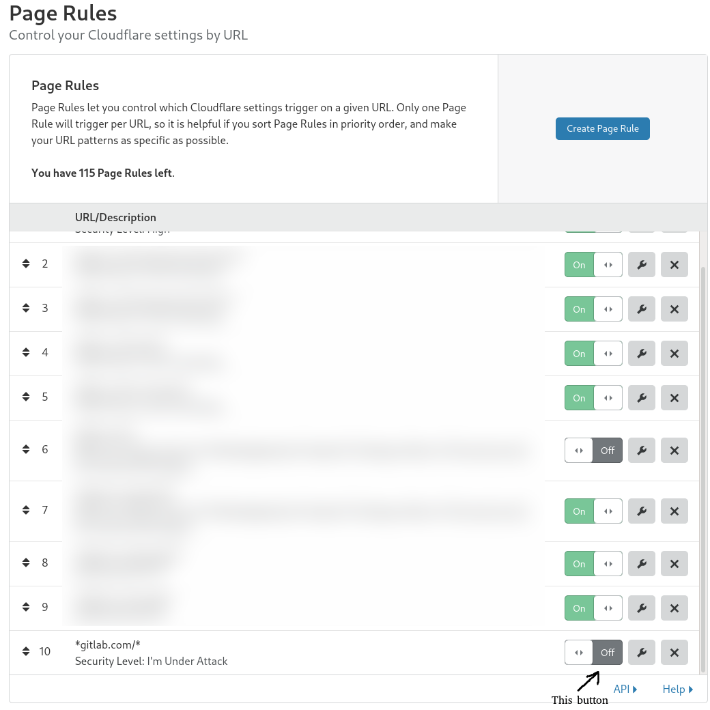

# Cloudflare: Managing Traffic

## General

Cloudflare settings are managed with Terraform in the [`config-mgmt`](https://ops.gitlab.net/gitlab-com/gl-infra/config-mgmt) repo.

Any changes to Cloudflare settings **must** be made via a Merge Request to the appropriate environment. Any settings changes that are not committed to the source code **will be overwritten** next time the `terraform apply` pipeline runs.

GitLab Pages and the GitLab registry are not yet fronted by Cloudflare, so these blocks would not affect them.

### Creating new WAF rules

:warning: Note that WAF rules apply to HTTP/S traffic only. To apply blocks to other traffic (e.g. SSH), you'll need to use [IP Access Rules](https://developers.cloudflare.com/waf/tools/ip-access-rules/), which are a lot less flexible. If you need greater flexibility than what IP Access Rules offer (for example, blocking IP ranges that aren't `/16` or `/24`), consider [blocking in HAProxy](../frontend/ban-netblocks-on-haproxy.md). :warning:

#### via Merge Request to Terraform

New rules that should affect all GitLab services (including Dedicated and Runway) should be added to the [`cloudflare-waf-rules`](https://ops.gitlab.net/gitlab-com/gl-infra/terraform-modules/cloudflare/cloudflare-waf-rules) module. Only add rules to `config-mgmt` that are specific to GitLab.com.

- New WAF rules to block traffic (or add a challenge to traffic) should be added to the Custom Rules [ruleset](https://ops.gitlab.net/gitlab-com/gl-infra/config-mgmt/-/blob/main/environments/gprd/cloudflare-custom-rules.tf) via a Merge Request
- New rules to rate limit traffic should be added to the Rate Limit [ruleset](https://ops.gitlab.net/gitlab-com/gl-infra/config-mgmt/-/blob/main/environments/gprd/cloudflare-rate-limits-waf-and-rules.tf#L41) via a Merge Request
Note: take care to add these to the ruleset, and not as `cloudflare_rate_limit` resources. These are now [deprecated](https://developers.cloudflare.com/waf/reference/migration-guides/old-rate-limiting-deprecation) and will be removed by May 1st 2024
- These Merge Requests _must_ contain a link to the issue explaining why the change was made (probably an incident issue), for audit and tracking purposes. Having a comment in Terraform containing a link to the relevant issue or incident is also helpful.

#### Manually

- **If it is necessary to make changes via the Cloudflare UI** (for example, during an incident) this can still be done manually, however the changes **will be overwritten** the next time there is a `terraform apply`. As such, any new rules will need to be committed to Terraform after the incident (either by the EOC, or asking for help from Infrastructure).

- Create the rule using the [Cloudflare UI](https://dash.cloudflare.com/852e9d53d0f8adbd9205389356f2303d/gitlab.com/firewall/firewall-rules) with a description explaining why the rule was created (ideally include an issue number). For further detail refer to the [Cloudflare documentation on managing rules.](https://developers.cloudflare.com/firewall/cf-dashboard/create-edit-delete-rules/).

*Note:* For audit purposes, any manual changes in the UI must be documented in the associated incident or issue. Please note the Resource ID (you can find this in the URL when editing a rule) and add the `~Cloudflare UI Change` label.

#### Cloudflare Rules Naming Conventions

New rules must adhere to the naming conventions described in the [Naming Convention](/intro.md)

## How do I Enable "I'm Under Attack Mode" in Cloudflare once I determine we are under a large scale attack?

In the Cloudflare UI, under the domain in question, click on the Page rules button up the top. Once you
see the list of page rules, scroll down to the bottom, where you should notice a page rule for
`*gitlab.com/*` with security level "I'm Under Attack" set to "Off". Click the button to "On" to enable it.

If you enable "Under Attack Mode" at the zone level, this will break all Gitlab API traffic, so the method above
is preferred as it will preserve API traffic from being affected.

## When to block and how to block

Blocks should be combined to limit the impact on customers sharing the same public IP as the abuser, whenever possible.

IP Blocks should not be a permanent solution. IP addresses get rotated on an ISP level, so we should strive to block them only as long as required to mitigate an attack or block abusive behaviour.

Whatever it is. Create a Merge Request to the [config-mgmt repo](https://ops.gitlab.net/gitlab-com/gl-infra/config-mgmt/-/blob/main/environments/gprd/cloudflare-custom-rules.tf) first and link it to the relevant issues.

Note: the [firewall issues tracker](https://gitlab.com/gitlab-com/gl-infra/cloudflare-firewall/-/issues) is now **deprecated**. We are keeping the repository for historical tracking purposes.

### Decision Matrix

| Type of traffic pattern \ Type of Block | Temporary block on URI | Temporary block on other criteria | Temporary block on IP/CIDR | Permanent block on IP/CIDR |
| --- | ---| --- | --- | --- |
| 1. Project abuse as CDN, causing production issues or similar | yes | yes, in combination if uniquely identifiable via User-Agent or other means | no | no |
| 2. Spamming on issues and/or Merge Requests | yes, in combination, not as standalone | yes, if uniquely identifiable via User-Agent or other means | yes, if applicable | yes, if applicable and repeated |
| 3. API / Web abuse from single IP/CIDR | yes, if limited to specific paths | yes, in combination if uniquely identifiable via User-Agent or other means | yes | yes, if repeated |
| 4. L7 DDoS not automatically detected by WAF | no | no | yes | yes, if repeated |

### Scenarios

- Scenario 1.1:
  - Problem:
    - Project `foo/bar` is abused by someone, who develops an app (with a dedicated user-agent) which uses this project as a CDN for its version check. This causes high load on Gitaly, raising an alert.
  - Block to apply:
    - We have the following datapoints to identify traffic for this specific abuse, so we should apply those. This prevents blocking other, legitimate traffic the App might have with our service, while alleviating the abuse pattern.
      - The project URI
      - User-agent of the app
    - The block to apply would be a combination of those two datapoints.
  - Why?
    - Blocking the project URI itself would lead to a project being unavailable for everyone. But we should limit the impact of a block to the immediate offenders. Since we can uniquely identify update checks via the combination of project URI and User-agent, we should refrain from a project-wide block.
  - Further measures:
    - Make sure to have support reach out to the project owner(s), to have the abusive pattern removed.
    - Inform the abuse team, to further analyze long-term solutions.

- Scenario 1.2:
  - Problem:
    - Project `bar/baz` is abused by someone, by hosting binary blobs, which are hot-linked all over the internet. This causes high load on Gitaly, raising an alert.
  - Blocks to apply:
    - We only have the project URI as an identifier of the requests, as they come from everywhere and are using different clients to connect.
    - Thus, the block to apply is on the project URI in question.
  - Why?
    - We cannot limit the impact of the block, as we have no other means of identifying requests, so we need to block the whole project as a last resort.
  - Further measures:
    - Have support reach out to the project owner(s), to have them remove the hot-links, if not the primary use-case of the project.
    - Inform the abuse team, to further analyze long-term solutions.

- Scenario 2.1:
  - Problem:
    - A bot spams on issues of project `gnarf/zort`. It does not have a unique user-agent, but limits itself to a single project and originates in a single IP.
  - Blocks to apply:
    - We have the IP, as well as the project as identifiers.
    - We should issue a combined block of project and IP. This is however not applicable, if the target project changes. In that case blocking the IP is the only way we can alleviate this issue.
  - Why?
    - We should *never* block the project in these cases, as a project is to be considered a victim of the spam. The combination of project and IP allows a legit customer to still use GitLab if on a shared connection.
  - Further measures:
    - Involve the abuse team to get the issue spam removed and potentially the user account abused to create those issues blocked.

What to consider repeated abuse?

### Geo-blocking

For geo-political reasons outside our control, and to remain in compliance with applicable law, we must from time to time [block access to our services from specific geographical locations](https://ops.gitlab.net/gitlab-com/gl-infra/config-mgmt/-/blob/main/environments/gprd/cloudflare-custom-rules.tf?ref_type=heads#L21).

CloudFlare's firewall rules support doing this using the `ip.geoip` filter; we currently use `country` and `subdivision_1_iso_code` below that, although there are a few other options as well (see <https://developers.cloudflare.com/firewall/cf-firewall-language/fields>).  The implementation of this is apparently built on the MaxMind GeoIP database; in the event of questions about classification (the topic is tricky, shifting, and occasionally fraught) <https://www.maxmind.com/en/geoip2-precision-demo> can be used to confirm the classification from MaxMind, and in the event that it needs to be disputed, <https://support.maxmind.com/geoip-data-correction-request/> can be used to submit a correction.  However, unless we have first-hand positive knowledge regarding the location of the IP address we should usually leave that to the affected parties who can be expected to have access to any required proof.

### Removing rules

If a rule is intended to be temporary, please remove it (via Merge Request) when it is no longer necessary. The Networking and Incident Management team currently has an [open issue](https://gitlab.com/gitlab-com/gl-infra/production-engineering/-/issues/24832) to create automation for rule expiry.
