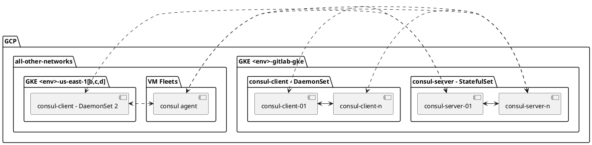

<!-- MARKER: do not edit this section directly. Edit services/service-catalog.yml then run scripts/generate-docs -->

# Consul Service

* [Service Overview](https://dashboards.gitlab.net/d/a988f2tmz/consul)
* **Alerts**: <https://alerts.gitlab.net/#/alerts?filter=%7Btype%3D%22consul%22%2C%20tier%3D%22inf%22%7D>
* **Label**: gitlab-com/gl-infra/production~"Service::Consul"

## Logging

* [Consul](https://log.gprd.gitlab.net/goto/7f15b1f04a0f09fbb18fc62adefe3ed1)
* [system](https://log.gprd.gitlab.net/goto/a22fbb60e45a3f6d7860908a5427301c)

<!-- END_MARKER -->

## Summary

[Consul](https://developer.hashicorp.com/consul)

## Architecture

Consul Server Cluster is a Kubernetes StatefulSet deployed in the regional GKE cluster (`$ENV-gitlab-gke`) with 3 or 5 pods.
The StatefulSet is managed and deployed by the [`consul-gl` Helm release](https://gitlab.com/gitlab-com/gl-infra/k8s-workloads/gitlab-helmfiles/-/blob/master/releases/consul/helmfile.yaml).

The servers have one "leader" which serves as the primary server, and all others will be
noted as "followers". We utilize either 3 (`pre`, `ops`, `db-benchmarking`) or 5 (`gstg`, `gprd`) nodes as Consul uses a quorum to ensure the data to be returned to clients is a state that all members of the Consul cluster
agree too. A cluster of 5 nodes also allows for at most 2 followers to be down before our Consul cluster would be considered faulty.

Consul Server cluster ports are exposed by an internal `Loadbalancer` Service and can be reached by Consul clients from outside the Kubernetes Cluster (`consul-internal.<env>.gke.gitlab.net`).
Consul DNS is being exposed by a Kubernetes Service as well and uses each local Consul Client to provide DNS resolution to the Rails workloads to be able to discover what is the Patroni primary and replica nodes.

Reference: [Consul Architecture Overview](https://developer.hashicorp.com/consul/docs/architecture/control-plane)

Consul clients run on nearly all servers (VMs and GKE nodes). These assist in helping the Consul
servers with service/client discovery. The clients also all talk to each other,
this helps distribute information about new clients, the consul servers, and
changes to infrastructure topology.

### Logical Architecture


### Physical Architecture

Consul Server ports are exposed by a `Loadbalancer` Service and can be reached by Consul clients from outside the Kubernetes Cluster.
All firewall ports are open as necessary such that all components that will have consul deployed will be able to
successfully talk to each other.



## Configurations

### Chef

* We use a single cookbook to manage our VM Consul agents:
  [gitlab_consul](https://gitlab.com/gitlab-cookbooks/gitlab_consul)
* All agents will have the `recipe[gitlab_consul::service]` in their `run_list`
* All agents will have a list of `services` that they participate in the role's
  `gitlab_consul.services` list
  * This provides some form of service discovery
  * Note that this is not yet well formed and not all servers properly configure
    this item. Example, all of our `fe` servers are noted as `haproxy`, but we do
    not distinguish between which type of `fe` node a server may be. Servers
    that partake in diffing stages, example `main` and `canary` are not
    distinguished inside of Consul.
  * Only rely on Consul for service discovery if it as an item for which is
    already well utilized, such as our database servers. Expect inconsistencies
    when comparing data with Chef for all other keys.
* All agents need to know how to reach the DNS endpoint. This is done via the
    running agent and configuring `systemd-resolved` to perform DNS lookups for
    the `.consul` domain to the running agent on that node on port `8600`.
    This is configured via the recipe
    [gitlab-server::systemd-resolved_consul](https://gitlab.com/gitlab-cookbooks/gitlab-server/-/blob/master/recipes/systemd-resolved_consul.rb)
  * All agents that need to perform a DNS lookup for services will have this
    enabled. This consists mostly of anything running requiring access to
    PostgreSQL.

### Kubernetes

* Kubernetes deploys the Consul Server Cluster as a StatefulSet with a replica count of 3 (`pre`, `ops`, `db-benchmarking`) or 5 (`gstg`, `gprd`).
* Kubernetes deploys the Consul Client agent as a DaemonSet such that it gets deployed onto all nodes
* The Consul Helm chart also provides a DNS service
  (`consul-gl-consul-dns.consul.svc.cluster.local:53`), this service is
  configured with `internalTrafficPolicy: Cluster` and
  [configured as the resolver for the domain `.service.consul` in kube-dns](https://gitlab.com/gitlab-com/gl-infra/k8s-workloads/gitlab-helmfiles/-/blob/ef246917d590697358adc15bdb9bc2c54f5be5ef/releases/kube-dns/values.yaml.gotmpl#L3-4).
  This means that DNS queries from any pods for this domain will use any
  Consul client or server node.
* Both Kubernetes clients and servers are configured via [`k8s-workloads/gitlab-helmfiles`](https://gitlab.com/gitlab-com/gl-infra/k8s-workloads/gitlab-helmfiles/-/tree/master/releases/consul)

### Consul VM Agents

All VMs that have Consul installed contain all configuration files in
`/etc/consul`. A general config file `consul.json` provides the necessary
configuration for the service to operate. Anything in `conf.d` are the services
for which Consul partakes in. This includes the healthchecks which Consul will
execute to tell the Consul cluster if that service is healthy on that particular
node. The `ssl` directory contains secret items that are discussed later in this
document.

### Environment Specific

In general, the configurations look nearly identical between production and
staging. Items that differ include the certificates, keys, hostnames, and
the environment metadata.

## Performance

No testing of performance for this service has ever been performed. This
service was pushed into place prior to recognition for the need to test this.

## Scalability

The Consul cluster is currently managed using Helm. Any additional
nodes can be added by modifying the `server:replica` count for the specific
environment. The replica count must always be an odd number to avoid a
split-brain scenario.

Agents can come and go as they please. On Kubernetes, this is very important as
our nodes auto-scale based on cluster demand.

## Availability

### Cluster Servers

With 5 Consul servers participating as servers, we can lose upwards of 2 before
we lose the ability to have quorum.

Diagnosing service failures on the cluster servers requires observing logs and
taking action based on the failure scenario.

#### Failure Recovery

Consul operates very quickly in the face of failure. When a cluster is
restored, it takes just a few seconds for the quorum to be reached.

Consul has [documented a set of common error
messages](https://developer.hashicorp.com/consul/docs/error-messages/consul).

##### Split Brain

Consul has the ability to be placed into a split brain state. This may happen in
cases where network connectivity between two availability zones is lost and
later recovers and the election terms differ between the cluster servers. We
currently do not have the appropriate monitoring as the version of Consul
utilized does not provide us the necessary metrics required to detect this
situation. Suffering a split brain may provide some servers improper data which
may lead to application speaking to the wrong database servers.

This can be found by logging into each of the Consul servers and listing out the
members as describe in [our Useful Commands](interaction#useful-commands).
Recovery for this situation is documented by Hashicorp: [Recovery from a split
brain](https://support.hashicorp.com/hc/en-us/articles/360058026733-Identifying-and-Recovering-from-a-Consul-Split-Brain)

A summary of the document would be to perform the following:

1. Identify which cluster is safe to utilize
   * This is subjective and therefore unable to describe in this document
1. Stop the Consul service on nodes where we need to demote
1. Move/Delete the data directory (defined into the `consul.json` config file) or Persistent Volume
1. Start the Consul service 1 at a time, validating each one joins the cluster
   successfully

#### Dependencies

Consul has minimal dependencies to operate:

* A healthy networking connection
* Operating DNS
* A healthy server

Memory and Disk usage of Consul is very minimal. Disk usage primarily consists
of state files that are stored in `/consul/data` and for our environments,
The largest file is going to be that of the `raft.db` which will vary in size,
usually growing as we use this service more. As of today we primarily use this
to store which servers and services are healthy. Production appears to utilize
approximately 120MiB of space. This database uses BoltDB underneath Consul and
is subject to growth until the next compaction is run. All of this happens in
the background of Consul itself and shouldn't be a concern of our Engineers.
These are configurable via two options:

* [`raft_snapshot_threshold`](https://developer.hashicorp.com/consul/docs/reference/agent/configuration-file/raft#_raft_snapshot_threshold)
* [`raft_snapshot_interval`](https://developer.hashicorp.com/consul/docs/reference/agent/configuration-file/raft#_raft_snapshot_interval)

If we see excessive growth in Disk usage, we should first validate whether or not
it is in use by Consul. If yes, we then need to observe any behavioral changes
to how we utilize Consul. Example may be adding a new service or a set of
servers that make a lot of changes to Consul. This could signify that we may
need to expand Consul if the usage is determined to be normal, or that a service
is not properly behaving and we may be putting undue load on the Consul cluster.

If DNS is failing, Consul may fail to properly resolve the addresses of clients
and other Consul servers. This will effectively bring down a given node and
potentially the cluster. We currently do not provide any special DNS
configurations on the Consul servers and are subject to the resolves provided by
our infrastructure.

### Consul Agents

A loss of a Consul agent will prevent any service running on that node from
properly running DNS and/or participation of the Consul cluster. How this is
impacted depends on the service.

* Patroni Consul agent failure == replicas will not be registered in the
  service, providing less replicas for GitLab services to talk to. This will
  lead to higher pressure on the remaining replicas. If on the primary Patroni
  node, a Patroni failover will be triggered.
* Agent failure on nodes running GitLab Services == GitLab services will be
  unable to properly query which database server to talk to. Due to this, the
  application will default to always opening connections to the primary.

Diagnosing agent failures requires observing logs and taking action based on the
failure scenario.

Consul agents only depend on the ability to communicate to the Consul servers.
If this is disrupted for any reason, we must determine what causes said
interruption. The agents store very little data on disk, and their memory and
CPU requirements are very low.

### Recovery Time Objective

We do not have a defined RTO for this service. This is currently unobtainable
due to the lack of frequent testing.

## Durability

The data held within Consul is dynamic but strongly agreed to as is the design
of Consul to have a [consensus](https://developer.hashicorp.com/consul/docs/concept/consensus) on the data it has knowledge of.

Consul Raft snapshots are backed up to a GCS bucket `gitlab-$ENV-consul-snapshots` every hour by a Kubernetes CronJob.

Should a single node have failed, the StatefulSet in Kubernetes will automatically bring it back into the cluster
without needing to worry about data on disk. As soon as a Consul server is
brought back into participation of the cluster, the Raft database will sync
enabling that server to begin participating in the cluster in a matter of a few
seconds.

## Security / Compliance

### TLS

Consul utilizes mutual TLS (mTLS) for authentication and traffic encryption to
prevent intrusion of rogue clients.

We manage multiple certificates:

| Certificate         | Renewal method                | Validity time | Vault secret path                                                                                                       | Kubernetes Secret              | Location on disk      |
|---------------------|-------------------------------|---------------|-------------------------------------------------------------------------------------------------------------------------|--------------------------------|-----------------------|
| CA                  | Manual                        | 5 years       | `k8s/env/$ENV/ns/consul/tls` (certificate and key)<br/>`chef/env/$ENV/cookbook/gitlab-consul/client` (certificate only) | `consul-tls-v*`                | `/consul/tls/ca/`     |
| Server              | Automatic on every Helm apply | 2 years       | n/a                                                                                                                     | `consul-gl-consul-server-cert` | `/consul/tls/server/` |
| Client (Kubernetes) | Automatic on pod init         | 1 year        | n/a                                                                                                                     | n/a                            | `/consul/tls/client/` |
| Client (VM)         | Manual                        | 5 years       | `chef/env/$ENV/cookbook/gitlab-consul/client`                                                                           | n/a                            | `/etc/consul/certs/`  |

#### CA TLS Certificate rotation

The CA TLS certificates must be renewed every 5 years.

The CA certificate expiration date can be monitored using the metric [`x509_cert_not_after{secret_namespace="consul",secret_name=~"consul-tls-v.+"}`](https://dashboards.gitlab.net/goto/Tq14Nv8HR?orgId=1).

To renew the CA certificate while reusing the same key:

1. Generate a new certificate based on the current one with a 5 years expiration date, and store it into Vault:

   ```shell
   vault kv get -field certificate k8s/env/gprd/ns/consul/tls > tls.crt
   vault kv get -field key k8s/env/gprd/ns/consul/tls > tls.key
   openssl x509 -in tls.crt -signkey tls.key -days 1825 | vault kv patch k8s/env/gprd/ns/consul/tls certificate=-
   ```

2. Create a new Kubernetes external secret `consul-tls-vX` for the new Vault secret version in [`values-secrets/gprd.yaml.gotmpl`](https://gitlab.com/gitlab-com/gl-infra/k8s-workloads/gitlab-helmfiles/-/blob/52c03b15b34852744705c3bbb5660a7c9710b5fd/releases/consul/values-secrets/gprd.yaml.gotmpl#L3) ([example MR](https://gitlab.com/gitlab-com/gl-infra/k8s-workloads/gitlab-helmfiles/-/merge_requests/8237))
3. Update the Consul Helm deployment in [`values-consul-gl/gprd.yaml.gotmpl`](https://gitlab.com/gitlab-com/gl-infra/k8s-workloads/gitlab-helmfiles/-/blob/52c03b15b34852744705c3bbb5660a7c9710b5fd/releases/consul/values-consul-gl/gprd.yaml.gotmpl#L4-8) to use this new secret ([example MR](https://gitlab.com/gitlab-com/gl-infra/k8s-workloads/gitlab-helmfiles/-/merge_requests/8238))

4. The server certificate will be regenerated during the Helm apply. Follow [these steps below](#servers) to roll out the new CA and server certificates to all server pods.

5. The Kubernetes client certificate will be regenerated during pod init. Follow [these steps below](#clients) to roll out the new CA certificate to all clients pods.

6. Follow [these steps below](#client-tls-certificate-rotation) to roll out the new CA certificate to all VMs and regenerate the VM client certificate.

##### Server TLS certificate rotation

The server TLS certificate is generated automatically during each Helm
deployment and is valid for 2 years. Regular Consul updates should keep it
current. If Consul hasn't been deployed over this time period, forcing a Helm
deployment (eg. by adding an annotation) will renew it.

The server TLS certificate expiration date can be verified with the following command:

```shell
kubectl get secret consul-gl-consul-server-cert --namespace consul --output jsonpath='{.data.tls\.crt}' | base64 -d | openssl x509 -noout -dates
```

##### Client TLS certificate rotation

The Kubernetes client TLS certificate is generated for each pod during initialisation and is valid for 1 year.

The VM client TLS certificate must regenerated manually and stored into the Chef Cookbook secret in Vault with the following commands:

> [!caution]
> Proper caution should be taken while updating the Consul client certificates on all VMs, especially Patroni nodes, as a client restart (when updating the CA) or an incorrect certificate could cause serious Patroni service disruptions.

To renew the client certificate, whether or not a new CA is also being rolled out:

1. Pause Chef all VMs of the environment

   ```shell
    knife ssh 'chef_environment:$ENV AND recipes:gitlab_consul\:\:agent' 'sudo chef-client-disable <link>'
    ```

2. Generate a new client certificate with a 2 years expiration date and store it into the Consul cookbook secret in Vault:

   ```shell
   vault kv get -field certificate k8s/env/$ENV/ns/consul/tls > tls.crt
   vault kv get -field key k8s/env/$ENV/ns/consul/tls > tls.key
   consul tls cert create -client -ca tls.crt -key tls.key -days 530 -dc east-us-2
   vault kv patch chef/env/$ENV/cookbook/gitlab-consul/client ca_certificate=@tls.crt certificate=@east-us-2-client-consul-0.pem private_key=@east-us-2-client-consul-0-key.pem
   ```

3. Rollout and test the new certificate(s) on a single VM (or a few more to be sure):

   1. Re-enable and run Chef:

      ```shell
      sudo chef-client-enable
      sudo chef-client
      ```

      The client certificate will be reloaded automatically.

   2. If the CA certificate was renewed, the Consul client need to be restarted:

      ```shell
      sudo systemctl restart consul.service
      ```

4. Rollout the new certificate(s) to the Patroni nodes following the same steps above, starting with the replicas one at a time, and finishing with the leader.

   Before updating each Patroni replica node, put it maintenance mode first:

   ```shell
   knife node run_list add $NODE 'role[$ENV-base-db-patroni-maintenance]'
   ```

   And disable the maintenance mode after:

   ```shell
   knife node run_list remove $NODE 'role[$ENV-base-db-patroni-maintenance]'
   ```

   > [!important]
   > If the CA certificate was renewed, perform a switchover of the leader node before updating it so that the restart of the Consul client doesn't cause a uncontrolled failover (see the [DBRE Toolkit](https://gitlab.com/gitlab-com/gl-infra/db-migration/-/tree/master/dbre-toolkit)).

4. Rollout the new certificate(s) to all remaining nodes following the same steps above again:

   ```shell
   knife ssh 'chef_environment:$ENV AND recipes:gitlab_consul\:\:agent AND NOT recipes:gitlab-patroni\:\:consul' 'sudo chef-client-enable && sudo chef-client && sudo systemctl restart consul.service'
   ```

### Gossip

All Gossip Protocol traffic is encrypted. This key is stored in Vault under the path:
`k8s/env/$ENV/ns/consul/gossip` and synced to the Kubernetes secret `consul-gossip-v*`.

## Monitoring/Alerting

* [Overview Dashboard](https://dashboards.gitlab.net/d/consul-main/consul-overview?orgId=1)
* Logs can be found on [Kibana](https://log.gprd.gitlab.net) under the
  `pubsub-consul-inf-gprd*` index.
* We only appear to alert on specific services and saturation of our nodes.

## Deployments in k8s

When we bump the `chart_version` for Consul (`consul_gl`) in the [`bases/environments/$ENV.yaml`](https://gitlab.com/gitlab-com/gl-infra/k8s-workloads/gitlab-helmfiles/-/blob/52c03b15b34852744705c3bbb5660a7c9710b5fd/bases/environments/gprd.yaml#L21) file,
this actually bumps the Consul version for servers **and** clients. In all non-production environments, this will trigger an upgrade
of the servers and clients and there is no manual intervention required. Server pods will be rotated one-by-one, and simultaneously client
pods will get rotated. So you might have clients that are temporarily on a newer version than the server, but this is usually fine as Hashicorp
have a [protocol compatibility promise](https://developer.hashicorp.com/consul/docs/upgrading/compatibility).

Nevertheless, in production we want to be more cautious and thus we make use of two guard rails for the sake of reliability:

1. For servers, we set `server.updatePartition` to the number of replicas minus 1 (i.e., currently in `gprd` this is set to `4`).

    This setting allows us to carefully control a rolling update of Consul server agents. With the default setting of `0`, k8s would simply rotate
    each pod and wait for the health check to pass before moving onto the next pod. This _may_ be OK, but we could run into a situation
    where the pod passes health check, but then becomes unhealthy, and k8s has already moved onto the next pod. This could potentially result
    in an unhealthy Consul cluster, which would impact critical components like Patroni. Given the importance of a healthy Consul cluster, we
    decided the inconvenience of human intervention to occasionally upgrade Consul was justified to minimize the risk of an outage.

1. For clients, we set the `client.updateStrategy.type` to `OnDelete` so we can wait until we're done upgrading the server cluster before we upgrade clients.

The following instructions describe the upgrade process for servers and clients **for production only**. As abovementioned, all other environments will
upgrade servers and clients automatically once the `chart_version` is bumped.

### Servers

The `server.updatePartition` setting controls **how many instances of the server cluster are updated** when the `.spec.template` is updated.
Only instances with an index greater than or equal to `updatePartition` (zero-indexed) are updated. So by setting this value to `4`,
we're effectively saying only recreate the last pod (`...-consul-server-4`) but **leave all other pods untouched**.

The upgrade process is as follows:

1. Bump `chart_version` in the [`bases/environments/$ENV.yaml`](https://gitlab.com/gitlab-com/gl-infra/k8s-workloads/gitlab-helmfiles/-/blob/52c03b15b34852744705c3bbb5660a7c9710b5fd/bases/environments/gprd.yaml#L21) file(s)
1. Create your MR, get it reviewed and merged
1. Once Helm starts to apply the change, you should see the `...-consul-server-4` pod get recreated, but the rest will remain unchanged. No client pods will get rotated at this stage.
1. Helm will hang waiting for all pods to be recreated, so this is where you need to take action.
1. SSH to one of the Consul members and keep an eye on the servers:

   ```sh
   watch -n 2 consul operator raft list-peers
   ```

1. Bring up your tunnel to talk to the `gprd` regional k8s cluster (e.g., `glsh kube use-cluster gprd`)
1. Confirm that the Consul cluster looks healthy:

   ```sh
   kubectl --context gke_gitlab-production_us-east1_gprd-gitlab-gke -n consul get pods -o wide -l component=server
   ```

    The pod `consul-gl-consul-server-4` should only show minutes in the `AGE` column. All pods should be `Running`.
1. Rotate 2 more pods:

   ```sh
   kubectl --context gke_gitlab-production_us-east1_gprd-gitlab-gke -n consul patch statefulset consul-gl-consul-server -p '{"spec":{"updateStrategy":{"rollingUpdate":{"partition":2}}}}'
   ```

1. You should now see 2 more pods get recreated. Wait until the Consul cluster is healthy (should only take a few secs to a minute) and do the last 2 pods:

   ```sh
   kubectl --context gke_gitlab-production_us-east1_gprd-gitlab-gke -n consul patch statefulset consul-gl-consul-server -p '{"spec":{"updateStrategy":{"rollingUpdate":{"partition":0}}}}'
   ```

1. You should now see the remaining 2 pods get recreated. You can now put the setting back to `4`:

   ```sh
   kubectl --context gke_gitlab-production_us-east1_gprd-gitlab-gke -n consul patch statefulset consul-gl-consul-server -p '{"spec":{"updateStrategy":{"rollingUpdate":{"partition":4}}}}'
   ```

1. You should now see the Helm apply job complete successfully.

### Clients

To upgrade the clients, you have two choices:

1. Do nothing and let the clients get upgraded organically as servers come and go due to autoscaling. This is an acceptable approach if there is no rush on upgrading clients.
2. Rotate the pods by doing the `updateStrategy` dance as follows.

   For each of the 4x production k8s clusters (regional + zonals):

     1. Change `updateStrategy.type` to `RollingUpdate`:

        ```sh
        kubectl --context <cluster> -n consul patch daemonset consul-gl-consul-client -p '{"spec":{"updateStrategy":{"type":"RollingUpdate"}}}'
        ```

     1. Wait until all client pods have been rotated.
     1. Revert change to `updateStrategy.type`:

        ```sh
        kubectl --context <cluster> -n consul patch daemonset consul-gl-consul-client -p '{"spec":{"updateStrategy":{"type":"OnDelete"}}}'
        ```

<!-- ## Links to further Documentation -->
