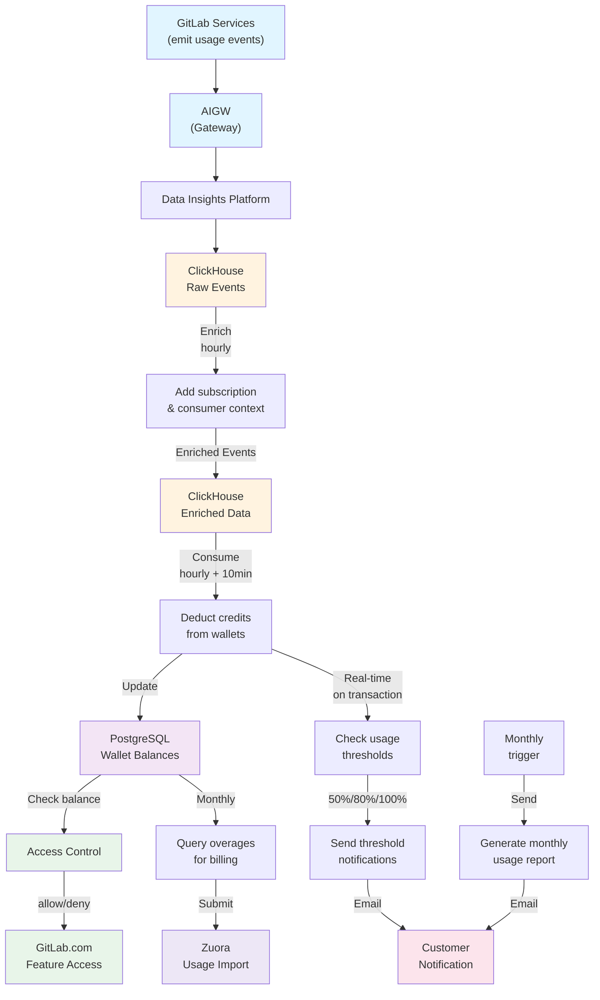

# Usage Billing Enrichment & Consumption - Production Runbook

## Overview

This runbook provides quick reference for debugging and resolving production issues in the usage billing enrichment & consumption pipeline. The system processes raw usage events through enrichment and consumption stages to calculate and deduct GitLab credits from customer wallets.

## Pipeline Overview

The usage billing pipeline consists of three main stages:

```
Raw Events (ClickHouse)
  → Enrichment (every 1 hour)
    → Consumption (wallet deduction every 1 hour, 10 mins after enrichment)
```

### Pipeline Stages

1. **Raw Events**: Usage events are ingested into ClickHouse from the Data Insights Platform (DIP)
2. **Enrichment**: Events are enriched with subscription context and GitLab credit calculations
3. **Consumption**: Enriched events trigger wallet deductions for customers

### Diagram



## Key Tables & Their Purpose

| Table/View | Location | Purpose |
| ---------- | -------- | ------- |
| `raw_billing_usage_messages` | ClickHouse | Raw message blobs from DIP |
| `raw_billing_usage_events` | ClickHouse | Extracted structured events (populated via materialized view) |
| `usage_billing_enriched` | ClickHouse | Events + subscription context + calculated GitLab credits |
| `consumer_wallets` | PostgreSQL | Current balance for consumer wallets |
| `subscription_wallets` | PostgreSQL | Current balance for subscription wallets |
| `wallet_transactions` | PostgreSQL | Recent transactions |
| `zuora_overage_submissions` | PostgreSQL | Zuora submission uploads |
| `zuora_overage_records` | PostgreSQL | Overage submissions corresponding to individual subscriptions |

## Monitoring & Alerts

### Dashboards

- [DIP Dashboard](https://dashboards.gitlab.net/d/data-insights-platform-customerdot/data-insights-platform3a-usage-billing?from=now-24h&orgId=1&timezone=utc&to=now&var-Deployment=data-insights-platform-single&var-PROMETHEUS_DS=mimir-fulfillment-platform&var-cluster=stgsub-customers-gke&var-environment-2=gstg&var-environment=gstg&var-namespace=data-insights-platform)
- ClickHouse query performance dashboard (TODO: Add link)
- Job execution monitoring (TODO: Add link)

### Staging Kibana Links

1. [Enrichment Jobs](https://nonprod-log.gitlab.net/app/r/s/1fNBj)
2. [Event Enrichment](https://nonprod-log.gitlab.net/app/r/s/oiMZ6)
3. [Consumption Jobs](https://nonprod-log.gitlab.net/app/r/s/KAJQ9)
4. [Enriched Event Consumption](https://nonprod-log.gitlab.net/app/r/s/Xb9od)
5. [Dashboard](https://nonprod-log.gitlab.net/app/r/s/5eMNG)

### Production Kibana Links

1. [Enrichment Jobs](https://log.gprd.gitlab.net/app/r/s/wvCp7)
2. [Event enrichment](https://log.gprd.gitlab.net/app/r/s/EmIpU)
3. [Consumption Jobs](https://log.gprd.gitlab.net/app/r/s/yadNT)
4. [Enriched Event Consumption](https://log.gprd.gitlab.net/app/r/s/xLkrT)
5. [Dashboard](https://log.gprd.gitlab.net/app/r/s/r5Mxx)

### Alert Thresholds

TODO: Add alert thresholds and escalation paths once monitoring is configured

## Troubleshooting Scenarios

- [Events Not Arriving in ClickHouse](#events-not-arriving-in-clickhouse)
- [Events Not Enriched](#events-not-enriched)
- [Events Not Consumed](#events-not-consumed)
- [Incorrect Wallet Balance](#incorrect-wallet-balance)
- [Performance Degradation](#performance-degradation)
- [Subscription Not Submitted via Zuora Overage Submission](#subscription-not-submitted-via-zuora-overage-submission)
- [Zuora Overage Submission Failed](#zuora-overage-submission-failed)
- [Access Cutoff Flow Issues](#access-cutoff-flow-issues)
- [Usage Notifications Not Sent](#usage-notifications-not-sent)

### Events Not Arriving in ClickHouse

**Symptoms:**

- No records in `raw_billing_usage_events`
- Stale dashboard data

**Debug Commands:**

Check how many records are in the table:

```sql
SELECT count(*), max(IngestionTimestamp)
FROM raw_billing_usage_events
WHERE toDate(IngestionTimestamp) = today()
```

**Resolution:**

Identify where the data flow is breaking by checking each integration point:

1. **GitLab to AIGW**: Verify source services are emitting usage events, then review [AIGW Logs](https://cloudlogging.app.goo.gl/SFb2pyk6dWtgJwDKA) for transmission errors
2. **AIGW to DIP**: Refer to [DIP Runbook](https://gitlab.com/gitlab-com/runbooks/-/blob/master/docs/data-insights-platform/environments/usage-biilling/overview.md?ref_type=heads) for pipeline issues
3. **DIP to ClickHouse**: Verify ClickHouse connectivity and check [DIP dashboard](https://dashboards.gitlab.net/d/data-insights-platform-customerdot/data-insights-platform3a-usage-billing?from=now-24h&orgId=1&timezone=utc&to=now&var-Deployment=data-insights-platform-single&var-PROMETHEUS_DS=mimir-fulfillment-platform&var-cluster=stgsub-customers-gke&var-environment-2=gstg&var-environment=gstg&var-namespace=data-insights-platform)
4. **Escalate if needed**: Contact Analytics team if needed

### Events Not Enriched

**Symptoms:**

- Records exist in `raw_billing_usage_events`
- Missing from `usage_billing_enriched`
- No subscription context

**Debug Commands:**

```sql
SELECT *
FROM usage_billing_enriched
WHERE toDate(EnrichedAt) = today()
```

**Check Enrichment Logs in Kibana:**

Search for these error patterns:

- "Failed to enrich event"
- "Event missing required identifier"
- "Missing subscription for event_id"
- "Failed to find or create a consumer for event"

**Kibana Links (Staging):**

- [Enrichment Jobs](https://nonprod-log.gitlab.net/app/r/s/1fNBj)
- [Event Enrichment](https://nonprod-log.gitlab.net/app/r/s/oiMZ6)

**Kibana Links (Production):**

- [Enrichment Jobs](https://log.gprd.gitlab.net/app/r/s/wvCp7)
- [Event Enrichment](https://log.gprd.gitlab.net/app/r/s/EmIpU)

**Resolution:**

Note: These steps can be done with read-only Rails console access to CDot production.

Step through the `EnrichmentService` steps manually in a Rails console to identify root cause if not clear from logs.

Re-run enrichment for all un-enriched events in a time period:

```ruby
Billing::Usage::EnrichmentCoordinatorJob.perform_now(
  start_time: '2025-06-19 10:00:00 UTC',
  end_time: '2025-06-19 13:00:00 UTC'
)
```

Re-run enrichment for specific event(s) in a time period:

```ruby
# Fetch events (more custom querying required to find individual/specific events)
events = Billing::Usage::RawEvents.new.fetch_batch_for_enrichment(
  start_time: start_time,
  end_time: end_time
)

# Execute enrichment
Billing::Usage::EnrichmentService.new(events).execute
```

### Events Not Consumed

**Symptoms:**

- Records exist in `usage_billing_enriched`
- No wallet transactions
- Dashboard shows 0 or inaccurate usage

**Debug Steps:**

**1. Find the Consumer/Subscription Wallets**

```ruby
# Find consumer
consumer = Consumer.for_subscription('subscription_name').first
consumer = Consumer.with_user_id(entity_id).first

# Find consumer wallet
consumer_wallet = consumer.wallet

# Find subscription wallets
monthly_commitment_wallet = SubscriptionWallet.find_by(subscription_name: '<subscription_name>', category: 'monthly_commitment')
otc_wallet = SubscriptionWallet.find_by(subscription_name: '<subscription_name>', category: 'otc')
overage_wallet = SubscriptionWallet.find_by(subscription_name: '<subscription_name>', category: 'overage')
```

**2. Check Balance and Transactions**

```ruby
# Check wallet balance
wallet.balance

# Review all transactions
wallet.transactions
```

- [All available wallet scopes and methods](https://gitlab.com/gitlab-org/customers-gitlab-com/-/blob/main/app/models/concerns/is_wallet.rb)

**3. Check Consumption Logs in Kibana**

Search for these error patterns:

- "No consumers found for consumption event"
- "No subscription found for consumption event"

**Kibana Links (Staging):**

- [Consumption Jobs](https://nonprod-log.gitlab.net/app/r/s/KAJQ9)
- [Enriched Event Consumption](https://nonprod-log.gitlab.net/app/r/s/Xb9od)

**Kibana Links (Production):**

- [Consumption Jobs](https://log.gprd.gitlab.net/app/r/s/yadNT)
- [Enriched Event Consumption](https://log.gprd.gitlab.net/app/r/s/xLkrT)

**Resolution:**

Note: These steps can only be done with read-write Rails console access to CDot production as they write to the Postgres DB.

```ruby
Billing::Usage::ConsumptionCoordinatorJob.perform_now(
  start_time: '2025-06-19 10:00:00 UTC',
  end_time: '2025-06-19 13:00:00 UTC'
)
```

### Incorrect Wallet Balance

**Symptoms:**

- Transactions exist
- Balance doesn't match expected
- Customer reports wrong totals

**Debug Commands:**

```ruby
# Find consumer
consumer = Consumer.for_subscription('subscription_name').first
consumer = Consumer.with_user_id(entity_id).first

# Check wallet balance
consumer_wallet = consumer.wallet
consumer_wallet.balance

# Review all transactions
consumer_wallet.transactions

# Check credits added vs deducted
credits_added = Wallets::Transaction.where(wallet_id: consumer_wallet.id).credits_added.sum(:amount)
credits_deducted = Wallets::Transaction.where(wallet_id: consumer_wallet.id).credits_deducted.sum(:amount)

# Check for expired credits affecting balance
expired = Wallets::Transaction.where(wallet_id: consumer_wallet.id).where('expires_at < ?', Time.current)
expired.sum(:amount)

# Find transactions by date range
Wallets::Transaction.where(wallet_id: consumer_wallet.id).between_created_dates(Date.today - 30.days, Date.today)
```

**Resolution:**

1. Check for missing allocations or expired credits
2. Verify transaction calculations match expected consumption
3. Investigate `Billing::Usage::ConsumptionService` or `Billing::Usage::ConsumptionProcessingService` if discrepancies found

### Performance Degradation

**Symptoms:**

- Jobs timing out
- Queue backlog
- Processing drift

**Debug Steps:**

1. Check job duration metrics
2. Monitor ClickHouse query performance (via CH Monitoring dashboard)
3. Check batch sizes

**Resolution:**

- **Short-term**: Increase parallelization
- **Long-term**: Optimize queries, consider hourly aggregation

### Subscription Not Submitted via Zuora Overage Submission

**Symptoms:**

- `SubmitOverageUsageJob` ran successfully
- Don't see the subscription overage submitted in Zuora

**Debug Steps:**

**1. Verify Subscription exists in Overage Records**

If it doesn't exist, the subscription was never picked for upload:

```ruby
Zuora::OverageRecord.where(
  subscription_name: subscription_name
).group(:zuora_overage_submission_id).count
```

**2. Check Subscription Flags and Charge**

Verify subscription flags:

- `usage_overage_billing_allowed__c` should be `nil` or `true`
- `usage_overage_terms_accepted__c` should be `true`

Verify Usage Charge exists on the Subscription (Monthly Commitment purchased):

```ruby
subscription.rate_plan_charges.where(charge_type: 'Usage').exists?
```

**3. Check if Subscription Has Overage**

The subscription might not have been picked up by the overage query. Check the overage query:

```ruby
billing_month = Time.current.beginning_of_month
billing_month_end = billing_month.end_of_month

overaged_subscriptions = SubscriptionWallet
  .overage
  .joins(
    <<~SQL.squish
      INNER JOIN (#{Wallets::Transaction.total_credits_deducted(billing_month, billing_month_end).to_sql})
      credits_used ON credits_used.wallet_id = subscription_wallets.id
    SQL
  )
  .joins(
    <<~SQL.squish
      LEFT JOIN (#{Wallets::Transaction.total_overage_offset_credits_added(billing_month, billing_month_end).to_sql})
      credits_added ON credits_added.wallet_id = subscription_wallets.id
    SQL
  )
  .where('COALESCE(credits_used.total, 0) > COALESCE(credits_added.total, 0)')
  .where(subscription_name: '<your subscription name>')
  .select(
    'subscription_wallets.id',
    'subscription_wallets.subscription_name',
    'GREATEST(COALESCE(credits_used.total, 0) - COALESCE(credits_added.total, 0), 0) AS overage'
  )
```

**Resolution:**

Based on findings:

- Accept subscription overage acceptance flags (via Zuora)
- Add/purchase usage charge
- Create valid overage data for the subscription

### Zuora Overage Submission Failed

**Symptoms:**

- `SubmitOverageUsageJob` ran but the status is `Failed`

**Debug Commands:**

```ruby
sub = Zuora::OverageSubmission.last

# Verify created_at to ensure a submission was created
# sub.created_at should be near about same as Time.now
sub.created_at

# Verify your subscription was present in the submission
sub.zuora_overage_records

# Check the failure reason and Zuora response if any
sub.error_message
sub.zuora_response
sub.zuora_response.import_status
```

**Check Zuora Import Status:**

1. If `import_status` is `Failed` (Zuora returned a failure):
   - Check <https://test.zuora.com/platform/apps/com_zuora/usage?~(clearFilter~true)>
   - Click on `Import Failed Records` to see specific failure reason
   - Note: Sometimes it takes ~5-10 minutes for the failure to appear on the UI

**Known Zuora Failure Reasons:**

1. Overage was once submitted and then was also "billed" for the same billing month (invoice created)
2. Subscription data sent to Zuora is incorrect:
   - Start-date does not match the expected start date
   - Usage charge (on-demand GitLab credit SKU) does not exist for the subscription on Zuora
   - Subscription does not exist on Zuora
3. **Note**: Zuora failure fails the entire batch even if one record has an issue

**If `check_import_status_url` is empty:**

- Upload failed before hitting Zuora
- Could be due to network issue or exception within the job

**Resolution:**

**For Network Issues:**

```ruby
# Mark the submission as pending or delete it
sub.update!(status: 0)

# Re-run the job - it will delete this pending submission and create new ones
Billing::SubmitOverageUsageJob.perform_now(date: billing_month)
```

**For Invalid Data:**

- Identifying which subscription caused the issue is difficult and manual
- If you had run Zuora overage submission successfully for a subscription and have billed it once (and probably deleted the submission records for testing again), you **cannot resubmit it again in the same billing month**. Create a new subscription and test with that.
- For any other data issues, reach out to Utilization team for assistance. The overage submission job verifies the date and usage-charge of the subscription before submitting, so ideally the submitted data should be valid.

### Dry Run: Check Subscriptions to be Submitted to Zuora

**Use Case:** Preview which subscriptions would be submitted without actually submitting

**Commands:**

```ruby
# Dry run to check counts
Billing::Usage::Zuora::OverageSubmissionService.new(
  date: Date.today,
  dry_run: true
).execute

# Get subscription names
Billing::Usage::Zuora::OverageSubmissionService.new(
  date: Date.today,
  dry_run: true
).send(:overage_wallets).map(&:subscription_name)
```

### Access Cutoff Flow Issues

**Symptoms:**

- Users losing access unexpectedly
- Access cutoff not enforced across subscriptions
- Overage wallet not working correctly

**Possible Issues:**

- **Incorrect subscription flags** - `usage_overage_billing_allowed__c` or `usage_overage_terms_accepted__c` misconfigured
- **Missing wallets** - Overage, monthly_commitment, or OTC wallets don't exist
- **Consumption job failures** - Wallets not being deducted despite enriched events
- **Feature flag disabled** - Usage billing or cutoff feature flags turned off

**Debug Commands:**

```ruby
subscription = Subscription.current_subscription('subscription_name')

# Check subscription flags
puts "Usage permitted: #{subscription.usage_permitted?}"
puts "Overage allowed: #{subscription.allow_billing_for_usage_overage?}"
puts "Overage terms accepted: #{subscription.overage_terms_accepted?}"

# Check wallets exist
subscription.wallets.map { |w| "#{w.category}: #{w.balance}" }

# Check feature flags
puts "Usage billing enabled: #{Billing::Usage::Feature.enabled?}"
puts "Usage cutoff enabled: #{Billing::Usage::Feature.usage_cutoff_enabled?}"
```

**Resolution:**

- Verify subscription flags in Zuora and sync: `subscription.reload`
- Create missing wallets: `subscription.find_or_create_wallet(:overage)`
- Re-run consumption job to deduct credits
- Check Kibana logs for "No consumers found" or "No subscription found" errors

### Usage Notifications Not Sent

**Symptoms:**

- Customers not receiving usage threshold emails (50%, 80%, 100%)
- Monthly usage reports not sent
- Notification records not created

**Possible Issues:**

- **Feature flag disabled** - Notifications feature flag turned off
- **No monthly commitment** - Subscription doesn't have purchased monthly commitment
- **Missing billing account** - Subscription not linked to billing account or customers
- **Notification already sent** - Debounce or duplicate prevention blocking resend
- **Wallet missing** - Subscription wallet doesn't exist

**Debug Commands:**

```ruby
subscription = Subscription.current_subscription('subscription_name')

# Check feature flag
puts "Notifications enabled: #{Billing::Usage::Feature.notifications_enabled?}"

# Check monthly commitment
puts "Has commitment: #{subscription.purchased_monthly_commitment?}"

# Check billing account and customers
billing_account = BillingAccount.find_by(zuora_account_id: subscription.account_id)
puts "Billing account: #{billing_account.present?}"
puts "Customers: #{billing_account&.customers&.count}"

# Check wallet
puts "Wallet exists: #{subscription.wallet.present?}"

# Check sent notifications
Billing::Usage::GitlabUnitsNotification.where(
  billing_account_id: billing_account.id
).order(created_at: :desc).limit(5)
```

**Resolution:**

- Enable notifications feature flag: `Unleash.enabled?(:usage_billing_notifications)`
- Verify subscription has monthly commitment purchased
- Ensure billing account and customers are linked
- Manually trigger notification job: `Subscriptions::TriggerGitlabUnitsEmailsJob.perform_now(subscription.zuora_id, monthly_notification: false)`
- Check Kibana logs for "GitlabUnitsNotifications" errors

## Common Resolution Commands

Note: These steps can be done with read-only Rails console access to CDot production.

### Re-run Enrichment

```ruby
Billing::Usage::EnrichmentCoordinatorJob.perform_now(
  start_time: Time.parse('2025-06-19 10:00:00 UTC'),
  end_time: Time.parse('2025-06-19 13:00:00 UTC')
)
```

### Re-run Consumption

```ruby
Billing::Usage::ConsumptionCoordinatorJob.perform_now(
  start_time: Time.parse('2025-06-19 10:00:00 UTC'),
  end_time: Time.parse('2025-06-19 13:00:00 UTC')
)
```

### Re-run Zuora Overage Submission

```ruby
billing_month = Time.current.beginning_of_month
Billing::SubmitOverageUsageJob.perform_now(date: billing_month)
```

## Feature Flags

The usage billing system uses granular feature flags for different components. The system uses a global enable, selective disable pattern.

For detailed information on available components and how to enable/disable them, see the [available components documentation](https://gitlab.com/gitlab-org/customers-gitlab-com/-/blob/main/doc/development/usage_billing.md?ref_type=heads#available-components).

## Related Documentation

- [CustomersDot Overview](./overview.md)
- [CustomersDot Architecture](https://gitlab.com/gitlab-org/customers-gitlab-com/blob/main/doc/architecture/index.md)
- [Usage Billing Design Doc](https://gitlab.com/gitlab-org/architecture/usage-billing/design-doc)
- [Work Item #14569](https://gitlab.com/gitlab-org/customers-gitlab-com/-/work_items/14569) - Original runbook issue

## Escalation

For issues that cannot be resolved using this runbook:

1. Check the [Fulfillment team escalation process](https://about.gitlab.com/handbook/engineering/development/fulfillment/#escalation-process-for-incidents-or-outages)
2. Contact the Utilization team for assistance with data issues
3. Escalate to Analytics team for ClickHouse connectivity or DIP issues
