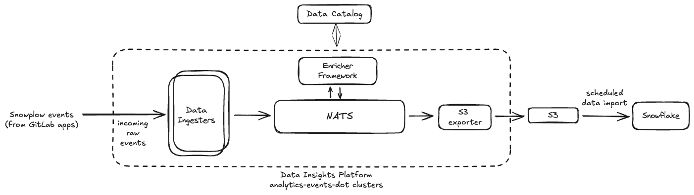

# Data Insights Platform - Product Usage Data via Snowplow

> Note, these environments are __not__ receiving production traffic yet. We're  currently planning migrating our current Snowplow data streams over to these Data Insights Platform backed environments. See [work epic](https://gitlab.com/groups/gitlab-org/architecture/gitlab-data-analytics/-/epics/10) for details.

## Overview

These Data Insights Platform instances help ingest product usage data (Snowplow) from GitLab instances across multiple environments, i.e. `.com`, `Dedicated` &  `self-managed` and export it to `S3`/`Snowflake` - to serve our internal data & analytics teams.

> Snowflake sits outside the scope of these environments. We only land data in `S3` - which is then ingested into Snowflake async.

Following is a brief overview of its setup in these environments:

- production: `usagestats.gitlab.com`
- staging: `usagestats.staging.gitlab.com`

## Access to these clusters

- All currently provisioned DIP instances should be accessible to on-call engineers. The access to these underlying GKE clusters follows our standard VPN-based tool chain as documented [here](https://runbooks.gitlab.com/kube/k8s-oncall-setup/#kubernetes-api-access).
- In case of other folks needing access to these environments, an access request needs to be created - [for example](https://gitlab.com/gitlab-com/team-member-epics/access-requests/-/issues/39796).

## Observability

SLIs for Data Insights Platform within `analytics` environments is defined in a separate metrics catalog [file](../../metrics-catalog/services/data-insights-platform.jsonnet) and available on Grafana [here](https://dashboards.gitlab.net/goto/T9sJI5CHR?orgId=1).

### Metrics

- production: [Grafana dashboard](TODO)
- staging: [Grafana dashboard](TODO)

### Logs

- production: [Kibana]()
- staging: [Kibana](https://nonprod-log.gitlab.net/app/r/s/Lg56I)

### Alerts

(work in progress)

## Infrastructure & Networking

### production: `usagestats.gitlab.com`

| Entity | Details |
|--|--|
| Provider | GCP |
| GCP Project | [analytics-eventsdot-prod](https://console.cloud.google.com/welcome?project=analytics-eventsdot-prod) |
| Region | us-east1 |
| Networks | eventsdot-prod-vpc / eventsdot-prod-subnet |
| DNS Names | usagestats.gitlab.com |
| Deployment configs | [In config-mgmt repository](https://ops.gitlab.net/gitlab-com/gl-infra/config-mgmt/-/tree/main/environments/analytics-eventsdot-prod?ref_type=heads) [In gitlab-helmfiles repository](https://gitlab.com/gitlab-com/gl-infra/k8s-workloads/gitlab-helmfiles/-/blob/master/bases/environments/analytics-eventsdot-prod.yaml?ref_type=heads) |

### staging: `usagestats.staging.gitlab.com`

| Entity | Details |
|--|--|
| Provider | GCP |
| GCP Project | [gl-analy-evtsdot-stg-0d67dbbc](https://console.cloud.google.com/welcome?project=gl-analy-evtsdot-stg-0d67dbbc) |
| Region | us-east1 |
| Networks | events-dot-stg-vpc / events-dot-stg-subnet  |
| GKE cluster | [events-dot-stg](https://console.cloud.google.com/kubernetes/list/overview?project=gl-analy-evtsdot-stg-0d67dbbc) |
| DNS Names | usagestats.staging.gitlab.com |
| Deployment configs | [In config-mgmt repository](https://ops.gitlab.net/gitlab-com/gl-infra/config-mgmt/-/tree/main/environments/analytics-eventsdot-stg?ref_type=heads) [In gitlab-helmfiles repository](https://gitlab.com/gitlab-com/gl-infra/k8s-workloads/gitlab-helmfiles/-/blob/master/bases/environments/analytics-eventsdot-stg.yaml?ref_type=heads) |
