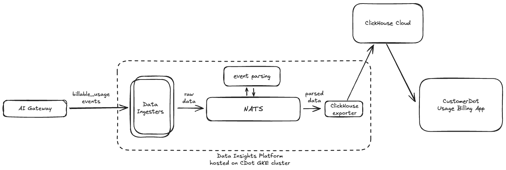
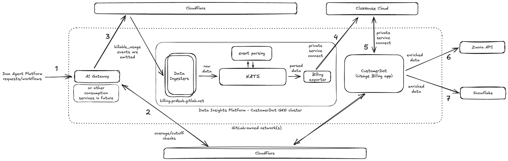

# Data Insights Platform - Usage Billing

## Overview

These Data Insights Platform (DIP) instances help ingest consumption-based `billable_usage` events from internal consumption services, e.g. AI-Gateway (AIGW) and export it to `customerdot` ClickHouse Cloud instances.

Following is a brief overview of its setup in these environments:



- production: `billing.prdsub.gitlab.net` on `prdsub` GKE environment.
- staging: `billing.stgsub.gitlab.net` on `stgsub` GKE environment.

## Access to these clusters

- All currently provisioned DIP instances should be accessible to on-call engineers. The access to these underlying GKE clusters follows our standard VPN-based tool chain as documented [here](https://runbooks.gitlab.com/kube/k8s-oncall-setup/#kubernetes-api-access).
- In case of other folks needing access to these environments, an access request needs to be created - [for example](https://gitlab.com/gitlab-com/team-member-epics/access-requests/-/issues/39796).

## Cluster Topology

Within these environments, we setup DIP in the `single-deployment` mode which allows us to run __all DIP components within the same statefulset__. This deployment mode keeps our topology simple to begin with.

> Note, if needed, we _can_ run each of the components in their own deployments/statefulsets to scale cluster throughput further.

For example, on the `stgsub` GKE cluster:

```text
➜  ~ kubectl -n data-insights-platform get statefulset
NAME                            READY   AGE
data-insights-platform-single   3/3     70d

➜  ~ kubectl -n data-insights-platform get pods
NAME                                                              READY   STATUS    RESTARTS   AGE
data-insights-platform-ingress-nginx-controller-596f47b544vdgr6   1/1     Running   0          11d
data-insights-platform-single-0                                   1/1     Running   0          20h
data-insights-platform-single-1                                   1/1     Running   0          20h
data-insights-platform-single-2                                   1/1     Running   0          20h
```

We can of course, scale the statefulset to multiple replicas - in this case 3.

## Observability

SLIs for Data Insights Platform within `customerdot` environment is defined in its specific `metrics-catalog` [file](../../metrics-catalog/services/customersdot.jsonnet), and available on Grafana [here](https://dashboards.gitlab.net/goto/VtkJI5jHR?orgId=1).

### Metrics

- production: [Grafana dashboard](https://dashboards.gitlab.net/goto/af2pnzhh222o0b?orgId=1)
- staging: [Grafana dashboard](https://dashboards.gitlab.net/goto/ff2po0viojxfka?orgId=1)

### Logs

- production: [Kibana](https://log.gprd.gitlab.net/app/r/s/ce9Be).
- staging: [Kibana](https://nonprod-log.gitlab.net/app/r/s/F52CR).

### Alerts

(work in progress)

## Infrastructure & Networking

### production: billing.prdsub.gitlab.net

| Entity | Details |
|--|--|
| Provider | GCP/GKE |
| GCP Project | `gitlab-subscriptions-prod` |
| Region | us-east1 |
| Networks |  |
| DNS Names | `billing.prdsub.gitlab.net` |
| Deployment configs | [In config-mgmt repository](https://ops.gitlab.net/gitlab-com/gl-infra/config-mgmt/-/tree/main/environments/prdsub?ref_type=heads)<br>[In gitlab-helmfiles repository](https://gitlab.com/gitlab-com/gl-infra/k8s-workloads/gitlab-helmfiles/-/blob/master/bases/environments/prdsub.yaml?ref_type=heads) |
| Cloudflare settings | [In config-mgmt repository](https://ops.gitlab.net/gitlab-com/gl-infra/config-mgmt/-/blob/main/environments/prdsub/gke-dip-ingress.tf?ref_type=heads) <br> Zone: `billing.prdsub.gitlab.net` <br> Host: `billing.prdsub.gitlab.net` |

### staging: billing.stgsub.gitlab.net

| Entity | Details |
|--|--|
| Provider | GCP/GKE |
| GCP Project | `gitlab-subscriptions-staging` |
| Region | us-east1 |
| Networks |  |
| DNS Names | `billing.stgsub.gitlab.net` |
| Deployment configs | [In config-mgmt repository](https://ops.gitlab.net/gitlab-com/gl-infra/config-mgmt/-/tree/main/environments/stgsub?ref_type=heads)<br> [In gitlab-helmfiles repository](https://gitlab.com/gitlab-com/gl-infra/k8s-workloads/gitlab-helmfiles/-/blob/master/bases/environments/stgsub.yaml?ref_type=heads) |
| Cloudflare settings | [In config-mgmt repository](https://ops.gitlab.net/gitlab-com/gl-infra/config-mgmt/-/blob/main/environments/stgsub/gke-dip-ingress.tf?ref_type=heads) <br> Zone: `billing.stgsub.gitlab.net` <br> Host: `billing.stgsub.gitlab.net` |

## How data flows across these system(s)

For Usage Billing deployments, following is a good representation of how usage-billing data flows across the various systems and/or network boundaries.



1. Duo Agent Platform requests and/or workflows are sent to be processed on AIGW.
2. AIGW first calls CustomerDot to check entitlements & allocated GitLab credits to enforce cutoff and/or overages.
3. Once clear to move forward and having processed the request, a corresponding billable_usage event is emitted to billing.prdsub.gitlab.net backed by Data Insights Platform (DIP).
4. DIP ingests & parses these events internally, eventually exporting it to CustomerDot-owned ClickHouse Cloud instance.
5. CustomerDot then fetches these parsed events from their ClickHouse Cloud instance; extracts necessary information from the payload, enriches it as needed and runs all usage-based billing logic.
6. Once processed, fully-enriched events are bulk-uploaded to Zuora via their API for eventual revenue recognition with users/customers.
7. Subsequently, fully-enriched events are also bulk-uploaded to Snowflake for internal analytical purposes.
