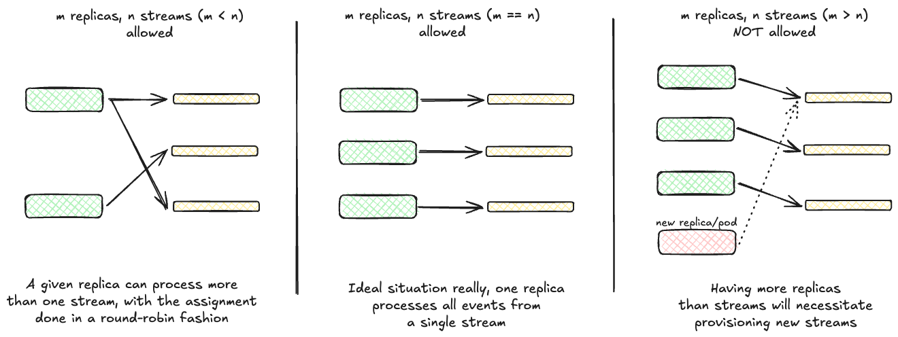

# Data Insights Platform - Message queueing with NATS/Jetstream

As marked in [Data Insights Platform - Overview](./overview.md), all ingested data via the `ingesters` is first landed into NATS/Jetstream to allow for durably persisting all data before it can be parsed, enriched & exported to other downstream systems.

## Logical implementation

* To be able to scale our event processing/consumption, we shard all incoming data across multiple NATS/Jetstream streams. All events are spread randomly over all configured streams, like [here](https://gitlab.com/gitlab-org/analytics-section/platform-insights/core/-/blob/add9b82461983979195bc9de75101746e06e84d0/pkg/snowplow/service.go#L159).

* To then avoid consuming the same message across multiple replicas, we pin `enricher`/`exporter` replicas to streams - assigning NATS streams to each running replica and keeping that assignment fixed for a given run of the application.

* Logically, [we perform a round-robin assignment of these streams over the number of running replicas](https://gitlab.com/gitlab-org/analytics-section/platform-insights/core/-/blob/main/pkg/nats/stream_manager.go?ref_type=heads). As a result, we can _at maximum_ have as many replicas as there are configured streams which is when there's a 1:1 mapping between them, i.e. one replica consuming from one given stream.

## Update how replicas map to NATS shards

In the [arguments list](https://gitlab.com/gitlab-org/analytics-section/platform-insights/data-insights-platform-helm-charts/-/blob/73413b990a089c043361eafafaa9b6986ff993cc/chart/values-full.yaml#L48-L59) to the running binary:

* change the number of replicas i.e. `--replicas`.
* change the number of streams i.e. `--streams`.

## Scale-up/down number of streams-in-use

* change the number of streams i.e. `--streams` upto a maximum of number of replicas i.e. `--replicas` as explained above.

## When reasoning about the number of replicas and/or shards to be used

### Horizonally scale when vertical scaling doesn't help anymore

* We might need to scale up the number of enrichers/exporters when the number of ingested events increases. Since both enrichers/exporters have to process each individual event, they spend compute and/or memory doing so. While vertical scaling, i.e. adding more resources to these pods can help, we might need to horizontally scale at some point, i.e. increase the number of these pods to start processing ingested events in parallel.

* In the _worst_ case, we can have a 1:1 mapping between enricher/exporter pods & NATS streams, increasing pod count would also necessitate increasing the number of streams we write data into. While multiple NATS streams can be consumed by a single pod, the other way is not possible owing our need to avoid duplicated consumption.

### Symptoms for when scaling might be needed

* When the enricher/exporter pods at running above our baseline levels. We'd ideally want these pods to be operating at 50% consumption, so when they trend above, we can horizontally or vertically scale as needed.
  * On [Data Insights Platform - Usage Billing Dashboard](https://dashboards.gitlab.net/goto/ff3skeg290veof?orgId=1) > check __Consumption__ panels for current usage.

* When overall pipeline latency is increasing and we cannot export ingested events into destination systems fast enough - would signal backpressure within the system and warrant adding more resources. This will also show as a large backlog of unacknowledged ACKs on NATS side.
  * On [NATS - Usage Billing Dashboard](https://dashboards.gitlab.net/goto/df3w0yr4hlog0c?orgId=1) > check __Consumer Metrics__ lanels for Total Pending or Total ACKs Pending metrics.

### Validate if measures above worked

* Pod resource consumption drops to our pre-defined baseline, say 50%.
* Overall pipeline latency drops to satisfactory levels, as necessitated by the business use-case being served.
* No undue backlogs on NATS servers.
* Check [Troubleshooting: Usage Billing - Data Ingestion](./environments/usage-billing/troubleshooting/data_ingestion.md) for in-depth details around data ingestion.

### Are these activities disruptive to incoming traffic?

> Generally speaking, all of this work can be done without disrupting incoming traffic to a given DIP instance. There's sufficient redundancy in the system to withstand rolling out new changes to the system.

* __for Data Insights Platform Ingesters__: Both horizontal & vertical scaling can be performed at anytime. All pods will be rolling-restarted to affect new changes without dropping incoming traffic.
  * On [Data Insights Platform - Usage Billing Dashboard](https://dashboards.gitlab.net/goto/ff3skeg290veof?orgId=1) > check __Throughput__ panel.

* __for Data Insights Platform Enrichers/Exporters__: When enricher/exporter pods restart in the case of an upgrade like above, all inflight messages will remain unacked and be redelivered to them when they're up again, thanks to NATS/Jetstream. Even if we have delivered an event to the destination system and haven't ACK'ed it in time, we should be okay considering we only promise atleast-once delivery semantics. All deduplication is to be carried out on the destination systems alone.
  * On [Data Insights Platform - Usage Billing Dashboard](https://dashboards.gitlab.net/goto/ff3skeg290veof?orgId=1) > check __Enrichment__ & __Data Export__ panels.

* __for NATS__: When increasing the number of streams used, a rollout of the `ingester` pods will cause new streams to be created on NATS. While this should work in principle, we may also have to scale and/or add new servers to the NATS cluster. For that we'll need to scale the NATS statefulset first.
  * Scaling the NATS cluster BEFORE bumping `--streams` on the pods will be prudent, allowing the new streams to be created on the newly-minted NATS servers.
  * Doing this AFTER having created the streams will necessitate moving streams to new servers manually.
  * Check [NATS - Usage Billing Dashboard](https://dashboards.gitlab.net/goto/bf3vvzt0dcu0we?orgId=1) for in-depth metrics for our NATS clusters & [NATS - Runbooks](https://gitlab.com/gitlab-com/runbooks/-/tree/master/docs/nats?ref_type=heads) for other operational details.

### Can these changes be rolled back?

* Updates to ingesters/enrichers/exporters can be rolled back at will, without affecting any changes to production traffic.

* The only caveat is when number of `--streams` have been increased, they CANNOT really be rolled back from a NATS perspective. If we deem the new streams to be unnecessary, they'll need to be deleted on NATS clusters manually. Though, leaving them as is should also be no problems operationally assuming all data on them have either been processed and/or deleted.
