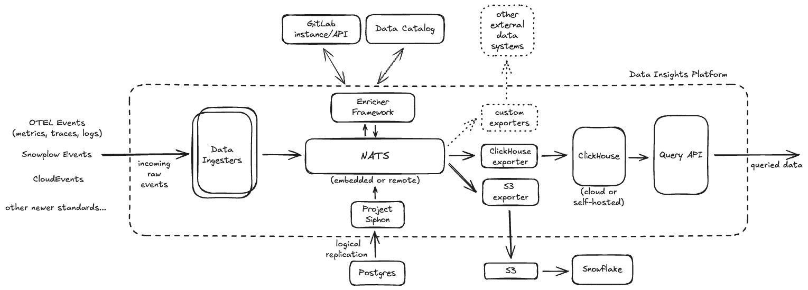

# Data Insights Platform Runbooks

## Overview

Data Insights Platform (DIP) is a unified abstraction to ingest, process, persist & query analytical data events generated across GitLab enabling our ability to compute business insights across the product.

It's designed to be a general-purpose data toolkit that can be used to transport events-data from one system to another while enriching ingested data dynamically. It _currently_ serves the following use-cases:

* [Consumption-based Usage Billing](./environments/usage-billing/overview.md)
* [Transporting Product Usage Data as Snowplow events](./environments/product-usage-data/overview.md)

## Troubleshooting

* [Consumption-based Usage Billing](./environments/usage-billing/overview.md)
  * [Data Ingestion](./environments/usage-billing/troubleshooting/data_ingestion.md)
* [Transporting Product Usage Data as Snowplow events](./environments/product-usage-data/overview.md)
  * [Coming Soon](#)

## Resources

* **Contact Information**
  * [Slack](https://gitlab.enterprise.slack.com/archives/C02Q93U8J07)
  * [Team Handbook](https://about.gitlab.com/direction/analytics/platform-insights/)
* **Documentation**
  * [Architecture Blueprint](https://handbook.gitlab.com/handbook/engineering/architecture/design-documents/data_insights_platform/)
  * [Production Readiness Review](https://gitlab.com/gitlab-com/gl-infra/readiness/-/merge_requests/248)
* **Development**
  * [Code](https://gitlab.com/gitlab-org/analytics-section/platform-insights/core)
  * [Helm-charts](https://gitlab.com/gitlab-org/analytics-section/platform-insights/data-insights-platform-helm-charts)
  * [Terraform-module](https://gitlab.com/gitlab-org/analytics-section/platform-insights/data-insights-platform-infra)
* **Tooling**
  * [Service Catalog](https://gitlab.com/gitlab-com/runbooks/-/blob/c610ff0286c55b8b05ca307285a9002701766f42/services/service-catalog.yml#L431)
  * [Metrics Catalog](https://gitlab.com/gitlab-com/runbooks/-/blob/master/metrics-catalog/services/data-insights-platform.jsonnet?ref_type=heads)
* **Dashboards**
  * [Main Overview](https://dashboards.gitlab.net/goto/k7OSLFCHR?orgId=1)

## General Architecture

> The following are general components that constitute a Data Insights Platform instance. For details around specific use-cases and/or environment-specific architectures, refer to their dedicated sections as linked earlier in the document.

| **Component** | **Description** |
| - | - |
| Ingress | All ingress into our currently-supported deployments of Data Insights Platform is proxied via Cloudflare. On the GKE side, we employ `ingress-nginx` as our ingress controller which in turn uses an IP whitelist containing advertised Cloudflare IP ranges. |
| Ingesters | Single ingestion mechanism for supported event types - which can be run both locally for development & as a cluster when in production. This layer is intentionally stateless to allow horizontal scalability to allow ingesting large data volumes. |
| Message Queue - NATS/Jetstream | All ingested data via the ingesters is first landed into NATS/Jetstream to allow for durably persisting all data before it can be parsed, enriched & exported to other downstream systems. |
| Enrichers | Custom framework to enrich incoming data with the ability to communicate with external components such as GitLab API or Data Catalog for metadata. Supported enrichments include operations such as pseudonymization or redaction of sensitive parts of ingested data, PII detection, parsing client useragent strings, etc. |
| Exporters | Custom implementations that help ship ingested data into designated persistent stores for further querying/processing: [ClickHouse Exporter](https://gitlab.com/gitlab-org/analytics-section/platform-insights/core/-/tree/main/pkg/snowplow/exporter/clickhouse?ref_type=heads): ClickHouse is our designated persistent database which helps us persist all analytical data ingested by the Platform and query from using the Query API. [S3/GCS Exporter](https://gitlab.com/gitlab-org/analytics-section/platform-insights/core/-/tree/main/pkg/snowplow/exporter/objectstore/s3?ref_type=heads): Having data shipped to S3/GCS helps land data into Snowflake powering our current analytical query-workflows using Snowflake & Tableau. |
| Storage | [ClickHouse](https://clickhouse.com/docs/intro): External persistent database that allows for durable persistence and advanced OLAP querying capabilities for all analytical data ingested within the Platform. |

## Message Queueing via NATS

* [How DIP shards ingested data across multiple NATS streams](./message-queueing.md)

## Service Level Indicators (SLI)

* [Data Insights Platform - Ingester](https://gitlab.com/gitlab-com/runbooks/-/blob/35ad3844b6ee73637df9e8e2947ae9cd87f3130a/metrics-catalog/services/data-insights-platform.jsonnet#L25)

## Self-managed & Dedicated

We have _not yet_ deployed a Data Insights Platform to service our self-managed and dedicated GitLab instances.

## Provisioning New Deployments

To kickoff related discussions, please start with filing an issue [here](https://gitlab.com/gitlab-org/analytics-section/platform-insights/core/-/issues/?sort=updated_desc&state=opened&first_page_size=100) with details of your use-case.
