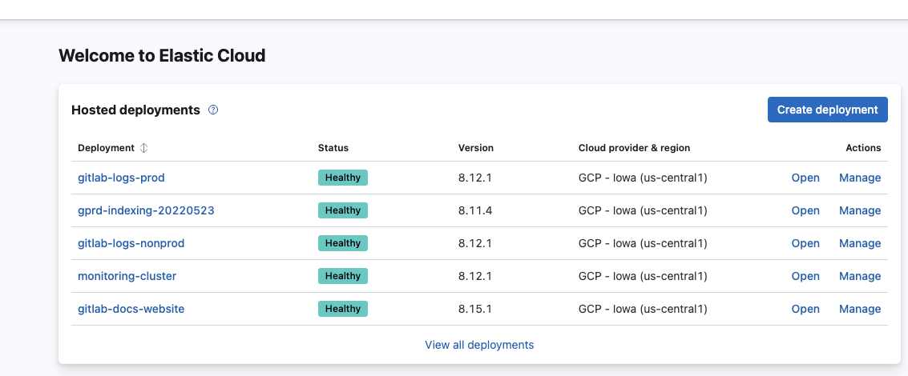

# Elastic

## Quick start

### Elastic related resources

1. [Logging dashboard in Grafana](https://dashboards.gitlab.net/d/USVj3qHmk/logging?orgId=1&from=now-7d&to=now)
1. runbooks repo:
    1. documentation
    1. Prometheus alerts
    1. dashboards/watchers/visualizations/searches
1. terraform config:
    1. infra managed in the `gitlab-com-infrastructure` repo (e.g. pubsubbeat VMs, stackdriver exporter)
    1. relevant terraform modules
1. chef config
1. Design documents in `www-gitlab-com` repo:
TODO: link here design docs once they are ready
1. Logging working group: <https://about.gitlab.com/company/team/structure/working-groups/log-aggregation/>
1. vendor issue tracker: <https://gitlab.com/gitlab-com/gl-infra/elastic/issues>
1. [Global Search](https://handbook.gitlab.com/handbook/engineering/infrastructure-platforms/core-platform/data_stores/search/) engineering team
1. Slack channel `#g_global_search`
1. Discussions in different issues across multiple projects (e.g. regarding costs for indexing entire gitlab.com)
1. Discussions in PM&Engineering meetings

### Historical notes

1. [esc-tools](https://ops.gitlab.net/gitlab-com/gl-infra/gitlab-restore/esc-tools) repo used for managing the ES5 cluster

## How-to guides

### Administrative access/login

We've locked down OKTA access to read only for both non-prod and prod logging clusters.  Both clusters can still be accessed for read/write by SRE on-call through the `ops-contact+elastic@gitlab.com` account.

Once logged into Elastic Cloud, select 'open' for any of the clusters and you'll be logged into Kibana as a super user.



### Disaster recovery

1. [Recovering lost Advanced Search updates](disaster_recovery/)

### Upgrade checklist

#### Pre-flight

* Upgrade the [version of Elasticsearch in CI](https://gitlab.com/gitlab-org/gitlab/-/blob/master/.gitlab/ci/global.gitlab-ci.yml)
* Upgrade the [version of Elasticsearch used in `gitlab-qa` nightly builds](https://gitlab.com/gitlab-org/quality/nightly/-/blob/master/.gitlab-ci.yml#L332) (we currently support latest version plus 1 older supported version)
* Upgrade the [version of Elasticsearch used in GDK](https://gitlab.com/gitlab-org/gitlab-development-kit/-/blob/main/lib/gdk/config.rb#L404)
* Verify that there are no errors in the **Staging** or in the **Production** cluster and that both are healthy
* Verify that there are no alerts firing for the Advanced Search feature, Elasticsearch, Sidekiq workers, or redis

#### Upgrade Staging

* Confirm new Elasticsearch version works in CI with passing pipeline
* Pause indexing in **Staging** `GitLab > Admin > Settings -> General > Advanced Search` or through the console `::Gitlab::CurrentSettings.update!(elasticsearch_pause_indexing: true)`
* Wait 2 mins for [queues in redis to drain and for inflight jobs to finish](https://dashboards.gitlab.net/d/sidekiq-shard-detail/sidekiq-shard-detail?orgId=1&from=now-30m&to=now&var-PROMETHEUS_DS=Global&var-environment=gstg&var-stage=main&var-shard=elasticsearch)
* Add a new comment to an issue and verify that the [Elasticsearch queue increases in the graph](https://dashboards.gitlab.net/d/stage-groups-global_search/stage-groups-group-dashboard-enablement-global-search?orgId=1&var-PROMETHEUS_DS=Global&var-environment=gstg&var-stage=main&var-controller=All&var-action=All&from=now-5m&to=now)
* In the Elastic Cloud UI, take a snapshot of the **Staging** cluster and note the snapshot name
* In Elastic Cloud UI, upgrade the **Staging** cluster to the desired version
* Wait until the rolling upgrade is complete
* Verify that the [Elasticsearch cluster is healthy](#how-to-verify-the-elasticsearch-cluster-is-healthy) in **Staging**
* Go to GitLab.com **Staging** and test that [searches across all scopes in the `gitlab-org` group](https://staging.gitlab.com/search?utf8=%E2%9C%93&snippets=false&scope=issues&repository_ref=&search=*&group_id=9970) still work and return results. _Note: We should not unpause indexing since that could result in data loss_
* Once all search scopes are verified, unpause indexing in **Staging** `GitLab > Admin > Settings -> General > Advanced Search` or through the console `::Gitlab::CurrentSettings.update!(elasticsearch_pause_indexing: false)`
* Wait until the [Sidekiq Queues (Global Search)](https://dashboards.gitlab.net/d/sidekiq-main/sidekiq-overview?orgId=1) have caught up
* Verify that the [Advanced Search feature is working](#how-to-verify-that-the-advanced-search-feature-is-working) in **Staging**

#### Upgrade Production

* Add a silence via <https://alerts.gitlab.net/#/silences/new> with a matcher on the following alert names (link the comment field in each silence back to the Change Request Issue URL)
  * `alertname="SearchServiceElasticsearchIndexingTrafficAbsent"`
  * `alertname="gitlab_search_indexing_queue_backing_up"`
* Pause indexing in **Production** `GitLab > Admin > Settings -> General > Advanced Search` or through the console `::Gitlab::CurrentSettings.update!(elasticsearch_pause_indexing: true)`
* Wait 2 mins for [queues in redis to drain and for inflight jobs to finish](https://dashboards.gitlab.net/d/sidekiq-shard-detail/sidekiq-shard-detail?orgId=1&from=now-30m&to=now&var-PROMETHEUS_DS=Global&var-environment=gprd&var-stage=main&var-shard=elasticsearch)
* Verify that the [Elasticsearch queue increases in the graph](https://dashboards.gitlab.net/d/stage-groups-global_search/stage-groups-group-dashboard-enablement-global-search?orgId=1&var-PROMETHEUS_DS=Global&var-environment=gprd&var-stage=main&var-controller=All&var-action=All&from=now-5m&to=now)
* In the Elastic Cloud UI, take a snapshot of the **Production** cluster and note the snapshot name
* In Elastic Cloud UI, upgrade the **Production** cluster to the desired version
* Wait until the rolling upgrade is complete
* Verify that the [Elasticsearch cluster is healthy](#how-to-verify-the-elasticsearch-cluster-is-healthy) in **Production**
* Go to GitLab.com **Production** and test that [searches across all scopes in the `gitlab-org` group](https://gitlab.com/search?utf8=%E2%9C%93&snippets=false&scope=issues&repository_ref=&search=*&group_id=9970) still work and return results. _Note: We should not unpause indexing since that could result in data loss_
* Once all search scopes are verified, unpause indexing in **Production** `GitLab > Admin > Settings -> General > Advanced Search` or through the console `::Gitlab::CurrentSettings.update!(elasticsearch_pause_indexing: false)`
* Wait until the [Sidekiq Queues (Global Search)](https://dashboards.gitlab.net/d/sidekiq-main/sidekiq-overview?orgId=1) have caught up
* Verify that the [Advanced Search feature is working](#how-to-verify-that-the-advanced-search-feature-is-working) in **Production**

#### Rollback steps

* If the upgrade completed but something is not working, create a new cluster and restore an older version of Elasticsearch from the snapshot captured above. Then update the credentials in `GitLab > Admin > Settings > General > Advanced Search` to point to this new cluster. The original cluster should be kept for root cause analysis. Keep in mind that this is a last resort and will result in data loss.

#### How to verify the Elasticsearch cluster is healthy

* Verify the cluster is in a healthy state and that there are no errors in the [Kibana cluster monitoring logs](https://00a4ef3362214c44a044feaa539b4686.us-central1.gcp.cloud.es.io:9243/app/monitoring#/elasticsearch?_g=(cluster_uuid:HdF5sKvcT5WQHHyYR_EDcw))
* Verify that the [`elasticsearch_exporter`](https://thanos.gitlab.net/graph?g0.expr=gitlab_component_ops%3Arate_5m%7Bcomponent%3D%22elasticsearch_searching%22%2Ctype%3D%22search%22%7D&g0.tab=0&g0.stacked=0&g0.range_input=30m&g0.max_source_resolution=0s&g0.deduplicate=1&g0.partial_response=0&g0.store_matches=%5B%5D) continues to export metrics

#### How to verify that the Advanced Search feature is working

* Add a comment to an issue and then search for that comment. _Note: that  before the results show up, all jobs in the queue need to be processed and this can take a few minutes. In addition, refreshing of the Elasticsearch index can take another 30s (if there were no search requests in the last 30s)._
* Search for a commit that was added after indexing was paused

#### Monitoring

#### Metric: Search overview metrics

* Location: <https://dashboards.gitlab.net/d/search-main/search-overview?orgId=1>
* What changes to this metric should prompt a rollback: Flatline of RPS

#### Metric: Search controller performance

* Location: <https://dashboards.gitlab.net/d/web-rails-controller/web3a-rails-controller?orgId=1&var-PROMETHEUS_DS=mimir-gitlab-gprd&var-environment=gprd&var-stage=main&var-controller=SearchController&var-action=show>
* What changes to this metric should prompt a rollback: Massive spike in latency

#### Metric: Search sidekiq indexing queues (Sidekiq Queues (Global Search))

* Location: <https://dashboards.gitlab.net/d/sidekiq-main/sidekiq-overview?orgId=1>
* What changes to this metric should prompt a rollback: Queues not draining

#### Metric: Search sidekiq in flight jobs

* Location: <https://dashboards.gitlab.net/d/sidekiq-shard-detail/sidekiq3a-shard-detail?orgId=1&var-PROMETHEUS_DS=mimir-gitlab-gprd&var-environment=gprd&var-stage=main&var-shard=elasticsearch>
* What changes to this metric should prompt a rollback: No jobs in flight

#### Metric: Elastic Cloud outages

* Location: <https://status.elastic.co/#past-incidents>
* What changes to this metric should prompt a rollback: Incidents which prevent upgrade of the cluster

### Performing operations on the Elastic cluster

One time Elastic operations should be documented as `api_calls` in this repo. Everything else, for example cluster config, index templates, should be managed using CI (with the exception of dashboards and visualizations created in Kibana by users).

The convention used in most scripts in `api_calls` is to provide cluster connection details using an env var called `ES7_URL_WITH_CREDS`. It has a format of: `https://<es_username>:<password>@<cluster_url>:<es_port>` . The secret that this env var should contain can be found in 1password.

### Estimating Log Volume and Cluster Size

If we know how much log volume we are indexing per day, how many resources we
are using on our cluster, the desired retention period and how much log volume
we want to add, then we can estimate the needed cluster size.

Currently, fluentd is sending all logs to stackdriver and some logs to GCP
PubSub. We have pubsubbeat nodes for each topic, sending the logs into elastic.

#### What is going to Stackdriver?

Stackdriver is ingesting everything - around **50TiB** per month as of 17-01-2020: [Resources
view](https://console.cloud.google.com/logs/usage?authuser=1&project=gitlab-production)

[haproxy logs](https://console.cloud.google.com/monitoring/metrics-explorer?pageState=%7B%22xyChart%22:%7B%22dataSets%22:%5B%7B%22timeSeriesFilter%22:%7B%22filter%22:%22metric.type%3D%5C%22logging.googleapis.com%2Fexports%2Fbyte_count%5C%22%20resource.type%3D%5C%22logging_sink%5C%22%20resource.label.%5C%22name%5C%22%3D%5C%22haproxy_logs%5C%22%22,%22perSeriesAligner%22:%22ALIGN_RATE%22,%22crossSeriesReducer%22:%22REDUCE_NONE%22,%22secondaryCrossSeriesReducer%22:%22REDUCE_NONE%22,%22minAlignmentPeriod%22:%2260s%22,%22groupByFields%22:%5B%5D,%22unitOverride%22:%22By%22%7D,%22targetAxis%22:%22Y1%22,%22plotType%22:%22LINE%22%7D%5D,%22options%22:%7B%22mode%22:%22COLOR%22%7D,%22constantLines%22:%5B%5D,%22timeshiftDuration%22:%220s%22,%22y1Axis%22:%7B%22label%22:%22y1Axis%22,%22scale%22:%22LINEAR%22%7D%7D,%22isAutoRefresh%22:true,%22timeSelection%22:%7B%22timeRange%22:%221w%22%7D%7D&project=gitlab-production)
are send into a GCP sink instead of to pubsub/elastic because of their
size (10MiB/s or **850GiB/day**).

#### What is the Volume of our PubSub topics?

[Average daily pubsub volume per topic in GiB](https://thanos.gitlab.net/graph?g0.range_input=2w&g0.max_source_resolution=0s&g0.expr=avg_over_time(stackdriver_pubsub_topic_pubsub_googleapis_com_topic_byte_cost%7Benv%3D%22gprd%22%7D%5B1d%5D)*60*24%2F1024%2F1024%2F1024&g0.tab=0)
(base unit in prometheus is Byte/minute for this metric).

[Same metric in Stackdriver metrics explorer](https://console.cloud.google.com/monitoring/metrics-explorer?authuser=1&project=gitlab-production&pageState=%7B%22xyChart%22:%7B%22dataSets%22:%5B%7B%22timeSeriesFilter%22:%7B%22filter%22:%22metric.type%3D%5C%22pubsub.googleapis.com%2Ftopic%2Fbyte_cost%5C%22%20resource.type%3D%5C%22pubsub_topic%5C%22%22,%22perSeriesAligner%22:%22ALIGN_RATE%22,%22crossSeriesReducer%22:%22REDUCE_NONE%22,%22secondaryCrossSeriesReducer%22:%22REDUCE_NONE%22,%22minAlignmentPeriod%22:%2260s%22,%22groupByFields%22:%5B%5D,%22unitOverride%22:%22By%22%7D,%22targetAxis%22:%22Y1%22,%22plotType%22:%22LINE%22%7D%5D,%22options%22:%7B%22mode%22:%22COLOR%22%7D,%22constantLines%22:%5B%5D,%22timeshiftDuration%22:%220s%22,%22y1Axis%22:%7B%22label%22:%22y1Axis%22,%22scale%22:%22LINEAR%22%7D%7D,%22isAutoRefresh%22:true,%22timeSelection%22:%7B%22timeRange%22:%221m%22%7D%7D) (Byte/s)

Total of **1.3TiB/day** as of 17-01-2020 (nginx being excluded).

#### How much elastic storage are we using per day?

As we have one index alias per pubsub topic and in ES5 cluster (`gitlab-production`) we use a naming convention for
rolled-over indices to add the date and a counter, we can grep the elastic cat
api for each pubsub index alias and add together the size of all indices
belonging to the same alias with the same day in the name to get the daily index
volume.  [../api_calls/single/get-index-stats-summary.sh]
is doing that for you.

The results as of 16-01-2020 are analyzed in
[this sheet](https://docs.google.com/spreadsheets/d/1RN7Ry2pI7iTFURqb0G5zjhNp7xkiPSVG-YsoBOO3TFw).

**We can conclude from this, that index volume (with one replica shard) is around
3 times the volume of the corresponding pubsub topic.**

As of 17-01-2020 we are using ca. **4TiB elastic storage per day** (only pubsub topics, excluding
nginx). That means for a **7 day retention** we consume around 28TiB storage. Adding
nginx logs would increase that by 0.6TiB/day (15%), haproxy logs by 2.5TiB/day (63%).

### Analyzing index mappings

At the moment of writing, we utilize static mappings defined in this repository. Here are a few ideas for analysis of those mappings:

```bash
jsonnet elastic/managed-objects/lib/index_mappings/rails.jsonnet | jq -r 'leaf_paths|join(".")' | grep -E '\.type$' | wc -l
jsonnet elastic/managed-objects/lib/index_mappings/rails.jsonnet | jq -r 'leaf_paths|join(".")' | grep -E '\.type$' | head
jsonnet elastic/managed-objects/lib/index_mappings/rails.jsonnet | jq -r 'leaf_paths|join(";")' | grep -E ';type$' | awk '{ print $1, 1 }' | inferno-flamegraph > mapping_rails.svg
```

## Concepts

### Elastic learning materials

### Design Document (Elastic at Gitlab)

<https://gitlab.com/gitlab-com/www-gitlab-com/merge_requests/23545>
TODO: update this link once merged

### Monitoring

Because Elastic Cloud is running on infrastructure that we do not manage or have access to, we cannot use our exporters/Prometheus/Thanos/Alertmanager setup. For this reason, the best option is to use Elasticsearch built-in x-pack monitoring that is storing monitoring metrics in Elasticsearch indices. In production environment, it makes sense to use a separate cluster for storing monitoring metrics (if metrics were stored on the same cluster, we wouldn't know the cluster is down because monitoring would be down as well).

When monitoring is enabled and configured to send metrics to another Elastic cluster, it's the receiving clusters' responsibility to handle metrics rotation, i.e. the receiving cluster needs to have retention configured. For more details see: <https://www.elastic.co/guide/en/cloud/current/ec-enable-monitoring.html#ec-monitoring-retention>  and <https://www.elastic.co/guide/en/elasticsearch/reference/current/monitoring-settings.html>

Apart from monitoring using x-pack metrics + watches, we are also using a blackbox exporter in our infrastructure. It's used for monitoring selected API endpoints, such as ILM explain API.

### Alerting

Since we cannot use our Alertmanager, Elasticsearch Watches have to be used for alerting. They will be configured on the Elastic cluster used for storing monitoring indices.

Blackbox probes cannot provide us with sufficient granularity of state reporting.

<!-- ## Summary -->

<!-- ## Architecture -->

<!-- ## Performance -->

<!-- ## Scalability -->

<!-- ## Availability -->

<!-- ## Durability -->

<!-- ## Security/Compliance -->

<!-- ## Monitoring/Alerting -->

<!-- ## Links to further Documentation -->
