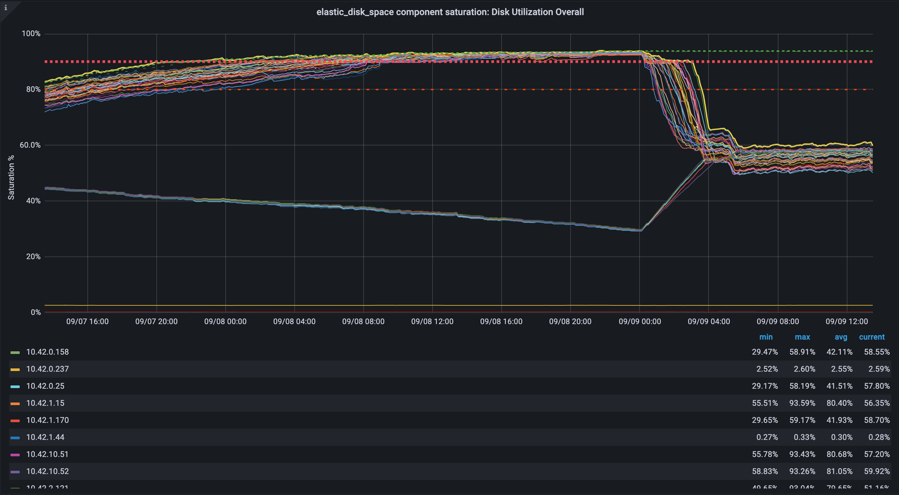
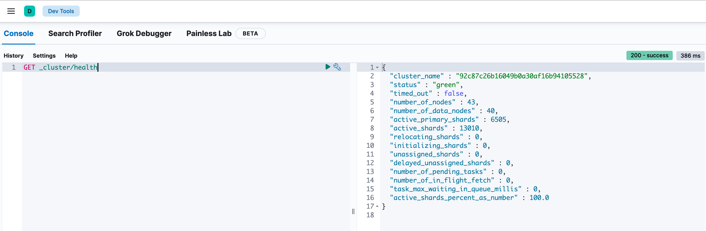

# Elastic Nodes Disk Space Saturation

[source](https://dashboards.gitlab.net/d/alerts-sat_elastic_disk_space/alerts-elastic_disk_space-saturation-detail?orgId=1&from=now-2d&to=now)

## Get cluster health

Using the [dev console](https://www.elastic.co/guide/en/kibana/current/console-kibana.html) or
the [API Console](https://www.elastic.co/guide/en/cloud/current/ec-api-console.html) get
the health of the cluster.

[`GET _cluster/health`](https://www.elastic.co/guide/en/elasticsearch/reference/7.17/cluster-health.html)

Check each value and see if this gives you an indication that something is
wrong with the cluster.

## Unassigned shards

If the [cluster health](#get-cluster-health) indicates that there is a number
of unassigned shards, this can lead up to the hot nodes disk being filled up
because
[ILM](https://www.elastic.co/guide/en/elasticsearch/reference/current/index-lifecycle-management.html)
is not able to roll over indencies properly.

Using the [dev console](https://www.elastic.co/guide/en/kibana/current/console-kibana.html) or
the [API Console](https://www.elastic.co/guide/en/cloud/current/ec-api-console.html) get
an overview ilm.

- [`GET
  _all/_ilm/explain`](https://www.elastic.co/guide/en/elasticsearch/reference/7.17/ilm-explain-lifecycle.html#ilm-explain-lifecycle-example).
  To filter out for the ones with errors with `GET
  _all/_ilm/explain?only_errors`.
- [`GET
  _cluster/allocation/explain`](https://www.elastic.co/guide/en/elasticsearch/reference/current/cluster-allocation-explain.html).
  Which provides an explanation for why the shard is unassigned.

## Find which lifecycle an index is using

- [`GET _cat/indices/pubsub-gitaly-inf-gprd-*`](https://www.elastic.co/guide/en/elasticsearch/reference/7.17/cat-indices.html): Get all gitaly indencies.
- [`GET pubsub-gitaly-inf-gprd-007382/_settings`](https://www.elastic.co/guide/en/elasticsearch/reference/7.17/indices-get-settings.html): Get `index.lifecycle`.
- [`GET _ilm/policy/gitlab-infra-high-ilm-policy`](https://www.elastic.co/guide/en/elasticsearch/reference/7.17/ilm-get-lifecycle.html): Get policy details.

## Previous Incidents

- [#7669](https://gitlab.com/gitlab-com/gl-infra/production/-/issues/7669)

<!-- Service: Logging -->
