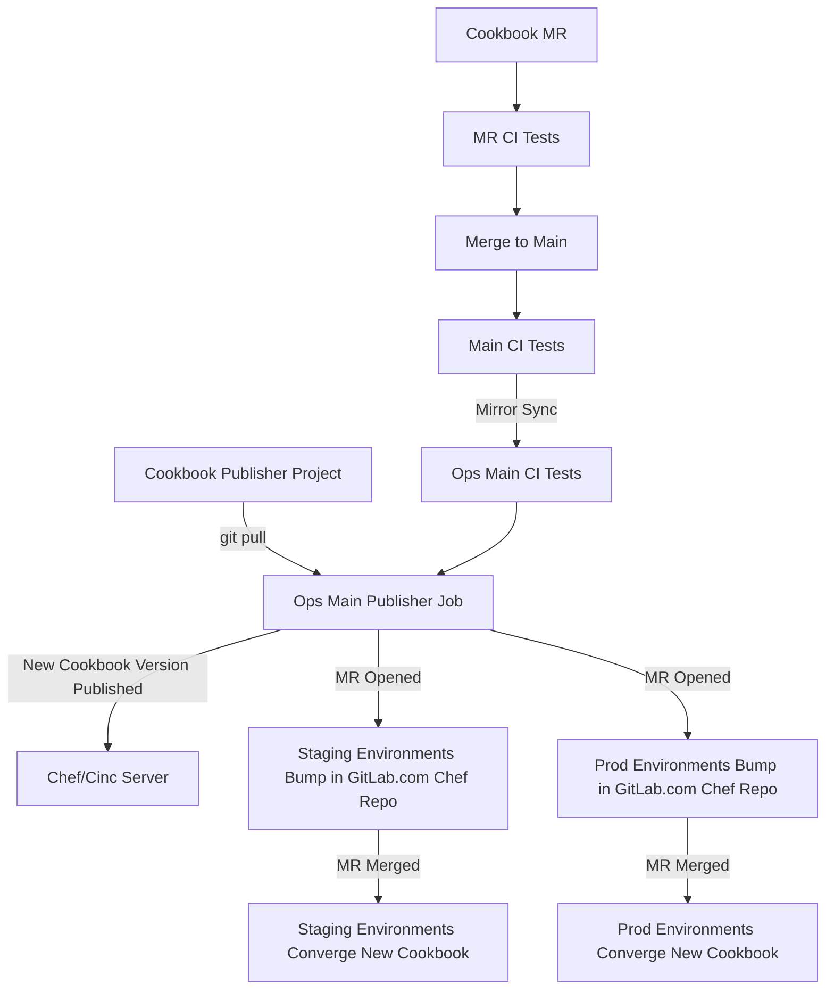

# Chef Cookbook Process

## Workflow

When updating a cookbook, the following steps are the current workflow.

1. Create a merge request that includes your changes in the appropriate cookbook.
   Merge requests CI jobs should run ChefSpec and Kitchen tests against the proposed
   changes. You should also make sure each change includes the correct metadata updates
   for version and other cookbook dependencies.
1. Once your changes are reviewed and merged, the ops.gitlab.net mirror will reflect
   the new protected branch and publish the cookbook. This publish step should create
   additional merge requests in the [Chef Repo][chef-repo] project on GitLab.com. If
   you do not see these merge requests, check the ops mirror of the cookbook to see
   why the publisher job failed.
1. The publish job should create a general merge request to update the pinned version
   of the cookbook for non-production environments and a production specific merge
   request that will update the pinned version of the cookbook for production
   environments. You should merge the non-production changes and give them plenty of
   time to deploy (usually a few hours at the longest) and verify the new cookbook
   version is working as expected.
1. Once you are confident the new cookbook version is working properly in non-production
   environments, merge the remaining production merge request in the Chef Repo project.



## Create New Cookbook

Creating new cookbook consists of several steps:

1. We have cookbook [template](https://gitlab.com/gitlab-cookbooks/template)
   which have all the necessary bits to speed up cookbook creation. To init
   new cookbook from template, do the following:
   1. Clone the template into new cookbook directory:

      ```
      git clone git@gitlab.com:gitlab-cookbooks/template.git gitlab_newcookbook
      ```

      Please use the `gitlab_` prefix for new cookbooks names.
   1. Replace the `template` with `gitlab_newcookbook` everywhere:

      ```
      find * -type f | xargs -n1 sed -i 's/template/gitlab_newcookbook/g'
      ls .kitchen*yml | xargs -n1 sed -i 's/template/gitlab_newcookbook/g'
      ```

      This will also update badges in README.md, attributes, and recipes.
   1. At this point, you have a fully functional initial commit with passing
      tests (see the Testing section in cookbooks README.md for details), and
      you can rewrite git commit history from template to you cookbook:

      ```
      git checkout --orphan latest && \
      git add -A && \
      git commit -am 'Initial commit'
      ```

      :point_up: the above may ask for GPG password if you sign your commits,
      so its separated from the branch switch below :point_down:

      ```
      git branch -D master && \
      git branch -m master && \
      sed -i 's/template/gitlab_newcookbook/' .git/config
      ```

1. Create a new GitLab.com project and mirror on ops.gitlab.net by updating the
   [Infrastructure Management][infra-mgmt-cookbooks] project. The project on GitLab.com is
   where merge requests are made, reviewed, and merged into the protected branch.
   The ops mirror is where the cookbook changes are published to the Chef/Cinc
   server and it serves as a backup to publish cookbooks changes when GitLab.com
   is unavailable.

1. Do a `git push origin master` and verify that the repository is mirrored to
   ops in few minutes.

Go to the [chef-repo](https://gitlab.com/gitlab-com/gl-infra/chef-repo/) and edit the
Berksfile to add the new cookbook. Be sure that you add version pinning and point it to the
ops repo. Next, run `berks install` to download the cookbook for the first time, commit, and push.
Finally, run `berks upload <cookbookname>` to upload the cookbook to the Chef server.

To apply this uploaded cookbook to a new environment follow the steps [below](#chef-environments-and-cookbooks)

## ChefSpec and test kitchen

### ChefSpec

ChefSpec and test kitchen are two ways that you can test your cookbook before you
commit/deploy it. From the documentation:

> ChefSpec is a framework that tests resources and recipes as part of a simulated chef-client run.
> ChefSpec tests execute very quickly. When used as part of the cookbook authoring workflow,
> ChefSpec tests are often the first indicator of problems that may exist within a cookbook.

To get started with ChefSpec you write tests in ruby to describe what you want. An example is:

```ruby
file '/tmp/explicit_action' do
  action :delete
end

file '/tmp/with_attributes' do
  user 'user'
  group 'group'
  backup false
  action :delete
end

file 'specifying the identity attribute' do
  path   '/tmp/identity_attribute'
 action :delete
end
```

There are many great resources for ChefSpec examples such as the [ChefSpec documentation](https://docs.chef.io/chefspec.html)
and the [ChefSpec examples on GitHub](https://github.com/sethvargo/chefspec/tree/master/examples).

### Test Kitchen/KitchenCI

[Test Kitchen/KitchenCI](http://kitchen.ci/) is a integration testing method that can spawn a VM
and run your cookbook inside of that VM. This lets you do somewhat more than just ChefSpec
and can be an extremely useful testing tool.

To begin with the KitchenCI, you will need to install the test-kitchen Gem `gem install test-kitchen`.
It would be wise to add this to your cookbook's Gemfile.

Next, you'll want to create the Kitchen's config file in your cookbook directory called `.kitchen.yml`.
This file contains the information that KitchenCI needs to actually run your cookbook. An example and explanation
is provided below.

```yaml
---
driver:
  name: vagrant

provisioner:
  name: chef_zero

platforms:
  - name: centos-7.1
  - name: ubuntu-14.04
  - name: windows-2012r2

suites:
  - name: client
    run_list:
      - recipe[postgresql::client]
  - name: server
    run_list:
      - recipe[postgresql::server]
```

This file is probably self-explanatory. It will use VirtualBox to build a VM and use `chef_zero` as the
method to converge your cookbook. It will run tests on 3 different OSes, CentOS, Ubuntu, and Windows 2012 R2.
Finally, it will run the recipes listed below based on the suite. The above config file will generate
6 VMs, 3 for the `client` suite and 3 for the `server` suite. You can customize this however you wish.
It is possible to run KitchenCI for an entire deployment, however I don't think our chef-repo is set up
in such a way.

As always, there are many resources such as the [KitchenCI getting started guide](http://kitchen.ci/docs/getting-started/)
and the [test-kitchen repo](https://github.com/test-kitchen/test-kitchen).

## Test cookbook on a local server

If you wish to test a cookbook on your local server versus KitchenCI, this is totally possible.

The following example is a way to run our GitLab prometheus cookbook locally.

```
mkdir -p ~/chef/cookbooks
cd ~/chef/cookbooks
git clone git@gitlab.com:gitlab-cookbooks/gitlab-prometheus.git
cd gitlab-prometheus
berks vendor ..
cd ..
chef-client -z -o 'recipe[gitlab-prometheus::prometheus]'
```

The `chef-client -z -o` in the above example will tell the client to run in local mode and
to only run the runlist provided.
You can substitute any cookbook you wish, including your own. Do keep in mind however that
this may still freak out when a chef-vault is involved.

## Update cookbook and deploy to production

When it comes time to edit a cookbook, you first need to clone it from its repo, most likely
in <https://gitlab.com/gitlab-cookbooks/>.

Once you make your changes to a cookbook, you will want to be sure to bump the version
number in `metadata.rb` as we have versioning requirements in place so Chef will not accept
a cookbook with the same version, even if it has changed. Commit these changes and submit a
merge request to merge your changes.

Once your changes are merged, the new cookbook will be uploaded to Chef server automatically as part of a CI pipeline.

After uploading the new cookbook version to the Chef server, [cookbook-publisher](https://gitlab.com/gitlab-cookbooks/cookbook-publisher/) will open 2 MRs to the [chef-repo]. The first MR will be for updating the cookbook version on all non-production environments. The second MR will be for updating the cookbook version in the production environment.

The typical workflow when a cookbook needs to be updated will look like this:

1. Create an MR to the Cookbook and merge it
    1. [Cookbook MR](https://gitlab.com/gitlab-cookbooks/cookbook-omnibus-gitlab/-/merge_requests/137)
1. Merge the auto-generated MR that will update the cookbook version in non-production environments
    1. [Sample MR](https://gitlab.com/gitlab-com/gl-infra/chef-repo/-/merge_requests/5868)
1. Make sure that chef-client succeeds in non-production environments
1. Merge the auto-generated MR that will update the cookbook version in production
    1. [Sample MR](https://gitlab.com/gitlab-com/gl-infra/chef-repo/-/merge_requests/5869)
1. Make sure that chef-client succeeds in production

## Rollback cookbook

With the advent of environment pinned versions, rolling back a cookbook is as simple as
changing the version number back to the previous one in the respective environment file.

There is no need to delete the version, we can roll forward and upload a corrected
version in its place.

## Chef Environments and Cookbooks

By utilizing environments in chef we are able to roll out our cookbooks to a subset
of our infrastructure. As an [environment](https://docs.chef.io/environments.html) we
divide up our infrastructure the same way was in [Terraform](https://ops.gitlab.net/gitlab-com/gl-infra/config-mgmt/-/tree/main/environments).

Some of the important environments are:

* [gstg](https://gitlab.com/gitlab-com/gl-infra/chef-repo/blob/master/environments/gstg.json) (staging)
* [gprd](https://gitlab.com/gitlab-com/gl-infra/chef-repo/blob/master/environments/gprd.json) (production)
* [pre](https://gitlab.com/gitlab-com/gl-infra/chef-repo/blob/master/environments/pre.json) (pre production)
* [ops](https://gitlab.com/gitlab-com/gl-infra/chef-repo/blob/master/environments/ops.json) (pre production)

The complete list of environments can be seen under [`chef-repo/environments`](https://gitlab.com/gitlab-com/gl-infra/chef-repo/-/blob/master/environments/).

To see the nodes in an environment use a knife search command such as:

```
knife search node 'chef_environment:gstg'| grep Name| sort
```

Each environment has a locked version for each GitLab cookbook which looks like this:

```
"gitlab-common": "= 0.2.0"
```

The pattern matching follows the same syntax as [gem or berks version operators](http://guides.rubygems.org/patterns/#declaring-dependencies)
(ie. <, >, <=, >=, ~>, =). This allows us to roll out a cookbook one environment at a time.
The workflow for this would look as follows.

The version should be on the chef server when the [chef-repo] MR is merged into master. It is actively applied to VMs on the next run of the `chef-client`. `chef-client` runs once every 30 minutes on all VMs.

## Run chef client in interactive mode

Really useful to troubleshoot.

Starting from the chef-repo folder run the following command:

```
chef-shell -z -c .chef/knife.rb
```

In here you can type `help` to get really useful help, but then for instance you can do this

```
> nodes.search('name:node-name-in-chef')
```

And then examine this node from chef's perspective

## References

* [GitLab's chef-repo](https://gitlab.com/gitlab-com/gl-infra/chef-repo/)
* [ChefSpec documentation](https://docs.chef.io/chefspec.html)
* [ChefSpec examples on GitHub](https://github.com/sethvargo/chefspec/tree/master/examples)
* [KitchenCI getting started guide](http://kitchen.ci/docs/getting-started/)
* [test-kitchen repo](https://github.com/test-kitchen/test-kitchen)

[chef-repo]: https://gitlab.com/gitlab-com/gl-infra/chef-repo/
[infra-mgmt-cookbooks]: https://gitlab.com/gitlab-com/gl-infra/infra-mgmt/-/blob/main/data/projects/gitlab-cookbooks/repos.yaml?ref_type=heads
