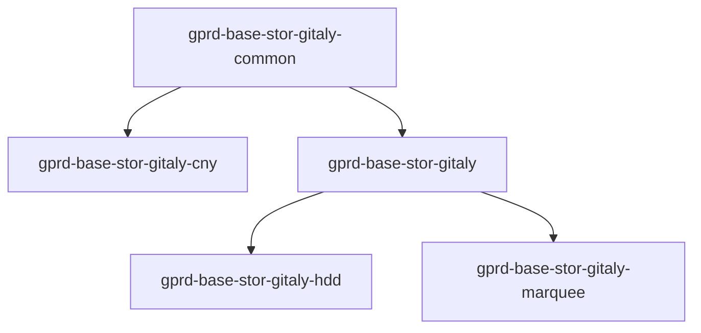
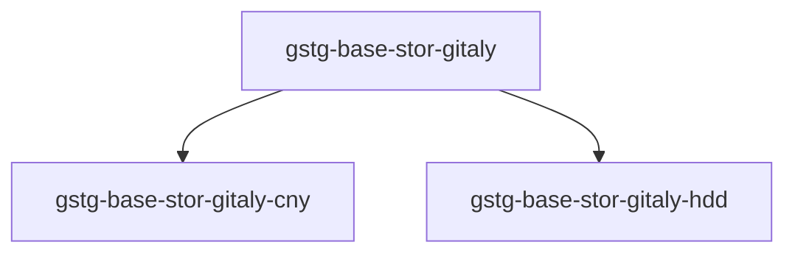

<!-- MARKER: do not edit this section directly. Edit services/service-catalog.yml then run scripts/generate-docs -->

# Gitaly Service

* [Service Overview](https://dashboards.gitlab.net/d/gitaly-main/gitaly-overview)
* **Alerts**: <https://alerts.gitlab.net/#/alerts?filter=%7Btype%3D%22gitaly%22%2C%20tier%3D%22stor%22%7D>
* **Label**: gitlab-com/gl-infra/production~"Service::Gitaly"

## Logging

* [Gitaly](https://log.gprd.gitlab.net/goto/4f0bd7f08b264e7de970bb0cc9530f9d)
* [gitlab-shell](https://log.gprd.gitlab.net/goto/ba97a9597863f0df1c3b894b44eb1db6)
* [system](https://log.gprd.gitlab.net/goto/7cfb513706cffc0789ad0842674e108a)

<!-- END_MARKER -->

<!-- ## Summary -->

## Architecture

### Chef

#### `gprd`

* `gprd-base-stor-gitaly-common`: The base configuration which is common for all Gitaly shards and stages.
* `gprd-base-stor-gitaly-cny`: Any extra configuration we might want to add for Gitaly `shard=default, stage=cny`.
* `gprd-base-stor-gitaly`: Any extra configuration we might want to add for Gitaly `shard=default, stage=main`.
* `gprd-base-stor-gitaly-hdd`: Any extra configuration we might want to add for Gitaly `shard=hdd, stage=main`.
* `gprd-base-stor-gitaly-marquee`: Any extra configuration we might want to add for Gitaly `shard=marquee, stage=main`.

#### `gstg`

* `gstg-base-stor-gitaly`: The base configuration which is common for all Gitaly shards and stages.
* `gstg-base-stor-gitaly-cny`: Any extra configuration we might want to add for Gitaly `shard=default, stage=cny`.
* `gstg-base-stor-gitaly-hdd`: Any extra configuration we might want to add for Gitaly `shard=main, stage=main`.

<!-- ## Performance -->

<!-- ## Scalability -->

<!-- ## Availability -->

<!-- ## Durability -->

<!-- ## Security/Compliance -->

## Monitoring/Alerting

[GitalyServiceGoserverTrafficCessationSingleNode Playbook](alerts/GitalyServiceGoserverTrafficCessationSingleNode.md)

<!-- ## Links to further Documentation -->
