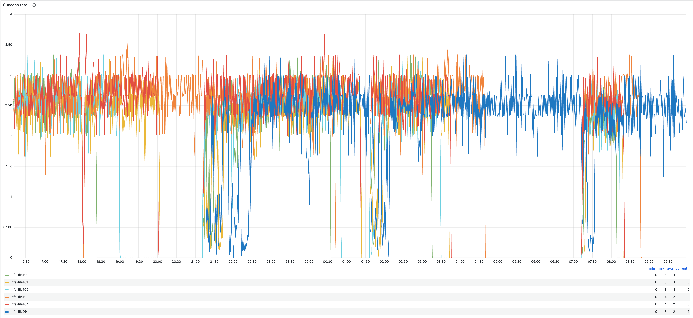

# `gitalyctl`

## Introduction

[`gitalyctl`](https://gitlab.com/gitlab-com/gl-infra/woodhouse/-/blob/f3039d33367750c0afbee21a1aa62c0b40cfb2c5/cmd/woodhouse/gitalyctl.go) implements the [solution spec](https://gitlab.com/gitlab-com/gl-infra/readiness/-/blob/master/library/gitaly-multi-project/README.md#solution) to drain git storages. This is achived by moving all the git repositories from the configured Gitaly storage to different Gitaly storages by use of the `woodhouse gitalyctl storage drain` so that the drained storages can be decomissioned.

## Deployment

Deployment of `gitalyctl` is done by through the [`gitalyctl helm release:`](https://gitlab.com/gitlab-com/gl-infra/charts/-/tree/main/gitlab/gitalyctl?ref_type=heads)

- Create a new GitLab Admin user and a PAT for that user, [example](https://gitlab.com/gitlab-com/team-member-epics/access-requests/-/issues/24091).
- Create new `gitalyctl-api-token` which is used by `gitalyctl` by following the steps in this [runbook.](https://gitlab.com/gitlab-com/runbooks/-/blob/master/docs/vault/usage.md#external-secrets-in-kubernetes) `gitalyctl` uses a personal admin credential via the environment variable `GITALYCTL_API_TOKEN` that allows it to send requests to the Gitlab API.
- Add the release to the gitalyctl release [helmfile.yaml](https://gitlab.com/gitlab-com/gl-infra/k8s-workloads/gitlab-helmfiles/-/blob/master/releases/gitalyctl/helmfile.yaml?ref_type=heads)

## How `gitalyctl drain storage` works

Once `woodhouse gitalyctl drain storage` is executed the following will happen:

1. Drain Group Wikis using GitLab's API and move the repository to the available Gitaly storage.
1. Drain Snippets using GitLab's API and move the repository to the available Gitaly storage.
1. Drain Project Wikis/Repositories using GitLab's API and move the repository to the available Gitaly storage.
1. `--dry-run` this will only print out the projects that will be migrated, and their `statistics.repository_size`, `repository_storage` this allows us to check if we are picking the right projects both for local development and the production deployment.

More details on how this happens can be found in the [Gitaly Multi Project solution](https://gitlab.com/gitlab-com/gl-infra/readiness/-/blob/master/library/gitaly-multi-project/README.md#solution) from step 2

## Increase throughput of moves

### What is throughput

The main metric for throughput is the increase in the number of GB/s we are moving or the number of moves/s. The best metric we have is the `Success Rate`, the higher it is the faster we are moving repositories



[source](https://dashboards.gitlab.net/d/gitaly-multi-project-move/gitaly-gitaly-multi-project-move?orgId=1&from=1698077498008&to=1698141553180&viewPanel=16)

### Configuration

When draining storage there are multiple configuration fields to increase the throughput:

1. [`storage.concurrency`](https://gitlab.com/gitlab-com/gl-infra/woodhouse/-/blob/f3039d33367750c0afbee21a1aa62c0b40cfb2c5/configs/gitalyctl-storage-drain-config.example.yml#L6):
    - How many storages from the list it will drain in 1 go.
1. `concurrency`; [Group](https://gitlab.com/gitlab-com/gl-infra/woodhouse/-/blob/f3039d33367750c0afbee21a1aa62c0b40cfb2c5/configs/gitalyctl-storage-drain-config.example.yml#L12), [Snippet](https://gitlab.com/gitlab-com/gl-infra/woodhouse/-/blob/f3039d33367750c0afbee21a1aa62c0b40cfb2c5/configs/gitalyctl-storage-drain-config.example.yml#L19), [Project](https://gitlab.com/gitlab-com/gl-infra/woodhouse/-/blob/f3039d33367750c0afbee21a1aa62c0b40cfb2c5/configs/gitalyctl-storage-drain-config.example.yml#L26)
    - The higher the value the more concurrent moves it will do.
    - The concurrency value is per storage.
1. `move_status_update`; [Group](https://gitlab.com/gitlab-com/gl-infra/woodhouse/-/blob/f3039d33367750c0afbee21a1aa62c0b40cfb2c5/configs/gitalyctl-storage-drain-config.example.yml#L14), [Snippet](https://gitlab.com/gitlab-com/gl-infra/woodhouse/-/blob/f3039d33367750c0afbee21a1aa62c0b40cfb2c5/configs/gitalyctl-storage-drain-config.example.yml#L21), [Project](https://gitlab.com/gitlab-com/gl-infra/woodhouse/-/blob/f3039d33367750c0afbee21a1aa62c0b40cfb2c5/configs/gitalyctl-storage-drain-config.example.yml#L28)
    - This is the frequency at which it checks the move status. The faster it checks, the quicker it can free up a slot to schedule a move for another project. We don't expect this to change a lot currently.
    - Look at the [precentile](https://log.gprd.gitlab.net/app/r/s/hQgAC) to see if we need to reduce this, but it should be well-tuned already.
    - Example: <https://gitlab.com/gitlab-com/gl-infra/k8s-workloads/gitlab-helmfiles/-/merge_requests/3345#note_1606716477>

### Bottlenecks

1. `sidekiq`: All of the move jobs run on the
   [`gitaly_throttled`](https://dashboards.gitlab.net/d/sidekiq-queue-detail/sidekiq-queue-detail?orgId=1&var-PROMETHEUS_DS=Global&var-environment=gprd&var-stage=main&var-queue=gitaly_throttled).
   This will be the main bottleneck, if you see a large `queue length` it might
   be time to scale up
   [`maxReplicas`](https://gitlab.com/gitlab-com/gl-infra/k8s-workloads/gitlab-com/-/blob/a26c7188f019c79b3f65770be199413bf1c220ff/releases/gitlab/values/gprd.yaml.gotmpl#L670)
    - Risk: One risk of increasing `maxReplicas` is that will be increasing the
      load on the Gitaly servers. So when you increase `maxReplicas` make sure
      you have enough resource capacity in Gitaly.
    - Example: <https://gitlab.com/gitlab-com/gl-infra/reliability/-/issues/24529#note_1601462542>
1. `gitaly`: Both the source and destination storage might end up getting resource saturated, below is a list of resources that get saturated
    - [Disk Read throughput](https://thanos.gitlab.net/graph?g0.expr=max(%0A%20%20rate(node_disk_read_bytes_total%7Benv%3D%22gprd%22%2Cenvironment%3D%22gprd%22%2Cfqdn%3D~%22gitaly-01-stor-gprd.c.gitlab-gitaly-gprd-83fd.internal%22%2Ctype%3D%22gitaly%22%7D%5B1m%5D)%0A)%20by%20(fqdn)%0A&g0.tab=0&g0.stacked=0&g0.range_input=1h&g0.max_source_resolution=0s&g0.deduplicate=1&g0.partial_response=0&g0.store_matches=%5B%5D)
    - [Disk Write throughput](https://thanos.gitlab.net/graph?g0.expr=max(%0A%20%20rate(node_disk_written_bytes_total%7Benv%3D%22gprd%22%2Cenvironment%3D%22gprd%22%2Cfqdn%3D~%22gitaly-01-stor-gprd.c.gitlab-gitaly-gprd-83fd.internal%22%2Ctype%3D%22gitaly%22%7D%5B1m%5D)%0A)%20by%20(fqdn)%0A&g0.tab=0&g0.stacked=0&g0.range_input=1h&g0.max_source_resolution=0s&g0.deduplicate=1&g0.partial_response=0&g0.store_matches=%5B%5D)
    - [CPU scheduling wait](https://thanos.gitlab.net/graph?g0.expr=max%20by%20(fqdn)%20(%0A%20%20rate(node_schedstat_waiting_seconds_total%7Benv%3D%22gprd%22%2Cenvironment%3D%22gprd%22%2Cfqdn%3D~%22gitaly-01-stor-gprd.c.gitlab-gitaly-gprd-83fd.internal%22%2Ctype%3D%22gitaly%22%7D%5B5m%5D)%0A)%0A&g0.tab=0&g0.stacked=0&g0.range_input=1h&g0.max_source_resolution=0s&g0.deduplicate=1&g0.partial_response=0&g0.store_matches=%5B%5D)
    - [CPU](https://thanos.gitlab.net/graph?g0.expr=avg(instance%3Anode_cpu_utilization%3Aratio%7Benv%3D%22gprd%22%2Cenvironment%3D%22gprd%22%2Cfqdn%3D~%22gitaly-01-stor-gprd.c.gitlab-gitaly-gprd-83fd.internal%22%2Ctype%3D%22gitaly%22%7D)%20by%20(fqdn)%0A&g0.tab=0&g0.stacked=0&g0.range_input=1h&g0.max_source_resolution=0s&g0.deduplicate=1&g0.partial_response=0&g0.store_matches=%5B%5D)

## Stopping migration during emergency

During migration of gitaly projects from current to new servers, we are perodically moving projects in bulk from old servers (`file-*`) to new (`gitaly-*`) servers and that is being done concurrently while new projects are also being created on the same set of available servers. If a migration is not going as expected, we can quickly overrun available disk space and soon be unable to create new projects for customers.

We can determine if there is an ongoing migration by seeing an uptrend in `Repository on new Gitaly VMs` [here](https://dashboards.gitlab.net/d/gitaly-multi-project-move/gitaly3a-gitaly-multi-project-move?orgId=1&from=now-7d&to=now)

To stop migrations in emergency situation, run:

(`gitalyctl` is running in `ops` cluster)

```shell
glsh kube use-cluster ops
```

Then in a separate session/window, scale down the replicas to zero:

```shell
kubectl scale deployment gitalyctl-gprd -n gitalyctl --replicas=0
```

And reach out to [#wg_disaster-recovery](https://gitlab.slack.com/archives/C01D6Q0DHAL) slack channel as a followup, to let the team now.

**Note:** This will not leave any repositories in a bad state.
