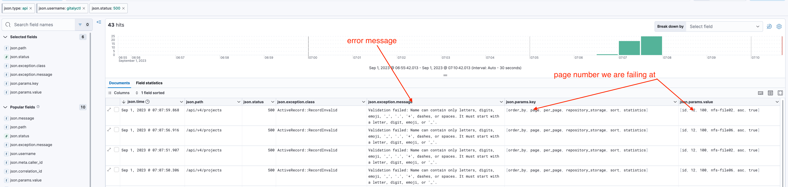
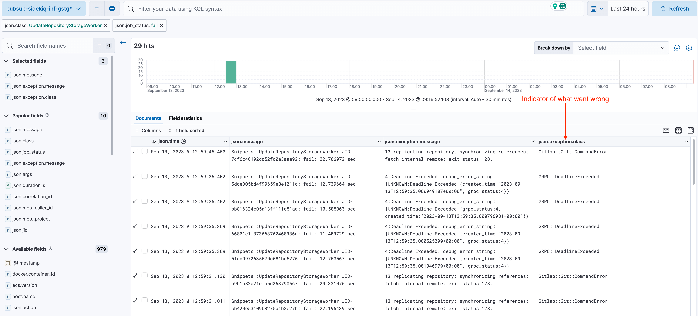
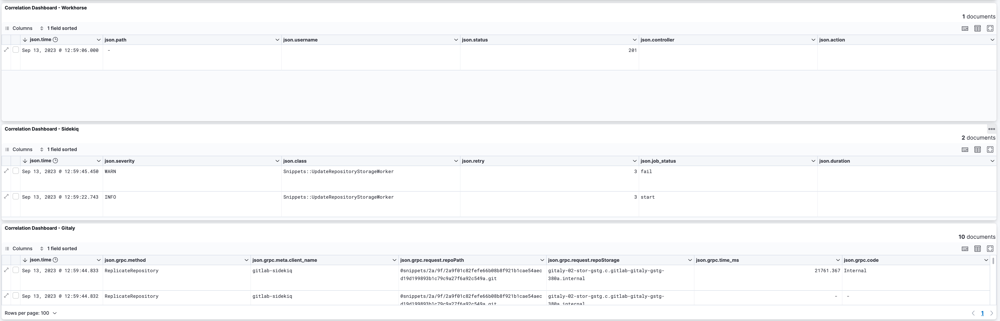

# Gitaly multi-project migration

- [Epic](https://gitlab.com/groups/gitlab-com/gl-infra/-/epics/935)
- [Design Document](https://gitlab.com/gitlab-com/gl-infra/readiness/-/blob/master/library/gitaly-multi-project/README.md)
- [`gitalyctl`](./gitalyctl.md)

## `gitalyctl`

### `500 Internal Server Error`

Symptoms:

```json
{
  "error": "move storage: 3 error(s) occurred:\n* drain project storage: list projects: GET https://staging.gitlab.com/api/v4/projects: 500 {message: 500 Internal Server Error}\n* drain project storage: list projects: GET https://staging.gitlab.com/api/v4/projects: 500 {message: 500 Internal Server Error}\n* drain project storage: list projects: GET https://staging.gitlab.com/api/v4/projects: 500 {message: 500 Internal Server Error}",
  "event": "shutdown",
  "level": "error",
  "ts": "2023-09-05T04:15:47.875264403Z"
}
```

[source](https://dashboards.gitlab.net/explore?orgId=1&left=%7B%22datasource%22:%22R8ugoM-Vk%22,%22queries%22:%5B%7B%22refId%22:%22A%22,%22expr%22:%22%7Bnamespace%3D%5C%22gitalyctl%5C%22%7D%20%7C%3D%20%60Internal%20Server%20Error%60%20%7C%20json%20level%3D%5C%22level%5C%22%20%7C%20level%20%3D%20%60error%60%22,%22queryType%22:%22range%22,%22datasource%22:%7B%22type%22:%22loki%22,%22uid%22:%22R8ugoM-Vk%22%7D,%22editorMode%22:%22builder%22%7D%5D,%22range%22:%7B%22from%22:%22now-6h%22,%22to%22:%22now%22%7D%7D)

Runbook:

1. Find 500 error logs in the API: <https://nonprod-log.gitlab.net/app/r/s/s2ES1>
1. Check the `json.exception.message` and `json.exception.class` for the error message. Also, notice the `json.params.value` to know which page is failing.
    
1. Verify that you also see the 500 error locally

    ```shell
    $ curl -s --header "PRIVATE-TOKEN: $(op read op://private/GitLab-Staging/PAT)" "https://staging.gitlab.com/api/v4/projects?repository_storage=nfs-file02&order_by=id&sort=asc&statistics=true&per_page=100&page=12"
    {"message":"500 Internal Server Error"}⏎
    ```

1. Find the faulty project through the rails console.

    The `offset` will depend on which page is failing, for example, `page=12` is failing so calculating the offset `(page - 1) * 100 = 1100`.

    ```shell
    Project.where("repository_storage = ?", "nfs-file02").order(id: :asc).offset(1100).limit(100).each {|p| puts "ID: #{p.id}, valid: #{p.valid?}, errors: #{p.errors.full_messages}" unless p.valid? }; 0
    ID: 219566, valid: false, errors: ["Name can contain only letters..."]
    ```

### Project repository move timeout with `state:initial` / `state: schedule` / `state:started`

Symptoms:

Move timeout and `state="initial"` / `state="scheduled"` / `state="started"`

```json
{
  "destination_storage": "gitaly-01-stor-gstg.c.gitlab-gitaly-gstg-380a.internal",
  "event": "move repository timeout",
  "level": "error",
  "project": "https://staging.gitlab.com/clai/cuest-web-landing",
  "project_repository_move_id": 5967558,
  "repository_size": 0,
  "state": "scheduled",
  "storage": "nfs-file05",
  "timeout_duration": "1h0m0s",
  "ts": "2023-09-11T05:36:39.25137642Z"
}
```

[source](https://dashboards.gitlab.net/explore?orgId=1&left=%7B%22datasource%22:%22bf3c1752-94ff-41eb-90ee-f51be7d16be9%22,%22queries%22:%5B%7B%22refId%22:%22A%22,%22datasource%22:%7B%22type%22:%22loki%22,%22uid%22:%22bf3c1752-94ff-41eb-90ee-f51be7d16be9%22%7D,%22editorMode%22:%22builder%22,%22expr%22:%22%7Bcontainer%3D%5C%22gitalyctl%5C%22%7D%20%7C%3D%20%60move%20repository%20timeout%60%20%7C%20json%20state%3D%5C%22state%5C%22%20%7C%20state%20%3D%20%60scheduled%60%22,%22queryType%22:%22range%22%7D%5D,%22range%22:%7B%22from%22:%22now-7d%22,%22to%22:%22now%22%7D%7D)

Runbook:

1. Connect to the rails console
1. Find the `Projects::RepositoryStroageMove` using the `project_repository_move_id` from the log message.

    ```shell
    [ gstg ] production> Projects::RepositoryStorageMove.find(5967558)
    =>
    #<Projects::RepositoryStorageMove:0x00007fcb1acab4e8
     id: 5967558,
     created_at: Mon, 04 Sep 2023 09:09:04.454070000 UTC +00:00,
     updated_at: Mon, 04 Sep 2023 09:09:04.454070000 UTC +00:00,
     project_id: 3359362,
     state: 2,
     source_storage_name: "nfs-file05",
     destination_storage_name:
      "gitaly-01-stor-gstg.c.gitlab-gitaly-gstg-380a.internal">
    ```

    `state: 2` means it's [`scheduled`](https://gitlab.com/gitlab-org/gitlab/-/blob/460f795b6d723a1e69043659d7c36f4c2aee069b/app/models/concerns/repository_storage_movable.rb#L85-91)
1. Mark the move as a failure, and disable read only mode.

    ```shell
    # Mark as failure
    [ gstg ] production> Projects::RepositoryStorageMove.find(5967558).do_fail!
    => true

    # Disable read_only
    [ gstg ] production> Project.find(Projects::RepositoryStorageMove.find(5967558).project_id).update!(repository_read_only: false)
    => true
    ```

1. The repositry should be moved in the next round `gitalyctl` fetches projects for the storage.

### Move repository `state=failed`

Symptoms:

Move failed with `state="failed"`

```json
{
  "caller": "snippet_repository.go:182",
  "destination_storage": "gitaly-02-stor-gstg.c.gitlab-gitaly-gstg-380a.internal",
  "event": "move repository state failed",
  "level": "error",
  "snippet": "https://staging.gitlab.com/-/snippets/1664763",
  "snippet_repository_move_id": 1040466,
  "state": "failed",
  "storage": "nfs-file07",
  "timeout_duration": "1h0m0s",
  "ts": "2023-09-13T12:59:47.594007192Z"
}
```

[source](https://dashboards.gitlab.net/explore?orgId=1&left=%7B%22datasource%22:%22R8ugoM-Vk%22,%22queries%22:%5B%7B%22refId%22:%22A%22,%22datasource%22:%7B%22type%22:%22loki%22,%22uid%22:%22R8ugoM-Vk%22%7D,%22editorMode%22:%22builder%22,%22expr%22:%22%7Bcontainer%3D%5C%22gitalyctl%5C%22%7D%20%7C%20json%20state%3D%5C%22state%5C%22%20%7C%20state%20%3D%20%60failed%60%22,%22queryType%22:%22range%22%7D%5D,%22range%22:%7B%22from%22:%22now-24h%22,%22to%22:%22now%22%7D%7D)

Runbook:

1. Find failed sidekiq jobs for `UpdateRepositoryStorageWorker`: [gstg](https://nonprod-log.gitlab.net/app/r/s/7NExg) | [gprd](https://log.gprd.gitlab.net/app/r/s/pMpgv)

    

1. If you need more context about the failure for example the failure came form Gitaly, fetch `json.correlation_id` and check the correlation dashboard: [gstg](https://nonprod-log.gitlab.net/app/r/s/F9zdz) | [gprd](https://log.gprd.gitlab.net/app/r/s/gOgAn)

    

1. Confirm that the repository is not left in `read-only` mode

    ```irb
    # If Project
    [ gstg ] production> Project.find_by_full_path('sxuereb/gitaly').repository_read_only?
    => true

    # If Snippet
    [ gstg ] production> Snippet.find(3029095).repository_read_only?
    => true

    # If Group
    [ gstg ] production> Group.find(13181226).repository_read_only?
    => true
    ```

1. Change repository to be [writeable](#repository-read-only) if `repository_read_only? => true`

### Repository read-only

Symptoms:

Move fails:

```
{
  "caller": "project_repository.go:160",
  "event": "move repository",
  "level": "warn",
  "msg": "project is read-only",
  "project": "https://gitlab.com/sxuereb/gitaly",
  "repository_size": 0,
  "storage": "nfs-file102",
  "timeout_duration": "1h0m0s",
  "ts": "2023-10-27T08:43:43.15835397Z"
}
```

[source](https://dashboards.gitlab.net/explore?orgId=1&left=%7B%22datasource%22:%22R8ugoM-Vk%22,%22queries%22:%5B%7B%22refId%22:%22A%22,%22datasource%22:%7B%22type%22:%22loki%22,%22uid%22:%22R8ugoM-Vk%22%7D,%22editorMode%22:%22builder%22,%22expr%22:%22%7Bcontainer%3D%5C%22gitalyctl%5C%22%7D%20%7C%3D%20%60read-only%60%20%7C%20json%20level%3D%5C%22level%5C%22%20%7C%20level%20%3D%20%60warn%60%22,%22queryType%22:%22range%22%7D%5D,%22range%22:%7B%22from%22:%22now-1h%22,%22to%22:%22now%22%7D%7D)

Runbook:

1. Change repository to be writable if `read-only`

    ```irb
    # If Project
    [ gstg ] production> Project.find_by_full_path('sxuereb/gitaly').set_repository_writable!
    => nil
    [ gstg ] production> Project.find_by_full_path('sxuereb/gitaly').repository_read_only?
    => false

    # If Snippet
    [ gstg ] production> Snippet.find(3029095).set_repository_writable!
    => nil
    [ gstg ] production> Snippet.find(3029095).repository_read_only?
    => false

    # If Group
    [ gstg ] production> Group.find(13181226).set_repository_writable!
    => nil
    [ gstg ] production> Group.find(13181226).repository_read_only?
    => false
    ```

### Timeout waiting for project repository pushes

Symptoms:

- Sidekiq jobs failing this exception message: `Timeout waiting for project repository pushes` ([Kibana](https://log.gprd.gitlab.net/app/r/s/5PjXd))

Runbook:

- Check the project's reference counter multiple times, if the number is not growing up then you can reset the counter and wait for the project to be moved by gitalyctl:

    ```ruby
    project = Project.find_by_full_path('sxuereb/gitaly')
    project.reference_counter(type: project.repository.repo_type).value
    # => 6
    project.reference_counter(type: project.repository.repo_type).value
    # => 6
    project.reference_counter(type: project.repository.repo_type).reset!
    # => true
    ```

- If number is increasing over time, then it's a little tricky and a manual scheduling of movement is required. In a Rails console run all the following:

    ```ruby
    class Projects::RepositoryStorageMove
      override :schedule_repository_storage_update_worker
      def schedule_repository_storage_update_worker
        Projects::UpdateRepositoryStorageWorker.new.perform(
          project_id,
          destination_storage_name,
          id
        )
      end
    end

    project = Project.find_by_full_path('sxuereb/gitaly')
    # Try these two lines until you get a `true`
    project.reference_counter(type: project.repository.repo_type).reset!
    project.repository_storage_moves.build(source_storage_name: project.repository_storage).schedule
    # => true
    ```

_For more context around this error and its remedies, please check this [thread](https://gitlab.com/gitlab-com/gl-infra/production/-/issues/17061#note_1638971869)_.
