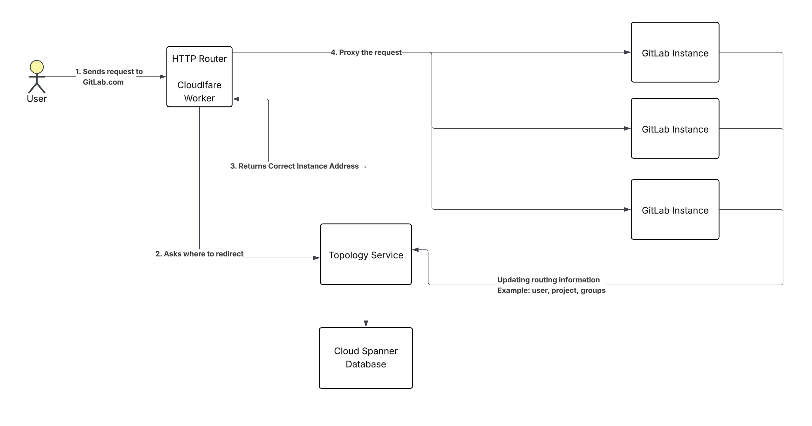
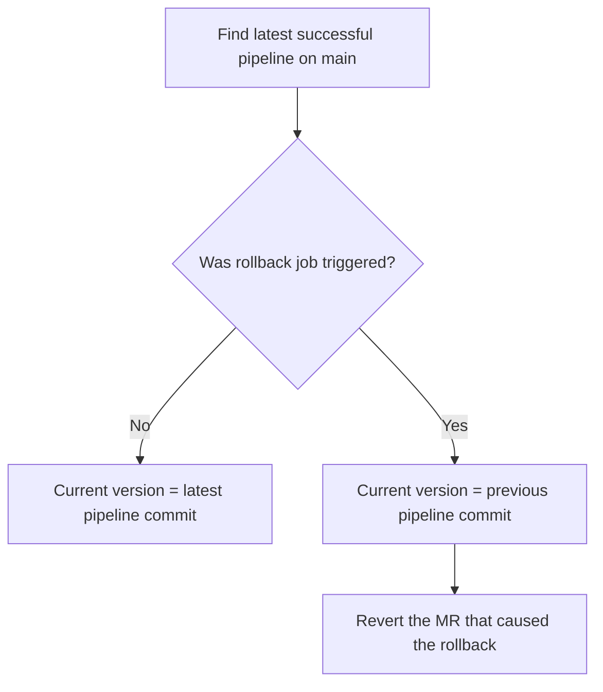

# HTTP Router: On-Call Survival Guide

This guide helps EOC (engineer-on-call) respond to incidents related to [HTTP Router](https://gitlab.com/gitlab-org/cells/http-router).

## What is HTTP Router

HTTP Router is the entry point for **all** HTTP requests under `gitlab.com/*`. It sits between Cloudflare's edge network and GitLab's backend infrastructure, determining which Cell should handle each incoming request. Currently, by default it proxies requests to our legacy cell.

HTTP Router is built on [Cloudflare Workers](https://workers.cloudflare.com/) and deployed via [http-router-deployer](https://gitlab.com/gitlab-com/gl-infra/cells/http-router-deployer/). It enables the [Cells architecture](https://handbook.gitlab.com/handbook/engineering/architecture/design-documents/cells/) by presenting all Cells under a single `gitlab.com` domain.

**Design Documentation:** [HTTP Routing Service Architecture](https://handbook.gitlab.com/handbook/engineering/architecture/design-documents/cells/http_routing_service)

### What HTTP Router Does

- Routes requests to the correct Cell based on path, headers, or cached classification.
  - Currently, it proxies most requests to our legacy cell. This will change once [path-based routing](https://gitlab.com/groups/gitlab-com/gl-infra/-/epics/1745) is enabled.
- Queries [Topology Service](../topology-service/) to identify which cell to proxy requests to (classify).

### What HTTP Router Does NOT Do

- Does not buffer request bodies (memory-constrained)
- Does not handle Git SSH traffic (separate SSH routing)
- Does not perform authentication or authorization (it may extract routing keys from tokens, but validation happens in the backend GitLab application)
- Does not make routing classification decisions itself (core classification logic lives in [Topology Service](../topology-service/))

### How HTTP Router Communicates with Topology Service

HTTP Router authenticates to Topology Service using [Cloudflare Zero Trust Service Tokens](https://developers.cloudflare.com/cloudflare-one/identity/service-tokens/). These tokens are:

- Injected via Worker environment variables
- Automatically rotated using a dual-token strategy (Token A rotates 90 days before expiry, Token B rotates 180 days before expiry) to ensure zero downtime
- Managed through [config-mgmt](https://ops.gitlab.net/gitlab-com/gl-infra/config-mgmt/-/blob/f84b53fbd5bb257b95170c0d00991680c2013306/environments/cloudflare/topology-service-zero-trust.tf)

If there is an issue with service token authentication, you will see **high error rates from the Classify service** as a symptom. In this case:

1. Check [Sentry](https://new-sentry.gitlab.net/organizations/gitlab/projects/http-router/?project=39) for authentication-related exceptions
2. Check [Topology Service metrics](../topology-service/) for incoming request failures
3. Review [Cloudflare Access Audit Logs](https://one.dash.cloudflare.com/852e9d53d0f8adbd9205389356f2303d/logs/access) for blocked requests

For more details, see [security.md](https://gitlab.com/gitlab-org/cells/http-router/-/blob/main/docs/security.md).

## Critical Information

| Metric | Value |
| -------------- | ---------------------------------------------------------------------------------- |
| Traffic Volume | [~40k+ requests/second](https://dashboards.gitlab.net/goto/bfbj7i4i2igw0d?orgId=1) |
| Deployment | [Cloudflare Workers](https://workers.cloudflare.com/) (edge) |
| Dependencies | [Topology Service](../topology-service/), [Worker Environment Variables](https://developers.cloudflare.com/workers/configuration/environment-variables/) |

## Quick Links

| Resource | Link |
| -------- | ---- |
| Repository | [gitlab-org/cells/http-router](https://gitlab.com/gitlab-org/cells/http-router) |
| Deployer | [http-router-deployer](https://gitlab.com/gitlab-com/gl-infra/cells/http-router-deployer/) |
| Pipelines | [Deployment Pipelines](https://ops.gitlab.net/gitlab-com/gl-infra/cells/http-router-deployer/-/pipelines) |
| Grafana | [HTTP Router Overview](https://dashboards.gitlab.net/d/http-router-main/http-router3a-overview) |
| Sentry | [http-router](https://new-sentry.gitlab.net/organizations/gitlab/projects/http-router/?project=39) |
| Alerts | [HTTP Router Alerts](https://alerts.gitlab.net/#/alerts?filter=%7Btype%3D%22http-router%22%2C%20tier%3D%22lb%22%7D) |

## Escalation

- **Slack:** [`#g_cells_infrastructure`](https://gitlab.enterprise.slack.com/archives/C07URAK4J59)
- **Team:** [Cells Infrastructure (Tenant Scale)](https://handbook.gitlab.com/handbook/engineering/infrastructure-platforms/tenant-scale/cells-infrastructure/)

## Troubleshooting Steps

### 1. Check Sentry for Exceptions

[Sentry Project](https://new-sentry.gitlab.net/organizations/gitlab/projects/http-router/?project=39) captures all exceptions across environments (`gprd`, `gstg`).

Exceptions are reported to Sentry via [a separate tail worker](https://gitlab.com/gitlab-org/cells/http-router/-/blob/main/docs/observability.md#tail-worker-integration).

### 2. Check Cloudflare Worker Logs

| Environment | Live Logs | Historical Logs |
| ----------- | --------- | --------------- |
| Production | [Live](https://dash.cloudflare.com/852e9d53d0f8adbd9205389356f2303d/workers/services/live-logs/production-gitlab-com-cells-http-router/production) | [Historical](https://dash.cloudflare.com/852e9d53d0f8adbd9205389356f2303d/workers/services/view/production-gitlab-com-cells-http-router/production/observability/logs) |
| Staging | [Live](https://dash.cloudflare.com/852e9d53d0f8adbd9205389356f2303d/workers/services/live-logs/staging-gitlab-com-cells-http-router/production) | [Historical](https://dash.cloudflare.com/852e9d53d0f8adbd9205389356f2303d/workers/services/view/staging-gitlab-com-cells-http-router/production/observability/logs) |

For detailed logging, see [logging.md](./logging.md).

### 3. Check Cloudflare Metrics

If [Grafana](https://dashboards.gitlab.net/d/http-router-main/http-router3a-overview) shows missing metrics, check [Cloudflare Dashboard](https://dash.cloudflare.com/852e9d53d0f8adbd9205389356f2303d/workers/services/view/production-gitlab-com-cells-http-router/production?time-window=1440&versionFilter=all) directly.

See [missing-metrics.md](./missing-metrics.md) for troubleshooting.

### 4. Check Recent Deployments

Review [successful deployment pipelines](https://ops.gitlab.net/gitlab-com/gl-infra/cells/http-router-deployer/-/pipelines?page=1&scope=all&ref=main&status=success) to identify if a recent change caused the issue.

#### Identifying the Currently Deployed Version

**Steps:**

1. Go to [Deployment Pipelines](https://ops.gitlab.net/gitlab-com/gl-infra/cells/http-router-deployer/-/pipelines?page=1&scope=all&ref=main&status=success)
2. Find the latest successful pipeline
3. Check if the `rollback` job was triggered on that pipeline
   - If **no rollback**: the commit from this pipeline is what's currently deployed
   - If **rollback was triggered**: the commit from the *previous* pipeline is what's deployed, and you should revert the MR that caused the rollback

> [!note]
> While immediate rollback via the UI is acceptable during incidents, always follow up by reverting the problematic MR to keep the `main` branch aligned with production.

### 5. Check Topology Service Health

HTTP Router depends on Topology Service for request classification. If TS is unhealthy, you'll see classify failures in HTTP Router.

- **Grafana:** [Topology Service (REST) Dashboard](https://dashboards.gitlab.net/d/topology-rest-main/topology-rest3a-overview)
- **Quick check:** Are there an increase in 404s across `gitlab.com` ? If yes, start with TS troubleshooting.

For detailed TS troubleshooting, see the [Topology Service Runbook](../topology-service/).

## Common Failure Modes

| Symptom | Likely Cause | Action |
| ------- | ------------ | ------ |
| 502 on large uploads | `ReadableStream.tee() buffer limit exceeded` | Check Sentry; review recent MRs for body handling changes |
| Intermittent 502s | Worker memory limits | Check Cloudflare logs for buffer/memory errors |
| High latency | CPU time exceeded | Check CPU metrics in Cloudflare dashboard |
| Missing Grafana metrics | Cloudflare processing delay | Verify via GraphQL API ([missing-metrics.md](./missing-metrics.md)) |
| High error rate on classify requests | Topology Service connectivity or auth issues | Check Sentry for auth exceptions; check [Topology Service health](../topology-service/) |

> [!note]
> There is a known issue on increased error rate caused by `/api/v4/jobs/request` endpoint, the team is working on updating our observability stack to fix the errors coming from here. This will change post <https://gitlab.com/gitlab-com/gl-infra/tenant-scale/cells-infrastructure/team/-/work_items/632> is closed.

## Rollback Procedures

### Quick Rollback

1. Go to [Deployment Pipelines](https://ops.gitlab.net/gitlab-com/gl-infra/cells/http-router-deployer/-/pipelines)
2. Find the last known good deployment
3. Run the rollback job

Details: [Rollback Documentation](https://gitlab.com/gitlab-org/cells/http-router/-/blob/main/docs/deployment.md#rollback)

### Emergency: Disable HTTP Router

> [!important]
> **Assess the impact before disabling.**
>
> With HTTP Router disabled, all requests fall back directly to the Legacy Cell (current `gitlab.com` installation). This is acceptable when no production Cells exist. Once production Cells are active, disabling HTTP Router means:
>
> - Users/groups on the Legacy Cell: **No impact**
> - Users/groups on production Cells: **Will receive 404 errors** (requests won't be routed to their Cell)
>
> Evaluate whether the incident impact is worse than the impact of disabling routing to production Cells.

Use only if HTTP Router is causing critical issues and must be bypassed entirely:

1. Remove or disable routes in [`cloudflare-workers.tf`](https://ops.gitlab.net/gitlab-com/gl-infra/config-mgmt/-/blob/main/environments/gprd/cloudflare-workers.tf)
2. Create MR, get approval, apply with `atlantis apply`

Details: [disable-http-router.md](./disable-http-router.md)

## Deployment Flow

HTTP Router deploys **separately** from GitLab application:

1. Changes merged to [http-router](https://gitlab.com/gitlab-org/cells/http-router)
2. The project on `gitlab.com` is mirrored to [http-router-deployer](https://ops.gitlab.net/gitlab-com/gl-infra/cells/http-router-deployer/) on `ops.gitlab.net` which runs the deployment pipeline.
2. Progression: `staging` → `production`

To read more in detail about deployment, see: <https://gitlab.com/gitlab-org/cells/http-router/-/blob/main/docs/deployment.md?ref_type=heads>

## References

- [HTTP Routing Service Design Doc](https://handbook.gitlab.com/handbook/engineering/architecture/design-documents/cells/http_routing_service)
- [Cells Architecture](https://handbook.gitlab.com/handbook/engineering/architecture/design-documents/cells/)
- [Cloudflare Workers Docs](https://developers.cloudflare.com/workers/)
- [Worker Logs Docs](https://developers.cloudflare.com/workers/observability/logs/workers-logs/)
- [HTTP Router Security](https://gitlab.com/gitlab-org/cells/http-router/-/blob/main/docs/security.md)
