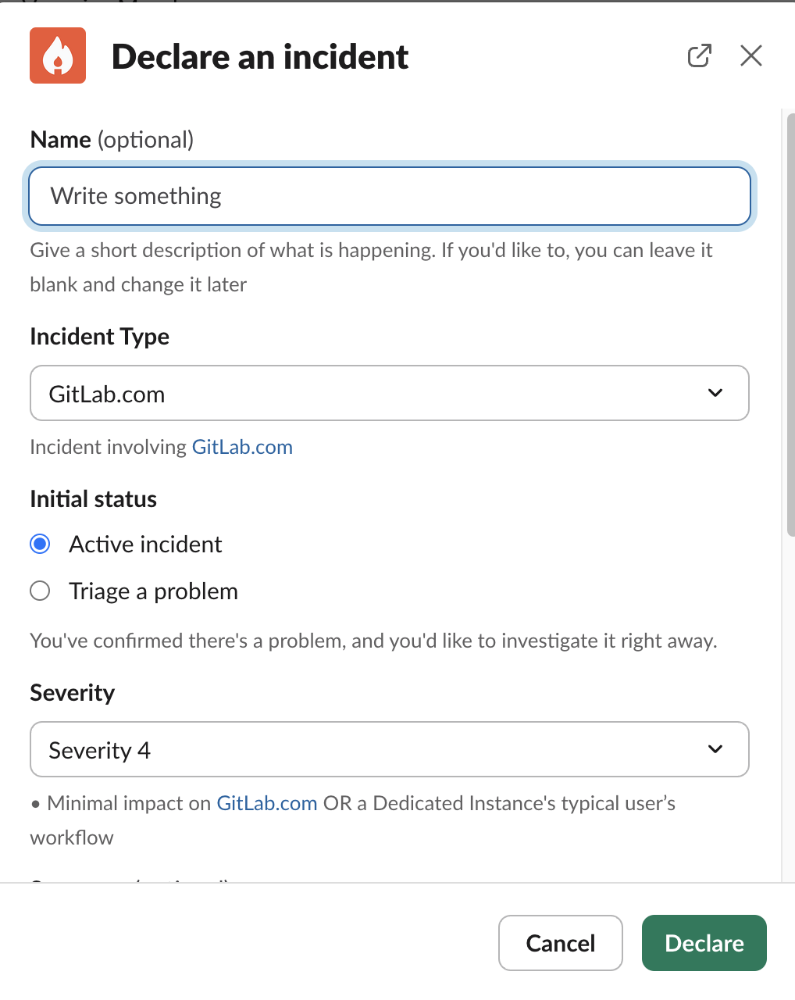
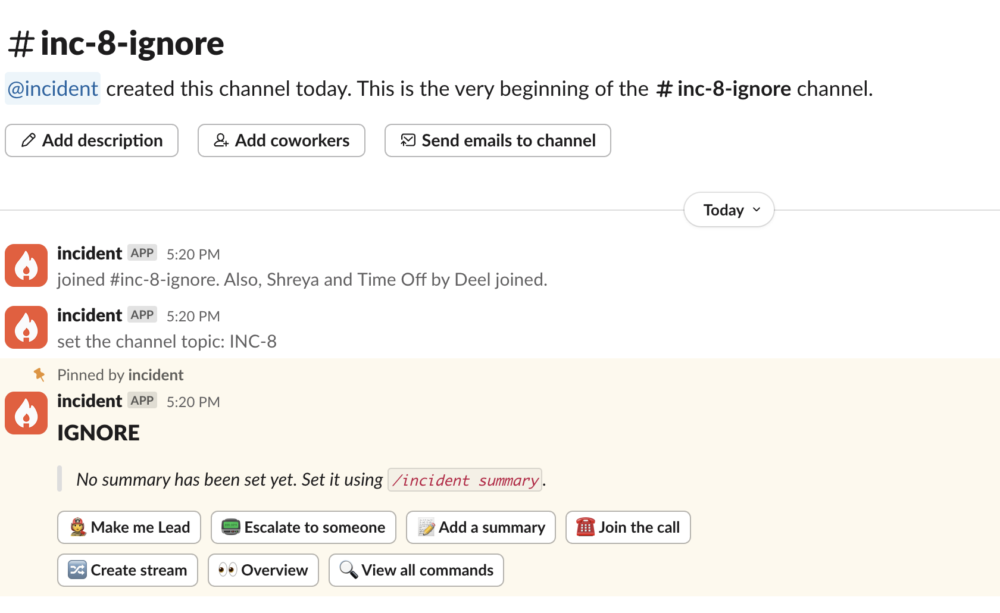
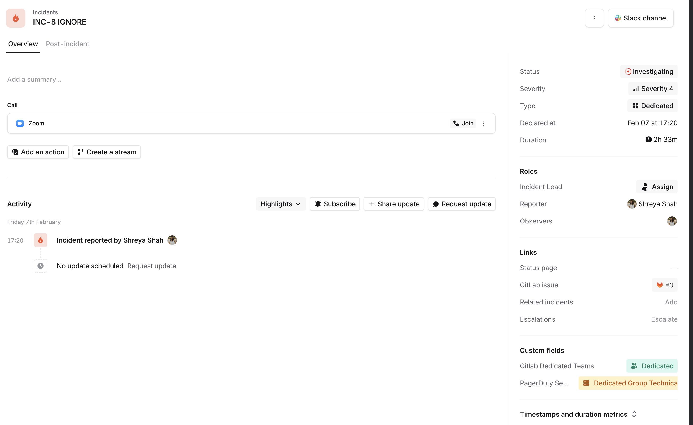
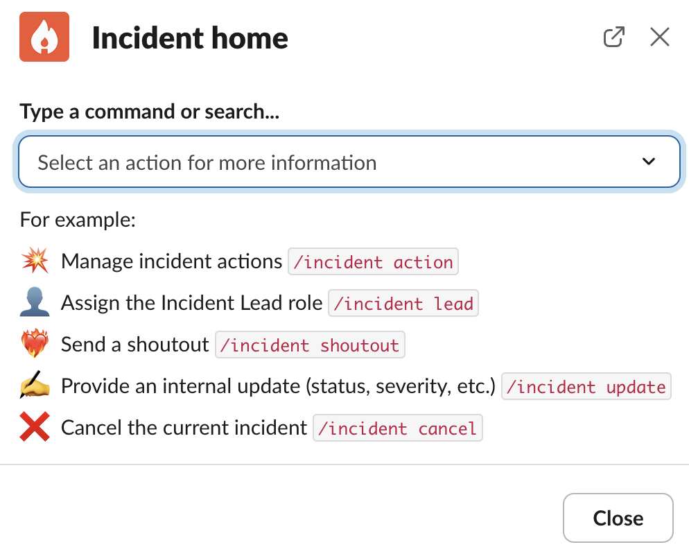

# GitLab Production Onboarding for Incident.io

This document highlights the basic onboarding steps to incident.io.

**Watch @ahanselka's walkthrough of incident.io [here](https://youtu.be/JeQu1UAxJE4).**

## Triage Incidents

- Triage incidents are automatically created in the `#incidents-dotcom-triage` Slack channel
- In order to accept or decline the incident, join the incident channel that has been created where you can "Accept" it, "Merge" it into another open incident, or "Decline" it if it is not a true incident.
- Once an incident is accepted, it will be announced as an incident to [`#incidents-dotcom`](https://gitlab.slack.com/archives/incidents-dotcom) and [`#incidents`](https://gitlab.slack.com/archives/incidents-dedicated).

## How to manually raise an incident

- Type the command `/incident declare`.
- This opens a popup to declare an incident.
- Give your incident a name and choose the incident type to be `Gitlab.com`.
- You can choose if you wish to block deployments/feature flags by selecting `yes` from the respective dropdown menu
- You can also choose to keep the issue confidential by selecting `Yes` from the dropdown menu

  
Click to expand image

  

## Creating a Retrospective Incident

Retrospective incidents allow you to back-date incidents in incident.io without triggering any alerts, Slack announcements, or paging. This is useful for documenting incidents that have already occurred.

### From Slack

- Type the command `/inc retro` in Slack.
- This opens a popup to declare a retrospective incident.
- Fill in the incident details as you normally would (name, severity, incident type, etc.).

### From the Dashboard

1. Navigate to the [incident.io dashboard](https://incident.io/) and click **Declare Incident**.
2. Select the **Retrospective incident** tab instead of **Active incident**.
3. Fill in the incident details as you normally would (name, severity, incident type, etc.).

### Default behavior

By default, the following options are set for retrospective incidents:

- **Announce this retrospective incident** → No
- **Enter post-incident flow** → No

This means:

- No Slack channel announcements are sent.
- No paging or alerting occurs for the EOC or anyone else.
- No automated workflows are triggered by default. (Our current workflows are configured to trigger on **Active** or **Triage** incidents only — verify this is still the case if you rely on it.)

You can still optionally enable announcements or post-incident flow when declaring the retrospective incident if needed.

## Navigating through an incident

- Once you create an incident, you will be redirected to the incident Slack channel.

  
Click to expand image

  

- Whenever you create an incident, a GitLab issue will be created [here](https://gitlab.com/gitlab-com/gl-infra/production/-/issues/?sort=created_date&state=opened&first_page_size=100), as well as a Zoom incident call.
- You can update the incident from Slack using the `/incident` command or via the incident dashboard. To go to the incident dashboard, click on `overview` and then `incident homepage`.

  
Click to expand image

  

- The dashboard provides a nice overview of the incident. To view the dashboard, you need to [log in](#login-to-the-incidentio-dashboard) to incident.io first.
- Incident.io provides a variety of commands to update the incident from Slack.

  
Click to expand image

  

- You can move to the incident Slack channel and start debugging.
- Periodically provide updates to folks following along on the incident by reacting to your slack message with a :mega: emoji. This will also update the public GitLab incident issue. Data that would be useful capturing for later analysis can be captured with a `:pushpin:` or `:star:` emoji. The `:pushpin:` will cause the message to be posted to the GitLab incident issue as a public comment, whereas the `:star:` will be posted as an internal comment. Images attached to the Slack message will not be posted to the GitLab issue. This is useful when trying to keep track of timestamps, as each pin activity is timestamped on the dashboard. You will need to view the Post-Incident tab or choose "All Activity" in the Overview tab to see pinned messages.
- Zoom calls started by incident.io will be automatically be summarized using [Scribe](https://incident.io/changelog/scribe). If you do not want Scribe on the call, you can remove it from the meeting or start a different zoom call. To remove scribe from the meeting, you will need to assume host controls. The host pin is listed both in 1password under `incidentio-svc@gitlab.com`, as well as at the top of the slack channel when an incident is active.
- Once the incident is mitigated or resolved, you can choose to have a Post-Incident workflow or attach follow-up items to be worked on related to the incident.

## Login to the incident.io dashboard

- Navigate to [incident.io](https://incident.io/).
- Click on Log in -> Sign-in with SAML SSO
- Congratulations, you are successfully logged in to the incident.io dashboard.

If you have issues logging in, please contact #it_help

## Future improvements

Follow our epic [Implement incident.io - Improvements](https://gitlab.com/groups/gitlab-com/gl-infra/-/epics/1489)
