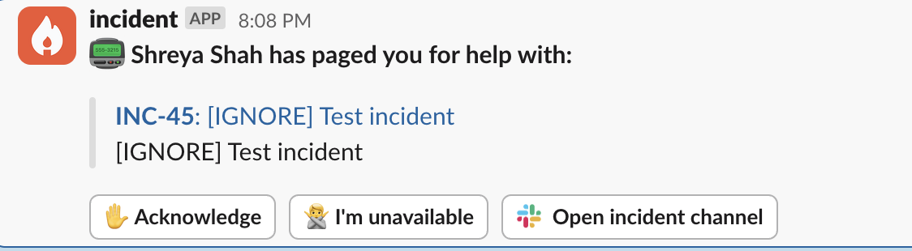
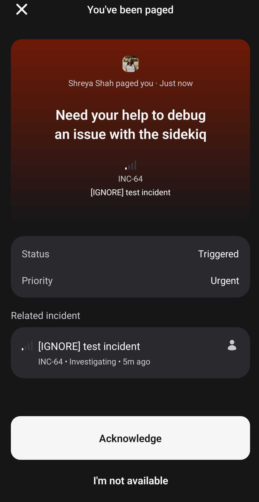
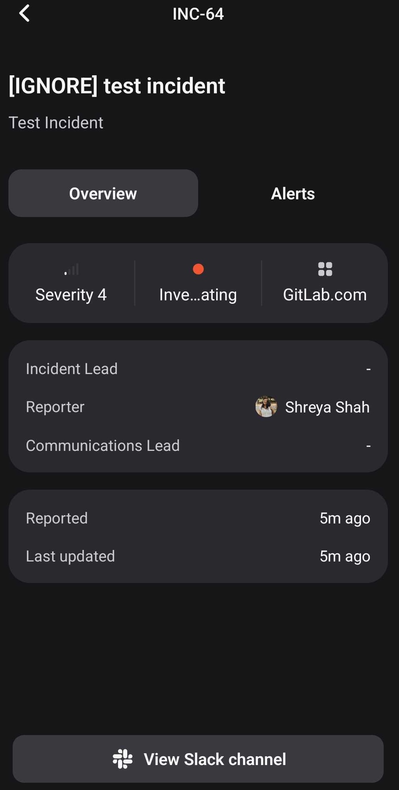
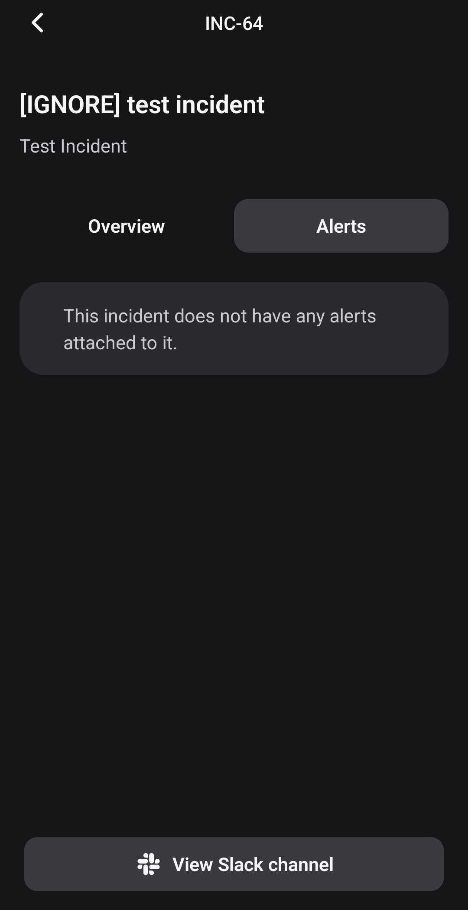
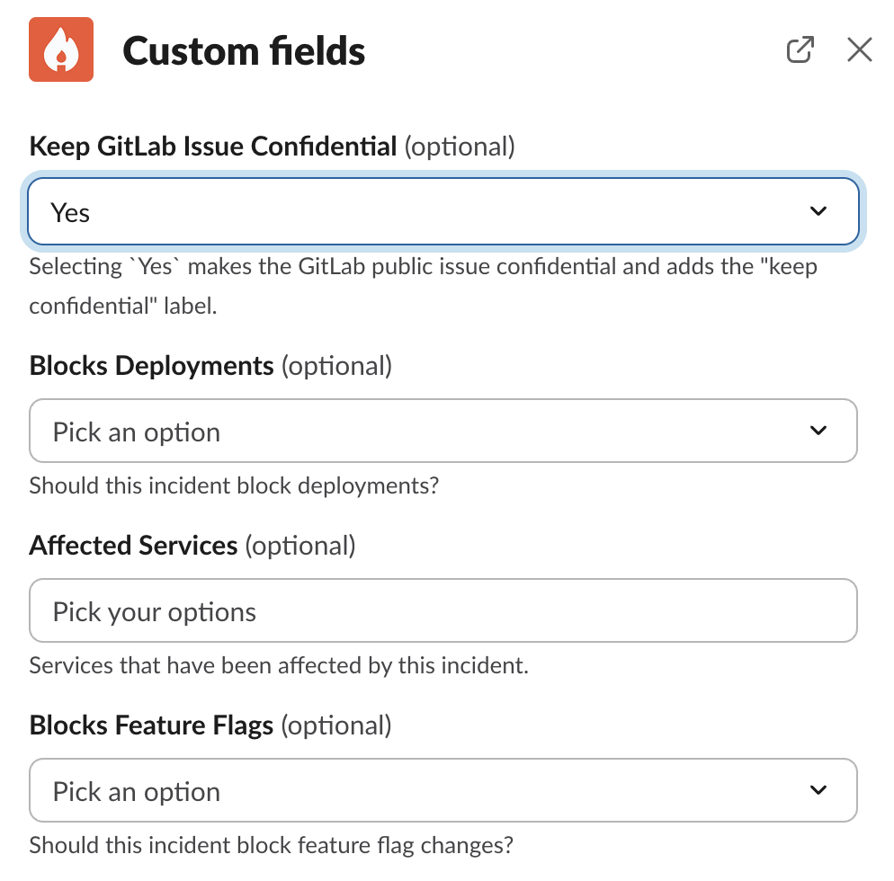
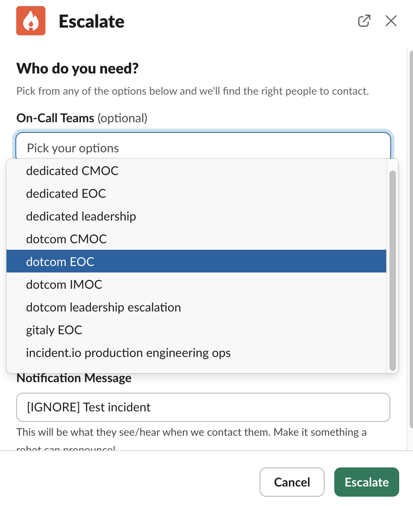
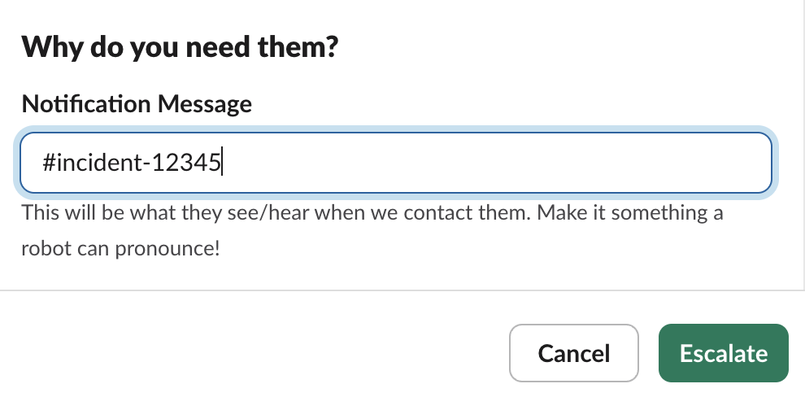
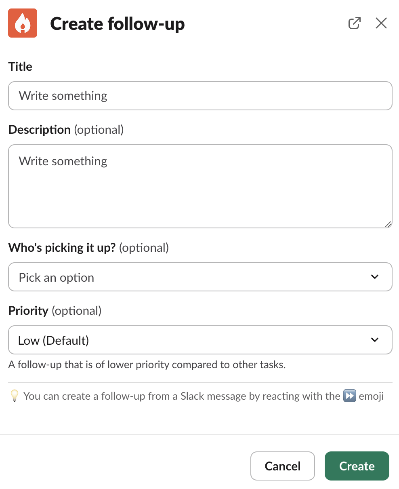
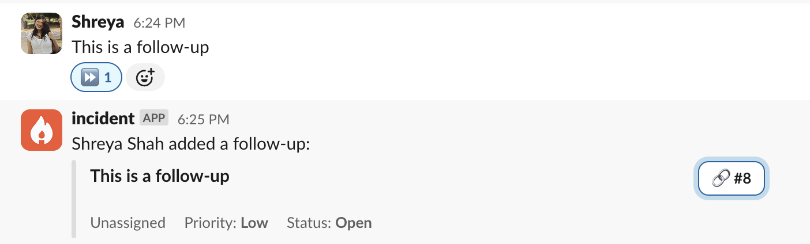
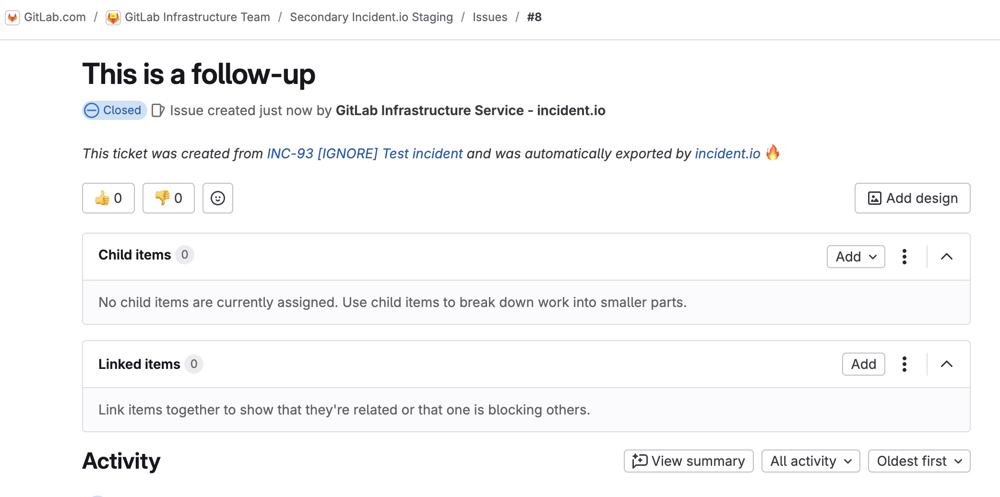

# On-Call

This document highlights the steps for responders on how to acknowledge incidents escalated via incident.io and for on-call engineers on how to escalate to teams via incident.io.

## Responder Quick Start guide

- <b>All [manual escalations](#manual-escalation) to the Infrastructure teams will now be via incident.io , if your team is still in an oncall rotation in PagerDuty , you will still be paged by PagerDuty for alerts please acknowledge the page in PagerDuty but all manual escalations to you/your team will be via incident.io oncall.</b>
- Please install the [incident.io app](https://help.incident.io/articles/3472064049-get-started-as-an-on-call-responder) on your mobile device for ease
  - Installing the app is recommended, but not required. Without the app, you will still be able to get paged via SMS and call.
  - Log in with SAML, which will use Okta.
  - To test that notifications work:
    1. Open incident.io via the Okta tile.
    1. Navigate to user preferences, which is in the :newtanuki: menu, top-left.
    1. In the `Contact methods` section, there is a bell icon next to each method that can be used to send a test notification.

> [!note]
> If you cannot install the app for any reason, you can configure Incident IO to Call/SMS your phone number. You may want to add the [Incident Contact Card](https://app.incident.io/api/mobile/responder_vcard) to override any do not disturb settings.

- Once you are paged via incident.io , you can acknowledge an incident either via the incident.io app , or through Slack , from there you can easily navigate to the incident slack channel

  

- See the following screenshots of the incident.app mobile app showing a page that has been received. To view the alerts, you can switch to the _Alerts_ tab.

  
  
  

- Once in the incident slack channel you can start troubleshooting the incident , join the incident zoom call and use the available commands for several actions.

### On-call alert handling process

This is something we are iterating on. The process is:

1. Acknowledge page within the response time ie: within 15 minutes , 10 minutes for Customer Emergency On-Call Rotation
1. Check if it's related to an active incident in the [Production project](https://gitlab.com/gitlab-com/gl-infra/production/-/issues/?sort=created_date&state=opened&first_page_size=100)
1. You can declare an incident by using the command `/incident declare`. All incidents will typically be announced in the `#incidents` channel. To only view announcements for incidents of type `Gitlab.com`, please navigate to `#incidents-dotcom`.
1. Declaring an incident will generate an incident Slack channel and Zoom call for you.
1. You can choose to **Block Deployments**, **Feature Flags**, or **Keep the issue confidential** by updating the respective custom field using the command `/incident field` from the incident Slack channel

   

1. An [incident management project](https://gitlab.com/gitlab-com/gl-infra/production) issue will be automatically created and linked to the incident.
   - See [How to raise an incident](incident-management.md#how-to-raise-an-incident) for detailed steps.
1. EOC is automatically assigned the incident lead for all S3 and S4 incidents , IMOC is automatically assigned lead for all S1 and S2 incidents , if you wish to change the incident lead for some reason , please use `/incident lead` command
1. Begin [working on the alert](#working-on-the-alert)

#### Working on the Alert

When working on an alert, you'll collaborate in the incident-specific Slack channel created by [incident.io](incident-management.md#navigating-through-an-incident). Use the incident's Slack channel for all investigation notes and updates. Key information can be pinned using the :pushpin: emoji, which will automatically be reflected in the incident.io dashboard and GitLab issue.

Important investigation details to document:

1. Screenshots and evidence: If any information is provided via screenshots, make sure to add a `Source` link to each screenshot. Make sure to use absolute time - and not `Last x hours` or `now-x hours`.
   1. In Grafana, click `Share` > `Copy` for the link; this will ensure the link is locked to the chosen time. **Note**: `Shorten URL` does not work.
   1. In Kibana, click `Share` > `Get Links` > Toggle `Short URL` > `Copy link`; this ensure the link works correctly and retains filters.
1. Use Zoom calls when needed for real-time collaboration, and utilize incident.io's Scribe feature to summarize call discussions directly in the incident channel.
1. Regular status updates can be posted using incident.io's update feature via the `/incident` command.

You can use `:boom:` emoji in Slack to assign an action related to the incident , Assigning an action does not create a Gitlab issue or MR.

As you work through an investigation, it is important to keep track of any ~"corrective actions"s (label: `~corrective action`) that need to be followed up on. Some strategies are to note these in the `Investigation Thread` or create a separate `Corrective Actions` thread to keep as reference. Once the Incident is over, the EOC should create Issues for the ~"corrective actions"s, as detailed in [Post-Incident Responsibilities](#post-incident-responsibilities).

## Manual Escalation

- These steps highlights the way to escalate to a team or individual , CMOC , IMOC during an incident.

- From the incident channel once you wish to escalate to a team / individual , use the command `/incident escalate` , this should trigger an escalation form pop-up

- Choose the oncall team you wish to escalate to from the drop-down menu / the individual you wish to escalate to , you can enter an optional notification message you would wish for the responder to see

- Page Security : for medium/high severity incidents, refer to how to engage the [SEOC](https://handbook.gitlab.com/handbook/security/security-operations/sirt/engaging-security-on-call/#engage-the-security-engineer-on-call). For lower severity incidents, refer to the [incident severity table](https://handbook.gitlab.com/handbook/security/security-operations/sirt/engaging-security-on-call/#incident-severity) to determine the right course of action

- Page Dev : by typing /devoncall incident-issue-url into #dev-escalation. Handbook

**_Note- When escalating from a woodhouse generated Slack channel please mention the incident slack channel in the Notification Message (( not recommended ))_**

### Incident Lifecycle

We manage incidents using [incident.io](incident-management.md). When an incident is created using `/incident create` in Slack, it automatically creates both a dedicated Slack channel and a GitLab issue. Lifecycles are defined [here](https://app.incident.io/gitlab/settings/lifecycle?tab=lifecycles). The incident has a few especially notable stages:

#### Active

Active incidents are managed through:

- The incident-specific Slack channel created by incident.io
- The automatically created GitLab issue in the [incident management project](https://gitlab.com/gitlab-com/gl-infra/gitlab-dedicated/incident-management/-/issues)
- The incident.io dashboard - see [Navigating through an incident](incident-management.md#navigating-through-an-incident)

[View currently active incidents](https://app.incident.io/gitlab/incidents?incident_type%5Bone_of%5D=01JK9KV07AV2WZKHYZD1GTK5KB).

#### Monitoring

An incident is considered in a `monitoring` status in the following scenarios :

1. The problem has been alleviated or addressed (at least temporarily) but may reoccur.
1. The problem is no longer active but we are still waiting for alerts to clear.

Update the incident status using the `/incident` command in the incident's Slack channel to reflect mitigation. This will update the status of the incident in incident.io. When the incident is resolved, you will separately need to close the incident issue.

[View currently mitigated incidents](https://app.incident.io/gitlab/incidents?incident_type%5Bone_of%5D=01JK9KV07AV2WZKHYZD1GTK5KB&status%5Bone_of%5D=01JH40E0GPQQZNK1DJHH2TCTEG)

#### Closed

The incident is resolved when it is fully addressed. Use incident.io's [Post-Incident workflow](https://help.incident.io/collections/7841117054-learning-from-incidents) to properly close out the incident, which may include [creating a post-incident review](https://help.incident.io/articles/8600719118-creating-postmortems-in-3-clicks). Incident reviews are typically performed for all S1 and S2 incidents or if an incident review is requested as per [GitLab's incident review process](https://handbook.gitlab.com/handbook/engineering/infrastructure-platforms/incident-review/#the-criteria-which-triggers-a-review).

[View currently resolved incidents](https://app.incident.io/gitlab/incidents?incident_type%5Bone_of%5D=01JK9KV07AV2WZKHYZD1GTK5KB&status%5Bone_of%5D=01JH40E0GPYDJ8B3AERA6RZSY8).

### Post-Incident Responsibilities

- Follow-ups are a way for your team to capture something that needs to be done after an incident is closed. These will come in all shapes and sizes, from an urgent task such as reverting a temporary workaround, to a low priority task such as investigating how to move to a new cloud provider. You are able to assign each follow-up a priority, to capture this level of importance within incident.io.

- Create follow-ups by using the command `/incident follow-up` , this opens up a form , fill in the required title and assign it to yourself or someone else as required

**_Note : Follow-ups create a Gitlab issue _**

- Alternatively you can also create a follow-up by reacting :fast_forward: to a message on Slack , this creates a Gitlab issue

  
  
