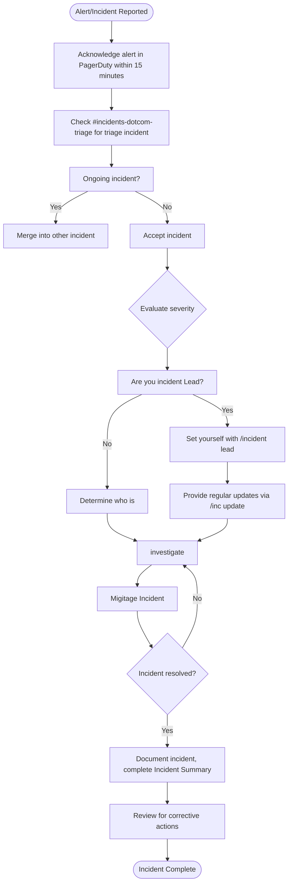

# Incident Workflow

Here are some quick reference diagrams for what each role should be doing during an incident.

## Engineer on Call (EOC)

## Incident Manager (IMOC)

## Communications Manager (CMOC)
