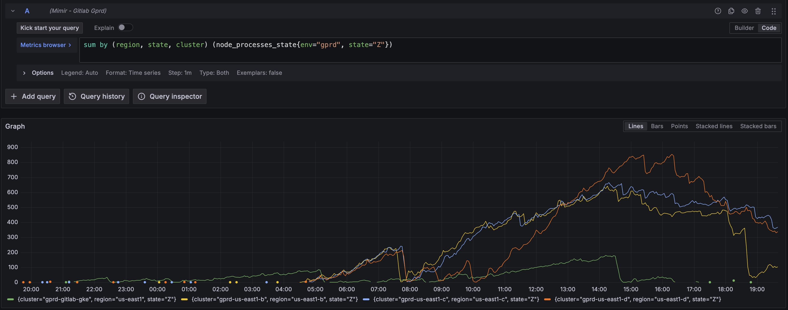

# KubernetesClusterZombieProcesses

## Overview

Zombie (or defunct) processes can occur on systems when a parent process spawns a child and fails to clean up the process after it finishes executing. When processes are regularly left in this state, it can lead to PID and file handle exhaustion, thread contention, and several other problematic states. It is usually the result of bugs in code that leave processes in this state.

If this alert is firing, we should check the graphs to determine when processes started being left in this state, if the start of leaking processes correlates to a recent deployment, we may consider rolling back the code. We may also want to locate the workload responsible for the leaking processes, and pre-emptively restart these pods to alleviate some of the symptoms associated with the state temporarily.

## Services

- This alert can apply to any workload running in Kubernetes.
- See the [## Troubleshooting] section for hints on locating the workloads that are contributing to zombie process creation.
- Refer to the [service catalog](https://gitlab.com/gitlab-com/runbooks/-/blob/master/services/service-catalog.yml?ref_type=heads) to locate the appropriate service owner once the workload is identified.

## Metrics

- Metric in [Grafana Explore](https://dashboards.gitlab.net/explore?schemaVersion=1&panes=%7B%227rg%22:%7B%22datasource%22:%22e58c2f51-20f8-4f4b-ad48-2968782ca7d6%22,%22queries%22:%5B%7B%22refId%22:%22A%22,%22expr%22:%22sum%28node_processes_state%7Bstate%3D%5C%22Z%5C%22%7D%29%20by%20%28cluster%29%22,%22range%22:true,%22instant%22:true,%22datasource%22:%7B%22type%22:%22prometheus%22,%22uid%22:%22e58c2f51-20f8-4f4b-ad48-2968782ca7d6%22%7D,%22editorMode%22:%22code%22,%22legendFormat%22:%22__auto%22%7D%5D,%22range%22:%7B%22from%22:%22now-6h%22,%22to%22:%22now%22%7D%7D%7D&orgId=1)
- Some zombie/defunct process churn is normal during day to day operations. The alert requires that the number of zombie processes be greater than 25 on a cluster for 15 minutes or longer before it will fire.
- We should use this metric to detect when these processes are being created but not removed automatically.
- An example of a problematic state:
    

## Alert Behavior

- This alert is intended to capture problems that exist across entire deployments in a given cluster, as opposed to individual workloads. Alerts are aggregated by cluster for this reason. Any created silence has the potential to mask additional new causes of the alert as long as it exists and should be done so for short durations, and with care.

## Severities

- This alert will capture symptomatic states of different issues and doesn't represent an **immediate** problem on it's own. Assigning a `S3` severity may be appropriate if no additional alerts are firing.
- There is a high likelihood that the cause of zombie/defunct processes being spawned will also result in Apdex violations that result in `S2` incidents, so this should not be ignored.

## Verification

- Refer to the metric in [Grafana Explore](https://dashboards.gitlab.net/explore?schemaVersion=1&panes=%7B%227rg%22:%7B%22datasource%22:%22e58c2f51-20f8-4f4b-ad48-2968782ca7d6%22,%22queries%22:%5B%7B%22refId%22:%22A%22,%22expr%22:%22sum%28node_processes_state%7Bstate%3D%5C%22Z%5C%22%7D%29%20by%20%28cluster%29%22,%22range%22:true,%22instant%22:true,%22datasource%22:%7B%22type%22:%22prometheus%22,%22uid%22:%22e58c2f51-20f8-4f4b-ad48-2968782ca7d6%22%7D,%22editorMode%22:%22code%22,%22legendFormat%22:%22__auto%22%7D%5D,%22range%22:%7B%22from%22:%22now-6h%22,%22to%22:%22now%22%7D%7D%7D&orgId=1) and verify that the zombie process counts are rising, and not simply the result of a spike that has subsided.

## Recent changes

- Look for recent deployments to the GPRD environment to determine if recent code changes have been deployed. A rollback may need to be considered if so.

## Troubleshooting

- Attempt to determine the workload that is responsible for spawning zombie/defunct processes.
  - Locate a node in the GCP cluster mentioned in the alert that has zombie processes. This can be done by removing the `sum()` aggregator.
  - From the process list (`ps -ef`), find any zombie processes as indicated by the `<defunct>` string.
  - Use the process name and paths identified to correlate back to the likely workload.
- **TODO:** We need to document a better way to identify the workload spawning these processes consistently. As of writing, I haven't found any running systems to create a succinct set of actions to take. The above are just suggestions.

## Possible Resolutions

- [A recent issue where zombie processes were related to the casue](https://gitlab.com/gitlab-com/gl-infra/production/-/issues/18591)

## Escalation

- Escalate to the team responsible for the service likely to be spawning the zombie processes.
- If unsure about the service resulting in the leaked PIDs, escalate to `#g_production_engineering`

## Definitions

- [Alert definition](https://gitlab.com/gitlab-com/runbooks/-/blob/master/mimir-rules/gitlab-gprd/kube/kubernetes.yml?ref_type=heads)
- [Link to edit this playbook](https://gitlab.com/gitlab-com/runbooks/-/blob/master/docs/kube/alerts/KubernetesClusterZombieProcesses.md)
- [Update the template used to format this playbook](https://gitlab.com/gitlab-com/runbooks/-/edit/master/docs/template-alert-playbook.md?ref_type=heads)

## Related Links

- > [Related alerts](https://gitlab.com/gitlab-com/runbooks/-/tree/master/docs/kube/alerts?ref_type=heads)
