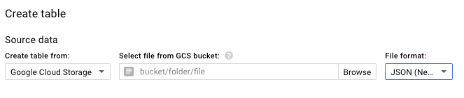
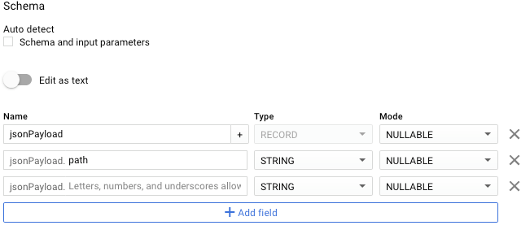
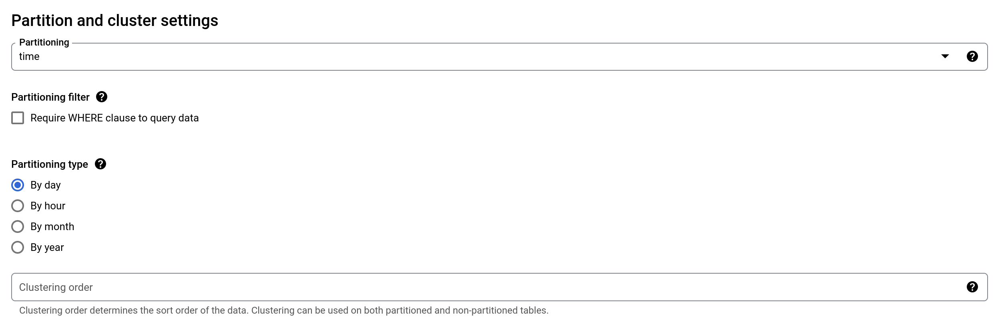

# Loading StackDriver(SD) Archives from Google Cloud Storage (GCS) into BiqQuery

## Summary

Currently searching older logs requires loading line-delimited archive JSON files stored in GCS into another tool; for this we can use Google's BigQuery(BQ).
In order to load a BQ table from a SD produced log archive stored in GCS a dataset must be defined, a table created and data imported through a job using a JSON schema.

### Why

- You need to query logs older than 7 days and thus are no longer in our [ELK](https://log.gprd.gitlab.net) instance.
- You need to query logs older than 30 days and thus are no longer in our SD.
- You need aggregate operators, summarized reports or output visualizations.

### What

Logs that come in to SD (see [logging.md](README.md)) are also sent
to the GCS bucket `gitlab-${env}-logging-archive` in batches using an export
sink. After 30 days, the log messages are expired in SD, but remain in GCS.

Additionally, because SD exports all Kubernetes container logs mixed
together into `stdout/` and `stderr/` folders, making it difficult to filter
per container name, [`vector-archiver`](https://gitlab.com/gitlab-com/gl-infra/argocd/apps/-/tree/main/services/vector-archiver)
exports to the same GCS bucket the logs sent to PubSub by
`fluentd-elasticsearch` into a separate folder per PubSub topic under the
folder `gke/`.

## How

### Using the UI

These instructions are similar in both the new style (within `console.cloud.google.com`)
and the old style (external page), but the screenshots may appear with
differing styles.

1. Create a dataset if necessary to group related tables.
1. Click on the dataset's `...` menu to "Create table".
1. Choose "Google Cloud Storage" with "JSONL (Newline delimited JSON)" as the `Source data`.
1. Using the browse functionality to find an appropriate bucket is not always
   an option, as only buckets in the same project are listed and data is
   usually imported from, for example, `gitlab-production` or
   `gitlab-internal`. Go to the ["Google Cloud Storage" browser](https://console.cloud.google.com/storage/browser/),
   browse the GCS bucket `gitlab-${env}-logging-archive` and locate the logs
   you want to query:

     - for GKE container logs, look under the `gke/` folder
     - for any other logs, look under the other folders

1. Insert the bucket path as follows: `bucket/folder/folder/myfile.json` for a
   single file or `bucket/folder/folder/*.json` for all files in that folder
   and its subfolders. When using hive partitioning with GKE container logs
   (see next step), add `dt=` to the prefix to filter out older path that don't
   match, for example `gitlab-gprd-logging-archive/gke/something/dt=*.json`.

   

1. The GKE container logs are stored in folders like `dt=YYYY-MM-DD` allowing
   the use of hive partitioning which greatly improves query performances. For
   this, enable `Source Data Partitioning` and set `Source URI Prefix` to the
   prefix of the path set above (everything before the wildcard) prefixed by
   `gs://` and followed by `{dt:DATE}` to set the partition type, for example
   `gs://gitlab-gprd-logging-archive/gke/something/{dt:DATE}`. Below this field,
   set `Partition Inference Mode` to "Provide my own".
1. In the destination section, set the desired table name.
1. When using hive partitioning with GKE container logs, consider setting
   `Table type` to "External table", this will allow BigQuery to load files
   dynamically as needed into a temporary table during queries, saving costs
   and time.
1. Unselect "Auto detect Schema and input parameters" if selected.
1. Use one of our [predifined schemas](https://gitlab.com/gitlab-com/runbooks/-/tree/master/docs/logging/logging_bigquery_schemas)
   or do it manually adding records for fields, using `RECORD` type for nested
   fields and adding subfields using the `+` on the parent record.  It should
   look something like this:

   

1. In `Advanced options`, check `Unknown values`
1. If the data to be imported is large, consider whether partioning will be necessary.
   In `Partitioning`, select the field on which to partition the data (a `TIMESTAMP`, typically).
   Only fields from the schema will be considered.

      

1. Create the table.  If everything is right, a background job will run to load
   the data into the new table. This usually takes a while, be patient or check
   the status of the created job under "Job History".

### Alternative: Starting from an existing schema

To save time and increase usability, the text version of a table schema can be
dumped with the `bq` command-line tool as follows:

```
  bq show --schema --format=prettyjson myproject:myhaproxy.haproxy > haproxy_schema.json
```

The result can be copied and pasted into BQ by selecting `Edit as text` when creating a table that relies on a similar schema.

Contribute changes or new schemas back to [logging_bigquery_schemas](./logging_bigquery_schemas).

### Accessing fields that can't be loaded due to invalid characters

BigQuery doesn't allow loading fields that contain dots in their names.
For instance, a field called `grpc.method` cannot be expressed in the
schema in a way that BigQuery will load it. To work around that, we can
do the following:

1. Load the JSON data as CSV into a table as a single column, giving a
   fake delimiter that doesn't appear anywhere in the JSON itself (here
   we choose ±):

    ```shell
    bq --project_id "$GCP_PROJECT" \
      load \
      --source_format=CSV \
      --field_delimiter "±" \
      --max_bad_records 100 \
      --replace \
      --ignore_unknown_values \
      ${WORKSPACE}.${TABLE_NAME}_pre \
      gs://gitlab-gprd-logging-archive/${DIRECTORY}/* \
      json:STRING
    ```

2. Transform that data and load into the desired table using
   [`JSON_EXTRACT`](https://cloud.google.com/bigquery/docs/reference/standard-sql/json_functions#json_extract):

    ```shell
    read -r -d '' query <<EOF || true
      CREATE OR REPLACE TABLE \`gitlab-production.${WORKSPACE}.${TABLE_NAME}\` AS
      SELECT
        PARSE_TIMESTAMP("%FT%H:%M:%E*SZ", JSON_EXTRACT_SCALAR(json, "$.timestamp")) as timestamp,
        JSON_EXTRACT_SCALAR(json, "$.jsonPayload['path']") as path,
        JSON_EXTRACT_SCALAR(json, "$.jsonPayload['ua']") as ua,
        JSON_EXTRACT_SCALAR(json, "$.jsonPayload['route']") as route,
        CAST(JSON_EXTRACT_SCALAR(json, "$.jsonPayload['status']") as INT64) as status
      FROM \`gitlab-production.${WORKSPACE}.${TABLE_NAME}_pre\`
    EOF

    bq --project_id "$GCP_PROJECT" query --nouse_legacy_sql "$query"
    ```

3. The table with the `_pre` suffix can now be deleted.

### Example Queries

The following sample queries can be run on tables created for logs coming from `gitlab-gprd-logging-archive/rails-application/*` and conforming to [the rails_application production schema](https://gitlab.com/gitlab-com/runbooks/blob/master/logging/logging_bigquery_schemas/rails_production_schema.json).

#### Find the most used Source-IP-Addresses for a User

```
select jsonPayload.remote_ip, count(jsonPayload.remote_ip) as count from dataset.table where jsonPayload.username='SomeUsername' group by jsonPayload.remote_ip
```

#### Find Actions by User and respective Paths Performed from a given IP-Address

```
select jsonPayload.action, jsonPayload.username, jsonPayload.path from dataset.table where jsonPayload.remote_ip='SomeIPAdress' and jsonPayload.username='SomeUsername'
```

#### Count the Number of Repositories a User has Archived and Downloaded

```
select count(jsonPayload.path) as count from dataset.table where jsonPayload.username like 'SomeUsername' and jsonPayload.action = 'archive'
```

## TODO

- It's probably possible to perform the above tasks with the `bq` command line.
