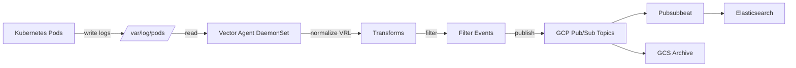

# Vector

- [Overview](#overview)
- [Vector Deployments](#vector-deployments)
- [Vector Agent](#vector-agent)
  - [Summary](#summary)
  - [Architecture](#architecture)
  - [Observability](#observability)
    - [Viewing vector-agent in ArgoCD](#viewing-vector-agent-in-argocd)
  - [Configuration Management](#configuration-management)
    - [Configuration Repositories](#configuration-repositories)
    - [ArgoCD Repository Layout](#argocd-repository-layout)
    - [Making Changes](#making-changes)
    - [How the Configuration Works](#how-the-configuration-works)
    - [Pipeline Template](#pipeline-template)
    - [Adding a New Pipeline](#adding-a-new-pipeline)
    - [Adding a Per-Pipeline Filter](#adding-a-per-pipeline-filter)
    - [Updating the Vector Agent DaemonSet](#updating-the-vector-agent-daemonset)
    - [Updating Chart Versions](#updating-chart-versions)
    - [Environment-Specific Overrides](#environment-specific-overrides)
  - [Troubleshooting](#troubleshooting)
    - [Using vector tap](#using-vector-tap-for-live-log-diagnosis)
    - [Diagnosing a Specific Pipeline](#diagnosing-a-specific-pipeline)

## Overview

[Vector](https://vector.dev/) is a high-performance, open-source observability data pipeline built in Rust by Datadog. It collects, transforms, and routes logs, metrics, and traces with a focus on correctness, performance, and operator ergonomics.

At Gitlab this is currently replacing our use of fluentd.

Vector is configured declaratively in YAML (or TOML/JSON) using a pipeline model of **sources** (where data comes from), **transforms** (how data is parsed, enriched, or filtered), and **sinks** (where data is sent).

For full documentation see <https://vector.dev/docs/>.

## Vector Deployments

We currently have the following Vector deployments:

| Deployment                          | Role              | Description                                                  |
| ----------------------------------- | ----------------- | ------------------------------------------------------------ |
| [vector-agent](#vector-agent)       | Agent (DaemonSet) | Kubernetes log collection, replacing `fluentd-elasticsearch` |
| vector-archiver                     | Archiver (Deploy) | Log archival to GCS, replacing `fluentd-archiver`            |

## Vector Agent

### Summary

Vector Agent is the Kubernetes log collection service that replaces the legacy `fluentd-elasticsearch` DaemonSet. It runs as a DaemonSet on every node, collecting pod logs from `/var/log/pods/` and shipping them to GCP Pub/Sub topics organized by service type.

The service is deployed via [ArgoCD](https://argocd.gitlab.net) in the `vector-agent` namespace using two Helm charts:

1. **`vector`** (from `https://helm.vector.dev`) -- the Vector binary, deployed as a DaemonSet
2. **`vector-config`** (from `registry.ops.gitlab.net/gitlab-com/gl-infra/charts`) -- generates the pipeline ConfigMap, to replicate the existing `fluentd-elasticsearch` logic.

### Architecture



### Observability

#### Dashboards

- [Argocd](https://argocd.gitlab.net/applications?showFavorites=false&proj=&sync=&autoSync=&health=&namespace=&cluster=&labels=app.kubernetes.io%252Fname%253Dvector-agent)
- [Grafana Logging Overview](https://dashboards.gitlab.net/goto/efe1ll4rq5blsc?orgId=1)
- [Grafana Vector Operational Insights](https://dashboards.gitlab.net/goto/efe1lnd641fcwc?orgId=1)

#### Viewing vector-agent in ArgoCD

1. Navigate to <https://argocd.gitlab.net>
2. In the search/filter bar, type `vector-agent`, or optionally label filter by `app.kubernetes.io/name=vector-agent`.
3. You will see one `vector-agent` Application per cluster where vector-agent is deployed.
4. Click on an application to view its sync status, health, and managed resources

### Configuration Management

#### Configuration repositories

- **ArgoCD app config**: <https://gitlab.com/gitlab-com/gl-infra/argocd/apps>
- **vector-config Helm chart**: <https://gitlab.com/gitlab-com/gl-infra/charts/-/tree/main/gitlab/vector-config>
- **Upstream Vector Helm chart**: <https://github.com/vectordotdev/helm-charts>

#### Argocd Repository layout

Configuration lives in the [ArgoCD apps repository](https://gitlab.com/gitlab-com/gl-infra/argocd/apps):

```
argocd/apps/services/vector-agent/
├── service.yaml            # ArgoCD ApplicationSet service definition
├── values.yaml             # Vector Helm chart values (DaemonSet config)
├── values-config.yaml      # Pipeline configuration (sources, transforms, sinks)
└── env/
    ├── gprd/
    │   ├── app.yaml            # Environment specifc chart versions, enabled/disabled
    │   └── values-config.yaml  # Environment specific values overrides
    ├── gstg/
    │   ├── app.yaml
    │   └── values-config.yaml
    ├── pre/
    │   └── app.yaml
    └── ops/
        └── app.yaml
```

#### Making changes

1. Edit the relevant files in `argocd/apps/services/vector-agent/`.
2. Open a merge request.
3. After merge, Argocd will trigger a sync of the application. You can check the sync status/health [via the UI](https://argocd.gitlab.net/applications?showFavorites=false&proj=&sync=&autoSync=&health=&namespace=&cluster=&labels=app.kubernetes.io%252Fname%253Dvector-agent).

For pipeline configuration changes (adding/modifying services), only `values-config.yaml` needs to be edited. The ConfigMap update triggers a live reload -- no pod restart required.

For DaemonSet changes (resources, volumes, tolerations), edit `values.yaml`. These changes require a pod rollout which happens during ArgoCD sync.

#### How the configuration works

The `vector-config` Helm chart generates a single **ConfigMap** named `vector-config` containing a `vector.yaml` file. The Vector agent watches this ConfigMap for changes via `VECTOR_WATCH_CONFIG=true`, enabling **live configuration reloading** without pod restarts.

The configuration is built from two concepts:

1. **Pipeline Templates** (`pipelineTemplates`): Reusable definitions of sources, transforms, and sinks. These define the common log collection pattern.
2. **Pipeline Configs** (`pipelineConfigs`): Concrete instances that reference a template and provide service-specific values (log paths, Pub/Sub topics, filters).

#### Pipeline template

The default template named `kubernetes` defines a three-stage pipeline:

| Stage             | Component Type     | Purpose                                                                                           |
| ----------------- | ------------------ | ------------------------------------------------------------------------------------------------- |
| `kubernetes_logs` | Source             | Reads pod logs from `/var/log/pods/`                                                              |
| `normalize`       | Transform (VRL)    | Parses log messages (syslog, nginx, JSON), extracts timestamps, enriches with Kubernetes metadata |
| `filter_events`   | Transform (filter) | Per-pipeline configurable filter for dropping unwanted events                                     |
| `pubsub`          | Sink               | Sends events to a GCP Pub/Sub topic with JSON encoding                                            |

#### Adding a new pipeline

To collect logs for a new service, add an entry to `pipelineConfigs` in `values-config.yaml`:

```yaml
pipelineConfigs:
  my-new-service:
    template: kubernetes
    pubsub_topic: "pubsub-my-new-service-inf-{{ .Values._clusterEnvironment }}"
    paths_include:
      - /var/log/pods/my-namespace_my-service-*_*/*/*.log
```

Key fields:

| Field            | Required | Description                                                          |
| ---------------- | -------- | -------------------------------------------------------------------- |
| `template`       | Yes      | Name of the pipeline template to use (typically `kubernetes`)        |
| `paths_include`  | Yes      | Glob patterns for log files to collect                               |
| `paths_exclude`  | No       | Glob patterns for log files to exclude                               |
| `pubsub_topic`   | No       | Pub/Sub topic name (defaults to `pubsub-<name>-inf-<env>`)           |
| `filter`         | No       | VRL expression for filtering events (defaults to `true` / allow all) |
| `custom_records` | No       | Map of additional fields to add to every log event                   |

**Path format for Kubernetes pods:**

```
/var/log/pods/<namespace>_<pod_name>_<pod_uid>/<container_name>/<n>.log
```

This differs from the old fluentd format which used `/var/log/containers/`.

#### Adding a per-pipeline filter

Use the `filter` field with a VRL expression that returns a boolean:

```yaml
pipelineConfigs:
  pulp:
    template: kubernetes
    pubsub_topic: "pubsub-pulp-inf-{{ .Values._clusterEnvironment }}"
    paths_include:
      - /var/log/pods/pulp_*_*/*/*.log
    filter: |
      !match_any(.subcomponent, [r'^metrics$', r'^request_log$']) ?? true
```

#### Updating the Vector Agent DaemonSet

Changes to the DaemonSet itself (resources, tolerations, volumes, ports) go in `values.yaml`. These are values passed to the upstream [Vector Helm chart](https://vector.dev/docs/setup/installation/package-managers/helm/).

Key settings:

```yaml
role: "Agent"                          # DaemonSet mode
existingConfigMaps: ["vector-config"]  # External config from vector-config chart
env:
  - name: VECTOR_WATCH_CONFIG
    value: "true"                      # Hot-reload on ConfigMap changes
resources:
  requests:
    cpu: 150m
    memory: 1024Mi
  limits:
    cpu: 300m
    memory: 2048Mi
```

#### Updating chart versions

1. Update the version in the relevant `env/<environment>/app.yaml`
2. Open a merge request
3. After merge, sync the application in ArgoCD

#### Environment-specific overrides

The value file hierarchy (evaluated in order, later files override earlier ones):

1. `values-config.yaml` -- base configuration for all environments
2. `env/<environment>/values-config.yaml` -- environment-specific overrides
3. `env/<environment>/clusters/<cluster-name>/values-config.yaml` -- cluster-specific overrides

### Troubleshooting

#### Using `vector tap` for live log diagnosis

`vector tap` is a powerful debugging tool that lets you observe events flowing through any component in the pipeline in real time. It connects to the Vector API and streams matching events to your terminal.

##### Prerequisites

- The Vector API must be enabled (it is, on `127.0.0.1:8686`)
- You need `kubectl exec` access to a vector-agent pod

##### Tapping a specific component

To observe events flowing through a specific source, transform:

```bash
kubectl -n vector-agent exec -it <pod-name> -- vector tap 'rails_normalize'

kubectl -n vector-agent exec -it <pod-name> -- vector tap 'rails_pubsub'
```

** Note: `taps` view the logs post stage processing, and as such you can not tap a sink (output), as the logs are forwarded at this point.

##### Using glob patterns

You can use glob patterns to tap multiple components at once:

```bash
kubectl -n vector-agent exec -it <pod-name> -- vector tap 'sidekiq*_kubernetes_logs'
```

##### Filtering tap output

Combine `vector tap` with `grep` or `jq` to filter output:

```bash
kubectl -n vector-agent exec -it <pod-name> -- vector tap 'rails_normalize' | grep 'correlation_id'

kubectl -n vector-agent exec -it <pod-name> -- vector tap 'rails_normalize' --format json 2>/dev/null | jq '.'

kubectl -n vector-agent exec -it <pod-name> -- vector tap 'rails_normalize' --format json 2>/dev/null | jq 'select(.severity == "ERROR")'
```

##### Limiting tap output

```bash
kubectl -n vector-agent exec -it <pod-name> -- vector tap 'rails_normalize' --limit 10

kubectl -n vector-agent exec -it <pod-name> -- vector tap 'rails_normalize' --format json

kubectl -n vector-agent exec -it <pod-name> -- vector tap 'rails_normalize' --format yaml
```

##### Diagnosing a specific pipeline

A common debugging workflow:

1. **Check the source is receiving events:**

    ```bash
    kubectl -n vector-agent exec -it <pod-name> -- vector tap '<pipeline>_kubernetes_logs' --limit 5
    ```

    If no events appear, the log path pattern may be wrong or no pods are producing logs matching the glob.

2. **Check the normalize transform is parsing correctly:**

    ```bash
    kubectl -n vector-agent exec -it <pod-name> -- vector tap '<pipeline>_normalize' --limit 5 --format json 2>/dev/null | jq '.'
    ```

    Check the format post normalize looks correct. We attempted to parse common log types (syslog, nginx, JSON), but always return the log body untouched if parsing fails.

3. **Check the filter is not dropping all events:**

    ```bash
    kubectl -n vector-agent exec -it <pod-name> -- vector tap '<pipeline>_normalize' --limit 100 2>/dev/null | wc -l
    kubectl -n vector-agent exec -it <pod-name> -- vector tap '<pipeline>_filter_events' --limit 100 2>/dev/null | wc -l
    ```
