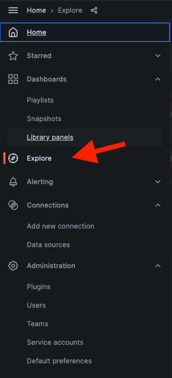
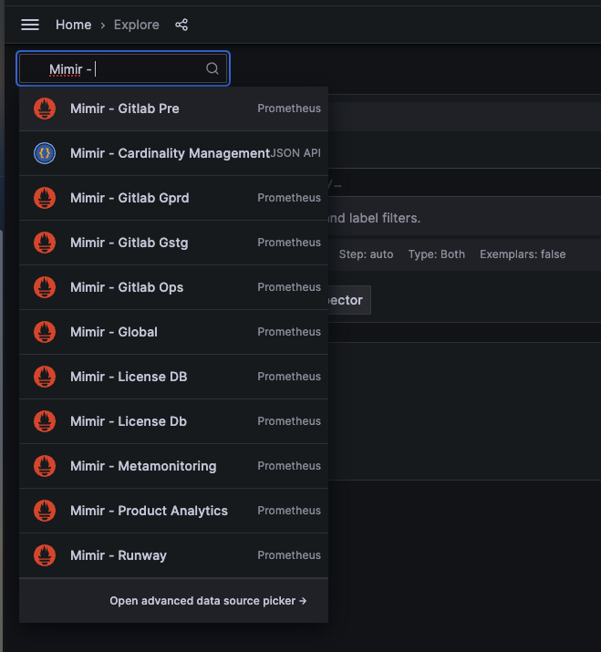

# Mimir Onboarding

Mimir is a multi-tenanted system.

This helps us to create soft boundaries by tenant and introduces a few key benefits:

- Improved visibility into metric ownership
- Query boundaries and isolated workloads via [shuffle sharding](https://grafana.com/docs/mimir/latest/configure/configure-shuffle-sharding/#about-shuffle-sharding)
- Per tenant limits and cardinality management
- Reduced failure domains in the event of a [query of death](https://grafana.com/docs/mimir/latest/configure/configure-shuffle-sharding/#the-impact-of-a-query-of-death)

## Endpoints

| Region | Endpoint | Internal Endpoint |
| ------ | -------- | ----------------- |
| us-east1 | mimir.ops-gitlab-gke.us-east1.gitlab-ops.gke.gitlab.net | mimir-internal.ops-gitlab-gke.us-east1.gitlab-ops.gke.gitlab.net |

## Data Retention

By default Mimir keeps all data for 1 year. This is configurable per tenant through [tenant limits configuration](#checking-tenant-limits).

## Historical Data

Historical data from Thanos is still available by the Thanos datasource in Grafana `Thanos - Historical Data`. Due to the limited use cases we have availalbe currently, and the risks around important the data in to Mimir we have opted to just keep this accessible through Thanos for now.

At a later date we will offline this completely by the data will still be able to be onlined in a need arises.

## Creating a tenant

Tenants are provisioned through [config-mgmt](https://ops.gitlab.net/gitlab-com/gl-infra/config-mgmt/-/tree/main/environments/observability-tenants).

Check the [README](https://ops.gitlab.net/gitlab-com/gl-infra/config-mgmt/-/tree/main/environments/observability-tenants#create-tenant) for creating a new tenant.

This helps us to centralise tenants across future observability backends, as well as provide a way to review limit increases or changes.

## Checking Tenant Limits

The [Mimir - Tenants](https://dashboards.gitlab.net/d/35fa247ce651ba189debf33d7ae41611/mimir-tenants?orgId=1) dashboard will show you tenant specific data, as well as active series and how close you are to limits.

Additionally, there is a [Mimir - Overrides](https://dashboards.gitlab.net/d/1e2c358600ac53f09faea133f811b5bb/mimir-overrides?orgId=1) dashboard which shows all of the configured default limits and any overrides applied to a given tenant.

Bumping tenant limits is also done through `config-mgmt` and you can see an example [here](https://ops.gitlab.net/gitlab-com/gl-infra/config-mgmt/-/blob/7a6669d31a8e17b833004f1d0e7b621f9c64e2de/environments/observability-tenants/tenants/gitlab-gprd.yaml#L5) as well as an [example MR](https://ops.gitlab.net/gitlab-com/gl-infra/config-mgmt/-/merge_requests/7737).

A full list of tenant overrides is documented [here](https://grafana.com/docs/mimir/latest/references/configuration-parameters/#limits).

The primary limits tenants will face are:

- `ingestion_rate` - Allowed samples per second
- `max_global_series_per_user` -  Maximum in-memory series allowed in an ingester
- `max_label_names_per_series` - Maximum label names per sent series

## Accessing metrics through the Mimir API

Mimir provides an HTTP endpoint which exposes a [Prometheus query API](https://prometheus.io/docs/prometheus/latest/querying/api/).

In order to access the API programmatically, the following steps are necessary:

1. Specify a tenant scope through `X-Scope-OrgID` header. For example use `X-ScopeOrgID: gitlab-gprd` for production metrics.
2. Use HTTP basic auth to authenticate, see vault [`k8s/shared/observability/tenants/runbooks`](https://vault.gitlab.net/ui/vault/secrets/k8s/kv/shared%2Fobservability%2Ftenants%2Frunbooks/details) for secrets.
3. The API is exposed through `https://mimir-internal.ops.gke.gitlab.net/prometheus`, which is also available through port-forwarding.

For team members without cluster-level network access, consider using below socks-proxy based solution:

```
ssh -D "18202" "lb-bastion.gstg.gitlab.com" 'echo "Connected! Press Enter to disconnect."; read disconnect' >&2
```

Full example with authentication and using above proxy:

```
username=$(vault kv get -field=username -mount="k8s" "shared/observability/tenants/runbooks")
password=$(vault kv get -field=password -mount="k8s" "shared/observability/tenants/runbooks")

curl \
  -x socks5://localhost:18202 \
  --user ${username}:${password} \
  -H "X-Scope-OrgID: gitlab-gstg" \
  https://mimir-internal.ops.gke.gitlab.net/prometheus/api/v1/query\?query\=up
```

Please exercise caution when specifying more than one tenant in `X-Scope-OrgID: tenant1|tenant2|...`.
This drastically increases the data scope for a given query and hence the load on the system.

## Sending Metrics To Mimir

After you have set up the tenant (or use an existing), you can setup your prometheus client to remote-write metrics
Prometheus configuration is done via the [remote_write config](https://prometheus.io/docs/prometheus/latest/configuration/configuration/#remote_write).

The following example uses the [prometheus-operator](https://github.com/prometheus-operator/prometheus-operator) in kubernetes:

```yaml
remoteWrite:
  - url: <replace_with_mimir_endpoint>
    name: mimir
    basicAuth:
      username:
        name: remote-write-auth
        key: username
      password:
        name: remote-write-auth
        key: password
```

Unfortunately prometheus doesn't support ENV var substitution in the config file, however if using via prometheus-operator it does support a Kubernetes secret reference.
In the above example we point the auth to a secret named `remote-write-auth` and the corresponding object keys for both `username` and `password`.

Here is an [example config](https://gitlab.com/gitlab-com/gl-infra/k8s-workloads/gitlab-helmfiles/-/blob/7fc52a69894df7e4f635e976668ecb19c962b570/releases/30-gitlab-monitoring/values-instances/ops-gitlab-rw.yaml.gotmpl#L16)

Note that the current usage of htpasswd/basicAuth will be replaced in a future iteration.

For the `url` setting see the [endpoints list](#endpoints).

## Exploring Metrics

Unlike Thanos, Mimir does not have a query UI. Instead it relies on Grafana as its UI for querying.

Within Grafana you can use the [Explore UI](https://dashboards.gitlab.net/explore) to run queries.

Select the explore menu item from grafana:



Ensure you have selected the correct datasource for your tenant:



Query away.

For more information on using the explore UI, you can reference the [Grafana official docs](https://grafana.com/docs/grafana/latest/explore/).

## VM Metrics Ingestion

Mimir uses a different method to scrape virtual machines than Thanos did.  It no longer depends on chef relabelling and instead scrapes VMs based on two GCP labels:  gitlab_com_service and gitlab_com_type.  The service labels is used to scrape for specific services (as an example, all postgres running hosts have the service label postgres).  The type label is passed through to the metrics and will be the type label on the metrics themselves.

These labels should be set in [config-mgmt](https://gitlab.com/gitlab-com/gl-infra/config-mgmt) as part of the Terraform configuration.  An example MR that set these is [https://ops.gitlab.net/gitlab-com/gl-infra/config-mgmt/-/merge_requests/7714](https://ops.gitlab.net/gitlab-com/gl-infra/config-mgmt/-/merge_requests/7714)

These labels are set either in variables or in the terraform configuration directly.

The label scrape configs are managed via `scrapeConfig` CRD objects as part of the [GitLab Helmfiles](https://gitlab.com/gitlab-com/gl-infra/k8s-workloads/gitlab-helmfiles/-/tree/master/releases/prometheus-scrape-configs?ref_type=heads) and are not yet self-service.  To add a new service, please open an issue in the [Scalability issue tracker](https://gitlab.com/gitlab-com/gl-infra/scalability/-/issues/).
