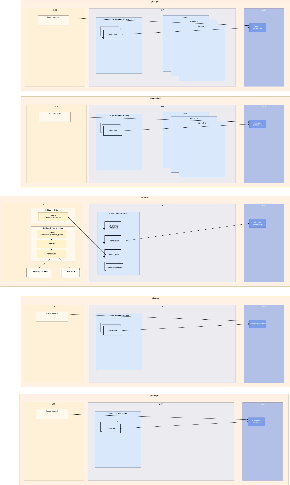

<!-- MARKER: do not edit this section directly. Edit services/service-catalog.yml then run scripts/generate-docs -->

# Monitoring Service

* [Service Overview](https://dashboards.gitlab.net/d/monitoring-main/monitoring-overview)
* **Alerts**: <https://alerts.gitlab.net/#/alerts?filter=%7Btype%3D%22monitoring%22%2C%20tier%3D%22inf%22%7D>
* **Label**: gitlab-com/gl-infra/production~"Service::Prometheus"

## Logging

* [system](https://log.gprd.gitlab.net/goto/3a0b51d10d33c9558765e97640acb325)
* [monitoring](https://log.gprd.gitlab.net/goto/09f7c84d5f36e3df0d03382dc350cddf)

<!-- END_MARKER -->

## Introduction

This document describes the monitoring stack used by gitlab.com. "Monitoring
stack" here implies "metrics stack", concerning relatively low-cardinality,
relatively cheap to store metrics that are our primary source of alerting
criteria, and the first port of call for answering "known unknowns" about our
production systems. Events, logs, and traces are out of scope.

We assume some basic familiarity with the [Prometheus](https://prometheus.io/)
monitoring system, and the [Mimir](https://grafana.com/docs/mimir/latest/) project, and encourage
you to learn these basics before continuing.

The rest of this document aims to act as a high-level summary of how we use
Prometheus and its ecosystem, but without actually referencing how this
configuration is deployed. For example, we'll describe the job sharding and
service discovery configuration we use without actually pointing to the
configuration management code that puts it into place. Hopefully this allows
those onboarding to understand what's happening without coupling the document to
implementation details.

## Backlog

| Service | Description | Backlog |
|---------|------------|---------|
| ~"Service::Prometheus" | The multiple prometheus servers that we run. | [gl-infra/infrastructure](https://gitlab.com/gitlab-com/gl-infra/scalability/-/issues?scope=all&state=opened&label_name[]=Service%3A%3APrometheus) |
| ~"Service::Mimir" | Anything related to [Mimir](https://grafana.com/docs/mimir/latest/). | [gl-infra/infrastructure](https://gitlab.com/gitlab-com/gl-infra/scalability/-/issues?scope=all&state=opened&label_name[]=Service%3A%3AMimir) |
| ~"Service::Grafana" | Anything related to <https://dashboards.gitlab.net/> | [gl-infra/infrastructure](https://gitlab.com/gitlab-com/gl-infra/scalability/-/issues?scope=all&state=opened&label_name[]=Service%3A%3AGrafana) |
| ~"Service::AlertManager" | Anything related to AlertManager | [gl-infra/infrastructure](https://gitlab.com/gitlab-com/gl-infra/scalability/-/issues?scope=all&state=opened&label_name[]=Service%3A%3AAlertManager) |
| ~"Service::Monitoring-Other" | The service we provide to engineers, this covers metrics, labels and anything else that doesn't belong in the services above. | [gl-infra/infrastructure](https://gitlab.com/gitlab-com/gl-infra/scalability/-/issues?scope=all&state=opened&label_name[]=Service%3A%3AMonitoring-Other) |

Some of the issues in the backlog also belong in epics part of the
[Observability Work Queue
Epic](https://gitlab.com/groups/gitlab-com/gl-infra/-/epics/1444) to group
issues around a large project that needs to be addressed.

## Querying

Querying is done via [grafana](https://dashboards.gitlab.net/explore).

## Dashboards

Grafana dashboards on [dashboards.gitlab.net](https://dashboards.gitlab.net) are managed in 3 ways:

1. By hand, editing directly using the Grafana UI
1. Uploaded from <https://gitlab.com/gitlab-com/runbooks/tree/master/dashboards>, either:
   1. json - literally exported from grafana by hand, and added to that repo
   1. jsonnet - JSON generated using jsonnet/grafonnet; see <https://gitlab.com/gitlab-com/runbooks/blob/master/dashboards/README.md>

## Instrumentation

We pull metrics using various Prometheus servers from Prometheus-compatible
endpoints called "Prometheus exporters". Where direct instrumentation is not
included in a 3rd-party program, as is [the case with
pgbouncer](https://github.com/prometheus-community/pgbouncer_exporter), we
deploy/write adapters in order to be able to ingest metrics into Prometheus.

Probably the most important exporter in our stack is the one in our own
application. GitLab-the-app serves Prometheus metrics on a different TCP port to
that on which it serves the application, a not-uncommon pattern among
directly-instrumented applications.

## Metrics

Without trying to reproduce the excellent Prometheus docs, it is worth briefly
covering the "Prometheus way" of metric names and labels.

A Prometheus metric consists of a name, labels (a set of key-value pairs), and a
floating point value. Prometheus periodically scrapes its configured targets,
ingesting metrics returned by the exporter into its time-series database (TSDB),
stamping them with the current time (unless the metrics are timestamped at
source, a rare use-case). Some examples:

```
http_requests_total{status="200", route="/users/:user_id", method="GET"} 402
http_requests_total{status="404", route="UNKNOWN", method="POST"} 66
memory_in_use_bytes{} 10204000
```

Note the lack of "external" context on each metric. Application authors can add
intuitive instrumentation without worrying about having to relay environmental
context such as which server group it is running in, or whether it's production
or not. Context can be added to metrics in a few places in its lifecycle:

1. At scrape time, by relabeling in Prometheus service discovery configurations.
   1. Kubernetes / GCE labels can be functionally mapped to metric labels using
      custom rules.
   1. Static labels can be applied per scrape-job.
   1. e.g. `{type="gitaly", stage="main", shard="default"}`
   1. We tend to apply our [standard labels](https://gitlab-com.gitlab.io/gl-infra/gitlab-com-engineering/observability/prometheus/label_taxonomy.html#standard-labels)
      at this level.
   1. This adds "external context" to metrics. Hostnames, service types, shards,
      stages, etc.
1. If the metric is the result of a rule (whether recording or alerting), by
   static labels on that rule definition.
   1. e.g. for an alert: `{severity="S1"}`.
1. Static "external labels", applied at the prometheus server level.
   1. e.g. `{env="gprd", monitor="db"}`
   1. These are added by prometheus when a metric is part of an alerting rule,
      and sent to alertmanager, but are not stored in the TSDB and cannot be
      queried.
         * Note that these external labels are additional to the rule-level
           labels that might have already been defined - see point above.
         * There was an open issue on prometheus to change this, but I can't
           find it.
   1. These are also applied to series leaving prometheus via remote-write.
   1. Information about which environment an alert originates from can be useful
      for routing alerts: e.g. PagerDuty for production, Slack for
      non-production.

## Scrape jobs

### Service discovery and labels

"Jobs" in Prometheus terminology are instructions to pull ("scrape") metrics
from a set of exporter endpoints. Typically, our GCE Prometheus nodes typically
only monitor jobs that are themselves deployed via Chef to VMs, using static
file service discovery, with the endpoints for each job and their labels
populated by Chef from our Chef inventory.

Our GKE Prometheus nodes typically only monitor jobs deployed to Kubernetes, and
as such use Kubernetes service discovery to build lists of endpoints and map
pod/service labels to Prometheus labels.

#### A note about GitLab CI

GitLab CI jobs run in their own Google Project. This is not peered with our ops
VPC, as a layer of isolation of the arbitrary, untrusted jobs from any
gitlab.com project, from our own infrastructure. There are Prometheus instances
in that project that collect metrics, which have public IPs that only accept
traffic from our gprd Prometheus instances, which federation-scrape metrics from
it. The CI Prometheus instances are therefore not integrated with Alertmanager directly.

CI is undergoing somewhat of an overhaul, so this may well change fast.

## Alerting

### Prometheus rules

We deploy the same set of rules (of both the alerting and recording variety) to
all Prometheus instances. An advantage of this approach is that we get
prod/nonprod parity almost for free, by evaluating the same (alerting) rules and
relying on external labels to distinguish different environments in
Alertmanager's routing tree.

We exploit the fact that rule evaluation on null data is cheap and not an error:
e.g. evaluating rules pertaining to postgresql metrics on non-DB shards still
works, but emits no metrics.

Rules are uploaded to all Prometheus shards from
[here](https://gitlab.com/gitlab-com/runbooks/-/tree/master/legacy-prometheus-rules). This in turn
comes from 2 places:

1. Handwritten rules, in the various files.
1. "Generic" rules, oriented around the [4 golden signals](https://sre.google/sre-book/monitoring-distributed-systems/#xref_monitoring_golden-signals),
   generated from jsonnet by the [metrics-catalog](https://gitlab.com/gitlab-com/runbooks/-/tree/master/metrics-catalog).
      * The metrics catalog is a big topic, please read its own docs linked
        above.

In Chef-managed Prometheus instances, the rules directory is periodically pulled
down by chef-client, and Prometheus reloaded. For Kubernetes, the runbooks
repo's ops mirror pipeline processes the rules directory into a set of
PrometheusRule CRDs, which are pushed to the clusters and picked up by
Prometheus operator.

### Mimir Ruler

Mimir Ruler is a component that evaluates Prometheus rules centrally from data sent from Prometheus, via remote-write, to Mimir. Metrics are therefore available from all environments and shards,
and external labels are available.

Rules are defined in [runbooks/mimir-rules](https://gitlab.com/gitlab-com/runbooks/-/tree/master/mimir-rules),
which is populated from jsonnet in [runbooks/mimir-rules-jsonnet](https://gitlab.com/gitlab-com/runbooks/-/tree/master/mimir-rules-jsonnet).

### Alertmanager

We run a single Alertmanager service. It runs in our ops cluster. All Prometheus instances
(and mimir ruler, which can send alerts) make direct connections to each
Alertmanager pod. This is made possible by:

* The use of "VPC-native" GKE clusters, in which pod CIDRs are GCE subnets,
  therefore routable in the same way as VMs.
* We VPC-peer ops to all other VPCs (except CI) in a hub and spoke model.
* The use of [external-dns](https://github.com/kubernetes-sigs/external-dns)
  on a [headless service](https://kubernetes.io/docs/concepts/services-networking/service/#headless-services)
  to allow pod IP service discovery via a public A record.

The alertmanager routing tree is defined in
[runbooks](https://gitlab.com/gitlab-com/runbooks/-/tree/master/alertmanager).

## Scaling Prometheus (Mimir)

In the "Job partitioning" section above we've already discussed how Prometheus'
write/alerting path is sharded by scrape job. This gives us some problems in the
read/query path though:

* Queriers (whether dashboards or ad-hoc via the web console) need to know which
  Prometheus shard will contain a given metric.
* Queries must arbitrarily target one member of a redundant Prometheus pair,
  which may well be missing data from when it was restarted in a rolling
  deployment.
* We can't keep metrics on disk forever, this is expensive. Large indexes
  increase memory pressure on Prometheus

The [Mimir project](https://grafana.com/docs/mimir/latest/) aims to solve all of these problems:

* A Unified query interface: cross-Prometheus, de-duplicated queries
* Longer-term, cheaper metrics storage: object storage, downsampling of old
  metrics.

You can see more about our implementation [here](../mimir/README.md)

## meta-monitoring

We must monitor our monitoring stack! This is a nuanced area, and it's easy to
go wrong.

### Cross-shard monitoring

* Within an environment, the default shard in GCE monitors the other shards
  (app, db).
* "Monitors" in this context simply means that we have alerting rules for
  Prometheus being down / not functioning:
  <https://gitlab.com/gitlab-com/runbooks/-/blob/master/legacy-prometheus-rules/default/prometheus-metamons.yml>
* This is in a state of flux: The GKE shard is not part of this type of
  meta-monitoring. A pragmatic improvement would be to have the default-GKE
  shards monitor any other GKE shards ("app" when it exists), and eventually
  turn down the GCE shards by migrating GCE jobs to GKE Prometheus instances.
* All Prometheus instances monitor the Alertmanager: <https://gitlab.com/gitlab-com/runbooks/-/blob/master/legacy-prometheus-rules/alertmanager.yml>
* There is likely a hole in this setup since we introduced zonal clusters: we
  might not be attuned to monitoring outages there. See
  [issue](https://gitlab.com/gitlab-com/gl-infra/reliability/-/issues/12997).
* Observant readers will have noticed that monitoring Prometheus/Alertmanager is
  all well and good, but if we're failing to send Alertmanager notifications
  then how can we know about it? That brings us to the next section.

### Alerting failure modes

* Our urgent Alertmanager integration is
  [Pagerduty](https://gitlab.pagerduty.com/). When PagerDuty itself is down, we
  have no backup urgent alerting system and rely on online team members noticing
  non-paging pathways such as Slack to tell us of this fact.
* Our less-urgent Alertmanager integrations are Slack, and GitLab issues.
* If Alertmanager is failing to send notifications due to a particular
  integration failing, it will trigger a paging alert. Our paging alerts all
  _also_ go to the Slack integration. In this way we are paged for non-paging
  integration failures, and only Slack-notified of failures to page. This is a
  little paradoxical, but in the absence of a backup paging system this is what
  we can do.
* If Alertmanager is failing to send all notifications, e.g. because it is down,
  we should get a notification from [Dead Man's Snitch](https://deadmanssnitch.com/),
  which is a web service implementation of a dead man's switch.
  * We have always-firing "SnitchHeartBeat" alerts configured on all
       Prometheus shards, with snitches configured for each default shard (both
       GCE and GKE).
  * If a default shard can't check in via the Alertmanager, we'll get
       notified.
  * If the Alertmanager itself is down, all snitches will notify.

### External black-box monitoring

Finally, we also use an external third-party service, Pingdom, to notify us when
certain public services (e.g. gitlab.com) are down to it, as a last line of
defence.

## Architecture

The current architecture is best viewed in the [Mimir docs](../mimir/README.md)



## Performance

## Scalability

## Availability

## Durability

## Security/Compliance

## Monitoring/Alerting

## Links to further Documentation

* ["Prometheus: Up & Running" book](https://www.oreilly.com/library/view/prometheus-up/9781492034131/)
* <https://about.gitlab.com/handbook/engineering/monitoring>
* <https://about.gitlab.com/handbook/engineering/monitoring/#related-videos>
* [A recent "Prometheus 101" video](https://www.youtube.com/watch?v=KXs50X2Td2I) (private, you'll need a "GitLab Unfiltered" Youtube login).
* [Monitoring infrastructure overview](https://youtu.be/HYHQNEB4Rk8)
* [Monitoring infrastructure troubleshooting](https://youtu.be/iiLClqUQjYw)
* [Metrics catalog README](https://gitlab.com/gitlab-com/runbooks/-/blob/master/metrics-catalog/README.md)
* [Apdex alert guide](./apdex-alerts-guide.md)
* [video: delivery: intro to monitoring at gitlab.com](https://www.youtube.com/watch?reload=9&v=fDeeYqCnuoM&list=PL05JrBw4t0KoPzC03-4yXuJEWdUo7VZfX&index=13&t=0s)
* [epic about figuring out and documenting monitoring](https://gitlab.com/groups/gitlab-com/gl-infra/-/epics/75)
* [video: General metrics and anomaly detection](https://www.youtube.com/watch?reload=9&v=Oq5PHtgEM1g&feature=youtu.be)
* [./alerts_manual.md](./alerts_manual.md)
* [./common-tasks.md](./common-tasks.md)
* [Incident Diagnosis in a Symptom-based World](../tutorials/diagnosis.md)
