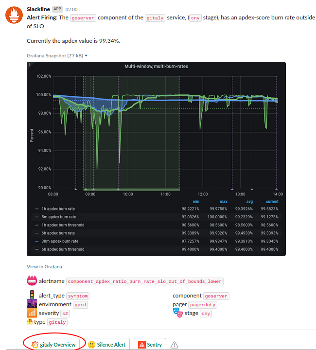
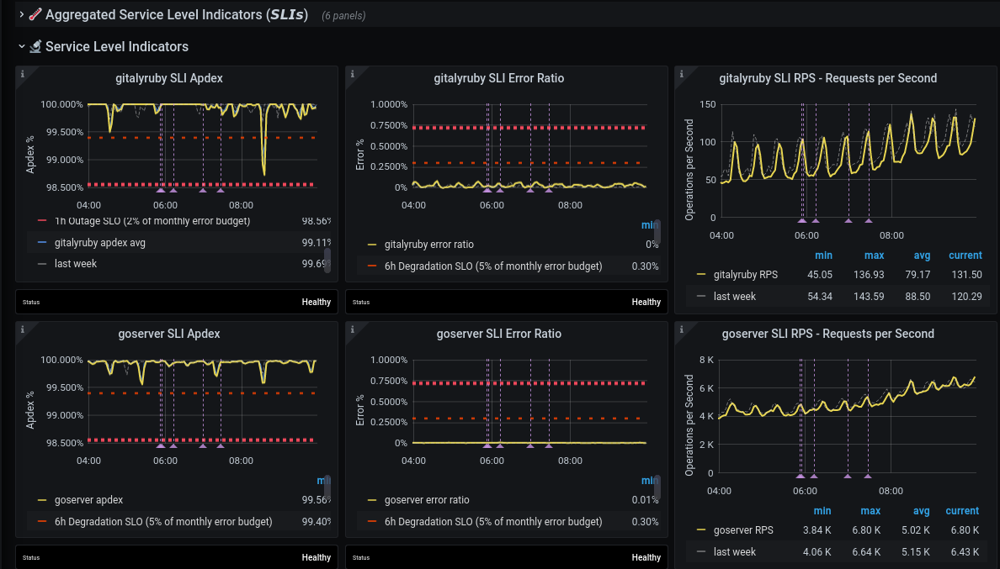
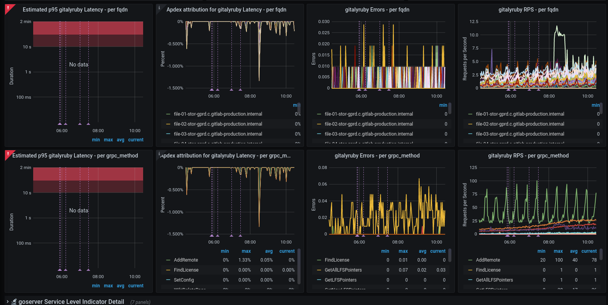
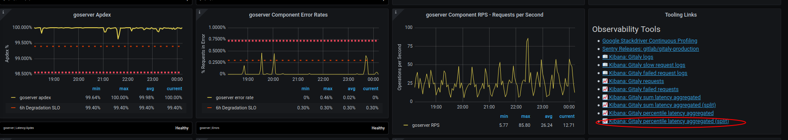
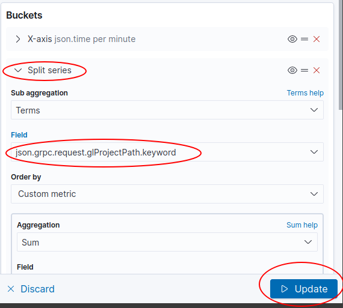
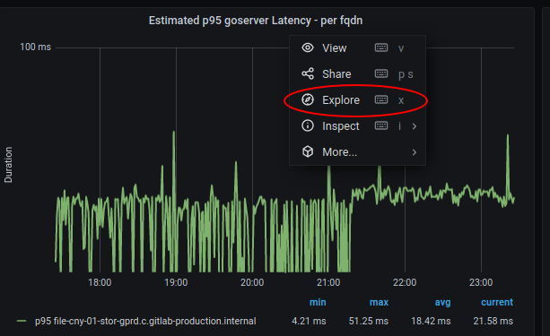
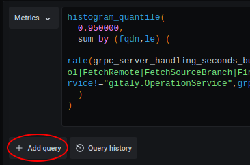
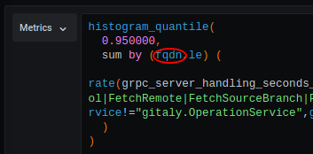
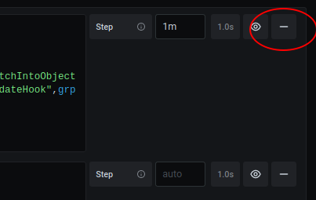

# Apdex alerts troubleshooting

Or: _How I learned to stop worrying and love the metrics_

In the interests of consistent and mathematically sound alerts about which we can reason, we use the [Apdex concept](./definition-service-apdex.md).  But as an on-call SRE, what do you do when confronted with an apdex alert for a service?  How do we drill down to identify the problematic area?

## Concepts

### Service

A "Service" is made up of one or more service level indicators (SLIs), e.g. Praefect is made up of the cloudsql, proxy, and replicator_queue SLIs, the API service is made up of the loadbalancer, puma, and workhose SLIs.  The apdexes of the individual SLIs combine to give an overall apdex for the Service in a given environment (gstg, gprd, etc) across all nodes, pods, and clusters (VMs or k8bs).

### Service Level Indicators

An SLI is an individually measurable thing within a service; they are often an independent daemon but can also be an discretely identifiable portion of the service e.g. for API it is the workhorse and puma daemons, and the /api handling backends from haproxy.  The key is that some set of metrics can be explicitly identified as belonging to that indicator, potentially by label.

Each SLI has its own apdex definition. Apdex definitions are part of the metrics catalog. They live in files defining services, for example, for the workhorse SLI of the [git service](https://gitlab.com/gitlab-com/runbooks/-/blob/c010a387c36fc8e2dd00d224302139eba7225f44/metrics-catalog/services/git.jsonnet#L111). They can be any valid Prometheus query. In most cases, definitions are actually jsonnet function calls (to make it more declarative) which evaluate to Prometheus queries.

One such function is `histogramApdex`. It takes as parameters: a name of a histogram in Prometheus, a selector that identifies the relevant requests (perhaps filtering on various labels to achieve that) and thresholds. The histogram name will almost always be a `FOO_duration_seconds_bucket`, or be very similarly named, and is ultimately 'how long the request took to complete'. The thresholds define latency ranges for satisfied and tolerated, as per service apdex ( see [service apdex](./definition-service-apdex.md) ).  Only user-facing requests are included in this, because this is all about measuring the end-user experience (human or API); internal requests/book-keeping details like healthchecks are excluded where possible; exceptions may apply for technical reasons, although we will try to remove those exceptions when identified.

### Burn rate

[MWMBR](https://landing.google.com/sre/workbook/chapters/alerting-on-slos/#6-multiwindow-multi-burn-rate-alerts): Multi Window Multi Burn Rate

In short: we have a budget (SLA) for being "out-of-spec" that we can burn through in a given period.  If the burn rate is high, we can't tolerate that for long (high burn, small window); if we're only slightly out-of-spec, we can burn for longer.  The idea is to alert quickly if things are going awry, but to not _miss_ slow burning problems (commonly regressions, but not always) that are degrading performance a little bit for a long period.

More specifically, on gitlab.com, we measure two burn rates, a 1h burn rate (fast 🔥) and a 6h burn rate (slow 🥵).  In a 1 hour period, we allow a service to burn 2% of its monthly error budget, and in a 6 hour period, we allow 5% of the monthly error budget to be used.

As a practical example, if a service has a 99.90% SLA, then in one month, 0.01% of requests are allowed to exceed the latency threshold (ie, be slow).  To calculate a 2% budget, we use:

```math
\frac{2\% * hoursInMonth}{hoursInBurnRange * errorBudget}
```

or

```math
\frac{2\% * 720}{1 * 0.01\%} = 0.144\%
```

So, in a 1h period, we can tolerate 14.4x our monthly error budget.  Likewise, over a 6h period, we can tolerate 0.6% errors.

When an apdex alert fires, it means that either we have used up more than 2% of our monthly error budget in a 1h period, or we have used up more than 5% of our monthly error budget in a 6h period. Either way, if we continue burning at the same rate, we will most likely violate our SLA over the month.

### Metrics catalog

All these bits and pieces are defined in `metrics-catalog/services/<service-name>.jsonnet`, in a declarative way.  jsonnet is used to construct the Prometheus configuration (aggregation rules and alerting rules), the Grafana dashboards and GitLab dashboards.  Manually constructing these was somewhere between difficult and impossible to do accurately, and was tedious.  The generating code is complex but still ultimately less complex than doing it by hand, and more reliable.

## Strategy for troubleshooting SLI/SLO alerts

### Introduction

As always the goal is to find the misbehaving thing, which could be anything from a server to a single endpoint/RPC/controller.  Here's some things you can do.

An apdex alert in `#production` should be paired with an alert in `#feed_alerts-general` from [Slackline](https://gitlab.com/gitlab-com/gl-infra/slackline).  Looking at `#feed_alerts-general` is optional and there is [an issue](https://gitlab.com/gitlab-com/gl-infra/scalability/-/issues/2060) open to move the Slackline alerts to `#production`.  The Prometheus link on the origin alert might give you a broad brush idea of the impact (length, intensity etc), but you probably want to find the Slackline message.  That will also give you an idea of whether it's a slow or fast burn (see [Burn Rate](#burn-rate) and more particularly a '<service> Overview' button/link, which takes you to the relevant Grafana dashboard:



### Service Overview dashboard

#### Aggregated Service Level Indicators

#### Service Level Indicators

The alert will have identified which SLI of the service is at fault, but in case it's not clear check the 'Service Level Indicators' section of the dashboard.  This should confirm which SLI is causing the alerts (or show that it is multiple).



Each row shows metrics for a given SLI. The three columns are, from left to right:

1. Apdex
1. Error Ratio
1. RPS (Requests per second)

Apdex alerts are about latency, but keep an eye on error rates and RPS as well, as changes in behavior on those _may_ provide clues for the apdex alert.

This section also contains links to useful Kibana queries. See 'Kibana links' section below for more details.

#### Service Level Indicator Detail

Once you identify a SLI that's misbehaving (either from the alert or using the Service Level Indicators section), expand the relevant `SLI Detail: <sli>` section.

As the name suggests, this section contains a more detailed view into the health of a SLI. For example, it contains a row for each 'significant label' (see the [metrics_catalog](#metrics-catalog) definitions).



Each row has apdex, error ratio and rps graphs that show the same data that is visible in the [Service Level Indicators] section, except it's split by 'significant label'. This is where outliers (e.g. a specific queue, gRPC method, etc) may be visible, suggesting specific code-paths (endpoint, class, controller, etc) that are causing the alert.

Most (all?) have the `fqdn` label as significant by default so that we can see if some subset of servers are outliers; this is an _excellent_ thing to check early.  An outlier on cattle-class machines (e.g. web, API) suggests a single machine may be failing; an outlier on Single-Point-Of-Failure machines indicates something specific to that node (e.g. an issue on a gitaly file storage node probably implicates repos specific to that node)

However, fqdn is only one possible such significant label, e.g. sidekiq has feature_category, urgency, queue.

If you suspect grouping/aggregating by some _other_ dimensions (labels) might provide insight, you have two options for ad-hoc explorations:

1. Use Kibana to query logs
1. Use the Grafana 'Explore' functionality to query metrics

Kibana will provide more detail (particularly the ability to group by user, group, or project), so in an active incident this is the recommended approach; however if you're investigating an incident that goes beyond basic ELK log retention (7 days), you'll need to use Grafana looking at Prometheus/Thanos metrics which we keep for longer but with more aggregation/lower detail or BigQuery for accessing logs older than 7 days.

#### Kibana links (for exploring more grouping/aggregation dimensions)

In the [Service Level Indicators] section, each SLI may have a `Tooling Links` section on the right, mainly being links to Kibana.  As noted above, kibana contains more detail but shorter retention; the detail is in dimensions that would otherwise cause performance problems for Prometheus, like users + projects.

In particular, if the simple "show all logs" links don't provide the split/detail you need, the ones with the "(split)" suffix are your starting point for aggregating on the additional dimensions.



The initially chosen split is somewhat arbitrary (e.g. for Web it is 'controller') but it is simple to change the field (dimension) on which the series split is occurring.  Commonly useful fields (across many indexes/log types):

* `json.meta.user.keyword`
* `json.meta.project.keyword`
* `json.meta.root_namespace`
* `json.grpc.request.glProjectPath.keyword` (gitaly-specific)

although there are others and you should explore as necessary.  As at the current version of kibana, it's on the right under the 'Buckets' section.  Expand the 'Split series' toggle, change the 'Field' value to the one you want to aggregate on, then click 'Update'


#### Grafana Explore (for exploring more grouping/aggregation dimensions)

1. Click title of an existing panel like the 'Estimated p95 FOO Latency - per fqdn' panel, and then click 'Explore'
    * 
1. Click '+ Add query'
    * 
1. Copy/paste the query from the top box to the new query box, and change 'fqdn' to other label you want to group by
    * 
1. Remove the original (top) query
    * 

If you're not sure what labels are available to aggregate on, copy the metric name (inside the 'rate' expression), paste it into <https://thanos.gitlab.net/graph> and inspect/choose from the available labels (warning: there can be a lot of metric instances, so you probably want to also include the `job` label from the original expression as well, e.g. `grpc_server_handling_seconds_bucket{job="gitaly"}`

Notes:

1. Adding/copying the query ensures you get a label key on the graph that reflects the label you chose; if you just edit the original in place, the label definition isn't updated.
1. It's possible to end up with such low-volume data that the graph becomes just points, not lines.  This is one of the downsides of this approach.

## See also

* [Incident Diagnosis in a Symptom-based World](../tutorials/diagnosis.md)
