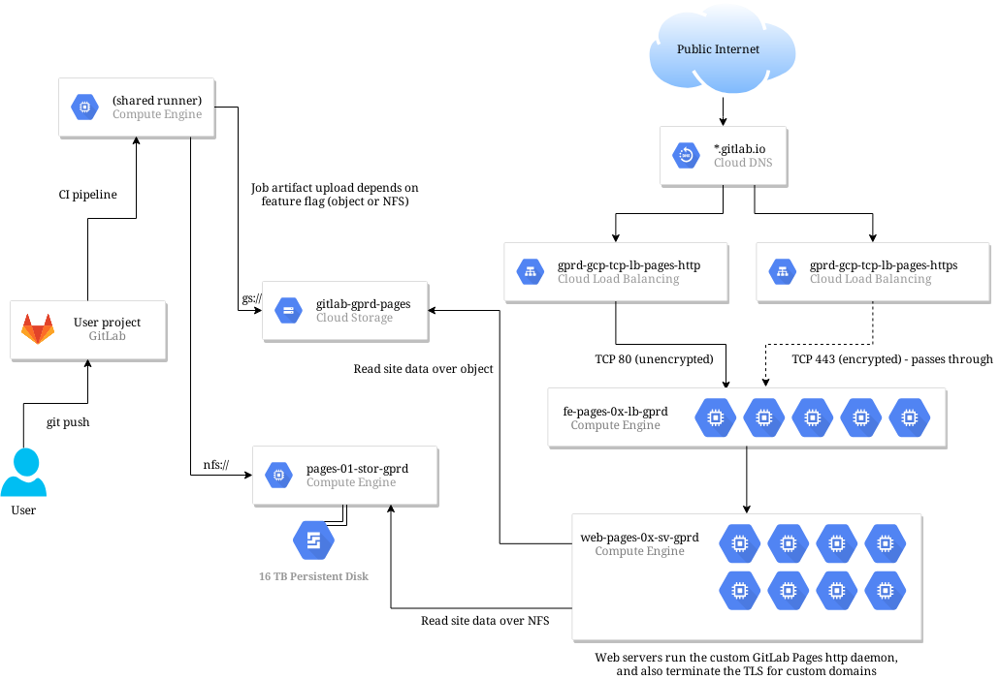

<!-- MARKER: do not edit this section directly. Edit services/service-catalog.yml then run scripts/generate-docs -->

# Pages Service

* **Alerts**: <https://alerts.gitlab.net/#/alerts?filter=%7Btype%3D%22pages%22%2C%20tier%3D%22lb%22%7D>
* **Label**: gitlab-com/gl-infra/production~"Service:Pages"

## Logging

* [Stackdriver Logs](https://console.cloud.google.com/logs/viewer?project=gitlab-production&advancedFilter=resource.type%3D%22gce_instance%22%0Alabels.tag%3D%22haproxy%22%0Alabels.%22compute.googleapis.com%2Fresource_name%22:%22fe-pages%22)

## Troubleshooting Pointers

* [Cloudflare: Managing Traffic](../cloudflare/managing-traffic.md)
* [Chef troubleshooting](../fleet-management/config_management/chef-troubleshooting.md)
* [Chef Vault Basics](../fleet-management/config_management/chef-vault.md)
* [Blocking individual IPs and Net Blocks on HA Proxy](../frontend/ban-netblocks-on-haproxy.md)
* [HAProxy management at GitLab](../frontend/haproxy.md)
* [../gitaly/git-high-cpu-and-memory-usage.md](../gitaly/git-high-cpu-and-memory-usage.md)
* [Gitaly unusual activity alert](../gitaly/gitaly-unusual-activity.md)
* [Service-Level Monitoring](../metrics-catalog/service-level-monitoring.md)
* [Node memory alerts](../monitoring/node_memory_alerts.md)
* [Diagnosis with Kibana](../onboarding/kibana-diagnosis.md)
* [Block specific pages domains through HAproxy](block-pages-domain.md)
* [GitLab Pages returning 404](gitlab-pages.md)
* [Determine The GitLab Project Associated with a Domain](pages-domain-lookup.md)
* [Troubleshooting LetsEncrypt for Pages](pages-letsencrypt.md)
* [Pg_repack using gitlab-pgrepack](../patroni/pg_repack.md)
* [PostgreSQL VACUUM](../patroni/postgresql-vacuum.md)
* [Deploy Cmd for Chatops](../uncategorized/deploycmd.md)
<!-- END_MARKER -->

<!-- ## Summary -->

<!-- ## Architecture -->

<!-- generated from ./img/gitlab-pages.drawio , see https://app.diagrams.net -->

<!-- ## Performance -->

<!-- ## Scalability -->

<!-- ## Availability -->

<!-- ## Durability -->

<!-- ## Security/Compliance -->

<!-- ## Monitoring/Alerting -->

<!-- ## Links to further Documentation -->
