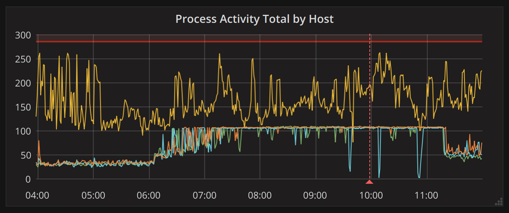
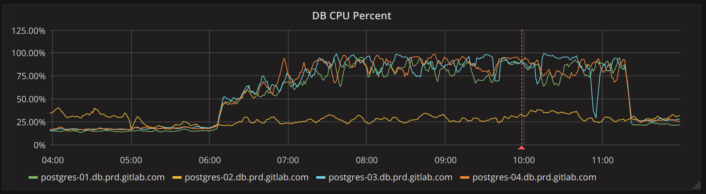
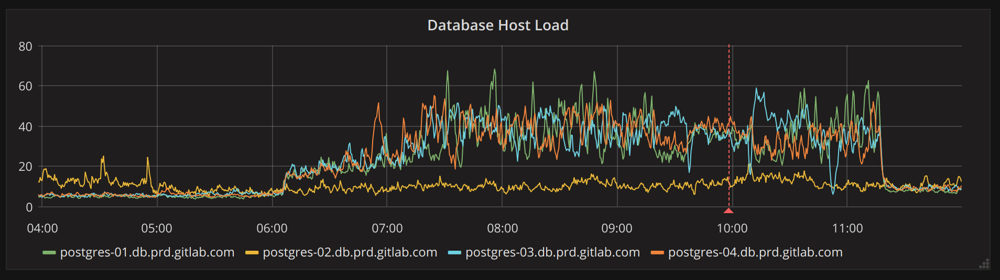

# Postgresql troubleshooting

## Dashboards

All PostgreSQL dashboards can be found in the [PostgreSQL Grafana Folder](https://dashboards.gitlab.net/dashboards/f/RNfEDpLmz/postgresql).

Some relevant dashboards:

- [PostgreSQL Overview](https://dashboards.gitlab.net/d/000000144/postgresql-overview?orgId=1&var-environment=gprd&var-prometheus=prometheus-01-inf-gprd&var-type=patroni)

- [Tuple Statistics](https://dashboards.gitlab.net/d/000000167/postgresql-tuple-statistics?orgId=1&var-environment=gprd&var-prometheus=prometheus-01-inf-gprd&var-instance=patroni-01-db-gprd.c.gitlab-production.internal)

- [Postgres Queries](https://dashboards.gitlab.net/d/000000153/postgresql-queries?orgId=1&var-environment=gprd&var-type=patroni&var-fqdn=patroni-01-db-gprd.c.gitlab-production.internal&var-prometheus=prometheus-01-inf-gprd)

:new: As of October 2024, there are also new dashboards for Postgres performance analysis and troubleshooting:

1. [Postgres node performance overview (high-level)](https://dashboards.gitlab.net/d/postgres-ai-node-performance-overview)
2. [Postgres aggregated query performance analysis](https://dashboards.gitlab.net/d/postgres-ai-NEW_postgres_ai_02)
3. [Postgres single query performance analysis](https://dashboards.gitlab.net/d/postgres-ai-NEW_postgres_ai_03)
4. [Postgres wait events analysis](https://dashboards.gitlab.net/d/postgres-ai-NEW_postgres_ai_04)

See also:

1. [Runbook "High-level performance analysis and troubleshooting of a Postgres node"](./single-node-high-level.md)
2. [Runbook "SQL query analysis and optimization for Postgres"](./query-analysis.md)
3. [Runbook "Postgres wait events analysis (a.k.a. Active Session History; ASH dashboard)"](./wait-events-analisys.md)

## Availability

Alerts that check for availability are XIDConsumptionTooLow
XLOGConsumptionTooLow and CommitRateTooLow. They all measure activity
on the database, not blackbox probes. Low values could indicate the
database is not responding or could indicate the application is having
difficulty connecting to the database.

They could also indicate the application is having its own problems
however ideally these thresholds should be set low enough that even a
minimually functional application would not trigger them.

Keep in mind that

Check:

- Postgres error logs (full disk or other I/O errors will normally not
  cause Postgres to shut down and may even allow read-only queries but
  will cause all read-write queries to generate errors).

- Check that you can connect to the database from a psql prompt.

- Check that you can connect to the database from the Rails
  console.

- Check that you can make a database modification. Run `select
  txid_current()` is handy for this as it does require disk i/o to
  record the transaction. You could also try creating and dropping a
  dummy table.

- Check other triage dashboards such as the cpu load and I/O metrics
  on the database host in question.

## Errors

The RollbackRateTooHigh alert measures the ratio of rollbacks to
commits. It may not indicate a database problem since the errors may
be caused by an application issue.

- Check the database error logs (full disk, out of memory, no more
  file descriptors, or other resource starvation issues could cause
  all read-write transactions to fail while Postgres limps along
  completing read-only transactions for example).

- Check that the host in question is under normal load -- if the usage
  is extremely low due to replication lag or network issues then this
  may be a false positive.

Note that this alert can be fired for a replica or the primary.

## Locks

The PostgresTooManyRowExclusiveLocks alerts when there are a large
number of records in pg_locks for RowExclusiveLock.

This is often not indicative of a problem, especially if they're
caused by inserts rather than updates or deletes or if they're
short-lived. But updates or deletes that are not committed for a
significant amount of time can cause application issues.

Look for blocked queries or application latency.

Remediation can involve tracking down a rogue migration and killing
or pausing it.

## Load

DBHeavyLoad is triggered based on simple OS load measurement. Look for
a large number of active backends running poorly optimized queries
such as sorting large result sets or missing join clauses.

Don't forget to look for generic Unix problems that can cause high
load such as a broken disk (with processes getting stuck in disk-wait)
or some administrative task such as mlocate or similar forking many
child processes.

## High (and similar) load on multiple hosts

It's also possible for high load to be caused by out of date query statistics.
For example, in <https://gitlab.com/gitlab-com/gl-infra/reliability/-/issues/4429> we
discovered that incorrect statistics for the "namespaces" table lead to an
increase in sequential scans on the "issues" table.

Typically problems like this will produce graphs like the following:







If you happen to know which table has out-of-date or incorrect statistics, you
can run the following *on the primary* to resolve this:

```sql
ANALYZE VERBOSE table_name_here;
```

However, it's not unlikely that *other* tables are affected as well, which may
lead one to believe the problem lies elsewhere. To figure this out you will need
a few query plans of (now) badly behaving queries, then look at the tables these
queries use. Once you have identified potential candidates, you can `ANALYZE`
those tables. Alternative, you can run the following SQL query *on the primary*:

(run inside `sudo gitlab-psql`)

```sql
SELECT schemaname, relname, last_analyze, last_autoanalyze, last_vacuum, last_autovacuum
FROM pg_stat_all_tables
ORDER BY last_analyze DESC;
```

This will list all tables, including the time `ANALYZE` last ran for the table.
Look for tables that have not been analysed for a long time, but should have
been. Keep in mind that `ANALYZE` may run only every now and then, if a table is
not updated very frequently. In other words, a high `last_analyze` or
`last_autoanalyze` value is not a guarantee that the table has incorrect
statistics.

A more drastic and easier approach is to simply re-analyze *all* tables. This
won't impact a running system, but this can take around 15 minutes to complete,
depending on the table sizes. To perform this operation, run the following _on
the primary_:

(run inside `sudo gitlab-psql`)

```sql
SET statement_timeout TO 0;
ANALYZE VERBOSE;
```

## Replication is lagging or has stopped

### Symptoms

We have several alerts that detect replication problems:

- Alert that replication is stopped
- Alert that replication lag is over 2min (over 120m on archive and delayed
  replica)
- Alert that replication lag is over 200MB

As well there are a few alerts that are intended to detect problems that could *lead* to replication problems:

- Alert for disk utilization maxed out
- Alert for XLOG consumption is high

### Possible checks

- [replication lag in Thanos](https://thanos.gitlab.net/graph?g0.range_input=2h&g0.max_source_resolution=0s&g0.expr=pg_replication_lag%7Benv%3D%22gprd%22%2C%20type%3D%22patroni%22%7D%20AND%20pg_replication_is_replica%20%3D%3D%201&g0.tab=0)

- Also check for bloat (see the section "Tables with a large amount of
  dead tuples" below). Replication lag can cause bloat on the primary
  due to "vacuum feedback" which we have enabled.

- If a replica is falling behind, the primary might keep WAL files around that
  are needed to catch up. This can lead to running out of disk space pretty
  fast! If things don't resolve, remove the replication slot on the primary (see
  [below](#replication-slots))

- Check if there's a significant increase in writes in the [Tuple Stats dashboard](https://dashboards.gitlab.net/goto/7eDuWvY4z?orgId=1).
  - Check `pg_stat_activity_marginalia_sampler_active_count` in [Thanos](https://thanos-query.ops.gitlab.net/graph?g0.expr=sum%20by%20(endpoint%2C%20fqdn%2C%20environment)%20(%0A%20%20%20%20avg_over_time(pg_stat_activity_marginalia_sampler_active_count%7Benv%3D%22gprd%22%2C%20application%3D~%22.*%22%2C%20fqdn%3D~%22patroni-ci-2004.*%22%2C%20endpoint%3D~%22.*%22%2C%20state%3D~%22.*%22%7D%5B1m%5D)%0A)%0A&g0.tab=0&g0.stacked=0&g0.range_input=12h&g0.max_source_resolution=0s&g0.deduplicate=1&g0.partial_response=0&g0.store_matches=%5B%5D&g0.end_input=2023-03-30%2001%3A01%3A32&g0.moment_input=2023-03-30%2001%3A01%3A32) for possible leads on which endpoint may be making the database busy.

- Note that as replicas in the pool become outdated, all read workload will be shifted to whichever replicas remaining that are not lagging. Replicas dropping out of the pool would lead to increased load on the primary.

### Resolution

Look into whether there's a particularly heavy migration running which
may be generating very large WAL traffic that the replication can't
keep up with.

Not yet on the dashboards but you can look at `rate(pg_xlog_position_bytes[1m])
` compared with `pg_replication_lag` to see if the replication lag is correlated
with unusually high WAL generation and what time it started:
[Thanos](https://thanos.gitlab.net/graph?g0.range_input=2h&g0.max_source_resolution=0s&g0.expr=pg_replication_lag%7Benv%3D%22gprd%22%2C%20type%3D%22patroni%22%7D%20AND%20pg_replication_is_replica%20%3D%3D%201&g0.tab=0&g1.range_input=1h&g1.max_source_resolution=0s&g1.expr=rate(pg_xlog_position_bytes%7Benv%3D%22gprd%22%2C%20type%3D%22patroni%22%7D%5B1m%5D)&g1.tab=0)

Another cause of replication lag to investigate is a long-running query on the
replica which conflicts with a vacuum operation from the primary. This should
not be common because we don't generally run many long-running queries on
gitlab.com and we have vacuum feedback enabled.

[get_slow_queries.sh](../../scripts/database/get_slow_queries.sh)

Just wait, replication self recovers :wine_glass:

If it takes too long, kill the blocking query:
[terminate_slow_queries.sh](../../scripts/database/terminate_slow_queries.sh)

If a blocking query is not the cause, you may consider using load balancer
feature flags to alter the amount of replication lag we tolerate for replica
queries in order to prevent a site wide outage.

These two ops feature flags influence the application database load balancer
to use replicas that would normally not be used due to their replication lag
time exceeding max_replication_lag_time.

One doubles max_replication_lag_time, and the other ignores it completely.

The intent is for them to be used to prevent an outage in the event the
replicas cannot keep up with the WAL rate and the primary becomes saturated
without available replicas.

- `load_balancer_double_replication_lag_time` should be tried first.
- `load_balancer_ignore_replication_lag_time` should be a last resort.

You can also look for any sidekiq workers that do a lot of inserts, udpates,
or deletes. They can be deferred using chatops as described in
[Deferring Sidekiq jobs](https://docs.gitlab.com/development/feature_flags/#deferring-sidekiq-jobs).

## Replication Slots

### Symptoms

An unused replication slot in a primary will cause the primary to keep around a
large and growing amount of WAL (XLOG) in `pg_wal/`. This can eventually cause
low disk space free alerts and even an outage.

### Possible checks

- Look in `select * from pg_replication_slots where NOT active`, for both the
  primary and the secondaries.

### Resolution

Verify that the slot is indeed not needed any more. Note that after dropping the
slot Postgres will be free to delete the WAL data that replica would have needed
to resume replication. If it turns out to be needed that replica will likely
have to be resynced using wal-e/wal-g or recreated from scratch.

Drop the replication slot with `SELECT pg_drop_replication_slot('slot_name');`

It's possible for a secondary to have one or more inactive replication slots. In
this case the `xmin` value in `pg_replication_slots` *on the primary* may start
lagging behind. This in turn can prevent vacuuming from removing dead tuples.
This can be solved by dropping the replication slots *on the secondaries*.

## Tables with a large amount of dead tuples

### Symptoms

- Alert that there is a table with too many dead tuples

Also a number of other alerts which link here because they detect
conditions which will lead to dead tuple bloat:

- Alert on "replication slot with a stale xmin"
- Alert on "long-lived transaction"

### Possible Checks

Check on [Grafana dashboards](https://dashboards.gitlab.net/d/000000167/postgresql-tuple-statistics?orgId=1), in
particular the "PostgreSQL Tuple Statistics" and the "Vacumming"
and "Dead Tuples" tabs. Note that this is currently only visible
on the internal dashboards

In the "Autovacuum Per Table" chart expect `project_mirror_data` and
`ci_runners` to be showing about 0.5 vacuums per minute and other
tables well below that. If any tables are much over 0.5 that's not
good. If any tables are near 1.0 (1 vacuum per minute is the max our
settings allow autovacuum to reach) then that's very bad.

In the "Dead Tuple Rates" and "Total Dead Tuples" expect to see a lot
of fluctations but no trend. If you see "Total Dead Tuples" rising
over time (or peaks that are rising each time) for a table then
autovacuum is failing to keep up.

If the alert is for dead tuples then it will list which table has a
high number of dead tuples however note that sometimes when one table
has this problem there are other tables not far behind that just
haven't alerted yet. Run
`sort_desc(pg_stat_user_tables_n_dead_tup)` [in prometheus](https://prometheus-db.gprd.gitlab.net/graph?g0.range_input=1h&g0.expr=sort_desc(pg_stat_user_tables_n_dead_tup)&g0.tab=1)  to see what the top offenders are.

*Check that statistics are up to date for those offenders:*

Log into the primary and check that statistics are present. If logging in
through the console server, use `(your_username)-db-primary@console...`.
`(your_username)-db@console...` will give you a secondary.  In case the
primary has changed and the console server doesn't know the new location yet,
it may be necessary to identify the primary and log in directly.

If the below query does not yield any results for a particular table,
consider running `ANALYZE $table` to update statistics and try again.

Example for table `ci_builds` (run inside `sudo gitlab-psql`):

```sql
select n_live_tup, n_dead_tup, last_autoanalyze, last_analyze from
pg_stat_user_tables where relname='ci_builds';
```

If the alert is for "replication slot with stale xmin" or "long-lived
transaction" then check the above charts to see if it's already
causing problems. Log into the relevant replica and run

(inside `sudo gitlab-psql`):

```sql
SELECT now()-xact_start,pid,query,client_addr,application_name
  FROM pg_stat_activity
 WHERE state != 'idle'
   AND query NOT LIKE 'autovacuum%'
 ORDER BY now()-xact_start DESC
 LIMIT 3;
```

There are any of three cases to check for:

1. There's a large number of dead tuples which vacuum is being
   ineffective at cleaning up due to a long-lived transaction
   (possibly on a replica due to "replication slot with a stale xmin").
1. There's a large rate of dead tuples being created due to a run-away
   migration or buggy controller which autovacuum cannot hope to keep
   up with.
1. There's a busy table that needs specially tuned autovacuum settings
   to vacuum it effectively.

If there's a deploy running or recent deploy with background
migrations running then check for a very high "Deletes" or "Updates"
rate on a table. Also check for for signs of other problems such as
replication lag, high web latency or errors, etc.

If the problem is due to a migration and the dead tuples are high but
not growing and it's not causing other problems then it can be a
difficult judgement call whether the migratin should be allowed to
proceed. Migrations are a generally a one-off case-by-case judgement.

If the "Total Dead Tuples" is increasing over time then canceling the
migration and reverting the deploy is probably necessary. Similarly if
the source of the dead tuple thrashing is determined to be from a
buggy web or api endpoint (or if it can't be determined at all.)

## Connections

This could indicate a problem with the pgbouncer setup as it's our
primary mechanism for concentrating connections. It should be
configured to use a limited number of connections.

Also check `pg_stat_activity` to look for old console sessions or
non-pgbouncer clients such as migrations or deploy scripts. Look in
particular for `idle` or `idle in transaction` sessions or sessions
running very long-lived queries.

e.g.:

(run inside `sudo gitlab-psql`)

```SQL
SELECT pid,
       age(backend_start) AS backend_age,
    age(xact_start) AS xact_age,
    age(query_start) AS query_age,
    state,
    query
  FROM pg_stat_activity
 WHERE pid <> pg_backend_pid()
```

Also, FYI "prepared transactions" and replication connections both
contribute to connection counts. There should be zero prepared
transactions on gitlab.com and only a small number of replication
connections (2 currently).

## PGBouncer Errors

If this is for the label `no more connections allowed
(max_client_conn)` then the number of incoming connections from all
clients is larger than `max_client_conn`. PGBouncer runs on `patroni`
fleet. The alert should tell you which patroni host the alert triggered on.
If this is the main patroni node, then this means all connections from
all processes and threads on all hosts.

You can raise the `max_client_conn` temporarily by logging into the
pgbouncer console and issuing a command. First verify that the `ulimit
-n` is high enough using prlimit (which can also set it). And get the
password for pgbouncer console from 1password under `Production -
gitlab` and `Postgres pgbouncer user`:

```
# ps auxww |grep bin[/]pgbouncer
gitlab-+ 109886 34.4  0.6  28888 12836 ?        Rs   Mar19 13929:17 /opt/gitlab/embedded/bin/pgbouncer /var/opt/gitlab/pgbouncer/pgbouncer.ini

# prlimit -n -p 109886
RESOURCE DESCRIPTION               SOFT  HARD UNITS
NOFILE   max number of open files 50000 50000

$ sudo pgb-console

pgbouncer=# show config;
            key            |                           value                            | changeable
---------------------------+------------------------------------------------------------+------------
 max_client_conn           | 2048                                                       | yes
...

pgbouncer=# show pools;
          database           |   user    | cl_active | cl_waiting | sv_active | sv_idle | sv_used | sv_tested | sv_login | maxwait |  pool_mode
-----------------------------+-----------+-----------+------------+-----------+---------+---------+-----------+----------+---------+-------------
 gitlabhq_production         | gitlab    |       925 |          0 |        50 |      50 |       0 |         0 |        0 |       0 | transaction
 gitlabhq_production         | pgbouncer |         0 |          0 |         0 |       0 |       1 |         0 |        0 |       0 | transaction
 gitlabhq_production_sidekiq | gitlab    |      1088 |          0 |        56 |      69 |       0 |         0 |        0 |       0 | transaction
 gitlabhq_production_sidekiq | pgbouncer |         0 |          0 |         0 |       1 |       0 |         0 |        0 |       0 | transaction
 pgbouncer                   | pgbouncer |         1 |          0 |         0 |       0 |       0 |         0 |        0 |       0 | statement
(5 rows)

pgbouncer=# set max_client_conn=4096;
```

Note in the above `show pools` command the `cl_active` column lists a
total of 2013 active client connections (not including our
console). Just 35 short of the `max_client_conn` of 2048.

If this is an alert for any other error you're on your own. But be
aware that it could be caused by something mundane such as an admin
typing commands at the console generating "invalid command" errors or
the database server restarting or clients dying.

## Sentry - Postgres pending WAL files on primary is high

Check the Runbook [sentry_pending_wal_files_too_high.md](../../sentry/sentry_pending_wal_files_too_high.md).
