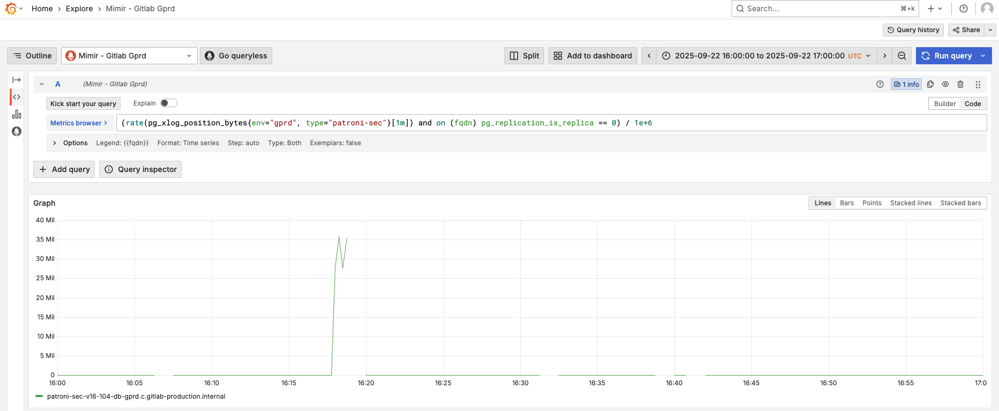

# Primary Database Node WAL Generation Saturation Analysis

## Why do we need this alert?

The goal of these alert is is to let us know that there was spike in amount of WAL generated on the primary database node,
so we can investigate while we still have logs available and before the situation gets worse. The alert triggers when WAL generation
is over three standard deviations above average, or when it is above 150 MiB/s.

High WAL Generation could be caused by many things; query pattern changes, processes modifying large amounts of data, database maintenance etc.
Also this is a saturation metric which we will slowly tip toe up to over time, and without other invention this alert will page more frequently as we run out of headroom.

High WAL Generation is sign of an impending saturation limit with WAL Reciever and/or WAL apply. We theorize that at 150 MB/s (over [5m]) WAL Generation
the replicas will not be able to recieve and apply the data fast enough to keep up with generation leading to saturation-induced replication lag.

Replication lag means the data on the replicas will be stale compared to the data on the primaries.
This could lead to the loadbalancer keeping sticky reads on the primary longer (more load on primary) or if the replication lag gets older
than 2 minutes the loadbalancer will redirect all read traffic to primary (even more load on primary). Finally, there could be data loss if an unexpected failover was to occur.
It is also worth noting that on the replicas both CPU and disk IO increases with WAL Generation rate, regardless of the content of that WAL data.

We should investigate what could have caused the WAL spike, and whether the spike is a early warning sign of an impending saturation limit with WAL Reciever and/or WAL apply.

To confirm the spike:

Look at the `pg_xlog_position_bytes` metric:

```
rate(pg_xlog_position_bytes{env="gprd", type="patroni"}[1m]) and on (fqdn) pg_replication_is_replica == 0
```

- Go to [Mimir](https://dashboards.gitlab.net/goto/00Y6B6CNg?orgId=1).
- For the `ci` database change the `type` label to `patroni-ci`, for `sec` change it to `patroni-sec`.
- Adjust time range to 30 minutes before and after the alert.
- In the example bellow we can see a spike in WAL genration at 16:20.
    

## Create an issue

Capture all findings in an issue:

- Click [here](https://gitlab.com/gitlab-com/gl-infra/production/-/issues/new?issue[title]=YYYY-MM-DD%20HH:MM:%20WAL%20generation%20spike%20on%20the%20primary%20node%20for%20(main|ci|sec)%20database)
- Title: _YYYY-MM-DD HH:MM: WAL generation spike on the primary node for (main|ci|sec) database_
- Labels: TBD
- Assignees: TBD
- Description: Include any relevant information that is available. When referencing to sources like Mimir and Kibana,
please include both screenshot and sharable link to the source ([example](https://gitlab.com/gitlab-com/gl-infra/production/-/issues/19990)).

## How to identify the root cause?

Spikes in WAL generation are often caused by specific queries that produce too much WAL.

### WAL bytes / WAL FPI

To find the top 15 statements by generated WAL:

```
topk(15,
  sum by (queryid) (
    rate(pg_stat_statements_wal_bytes{env="gprd", type="patroni", queryid!="-1"}[1m]) and on (instance) pg_replication_is_replica == 0
  )
)

topk(15,
  sum by (queryid) (
    rate(pg_stat_statements_wal_fpi{env="gprd", type="patroni", queryid!="-1"}[1m]) and on (instance) pg_replication_is_replica == 0
  )
)
```

- Go to [Mimir](https://dashboards.gitlab.net/goto/jAuaY6CHR?orgId=1).
- For the `ci` database change the `type` label to `patroni-ci`, for `sec` change it to `patroni-sec`.
- Adjust time range to 15 minutes before and after the alert.
- On the graph, click _"Show all"_ so that all series are rendered.
- Look for any statement(s) that stand out.

### Other resources

- [Replication is lagging or has stopped](primary_db_node_wal_generation_saturation.md#replication-is-lagging-or-has-stopped)
- TODO

### Other possible causes

- TODO

### Map queryid to SQL

To find the normalized SQL for given queryid, follow the [mapping docs](mapping_statements.md). Usually searching the logs is enough:

- Go to [Kibana](https://log.gprd.gitlab.net/app/r/s/tYFB8).
- Update the filter and set the queryid.
- If needed increase the time range.
