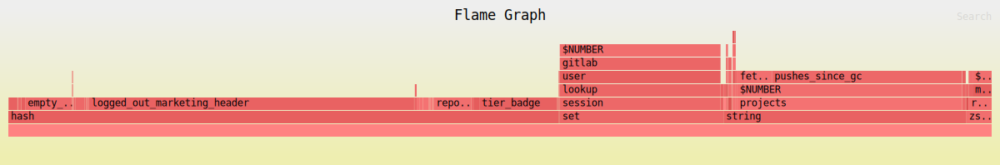
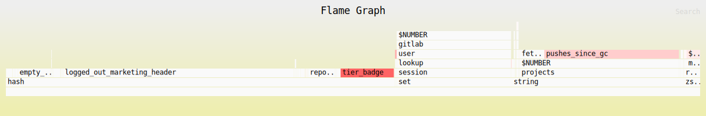

# Memory space analysis with cupcake-rdb

For Redis we often focus on analyzing CPU utilization, but sometimes we also need to investigate growth trends in memory usage.

For this purpose we have a tool called [cupcake-rdb](https://gitlab.com/gitlab-com/gl-infra/cupcake-rdb) that is able to process Redis RDB dumps into folded format for use in [flamegraph](https://www.brendangregg.com/flamegraphs.html) generation.

This tool will estimate the contribution of each key to the overall memory footprint. This estimate is not going to be perfect, as per-key allocation overhead, compression strategies, and fragmentation are not taken into account. It still is able to give an idea of which key prefixes have grown or shrunk, and provide a general sense of which prefixes are consuming space.

Note: It may be worth using [inferno](https://github.com/jonhoo/inferno) as a faster replacement for the [perl-based flamegraph scripts](https://github.com/brendangregg/FlameGraph), as the input size generated by cupcake-rdb can be considerable.

## Install

```shell
go install gitlab.com/gitlab-com/gl-infra/cupcake-rdb/cmd/cupcake@latest

### inferno installation
mise install rust
cargo install inferno
```

## Usage

For basic usage, you can feed in an RDB dump and get out either a text based stream of the key space or a folded output.

```shell
cupcake dump.rdb
cupcake -format folded dump.rdb
```

The folded output is pre-aggregated on key patterns, so it will process the entire RDB dump before outputting anything.

### Periodic analysis on GitLab.com

`cupcake` runs hourly (except for clusters that result in a big analysis result, those are run daily) on all Redis clusters in GitLab.com,
the results are stored in the `gitlab-gprd-redis-analysis` under the `bigkeys-cupcake` prefix. The results are in the folded format, so they
can be fed directly to `inferno-flamegraph` for flamegraph generation.

For example:

```shell
gsutil cat gs://gitlab-gprd-redis-analysis/bigkeys-cupcake/redis-cluster-repo-cache-shard-03/2025-10-24T022500 | inferno-flamegraph --hash --colors=perl > flamegraph.svg
```

### Space distribution flamegraph

When looking at a single RDB dump, we can generate a space distribution flamegraph. This provides attribution from key prefixes and patterns to their space consumption.

```shell
cupcake -format folded dump.rdb | inferno-flamegraph --hash --colors=perl > flamegraph.svg
```

Example:



### Differential flamegraph

When investigating trends however it can often be more interesting to compare two RDB snapshots, e.g. one week apart. These can be obtained by restoring disk snapshots. By comparing two points in time we can see how key prefixes have changed.

This provides valuable information including:

- Prefixes that are contributing to overall memory growth.
- Prefixes that have not changed at all and may be stale.

Here is an example of how to produce a set of differential flamegraphs:

```shell
mkdir folded_key_pattern_counts
cupcake -format folded rdb_files/redis-shared-state.as_of_20230924_0025.rdb > folded_key_pattern_counts/redis-shared-state.as_of_20230924_0025.folded.txt
cupcake -format folded rdb_files/redis-shared-state.as_of_20231001_0032.rdb > folded_key_pattern_counts/redis-shared-state.as_of_20231001_0032.folded.txt

mkdir flamegraphs
inferno-diff-folded folded_key_pattern_counts/redis-shared-state.as_of_{20230924_0025,20231001_0032}.folded.txt | inferno-flamegraph > flamegraphs/diff.2nd_minus_1st.svg
inferno-diff-folded folded_key_pattern_counts/redis-shared-state.as_of_{20231001_0032,20230924_0025}.folded.txt | inferno-flamegraph > flamegraphs/diff.1st_minus_2nd.svg
```

Example:



## Alternatives

An alternative to `cupcake-rdb` is [`HDT3213/rdb`](https://github.com/HDT3213/rdb?tab=readme-ov-file#install), it has its own [memory analyzer](https://github.com/HDT3213/rdb?tab=readme-ov-file#generate-memory-report).

```shell
go install github.com/hdt3213/rdb@latest

# Get top 10 keys by size
rdb -c bigkey -n 10 dump.rdb
```
