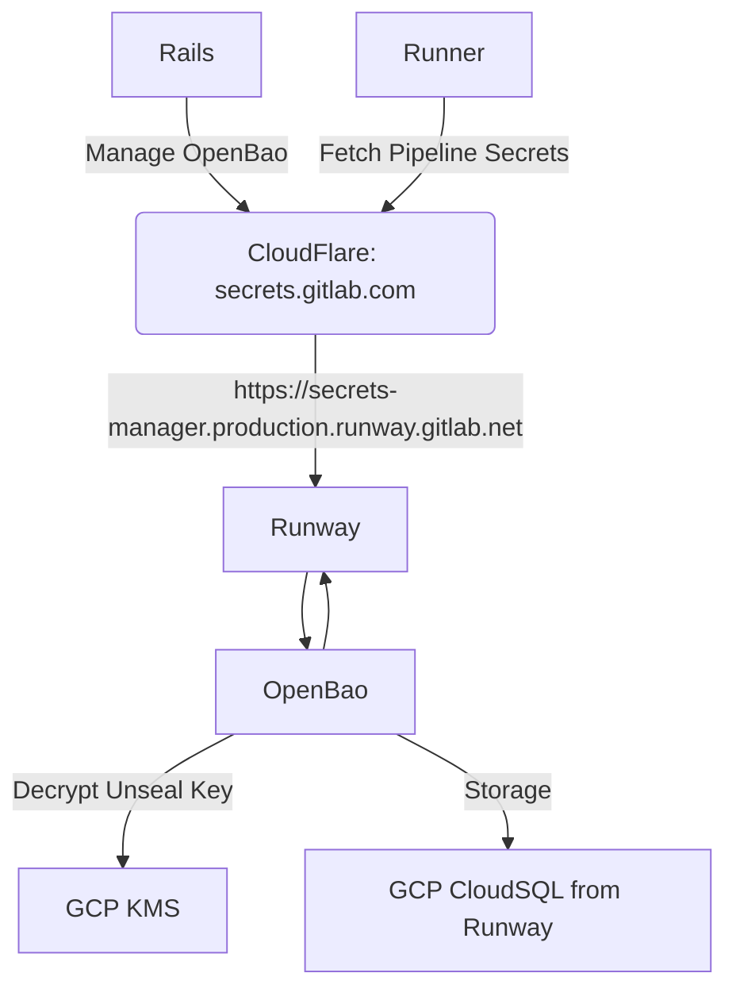
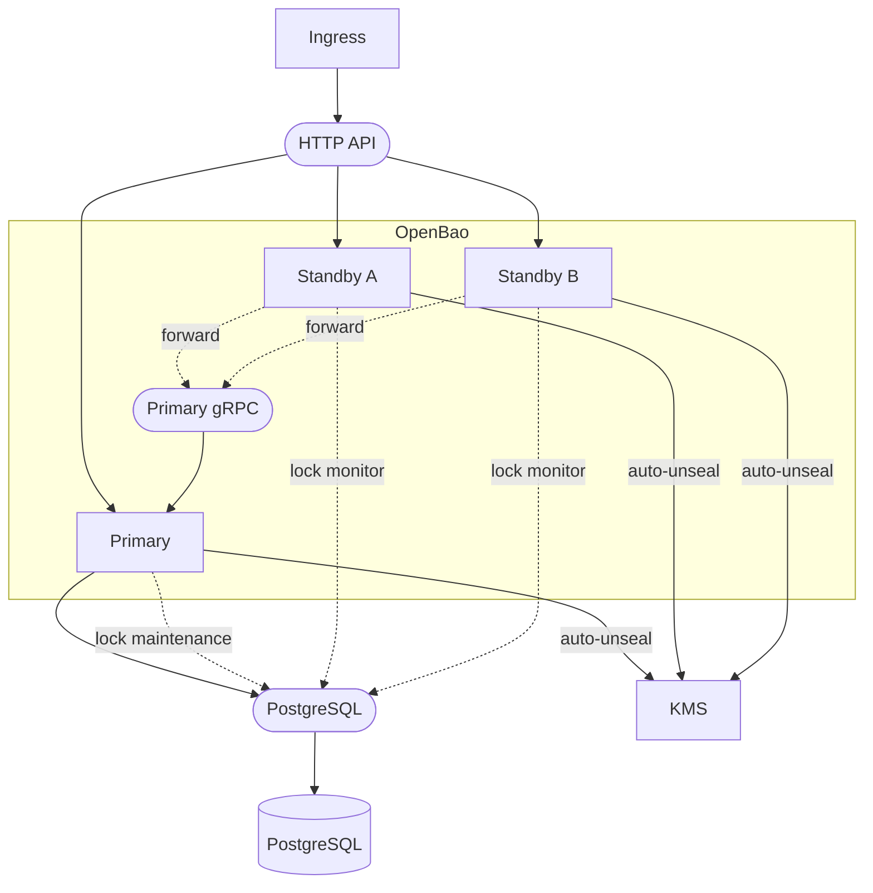

<!-- MARKER: do not edit this section directly. Edit services/service-catalog.yml then run scripts/generate-docs -->

# OpenBao for GitLab Secrets Manager Service

* [Service Overview](https://dashboards.gitlab.net/d/secrets-manager-main/secrets-manager-overview)
* **Alerts**: <https://alerts.gitlab.net/#/alerts?filter=%7Btype%3D%22secrets-manager%22%2C%20tier%3D%22sv%22%7D>
* **Label**: gitlab-com/gl-infra/production~"Service::RunwayOpenBao"

## Logging

* [secrets-manager](https://console.cloud.google.com/run/detail/us-east1/secrets-manager/logs?project=gitlab-runway-production)

<!-- END_MARKER -->

### Audit Logging

We suggest the following filters to focus on [relevant project audit logs](https://console.cloud.google.com/logs/query;query=resource.labels.service_name%3D%22secrets-manager%22%0Alabels.container_name%20%3D%20%22ingress%22%0AlogName%20%3D%20%22projects%2Fgitlab-runway-production%2Flogs%2Frun.googleapis.com%252Fstdout%22%0AjsonPayload.type%20%3D%20%22response%22;cursorTimestamp=2025-12-03T20:30:04.426103699Z;duration=P1D?project=gitlab-runway-production&inv=1&invt=Ab5OxA):

```
resource.labels.service_name="secrets-manager"
labels.container_name = "ingress"
logName = "projects/gitlab-runway-production/logs/run.googleapis.com%2Fstdout"
jsonPayload.type = "response"
```

#### Filters

* `jsonPayload.request.namespace.path="<ns_type>_<ns_id>/<obj_type>_<obj_id>/"` can be used to filter audit logs to a particular tenant's project or group.
  * `ns_type` and `ns_id` are the type and ID of the owning tenant; e.g., `user_12345` or `group_54321`.
  * `obj_type` and `obj_id` are the type and ID of the final project or group depending on the scope of the secrets manager instance in question.
  * For instance, a working example filter on production is `jsonPayload.request.namespace.path = "group_108099358/project_70952462/"`.
* `jsonPayload.request.path =~ "secrets/kv/data/explicit/.*"` can be used to filter to just secret _value read_ operations.
  * An explicit secret name can also be given with `jsonPayload.request.path = "secrets/kv/data/explicit/<SECRET-NAME>"`.
  * This is best used in conjunction with the above.

### Service Logging

We suggest the following filters to focus on [relevant project service logs](https://console.cloud.google.com/logs/query;query=resource.labels.service_name%3D%22secrets-manager%22%0Alabels.container_name%20%3D%20%22ingress%22%0AlogName%20%3D%20%22projects%2Fgitlab-runway-production%2Flogs%2Frun.googleapis.com%252Fstderr%22;duration=P1D?project=gitlab-runway-production&inv=1&invt=Ab5OxA):

```
resource.labels.service_name="secrets-manager"
labels.container_name = "ingress"
logName = "projects/gitlab-runway-production/logs/run.googleapis.com%2Fstderr"
```

## Summary

[GitLab Secrets Manager](https://docs.gitlab.com/ci/secrets/secrets_manager/) is a built-in secrets management solution for CI pipelines.
Secrets are created and managed using GitLab UI, and consumed by CI jobs.

GitLab Secrets Manager relies on the `secrets-manager` Runway service.
The service is configured and deployed using the
[gitlab-secrets-manager-container](https://gitlab.com/gitlab-org/govern/secrets-management/gitlab-secrets-manager-container) project.

`secrets-manager` runs [OpenBao](https://openbao.org/), which is a fork of [HashiCorp Vault](https://developer.hashicorp.com/vault).
The source code of OpenBao lives in
[openbao-internal](https://gitlab.com/gitlab-org/govern/secrets-management/openbao-internal),
a build project that is intended to modify the upstream OpenBao releases.

## Architecture

The Rails backend and runners connect to the `secrets-manager` service (running OpenBao)
through the CloudFlare WAF and Runway.

OpenBao stores data on the Cloud SQL instance provided by Runway,
and gets the unseal key from Google KMS.

OpenBao posts audit logs to the Rails backend.

The GitLab Secrets Manager [design docs](https://handbook.gitlab.com/handbook/engineering/architecture/design-documents/secret_manager/)
provides [request flow diagrams](https://handbook.gitlab.com/handbook/engineering/architecture/design-documents/secret_manager/decisions/009_request_flows/).



The service runs multiple OpenBao nodes:

* a single active node
* multiple standby nodes

Nodes connect to the PostgreSQL backend to store data and to acquire a lock.



## Performance

Benchmarking and sizing recommendations are covered by [gitlab#568356](https://gitlab.com/gitlab-org/gitlab/-/issues/568356).

## Scalability

The service is deployed using Runway and its scaling is handled by Cloud Run.

Scalability is configured in [`runway.yml`](https://gitlab.com/gitlab-org/govern/secrets-management/gitlab-secrets-manager-container/-/blob/main/.runway/secrets-manager/runway.yml).

## Availability

GitLab Secrets Manager is limited to the Ultimate tier. The feature needs to be [enabled](https://docs.gitlab.com/ci/secrets/secrets_manager/#enable-gitlab-secrets-manager) in a project.

The service is [configured](https://gitlab.com/gitlab-org/govern/secrets-management/gitlab-secrets-manager-container/-/blob/main/.runway/secrets-manager/runway.yml)
to be deployed to the `us-east1` region.

## Durability

Runway performs backup and backup restore validation as [configured](https://gitlab.com/gitlab-com/gl-infra/platform/runway/provisioner/-/blob/83d5d6f9ce67b51f28c349849cf2311f178977f1/config/runtimes/cloud-run/cloud-sql/managed.yml#L59-94)
for the `secrets-manager` service.

On Runway [backups are always on](https://docs.runway.gitlab.com/runtimes/cloud-run/managed-services/cloudsql/#backups-always-on).

Backup procedure:

1. Back up Cloud SQL PostgreSQL database.
1. Back up the unseal key material stored on Google Cloud KMS.
See [runbooks for our internal Vault service](https://gitlab.com/gitlab-com/runbooks/-/blob/master/docs/vault/vault.md#restoring-vault-from-a-snapshot-into-an-empty-installation), which similarly relies on Google Cloud KMS.

For restore, we suggest the following steps:

1. Stop OpenBao.
1. Perform the PostgreSQL restore.
1. Start OpenBao.

## Security/Compliance

The Cloud SQL PostgreSQL database only contains encrypted data, and the unseal is stored on Google KMS.

## Monitoring/Alerting

The service comes with built-in [Runway observability](https://docs.runway.gitlab.com/reference/observability/):

* [runway-service dashboard](https://dashboards.gitlab.net/d/runway-service/runway3a-runway-service-metrics?var-type=secrets-manager) filtered on `secrets-manager`
* [secrets-manager dashboard](https://dashboards.gitlab.net/d/secrets-manager-main/secrets-manager-overview)

## Metrics

The service comes with built-in Runway metrics.
Additionally, it exposes OpenBao metrics.

OpenBao metrics use the `secrets_manager_openbao` prefix.
See [OpenBao telemetry docs](https://openbao.org/docs/internals/telemetry/metrics/all/) for the full list.
The table below lists the metrics most relevant for operating the service.

| Metric | Description |
| ------ | ----------- |
| [`secrets_manager_openbao_audit_log_request_failure`](https://openbao.org/docs/internals/telemetry/metrics/all/#vault-audit-log_request_failure) | Number of audit log request failures |
| [`secrets_manager_openbao_audit_device_log_response_failure`](https://openbao.org/docs/internals/telemetry/metrics/all/#vault-audit-device-log_response_failure) | Number of audit log response failures |
| [`secrets_manager_openbao_barrier_delete`](https://openbao.org/docs/internals/telemetry/metrics/all/#vault-barrier-delete) | Time taken to delete an entry from the barrier |
| [`secrets_manager_openbao_barrier_get`](https://openbao.org/docs/internals/telemetry/metrics/all/#vault-barrier-get) | Time taken to get an entry from the barrier |
| [`secrets_manager_openbao_barrier_list`](https://openbao.org/docs/internals/telemetry/metrics/all/#vault-barrier-list) | Time taken to list entries in the barrier |
| [`secrets_manager_openbao_barrier_put`](https://openbao.org/docs/internals/telemetry/metrics/all/#vault-barrier-put) | Time taken to put an entry in the barrier |
| [`secrets_manager_openbao_cache_delete`](https://openbao.org/docs/internals/telemetry/metrics/all/#vault-cache-delete) | Number of delete operations on the cache |
| [`secrets_manager_openbao_cache_hit`](https://openbao.org/docs/internals/telemetry/metrics/all/#vault-cache-hit) | Number of cache hits |
| [`secrets_manager_openbao_cache_miss`](https://openbao.org/docs/internals/telemetry/metrics/all/#vault-cache-miss) | Number of cache misses |
| [`secrets_manager_openbao_cache_write`](https://openbao.org/docs/internals/telemetry/metrics/all/#vault-cache-write) | Number of cache writes |
| [`secrets_manager_openbao_core_active`](https://openbao.org/docs/internals/telemetry/metrics/all/#vault-core-active) | Whether the node is active (1) or standby (0) |
| [`secrets_manager_openbao_core_unsealed`](https://openbao.org/docs/internals/telemetry/metrics/all/#vault-core-unsealed) | Whether the node is unsealed (1) or sealed (0) |
| [`secrets_manager_openbao_core_leadership_lost`](https://openbao.org/docs/internals/telemetry/metrics/all/#vault-core-leadership_lost) | Number of times leadership was lost |
| [`secrets_manager_openbao_core_leadership_setup_failed`](https://openbao.org/docs/internals/telemetry/metrics/all/#vault-core-leadership_setup_failed) | Number of times leadership setup failed |
| [`secrets_manager_openbao_core_in_flight_requests`](https://openbao.org/docs/internals/telemetry/metrics/all/#vault-core-in_flight_requests) | Number of concurrent requests currently being processed |
| [`secrets_manager_openbao_rollback_inflight`](https://openbao.org/docs/internals/telemetry/metrics/all/#vault-rollback-inflight) | Number of rollback operations currently in flight |
| [`secrets_manager_openbao_postgres_delete`](https://openbao.org/docs/internals/telemetry/metrics/all/#vault-postgresql-delete) | Time taken to delete an entry from the PostgreSQL storage backend |
| [`secrets_manager_openbao_postgres_get`](https://openbao.org/docs/internals/telemetry/metrics/all/#vault-postgresql-get) | Time taken to get an entry from the PostgreSQL storage backend |
| [`secrets_manager_openbao_postgres_list`](https://openbao.org/docs/internals/telemetry/metrics/all/#vault-postgresql-list) | Time taken to list entries in the PostgreSQL storage backend |
| [`secrets_manager_openbao_postgres_put`](https://openbao.org/docs/internals/telemetry/metrics/all/#vault-postgresql-put) | Time taken to put an entry in the PostgreSQL storage backend |
| [`secrets_manager_openbao_runtime_alloc_bytes`](https://openbao.org/docs/internals/telemetry/metrics/all/#vault-runtime-alloc_bytes) | Number of bytes allocated by the OpenBao process |

**Notes:**

* Barrier and PostgreSQL metrics are `summary` metrics, exposing `_count`, `_sum`, and quantile series (0.5, 0.9, 0.99).
* PostgreSQL metrics are named `postgres` (not `postgresql`) in the telemetry output, despite the documentation listing them as `postgresql`.
* OpenBao is configured to exclude high-cardinality metrics.

**Excluded metrics:**

* `usage_gauge_period` is set to `0` to exclude the following metrics:
  * `token.count`
  * `token.count.by_policy`
  * `token.count.by_auth`
  * `token.count.by_ttl`
  * `expire.leases.by_expiration`
  * `secret.kv.count`
  * `identity.entity.count`
  * `identity.entity.alias.count`
* `prefix_filter` is set to exclude the following metrics:
  * `audit.*` — excluded except for `audit.log_request_failure`, `audit.log_request`, `audit.log_response_failure`, and `audit.log_response`
  * `rollback.attempt.*` — per-mount rollback counters
  * `route.*` — per-route request timers

## Direct OpenBao Access

Unlike Vault, we do not intend for OpenBao to be directly modified or accessed by SREs to protect customer secrets.
Only in the event of OIDC issuer reconfiguration of the global `auth/gitlab_rails_jwt` authentication mount would this be necessary.
To do so, use Terraform in [config-mgmt](https://gitlab.com/gitlab-com/gl-infra/config-mgmt/-/blob/main/environments/secrets-unseal-prod) to use recovery keys to create a highly privileged root token and remediate problems via Terraform for auditability.

## Reset

To reset OpenBao's data:

1. Verify staging Secrets Manager is online and operational (metrics from dashboard and/or logs).
1. Scale OpenBao down to zero instances.
1. Perform backup of database (`runway-db-secrets-manager`). (Via Google Cloud WebUI; requires the `cloudsql.backupRuns.create` permission).
1. Delete database contents (`TRUNCATE openbao_kv_store;` + `TRUNCATE openbao_ha_locks;` per defaults at [OpenBao PostgreSQL Storage Config](https://openbao.org/docs/configuration/storage/postgresql/) and configuration in [the project](https://gitlab.com/gitlab-org/govern/secrets-management/gitlab-secrets-manager-container/-/blob/main/config.hcl?ref_type=heads#L57)). (Via Google Cloud WebUI; requires the `cloudsql.instances.executeSql` permission).
1. Scale OpenBao up to one instance.
1. Monitor logs until new instance comes up: [log console link](https://console.cloud.google.com/logs/query;query=resource.type%3D%22cloud_run_revision%22%0Aresource.labels.service_name%3D%22secrets-manager%22;duration=PT1H?project=gitlab-runway-staging).
1. Perform additional backup so most-recent backup is on the new instance.
1. Scale back to regular OpenBao instances.
1. Verify connection with GitLab Staging instance works as expected; enable on new project/group.
   * Recovery procedure is same as before; revert to earlier backup and reconsider failure mode.

## Links to further documentation

* [User documentation](https://docs.gitlab.com/ci/secrets/secrets_manager/)
* [Production readiness review](https://gitlab.com/gitlab-com/gl-infra/readiness/-/tree/master/openbao/)
* [GitLab Secrets Manager design docs](https://handbook.gitlab.com/handbook/engineering/architecture/design-documents/secret_manager/)
* [OpenBao docs](https://openbao.org/docs/)
* [Runway docs](https://docs.runway.gitlab.com/)
