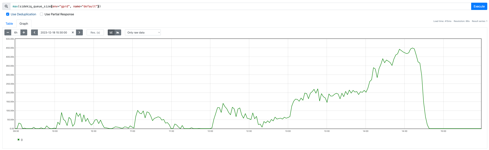

# Title: SidekiqQueueTooLarge

## Overview

- What does this alert mean?
This alert indicates that the Sidekiq queue has exceeded a predefined size threshold. This signifies a backlog of jobs waiting to be processed.
- What factors can contribute?
  - **Sudden Traffic Spikes**: Unexpected surges in workload can overwhelm Sidekiq's processing capacity, causing a queue buildup.
  - **Slow Workers**: Inefficient jobs or external dependencies causing slow processing can lead to task pile-up.
  - **Configuration Issues**: Limited Sidekiq worker processes might not be able to keep up with incoming jobs.
  - **Database Interactions**: Inefficient database queries or slow database performance can significantly impact task processing speed, leading to queue growth.
- What parts of the service are effected?
  - **Background Processing**: All background jobs managed by Sidekiq will experience delays.
  - **Time-sensitive** Jobs might be significantly impacted.
  - **Overall Application Performance**: Delayed background jobs can indirectly affect the responsiveness of your application.



## Services

- [Service Overview](../README.md)
- Team that owns the service: [Core Platform:Gitaly Team](https://handbook.gitlab.com/handbook/engineering/infrastructure-platforms/core-platform/systems/gitaly/)

- **Label:** gitlab-com/gl-infra/production~"Service::Sidekiq"

## Verification

- [Queue Detail Dashboard](https://dashboards.gitlab.net/d/sidekiq-queue-detail/sidekiq3a-queue-detail?orgId=1)
- [PromQL Link](https://dashboards.gitlab.net/goto/HqewjWUSg?orgId=1)
- [Shard Detail Dashboard](https://dashboards.gitlab.net/d/sidekiq-shard-detail/sidekiq3a-shard-detail?orgId=1&var-PROMETHEUS_DS=mimir-gitlab-gprd&var-environment=gprd&var-stage=main&var-shard=catchall&from=now-6h&to=now&timezone=utc)

## Troubleshooting

Analyze recent application changes, traffic patterns, and identify slow-running jobs.

- **Check inflight workers for a specific shard**: <https://dashboards.gitlab.net/d/sidekiq-shard-detail/sidekiq3a-shard-detail?orgId=1&viewPanel=11>
  - A specific worker might be running a large amount of jobs.
- **Check started jobs for a specific queue**: <https://log.gprd.gitlab.net/app/r/s/v28cQ>
  - A specific worker might be enqueing a lot of jobs.
- **Latency of job duration**: <https://log.gprd.gitlab.net/app/r/s/oZnYz>
  - We might be finishing jobs slower, so we get queue build up.
- **Throughput**: <https://dashboards.gitlab.net/d/sidekiq-shard-detail/sidekiq3a-shard-detail?orgId=1&var-PROMETHEUS_DS=mimir-gitlab-gprd&var-environment=gprd&var-stage=main&var-shard=catchall&viewPanel=panel-17&from=now-6h/m&to=now/m&timezone=utc>
  - If there is a sharp drop of a specific worker it might have slowed down.
  - If there is a sharp increase of a speicific worker it's saturating the queue.

## Resolution

### Scale Workers

Increase the number of concurrent Sidekiq workers if processing speed is the bottleneck.

- You can increase the [maxReplicas](https://gitlab.com/gitlab-com/gl-infra/k8s-workloads/gitlab-com/-/blob/28d3a55911185087719b183cc4bbca589154bf37/releases/gitlab/values/gprd.yaml.gotmpl#L570) for the specific shard. Things to keep in mind:
  - If we run more concurrent jobs it might add more pressure to downstream services (Database, Gitaly, Redis)
  - Check if this was a sudden spike or if it's sustained load.

### Check for new workers

It could be that this is a new worker that started running hopefully behind a feature flag that we can turn off.

### Mail queue

If the queue is all in mailers and is in the many tens to hundreds of thousands it is possible we have a spam/junk issue problem.  If so, refer to the abuse team for assistance, and also <https://gitlab.com/gitlab-com/runbooks/snippets/1923045> for some spam-fighting techniques we have used in the past to clean up.  This is in a private snippet so as not to tip our hand to the miscreants.  Often shows up in our gitlab public projects but could plausibly be in any other project as well.

### Get queues using sq.rb script

[sq](https://gitlab.com/gitlab-com/runbooks/raw/master/scripts/sidekiq/sq.rb) is a command-line tool that you can run to assist you in viewing the state of Sidekiq and killing certain workers. To use it, first download a copy:

```
curl -o /tmp/sq.rb https://gitlab.com/gitlab-com/runbooks/raw/master/scripts/sidekiq/sq.rb
```

To display a breakdown of all the workers, run:

```
sudo gitlab-rails runner /tmp/sq.rb
```

### How to disable a worker

In case of an incident caused by a misbehaving sidekiq worker, here's the immediate actions you should take.

1. Identify which sidekiq job class (worker) is causing the incident.

The [sidekiq: Worker Detail dashboard](https://dashboards.gitlab.net/d/sidekiq-worker-detail/sidekiq3a-worker-detail) may be helpful in checking a worker's enqueue rate, queue size, and summed execution time spent in shared dependencies like the DB.

2. Defer execution of all jobs of that class, using either:

- Chatops: This should be run in the `#production`

```shell
/chatops gitlab run feature set run_sidekiq_jobs_Example::SlowWorker false --ignore-feature-flag-consistency-check --ignore-production-check
```

- On the production rails node run the following to start the rails console:

```shell
sudo gitlab-rails console
```

After it starts, run:

```ruby
Feature.disable(:"run_sidekiq_jobs_Example::SlowWorker")
```

The action will cause sidekiq workers to defer (rather than execute) all jobs of that class, including jobs currently waiting in the queue.  This should provide some immediate relief. For more details [Disabling a worker](../disabling-a-worker.md)

### Examples of disabling workers via ChatOps

When the feature flag is set to true, 100% of the jobs will be deferred. But, we can also use **percentage of actors** rollout (an actor being each execution of job)
to progressively let the jobs processed. For example:

```shell
# not running any jobs, deferring all 100% of the jobs
/chatops gitlab run feature set run_sidekiq_jobs_SlowRunningWorker false --ignore-feature-flag-consistency-check

# only running 10% of the jobs, deferring 90% of the jobs
/chatops gitlab run feature set run_sidekiq_jobs_SlowRunningWorker --actors 10 --ignore-feature-flag-consistency-check

# running 50% of the jobs, deferring 50% of the jobs
/chatops gitlab run feature set run_sidekiq_jobs_SlowRunningWorker --actors 50 --ignore-feature-flag-consistency-check

# back to running all jobs normally
/chatops gitlab run feature delete run_sidekiq_jobs_SlowRunningWorker --ignore-feature-flag-consistency-check
```

Note that `--ignore-feature-flag-consistency-check` is necessary as it bypasses the consistency check between staging and production.
It is totally safe to pass this flag as we don't need to turn on the feature flag in staging during an incident.

To ensure we are not leaving any worker being deferred forever, check all feature flags matching `run_sidekiq_jobs`:

```shell
/chatops gitlab run feature list --match run_sidekiq_jobs
```

### Dropping jobs using feature flags via ChatOps

Similar to deferring the jobs, we could enable `drop_sidekiq_jobs_{WorkerName}` FF (disabled by default) to drop the jobs entirely (removed from the queue).

Example:

```shell
# drop all jobs
/chatops gitlab run feature set drop_sidekiq_jobs_SlowRunningWorker true --ignore-feature-flag-consistency-check

# back to running all jobs normally
/chatops gitlab run feature delete drop_sidekiq_jobs_SlowRunningWorker --ignore-feature-flag-consistency-check
```

Note that `drop_sidekiq_jobs` FF has precedence over the `run_sidekiq_jobs` FF. This means when `drop_sidekiq_jobs` FF is enabled and `run_sidekiq_jobs` FF is disabled,
`drop_sidekiq_jobs` FF takes priority, thus the job is dropped. Once `drop_sidekiq_jobs` FF is back to disabled, jobs are then deferred due to `run_sidekiq_jobs` still disabled.

### Disabling a Sidekiq queue

When the system is under strain due to job processing, it may be necessary to completely disable a queue so that jobs will queue and not be processed. To disable a queue it needs to be excluded from the routing rules

1. Identify which shard is associated to the queue, the ways to determine this are:
1. Find the queue in the [Shard Overview Dashboard](https://dashboards.gitlab.net/d/sidekiq-shard-detail/sidekiq-shard-detail)
1. Find the `resource_boundary` for the queue [app/workers/all_queues.yml](https://gitlab.com/gitlab-org/gitlab/-/blob/master/app/workers/all_queues.yml) or [ee/app/workers/all_queues.yml](https://gitlab.com/gitlab-org/gitlab/-/blob/master/ee/app/workers/all_queues.yml) and see which routing rules in [values.yml](https://gitlab.com/gitlab-com/gl-infra/k8s-workloads/gitlab-com/-/blob/51e2015528d332b48a0b72b76bb36cba530b624d/releases/gitlab/values/gprd.yaml.gotmpl?page=2#L1031)
1. If the queue is being processed by catchall on K8s, remove the queue from [values.yml](https://gitlab.com/gitlab-com/gl-infra/k8s-workloads/gitlab-com/-/blob/51e2015528d332b48a0b72b76bb36cba530b624d/releases/gitlab/values/gprd.yaml.gotmpl?page=2#L1031)
1. If the queue is being processed by one of the other shards in K8s, add a selector ` routingRules: resource_boundary=memory&name!=<queue name>`

### How to transfer a queue from an existing shard to a new one

In situations where one of the worker is flooding the queue, you can [create a new shard](../creating-a-shard.md) or use an existing one. Once that is done transfer queue traffic to an existing shard by [modifying the routing rules](https://gitlab.com/gitlab-com/gl-infra/k8s-workloads/gitlab-com/-/blob/51e2015528d332b48a0b72b76bb36cba530b624d/releases/gitlab/values/gprd.yaml.gotmpl?page=2#L1031)

Example MRs:

    - [[Gprd] Route elasticsearch shard's workers to elasticsearch queue](https://gitlab.com/gitlab-com/gl-infra/k8s-workloads/gitlab-com/-/merge_requests/974) to update elasticsearch queue to route elasticsearch shard's workers to elasticsearch queue.
    - [Move Members::DestroyWorker to quarantine queue](https://gitlab.com/gitlab-com/gl-infra/k8s-workloads/gitlab-com/-/merge_requests/3822)
    - [Define `urgent-authorized-projects` sidekiq shard](https://gitlab.com/gitlab-com/gl-infra/k8s-workloads/gitlab-com/-/merge_requests/1963)
    - [[gprd] Re-route quarantine, gitaly_throttled + database_throttled jobs to a single queue per shard](https://gitlab.com/gitlab-com/gl-infra/k8s-workloads/gitlab-com/-/merge_requests/1196)

### Remove jobs with certain metadata from a queue (e.g. all jobs from a certain user)

We currently track metadata in sidekiq jobs, this allows us to remove
sidekiq jobs based on that metadata.

Interesting attributes to remove jobs from a queue are `root_namespace`,
`project` and `user`. The [admin Sidekiq queues
API](https://docs.gitlab.com/ee/api/admin_sidekiq_queues.html) can be
used to remove jobs from queues based on these medata values.

For instance:

```shell
curl --request DELETE --header "Private-Token: $GITLAB_API_TOKEN_ADMIN" https://gitlab.com/api/v4/admin/sidekiq/queues/post_receive?user=reprazent&project=gitlab-org/gitlab
```

Will delete all jobs from `post_receive` triggered by a user with
username `reprazent` for the project `gitlab-org/gitlab`.

Check the output of each call:

1. It will report how many jobs were deleted.  0 may mean your conditions (queue, user, project etc) do not match anything.
1. This API endpoint is bound by the HTTP request time limit, so it will delete as many jobs as it can before terminating. If the `completed` key in the response is `false`, then the whole queue was not processed, so we can try again with the same command to remove further jobs.

## Metrics

[Sidekiq Queues Metrics](../../../rules/sidekiq-queues.yml)

This alert is based on the maximum value of the `sidekiq_queue_size` across different environments and queue names. It helps identify the queue with the most jobs waiting. It will complare the maximum queue size to a threshold of 50,000. If the maximum queue size exceeds 50,000 the alert triggers. This was based on historical data which under normal conditions the graph should show a consistent pattern

## Alert Behavior

- Information on silencing the alert (if applicable). When and how can silencing be used? Are there automated silencing rules?
  - If the current threshold is too sensitive for typical traffic, [adjust it to a more suitable level](https://alerts.gitlab.net/#/silences/new?filter=%7Balert_type%3D%22cause%22%2C%20environment%3D%22gprd%22%2C%20name%3D%22elasticsearch%22%2C%20pager%3D%22pagerduty%22%2C%20severity%3D%22s1%22%2C%20alertname%3D%7E%22SidekiqQueueTooLarge%22%7D).
- Expected frequency of the alert. Is it a high-volume alert or expected to be rare?
  - This is a rare alert and mainly happens when sidekiq is overloaded

## Severities

- The severity of this alert is generally going to be a ~severity::3 or ~severity::4
- There might be customer user impact depending on which queue is affected

## Recent changes

- [Recent Gitaly Production Change/Incident Issues](https://gitlab.com/gitlab-com/gl-infra/production/-/issues/?sort=created_date&state=all&label_name%5B%5D=Service%3A%3AGitaly&first_page_size=20)
- [Chef Gitaly Changes](https://gitlab.com/gitlab-com/gl-infra/chef-repo/-/merge_requests?scope=all&state=merged&label_name[]=Service%3A%3AGitaly)

## Possible Resolutions

- [Previous Incidents](https://gitlab.com/gitlab-com/gl-infra/production/-/issues/?sort=created_date&state=all&label_name%5B%5D=a%3ASidekiqQueueTooLarge&first_page_size=20)
  - [Large amount of Sidekiq Queued jobs in the elasticsearch queue](https://gitlab.com/gitlab-com/gl-infra/production/-/issues/18052)
  - [SidekiqQueueTooLarge default queue](https://gitlab.com/gitlab-com/gl-infra/production/-/issues/17294)

## Escalation

- Slack channels where help is likely to be found: `#g_scalability`

## Related Links

- [Related alerts](./)
- [Update the template used to format this playbook](https://gitlab.com/gitlab-com/runbooks/-/edit/master/docs/template-alert-playbook.md?ref_type=heads)
