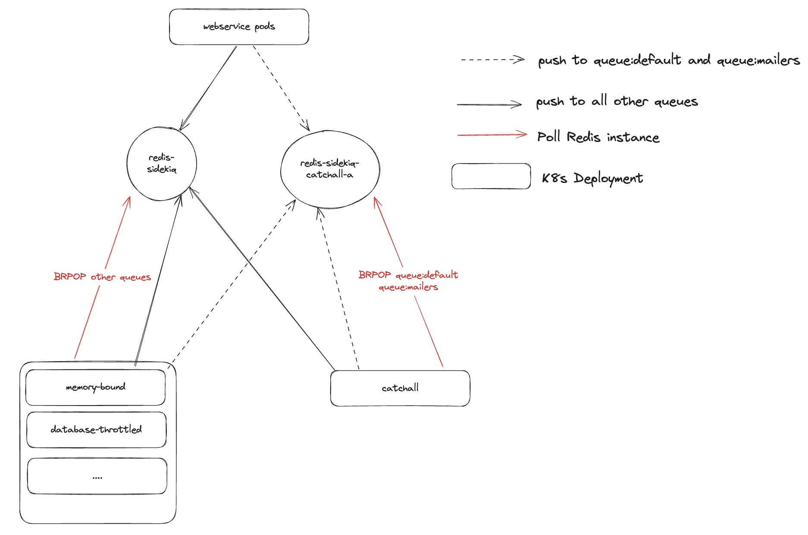
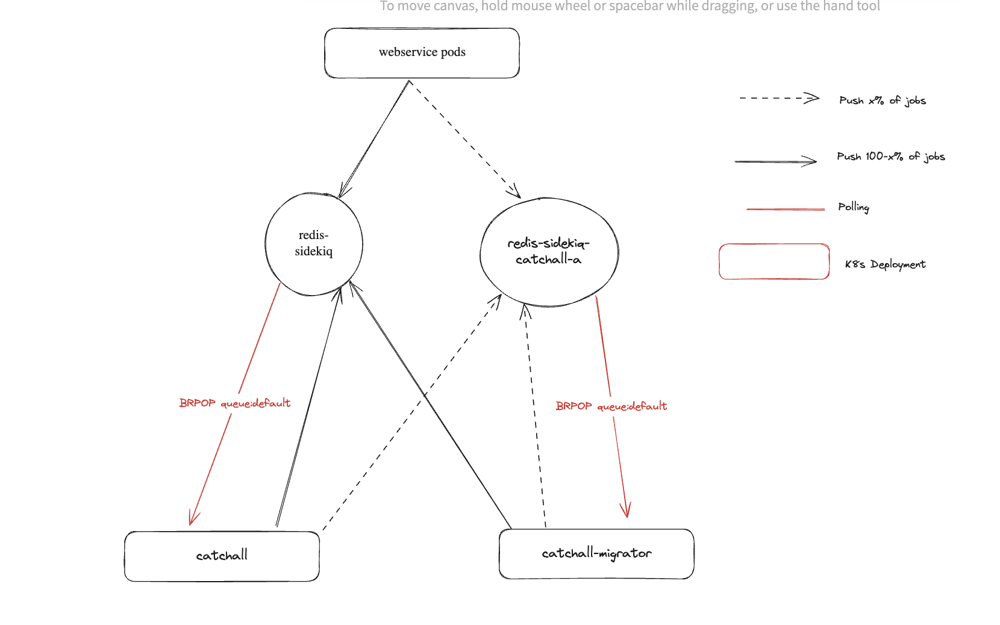
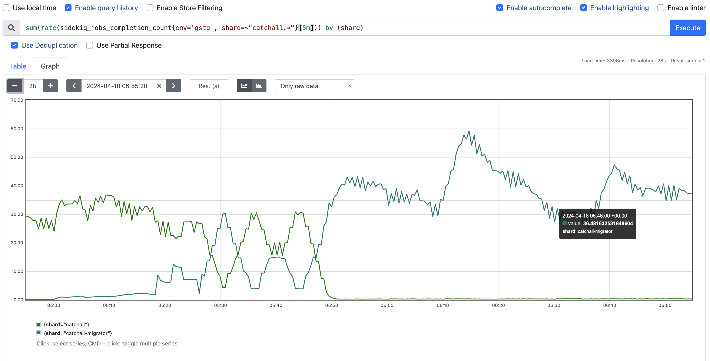

## Sidekiq Sharding

This documents outlines the necessary steps to horizontally shard Sidekiq and migrate workloads to the new Redis instance.

### Background

Sidekiq uses a Redis server (either standalone or with Sentinels) as its backing datastore. However, Redis is not horizontally scalable and Redis Cluster is not suitable for Sidekiq since
there are only a small subset of hot keys.

[Sharding](https://github.com/sidekiq/sidekiq/wiki/Sharding) Sidekiq involves routing jobs to another Redis at the application level.

Gitlab Rails supports this using an application-layer router which was implemented as part of [epic 1218](https://gitlab.com/groups/gitlab-com/gl-infra/-/epics/1218)

Note that "shard" in this document refers to a Redis shard while "shard" in the context of [K8s deployments](creating-a-shard.md) refers to a Sidekiq shard. A Redis shard is
a Redis instance meant to handle a fraction of the overall enqueueing workload required by Sidekiq.

A Sidekiq shard refers to a single K8s deployment that is configured to poll from a single queue and a single Redis instance. For purpose of clarity, we will explicitly use "K8s deployment" in place
of "Sidekiq shard" in this document.

### Sharding Sidekiq service

A Sidekiq service shards is a single K8s deployment of Sidekiq pods which consume jobs from a small set of queues in Redis. This allows SREs to control resource limits and concurrency of individual k8s deployments.
The recommended setup is to have [1 queue per shard](https://gitlab.com/gitlab-com/gl-infra/scalability/-/issues/961).

Refer to [google slide](https://docs.google.com/presentation/d/1geQTHaUd9iiSZqmxkeKr9PklcSPv__MbThs5HHLmw4c/edit?usp=sharing) for historical context.

#### Considerations

* If the workers are being proposed to migrate to a new shard, we must ensure we
  have a plan of action to bring online the new shard, and move those workers
  off the old shard.
* If this is a new worker, we should perform a readiness review such that all
  engineers fully understand any implications
* Where possible, we should utilize the new queue routing mechanism to configure
  which workers run where
* We need to understand the workload of this new shard.  This means we need to
  know how the Sidekiq workers operate, their urgency level, the speed of job
  execution, etc.
* Much of the above will be found while working with the appropriate engineering
  team.  Our [documentation for Engineers for
  Sidekiq](https://docs.gitlab.com/ee/development/sidekiq/) is an
  excellent resource.

#### Shard Characteristics

With the above information readily available we can then make a few
configuration choices:

* Picking a good obvious name of the shard that will be easy for other SREs to
  interpret the meaning of.
* Develop the appropriate Sidekiq worker configuration/selector query
  * This may be done via tagging our workers in the gitlab code base or via a
    highly sophisticated query.  We should avoid the latter
* How many Pods are necessary?
* If it is safe to utilize the Horizontal Pod Autoscaler, we can set our min
  and max pod values
  * If not, both values would be set to the same number
  * In [runbooks], we need to ensure that we note this shard is not subject to HPA
    saturation
* Attempt to choose the recommended CPU resource requests and Memory resource
  requests and limits

#### To Create the Shard

* Modify the necessary items in [runbooks] to ensure the new shard will have it's
  own dedicated metrics.  Includes at least the following:
  * Add an entry in `shards` in [metrics-catalog/services/lib/sidekiq-helpers.libsonnet](https://gitlab.com/gitlab-com/runbooks/-/blob/master/metrics-catalog/services/lib/sidekiq-helpers.libsonnet)
* Modify the necessary items in [argocd/apps] such that logging is configured for the new shard.
  * Add a new section in [`services/vector-agent/values-config.yaml`](https://gitlab.com/gitlab-com/gl-infra/argocd/apps/-/blob/main/services/vector-agent/values-config.yaml).
* If necessary create a new dedicated node pool
  * Add in terraform; currently in `environments/ENV/gke-regional.tf`; generally
      look for the other node pool definitions and duplicate/extend
* Modify [k8s-workloads/gitlab-com] adding the new sidekiq shard by adding a new section
  in [`gitlab.sidekiq.pods`](https://gitlab.com/gitlab-com/gl-infra/k8s-workloads/gitlab-com/-/blob/master/releases/gitlab/values/gstg.yaml.gotmpl) with settings determined above
  * This prepares a place for the jobs to run but does not cause anything to be routed
    to them just yet. The  "queues" value is the list of queues (probably just one) that
    this shard will listen on (used in the next step).
    * Here is [an example of how to add a shard to a pod](https://gitlab.com/gitlab-com/gl-infra/k8s-workloads/gitlab-com/-/merge_requests/1938/diffs#21a2743843174713a5692d172e40c08ce3a80383_505_505).
  * Also add a new entry in the [`auto-deploy-image-check` list](https://gitlab.com/gitlab-com/gl-infra/k8s-workloads/gitlab-com/-/blob/master/auto-deploy-image-check/gstg.json).
    * Here is [an example of how to add a auto-deploy image definition](https://gitlab.com/gitlab-com/gl-infra/k8s-workloads/gitlab-com/-/merge_requests/1938/diffs#42cbaf891b66f60a3a592f89140cb1409607642f_61_61)
* Modify [`global.appConfig.sidekiq.routingRules`](https://gitlab.com/gitlab-com/gl-infra/k8s-workloads/gitlab-com/-/blob/master/releases/gitlab/values/gstg.yaml.gotmpl) in [k8s-workloads/gitlab-com] to select
  the jobs you want (by name or other characteristics) in the first array value, and
  route them to the new queue (the second value in the array, being the name of the queue
  that the new shard is listening on)
  * When deployed, this is what will cause the jobs to be put into the named queue to be picked
    up by the new shard
    * Note: During the deploy, pods are slowly cycled over a period of time.  Due to this, there's a window of time for which the old and new shard will process the same work queue.

[k8s-workloads/gitlab-com]: https://gitlab.com/gitlab-com/gl-infra/k8s-workloads/gitlab-com
[runbooks]: https://gitlab.com/gitlab-com/runbooks
[argocd/apps]: https://gitlab.com/gitlab-com/gl-infra/argocd/apps

### Sharding redis-sidekiq service



The routing rules will specify how jobs are to be routed. For instance below, the last routing rule will
route jobs to the `queues_shard_catchall_a` instance in the `config/redis.yml`.
All other jobs will be routed to the main Sidekiq Redis defined by `config/redis.queues.yml` or the `queues` key in `config/redis.yml`.

```
sidekiq:
  routingRules:
    - ["worker_name=AuthorizedProjectUpdate::UserRefreshFromReplicaWorker,AuthorizedProjectUpdate::UserRefreshWithLowUrgencyWorker", "quarantine"] # move this to the quarantine shard
    - ["worker_name=AuthorizedProjectsWorker", "urgent_authorized_projects"] # urgent-authorized-projects
    - ["resource_boundary=cpu&urgency=high", "urgent_cpu_bound"] # urgent-cpu-bound
    - ["resource_boundary=memory", "memory_bound"] # memory-bound
    - ["feature_category=global_search&urgency=throttled", "elasticsearch"] # elasticsearch
    - ["resource_boundary!=cpu&urgency=high", "urgent_other"] # urgent-other
    - ["resource_boundary=cpu&urgency=default,low", "low_urgency_cpu_bound"] # low-urgency-cpu-bound
    - ["feature_category=database&urgency=throttled", "database_throttled"] # database-throttled
    - ["feature_category=gitaly&urgency=throttled", "gitaly_throttled"] # gitaly-throttled
    - ["*", "default", "queues_shard_catchall_a"] # catchall on k8s
```

To configure the Sidekiq server to poll from `queues_shard_catchall_a`, define an environment variable `SIDEKIQ_SHARD_NAME: "queues_shard_catchall_a"` in `extraEnv` of the desired [Sidekiq deployment](https://gitlab.com/gitlab-com/gl-infra/k8s-workloads/gitlab-com/-/blob/master/releases/gitlab/values/gstg.yaml.gotmpl) under `sidekiq.pods`.

The routing can be controlled using a feature flag `sidekiq_route_to_<queues_shard_catchall_a or any relevant shard name>` and "pinned" using the `SIDEKIQ_MIGRATED_SHARDS` environment variable post-migration.

#### Migration Overview



1. Configuring the Rails app and chef VMs.

This involves updating the routing rules by specifying a Redis instance in the rule. Note that the particular instance needs to be configured in `config/redis.yml`.

Refer to [a previous change issue](https://gitlab.com/gitlab-com/gl-infra/production/-/issues/17787) for an example of executing this change.

2. Provision a temporary migration K8s deployment

During the migration phase, 2 separate set of K8s pods are needed to poll from 2 Redis instances (migration source and migration target). This ensures that there are no unprocessed jobs that are not polled from a queue.

A temporary Sidekiq deployment needs to be added in [k8s-workloads/gitlab-com](https://gitlab.com/gitlab-com/gl-infra/k8s-workloads/gitlab-com/-/blob/master/releases/gitlab/values/gstg.yaml.gotmpl) under `sidekiq.pods`. The temporary deployment needs to have `SIDEKIQ_SHARD_NAME: "<new redis instance name>"` defined as an extra environment variable to correctly configure the `Sidekiq.redis`.

Below is an example. Note that variables like `maxReplicas`,  `resources.requests`, `resources.limits` may need to be tuned depending on the state of gitlab.com at the point of migration. `queues` and `extraEnv` would need to be updated to be relevant to the migration.

 ```
pods:
  - name: catchall-migrator
    common:
      labels:
        shard: catchall-migrator
    concurrency: 10
    minReplicas: 1
    maxReplicas: 100
    podLabels:
      deployment: sidekiq-catchall
      shard: catchall-migrator
    queues: default,mailers
    resources:
      requests:
        cpu: 800m
        memory: 2G
      limits:
        cpu: 1.5
        memory: 4G
    extraEnv:
      GITLAB_SENTRY_EXTRA_TAGS: "{\"type\": \"sidekiq\", \"stage\": \"main\", \"shard\": \"catchall\"}"
      SIDEKIQ_SHARD_NAME: "queues_shard_catchall_a"
    extraVolumeMounts: |
      - name: sidekiq-shared
        mountPath: /srv/gitlab/shared
        readOnly: false
    extraVolumes: |
      # This is needed because of https://gitlab.com/gitlab-org/gitlab/-/issues/330317
      # where temp files are written to `/srv/gitlab/shared`
      - name: sidekiq-shared
        emptyDir:
          sizeLimit: 10G
```

Refer to [a previous change issue](https://gitlab.com/gitlab-com/gl-infra/production/-/issues/17787) for an example of executing this change.

3. Gradually toggle feature flag to divert traffic

Use the following chatops command to gradually increase the percentage of time which the feature flag is `true`.

```
chatops gitlab run feature set sidekiq_route_to_queues_shard_catchall_a 50 --random --ignore-random-deprecation-check
```

Refer to [a previous change issue](https://gitlab.com/gitlab-com/gl-infra/production/-/issues/17841) for an example of a past migration. The proportion of jobs being completed by the new deployment will increase with the feature flag's enabled percentage.

The migration can be considered completed after the feature flag is fully enabled and there are no more jobs being enqueued to the queue in the migration source. This can be verified by measuring `sidekiq_jobs_completion_count` rates and `sidekiq_queue_size` value. Refer to the linked charts:

* completion count chart - [query](https://dashboards.gitlab.net/explore?schemaVersion=1&panes=%7B%22ekx%22:%7B%22datasource%22:%22mimir-gitlab-gprd%22,%22queries%22:%5B%7B%22refId%22:%22A%22,%22expr%22:%22sum(rate(sidekiq_jobs_completion_count%7Benv%3D'gprd'%7D%5B1m%5D))%20by%20(shard)%22,%22range%22:true,%22instant%22:true,%22datasource%22:%7B%22type%22:%22prometheus%22,%22uid%22:%22mimir-gitlab-gprd%22%7D,%22editorMode%22:%22code%22,%22legendFormat%22:%22__auto%22%7D%5D,%22range%22:%7B%22from%22:%22now-6h%22,%22to%22:%22now%22%7D%7D%7D&orgId=1)
* queue size chart - [query](https://dashboards.gitlab.net/explore?schemaVersion=1&panes=%7B%22ekx%22:%7B%22datasource%22:%22mimir-gitlab-gprd%22,%22queries%22:%5B%7B%22refId%22:%22A%22,%22expr%22:%22max%20by(name)%20(sidekiq_queue_size%7Benv%3D%5C%22gprd%5C%22%7D)%22,%22range%22:true,%22instant%22:true,%22datasource%22:%7B%22type%22:%22prometheus%22,%22uid%22:%22mimir-gitlab-gprd%22%7D,%22editorMode%22:%22code%22,%22legendFormat%22:%22__auto%22%7D%5D,%22range%22:%7B%22from%22:%22now-6h%22,%22to%22:%22now%22%7D%7D%7D&orgId=1)

For example, we should observe a decrease in job completion rate on the Sidekiq shard polling the migration source and an increase on the temporary migration K8s deployment that polls the migration target. The effects will be more pronounced as the feature flag percentage increases. Refer to the example below:



4. Finalise migration by setting the `SIDEKIQ_MIGRATED_SHARDS` environment variable

This will require a merge request to the [k8s-workloads project](https://gitlab.com/gitlab-com/gl-infra/k8s-workloads/gitlab-com) and prevents accidental toggles from the feature flags. This updates the application
with the list of Redis instances which are considered migrated and the application-router should route jobs to these instances without checking the feature flags.

Note: We use the term "shard" in the environment variables to be consistent with [Sidekiq Sharding terminology](https://github.com/sidekiq/sidekiq/wiki/Sharding).

The K8s deployment to be migrated can be now configured to poll from the new Redis instance and the temporary migration K8s deployment can be removed.

Note: scheduled jobs left in the `schedule` sorted set of the migration source will be routed to the migration target as long as there are other Sidekiq processes still using the migration source, e.g. other active queues.

#### Troubleshooting

This section will cover the issues that are relevant to a Sharded Sidekiq setup. The primary concern is incorrect job routing which
could lead to dangling/lost jobs.

**Check feature flag**

Checking the feature flag will determine the state of the router accurately and aid in finding a root cause.

```
/chatops gitlab run feature get sidekiq_route_to_<shard_instance_name>
```

**Migrate jobs across instances**

If there are cases of dangling jobs after, one way to resolve it would be to migrate it across instances.
This will require popping the job and enqueuing it in the relevant cluster. This can be done using the Rails console:

```
queue_name = "queue:default"
source = "main"
destination = "queues_shard_catchall_a"

Gitlab::Redis::Queues.instances[source].with do |src|
  while src.llen(queue_name) > 0
    job = src.rpop(queue_name)
    Gitlab::Redis::Queues.instances[destination].with { |c| c.lpush(queue_name, job) }
  end
end
```

**Provision a temporary K8s deployment to drain the jobs**

In the event where a steady stream of jobs are being pushed to the incorrect Redis instance, we can create a Sidekiq deployment which
uses the default `redis-sidekiq` for its `Sidekiq.redis` (i.e. no `SIDEKIQ_SHARD_NAME` environment variable). Set the `queues` values for the
deployment to the desired queue.

For example:

```
pods:
  - name: drain
    common:
      labels:
        shard: drain
    concurrency: 10
    minReplicas: 1
    maxReplicas: 10
    podLabels:
      deployment: sidekiq-drain
      shard: drain
    queues: <QUEUE_1>,<QUEUE_2>
    resources:
      requests:
        cpu: 800m
        memory: 2G
      limits:
        cpu: 1.5
        memory: 4G
    extraEnv:
      GITLAB_SENTRY_EXTRA_TAGS: "{\"type\": \"sidekiq\", \"stage\": \"main\", \"shard\": \"drain\"}"
    extraVolumeMounts: |
      - name: sidekiq-shared
        mountPath: /srv/gitlab/shared
        readOnly: false
    extraVolumes: |
      - name: sidekiq-shared
        emptyDir:
          sizeLimit: 10G

```
