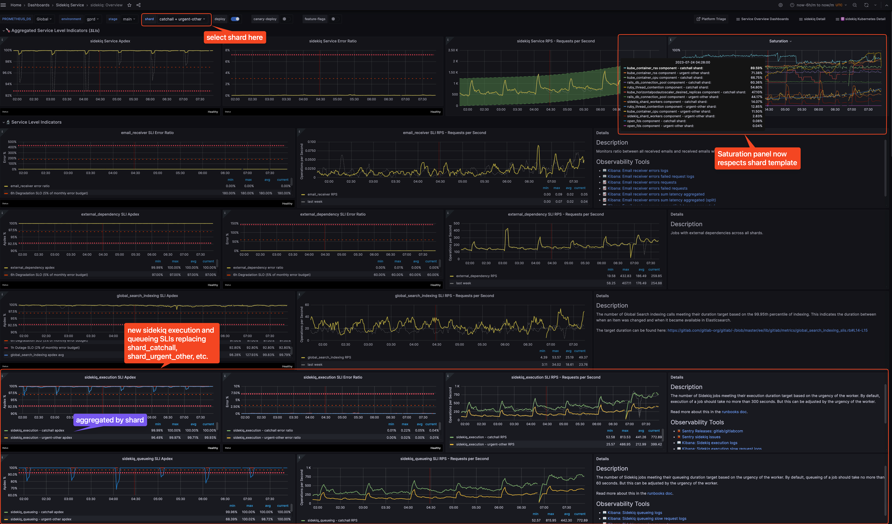

# Sidekiq SLIs

In the past, Sidekiq SLIs exist in the form of [SLI per-shard](https://gitlab.com/gitlab-com/runbooks/-/blob/0d35ba19351adeee62ca0096975541e5c515f903/metrics-catalog/services/sidekiq.jsonnet#L91-177) (e.g. `shard_catchall`, `shard_urgent_other`, etc). These SLIs combine both execution and queueing (duration that a job was queued before being executed) into a single apdex per shard. Therefore, when a particular shard's apdex is not performing well, we couldn't pinpoint whether it's an execution or queueing problem. On the other hand, we could see the apdex meeting the SLO target, but in reality the real queueing apdex is not meeting the target because execution apdex is still meeting the target.

As part of the works in [epic 700](https://gitlab.com/groups/gitlab-com/gl-infra/-/epics/700), we re-organized SLI per-shard into `sidekiq_execution` and `sidekiq_queueing` SLIs (which are aggregated by `shard` label).
This allows us to surface issues, monitor, and alert on execution and queueing SLIs separately.

The `sidekiq_execution` and `sidekiq_queueing` SLIs are defined as [Application SLIs](https://docs.gitlab.com/ee/development/application_slis/sidekiq_execution.html).
These SLIs use counter-based metrics to measure a successful [apdex measurement](#apdex-measurement) in place of the former histogram-based duration metrics.

## Observability

The SLIs appear in the [Sidekiq Overview dashboard](https://dashboards.gitlab.net/d/sidekiq-main/sidekiq-overview?orgId=1) with the `shard` template.

## Ownership

The execution SLI is owned by stage groups, whereas queueing SLI is owned by Infrastructure.

## Apdex measurement

A successful apdex measurement has to meet the target duration based on the job `urgency` from the worker attributes.
These apdex measurements happen entirely in the Rails app.
Refer to the requirement in [the job urgency
docs](https://docs.gitlab.com/ee/development/sidekiq/worker_attributes.html#job-urgency)
and [source code in Rails
app](https://gitlab.com/gitlab-org/gitlab/-/blob/f11262b09ad719b7b446fe5f8b6007af4a3727f0/lib/gitlab/metrics/sidekiq_slis.rb#L6-15).

There is a separate doc about [`sidekiq_queueing` apdex violations](sidekiq-queueing-apdex.md)
